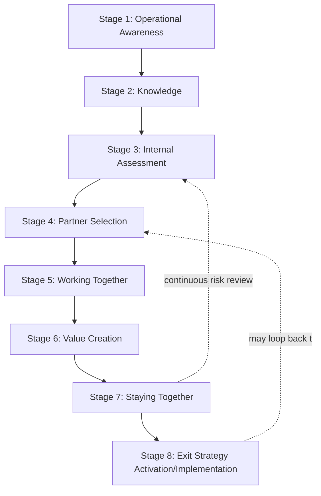
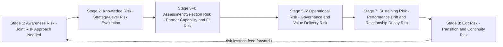
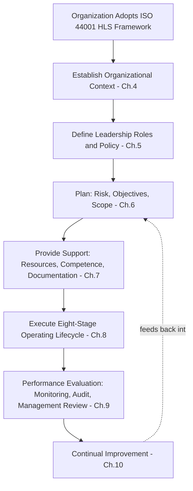
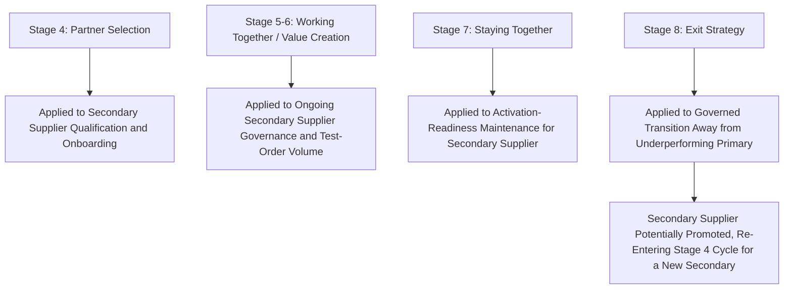

## ISO 44001 Collaborative Relationship Lifecycle


### Overview

ISO 44001 (Collaborative Business Relationship Management Systems — Requirements and Framework) is the international standard, published in 2017 and derived from the UK's British Standard BS 11000, initially developed from 2006 as PAS 11000, that provides a structured management-system framework for establishing, developing, and sustaining collaborative relationships between organizations. Its central contribution is an eight-stage life cycle model that treats a collaborative relationship as something to be deliberately engineered and managed through defined phases, rather than something that simply emerges informally from a signed contract. In Dual Sourcing, ISO 44001's lifecycle discipline — particularly its explicit treatment of exit strategy as a planned stage rather than an afterthought — offers a directly applicable structure for managing both the qualification of a secondary source and the eventual transition away from an underperforming primary. [Wikipedia](https://en.wikipedia.org/wiki/ISO_44001)[Wikipedia](https://en.wikipedia.org/wiki/ISO_44001)

### Key Points

- **Risk is treated as a continuous "red thread"** throughout the standard, highlighted at every stage, to guide the process to focus on the unique risk implications that arise when two or more organizations commit to work together — risk assessment is not a one-time gate but a recurring discipline across all eight stages. [iot-now](https://www.iot-now.com/?p=76100)
- **Exit strategy is planned from the outset, not improvised at relationship end**: uniquely among relationship-management frameworks, ISO 44001 treats exit as a formal, resourced stage of the lifecycle rather than a failure mode to be addressed only when a relationship is already failing.
- **The standard follows the ISO High-Level Structure (HLS)**, meaning it integrates naturally alongside other ISO management systems (ISO 9001 quality, ISO 27001 security) an organization may already operate, since it shares the same 10-chapter architecture.
- **Applicability is deliberately broad**: ISO 44001:2017 specifies requirements for the effective identification, development, and management of collaborative business relationships within or between organizations, and any organization can apply it regardless of type, size, or location. [sriregistrar](https://sriregistrar.com/?p=1735)
- **Dual sourcing relevance**: the lifecycle's "Partner Selection" and "Staying Together" stages map directly onto secondary-supplier qualification and ongoing readiness maintenance, while "Exit Strategy" maps onto the governed transition away from a failing primary supplier.

### The Eight-Stage Lifecycle Model

ISO 44001 incorporates the eight stage life cycle model that was the basis for BS 11000 to help business partners maximize the value of collaborative working, comprising: Operational awareness, Knowledge, Internal assessment, Partner selection, Working together, Value creation, Staying together, and Exit strategy implementation. [wikipedia](https://www.wikipedia.com/wiki/ISO_44001)[wikipedia](https://www.wikipedia.com/wiki/ISO_44001)



### Stage-by-Stage Breakdown

| Stage | Purpose | SRM/Dual-Sourcing Application |
| --- | --- | --- |
| 1. Operational Awareness | Recognize organizational context and the strategic case for collaboration | Recognizing that collaborative approaches introduce alternative ways of working which require alternative approaches to managing risk, including a joint approach to risk with the partner — foundational case for pursuing dual sourcing itself |
| 2. Knowledge | Build the business strategy and evaluate risk before committing | In-depth risk evaluation to precede action — category risk assessment (Kraljic positioning) informing whether dual sourcing is warranted |
| 3. Internal Assessment | Assess internal readiness, capability, and objectives before engaging externally | Confirming internal SRM governance capacity exists to support a second supplier relationship |
| 4. Partner Selection | Identify and select the right collaborative partner(s) | Secondary supplier qualification, RFQ/audit process, compliance attestation |
| 5. Working Together | Establish joint governance, communication protocols, and operating rhythms | Kickoff, communication cadence, escalation path design |
| 6. Value Creation | Realize and measure the mutual benefits of the collaboration | Scorecard performance, TCO/savings tracking, joint business planning |
| 7. Staying Together | Sustain and evolve the relationship, managing performance and change over time | Ongoing governance cadence, CAP processes, relationship ownership continuity |
| 8. Exit Strategy Implementation | Plan and, if triggered, execute a structured, low-disruption relationship conclusion | Governed supplier exit, transition to secondary source, last-time-buy planning |

### The "Red Thread" of Risk Across Stages



Throughout the standard risk is highlighted at every stage as a "red thread" to guide the process to focus on the unique risk implications that arise when two or more organizations commit to work together for a particular business purpose, reinforcing that risk management under ISO 44001 is not a gate passed once but a continuous discipline running parallel to all eight stages. [iot-now](https://www.iot-now.com/?p=76100)

### ISO High-Level Structure (Management System Chapters)

The ISO 44001:2017 adopts the "ISO High Level Structure (HSL)" in 10 chapters: [wikipedia](https://www.wikipedia.com/wiki/ISO_44001)



```
1. Purpose
2. Reference Standards
3. Terms and Definitions
4. Organization Context
5. Leadership
6. Planning
7. Support
8. Operating Activities
9. Performance Evaluation
10. Improvement
```

This structure means the eight-stage lifecycle model is embedded within Chapter 8 (Operating Activities), while Chapters 9–10 impose ongoing performance evaluation and continual improvement obligations on the collaborative relationship — mirroring the CAP/scorecard governance loop already established elsewhere in SRM practice.

### ISO 44001 Certification and Implementation Flow



### Guidance Extension: ISO 44002

ISO 44002, Collaborative business relationship management systems – Guidelines on the implementation of ISO 44001, offers specific guidance for establishing, developing and managing third-party relationships using the eight-stage life cycle detailed in ISO 44001, providing implementation-level detail (templates, maturity assessment tools, practical guidance) beyond the requirements-only structure of ISO 44001 itself. [iso](https://mbs.isolutions.iso.org/es/sites/isoorg/contents/news/2019/10/Ref2443.html)

### Dual Sourcing-Specific Mapping



- **Partner Selection rigor applies equally to backup suppliers**: ISO 44001's structured selection stage argues against treating secondary-supplier qualification as a lighter-touch, informal process relative to the primary.
- **"Staying Together" as continuous readiness maintenance**: this stage's emphasis on sustaining the relationship over time aligns directly with the dual-sourcing principle that a secondary supplier's governance, scorecard, and communication cadence must remain active — not dormant — between activation events.
- **Exit Strategy as the formalization of primary-to-secondary transition governance**: ISO 44001's insistence on planning exit from the relationship's outset validates building last-time-buy planning, transition timelines, and contractual wind-down terms into the *original* sourcing agreement rather than drafting them reactively.

### Common Pitfalls

- Treating ISO 44001 as a certification checkbox exercise rather than genuinely operating the eight-stage lifecycle and its continuous risk review
- Skipping or under-resourcing the "Internal Assessment" stage, entering partner selection without confirming the organization's own governance capacity to sustain the relationship
- Neglecting "Staying Together" activities for a low-volume secondary supplier, allowing the relationship to lapse into dormancy between activation events
- Treating Exit Strategy as a stage invoked only in crisis, rather than a planned component established during initial partner selection and contracting
- Applying the eight-stage rigor inconsistently — full rigor for a primary supplier, an abbreviated or skipped process for a secondary — undermining the standard's core premise of deliberate, risk-aware relationship management

**Related Topics**

- BS 11000 and the Historical Development of Collaborative Relationship Standards
- ISO 44002 Implementation Guidelines and Maturity Assessment Tools
- Relationship Governance Structures and Supplier Tiering Models
- Supplier Ranking, Rationalization, and Exit Decisions
- Risk-Based Thinking Across ISO Management System Standards (ISO 9001, ISO 31000)
- Dual Sourcing Partner Qualification and Activation Readiness Frameworks