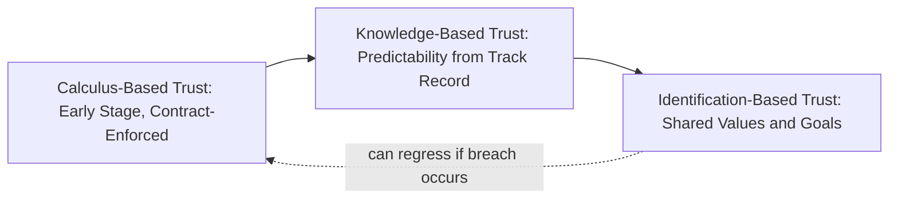
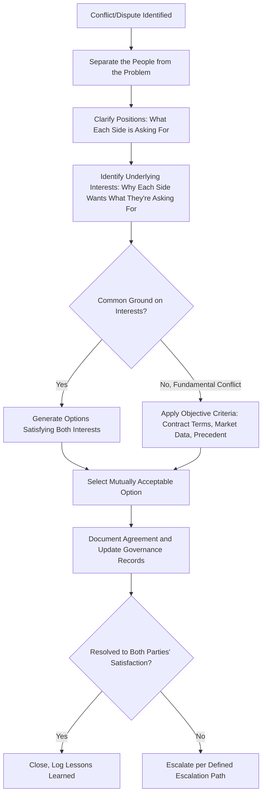
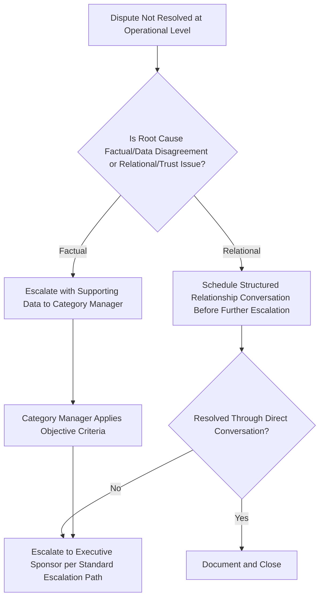
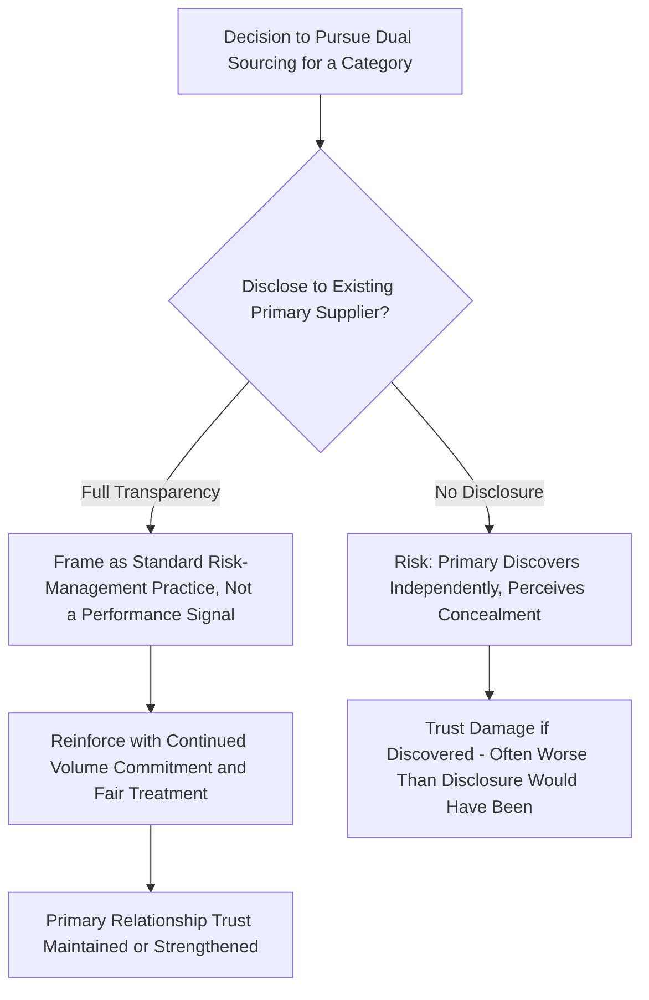

## Trust-Building and Conflict Resolution


### Overview

Trust-Building and Conflict Resolution addresses the interpersonal and organizational dynamics that determine whether a supplier relationship's formal governance structures (scorecards, escalation paths, JBPs) actually function as intended, or are quietly undermined by low trust and poorly managed disputes. Formal governance provides the skeleton of a relationship; trust and conflict-resolution capability determine whether that skeleton carries real weight. In Dual Sourcing, trust dynamics carry an additional layer of complexity: a primary supplier who becomes aware — or merely suspects — that a secondary source exists may interpret this as distrust, which can itself trigger defensive behavior that degrades the primary relationship the dual-sourcing strategy was meant to protect.

### Key Points

- **Trust operates on two distinct dimensions**: competence trust (belief the partner can deliver) and relational/goodwill trust (belief the partner will act in good faith, not opportunistically) — a supplier can be highly competent but low-trust if the relationship history includes perceived opportunism.
- **Trust is asymmetric in build/decay speed**: trust accumulates slowly through consistent, verified behavior over many interactions but can be severely damaged by a single serious breach — this asymmetry justifies conservative, evidence-based trust extension rather than optimistic assumption.
- **Contractual completeness and trust are substitutes, not complements, in classical theory** — but in practice, mature SRM relationships use both: contracts handle foreseeable risk allocation, while trust handles the residual, unforeseeable situations no contract can fully specify.
- **Conflict is inevitable and not inherently damaging**: well-managed conflict (addressed through structured, principled negotiation) can strengthen a relationship by demonstrating that disagreements can be resolved fairly; poorly managed conflict erodes trust regardless of the underlying issue's severity.
- **Dual sourcing transparency requires careful framing**: how and whether a primary supplier is informed about a parallel secondary sourcing arrangement significantly affects whether that arrangement is perceived as prudent risk management or as a signal of distrust that damages the primary relationship.

### Trust Dimensions Framework

| Trust Type | Basis | Builds Through | Damaged By |
| --- | --- | --- | --- |
| Competence Trust | Belief in capability to deliver | Consistent scorecard performance, successful crisis handling | Repeated quality/delivery failures |
| Goodwill/Relational Trust | Belief in good-faith intent | Transparency, fair dealing during disputes, honoring informal commitments | Perceived opportunism, hidden agendas, broken informal promises |
| Contractual Trust | Confidence the written agreement will be honored | Consistent contract adherence, fair interpretation of ambiguous terms | Aggressive contract interpretation, surprise penalty invocation |

### Trust Development Trajectory



[Inference: this reflects the widely cited Lewicki/Bunker trust-development model from organizational behavior research; real relationships don't always progress linearly and can regress or plateau at any stage.]

### Conflict Sources in Supplier Relationships

| Source Category | Example | Typical Resolution Path |
| --- | --- | --- |
| Performance Disputes | Disagreement over whether a delay was buyer- or supplier-caused | Data-driven review against agreed KPI definitions and exclusion criteria |
| Contractual Ambiguity | Unclear scope boundary in a change order | Structured negotiation referencing original contract intent |
| Commercial/Pricing | Disagreement over cost-increase justification | Should-cost model comparison, joint cost transparency review |
| Communication Breakdown | Missed expectations due to unclear escalation ownership | Governance structure review and RACI clarification |
| Perceived Bad Faith | Supplier suspects volume was quietly shifted to a competitor | Transparent (within confidentiality limits) relationship conversation |

### Structured Conflict Resolution Process



This structure reflects principled negotiation methodology (interest-based rather than purely positional bargaining) — separating relationship issues from substantive issues prevents a single contentious dispute from contaminating the broader relationship's trust reservoir.

### Trust-Building Practices in Routine Governance

| Practice | Trust Dimension Reinforced |
| --- | --- |
| Sharing forecast accuracy performance (not just demanding supplier OTIF) | Goodwill — demonstrates buyer accountability is bilateral |
| Acknowledging buyer-caused delays explicitly in scorecards (exclusion criteria) | Goodwill — signals fair dealing, not one-sided scrutiny |
| Consistent, predictable escalation response within stated SLAs | Competence and contractual trust |
| Proactive disclosure of relevant category strategy shifts (within confidentiality limits) | Goodwill — reduces the "hidden agenda" perception |
| Joint recognition of supplier-driven improvements (not just penalizing failures) | Relational — reinforces partnership framing over pure vendor management |

### Conflict Escalation Decision Point



### Communicating a Dual-Sourcing Strategy Without Damaging Primary Trust

```plaintext
===syllabot placeholder removed===
```



[Inference: the relative merits of proactive disclosure versus non-disclosure of a dual-sourcing strategy depend heavily on category dynamics, competitive sensitivity, and existing relationship trust levels — this is a judgment call rather than a universally correct policy, though many practitioners favor proactive, carefully framed disclosure over the risk of a primary supplier discovering the arrangement independently.]

### Dual Sourcing-Specific Considerations

- **Framing matters more than the fact itself**: Most experienced primary suppliers already assume some degree of dual/backup sourcing exists in their category; framing it as prudent, standard risk management (rather than as a punitive or distrustful signal) preserves the relational trust dimension even when the practice itself is disclosed.
- **Consistent treatment prevents suspicion**: If a primary supplier notices reduced order variability, shortened lead-time requests, or unusual audit intensity coinciding with secondary-supplier qualification activity, unexplained behavioral changes are more damaging to trust than the underlying dual-sourcing fact itself.
- **Conflict with the secondary supplier deserves equal resolution rigor**: Since the secondary is often lower-volume and may receive less relationship investment, disputes with it can be under-prioritized — but unresolved conflict here directly undermines the trust needed for reliable activation when the secondary is actually called upon.

### Common Pitfalls

- Treating every dispute as purely positional (who's "right" per the contract) without exploring underlying interests that might reveal a mutually beneficial resolution
- Allowing unresolved relational conflict to be masked by superficially resolved factual disputes, leaving the underlying trust deficit to resurface in future negotiations
- Concealing a dual-sourcing strategy in ways that, if discovered, cause disproportionate trust damage compared to a transparent, well-framed disclosure
- Applying rigorous conflict-resolution process to the primary supplier while informally dismissing or deprioritizing secondary-supplier disputes
- Assuming trust, once built, is permanent — neglecting the ongoing behaviors (fair dealing, consistent follow-through) required to sustain it through leadership or contact changes

**Related Topics**

- Principled Negotiation and Interest-Based Bargaining Methods
- Executive Sponsorship and Relationship Ownership Continuity
- Communication Cadences and Escalation Path Design
- Joint Business Planning and Transparent Forecast Sharing
- ISO 44001 Collaborative Relationship Lifecycle
- Dual Sourcing Disclosure Strategy and Supplier Relationship Framing