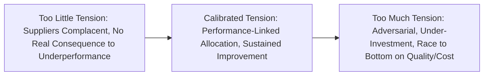
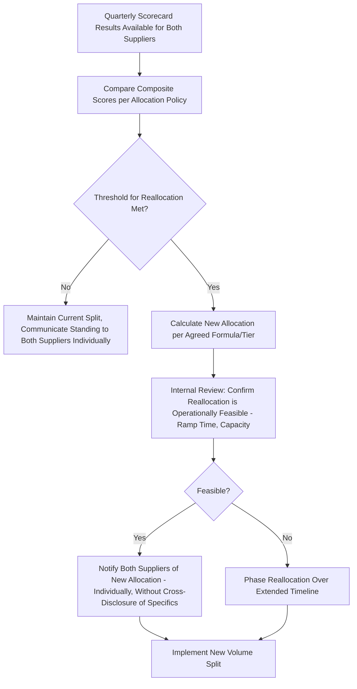
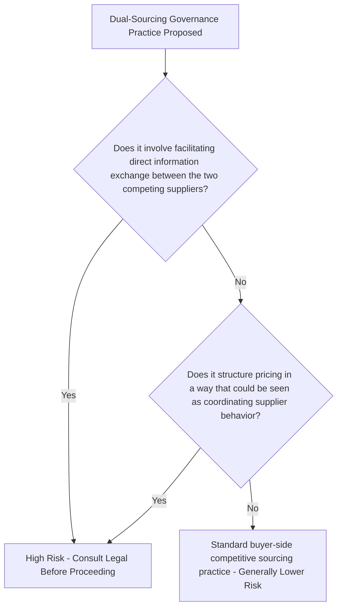
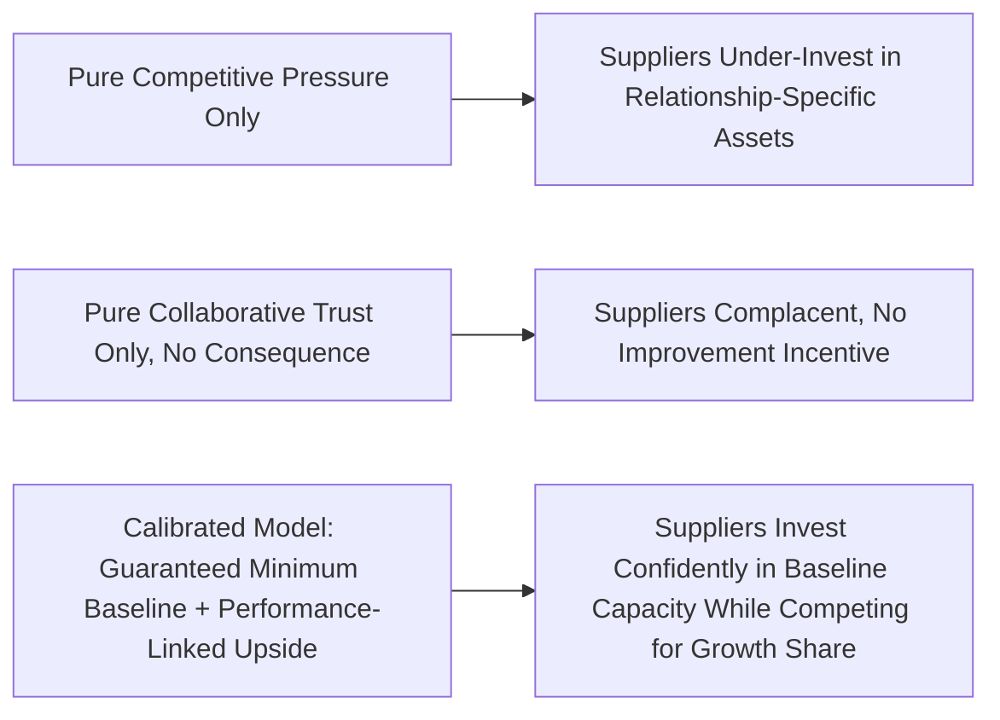

## Managing Competitive Tension Between Dual Sources

### Overview

Managing Competitive Tension Between Dual Sources addresses the deliberate calibration of rivalry between two (or more) qualified suppliers serving the same category, so that competitive pressure motivates continuous improvement without escalating into destructive behaviors — price collusion avoidance efforts backfiring into supplier disengagement, information gaming, or a race-to-the-bottom that damages quality or long-term capability investment. This is the operational core of dual sourcing as a strategy: the entire rationale for maintaining two sources, beyond pure supply continuity, rests on capturing the benefit of competitive tension while avoiding its failure modes. Done well, it produces sustained performance improvement from both suppliers; done poorly, it produces either an unproductive standoff (both suppliers assume they'll always get their allocated share regardless of performance) or an adversarial spiral that undermines the very trust and collaboration needed for either supplier to serve as a reliable partner.

### Key Points

- **Competitive tension requires genuine consequence, not just its appearance**: If volume allocation never actually shifts regardless of relative performance, suppliers quickly learn that competition is theater, and the intended pressure evaporates.
- **Transparency about the existence of competition, opacity about specifics**: Suppliers should generally know they are one of multiple qualified sources, but detailed performance/pricing data about the other supplier should not be shared, both for competitive-law reasons and to prevent collusive price-matching behavior.
- **Over-rotating on competitive pressure erodes the relational trust needed for collaboration**: Suppliers facing constant, aggressive competitive threat tend to under-invest in relationship-specific assets (dedicated capacity, joint innovation) since those investments carry higher risk if volume could be reallocated at any time.
- **Volume allocation mechanics are the primary lever for calibrated tension**: Sliding-scale or tiered allocation formulas tied to scorecard performance create continuous, proportionate incentive rather than binary winner-take-all dynamics.
- **Antitrust and competition-law boundaries constrain what buyers can do or say**: Facilitating information exchange between the two competing suppliers, or structuring arrangements that function as price-fixing facilitation, carries legal risk regardless of good intent.

### Spectrum of Competitive Tension Outcomes

### Performance-Linked Volume Allocation Model

A common mechanism for calibrated tension ties the volume split directly to relative (or absolute) scorecard performance rather than a fixed static ratio:

$$V_i = V_{total} \times \frac{S_i^{k}}{\sum_{j=1}^{n} S_j^{k}}$$

Where $V_i$ is supplier $i$'s allocated volume share, $S_i$ is supplier $i$'s composite scorecard score, $V_{total}$ is total category demand, and $k$ is a sensitivity exponent (higher $k$ amplifies the effect of score differences on allocation).

### Worked Allocation Example

| Supplier | Composite Score ($S_i$) | $S_i^2$ | Allocation Share |
| --- | --- | --- | --- |
| Supplier A (current primary) | 88 | 7,744 | $7744/(7744+5776) = 57.3\%$ |
| Supplier B (current secondary) | 76 | 5,776 | $5776/(7744+5776) = 42.7\%$ |

With $k=2$, a modest 12-point scorecard gap translates into a meaningful ~15-percentage-point volume-share difference, creating tangible incentive for Supplier B to close the performance gap, while Supplier A retains majority share reflecting its stronger current performance. [Inference: this specific formula and exponent choice is illustrative; actual allocation mechanics vary widely and are often negotiated contractually as tiered bands rather than a continuous formula.]

### Tiered Allocation Alternative (More Common in Practice)

| Scorecard Gap Between Suppliers | Allocation Response |
| --- | --- |
| Within 5 points | Maintain current allocation (avoid volume "chasing" over statistically insignificant differences) |
| 5–15 points | Gradual shift, e.g., 5% volume reallocation per quarter toward higher performer |
| >15 points, sustained 2+ quarters | Formal reallocation review, larger shift considered |
| Rating band downgrade (e.g., to At-Risk) | Immediate reallocation trigger regardless of point gap |

[Inference: tiered/banded allocation models are commonly preferred over continuous formulas in practice because they avoid volatile month-to-month volume swings driven by statistical noise in scorecard data.]

### Governance Flow for Competitive Allocation Reviews

### Information Boundaries: What Suppliers Should and Shouldn't Know

| Information | Share with Suppliers? | Rationale |
| --- | --- | --- |
| That multiple qualified suppliers exist in the category | Yes, generally | Establishes legitimate competitive context without specifics |
| Their own scorecard results and rating band | Yes | Necessary for their own improvement planning |
| The other supplier's specific scorecard scores | No | Competitive sensitivity; risk of enabling collusive behavior |
| The other supplier's pricing | No | Antitrust/price-fixing risk; also undermines independent negotiation |
| That their allocation may shift based on relative performance | Yes | Transparency about the mechanism (not the comparator's data) preserves fairness perception |
| Aggregate category volume/demand forecast | Yes, generally | Needed for capacity planning; doesn't reveal competitor-specific data |

### Antitrust and Competition-Law Considerations

[Unverified: specific antitrust/competition-law risk thresholds vary by jurisdiction; this flow represents a general risk-awareness heuristic, not legal advice, and legal counsel should be consulted for jurisdiction-specific guidance, particularly relevant given the Philippine LGU public-procurement context where competition and bidding-fairness rules may impose additional constraints.]

### Balancing Competitive Tension with Relationship Investment

A frequently used calibration mechanism guarantees each qualified supplier a minimum baseline volume (protecting their willingness to invest in dedicated capacity/quality systems) while making incremental volume above that baseline contingent on relative performance — this preserves enough certainty for relationship investment while still preserving genuine competitive stakes.

### Dual Sourcing-Specific Considerations

- **The "sole surviving supplier" trap**: If competitive tension is calibrated so aggressively that one supplier is effectively squeezed out entirely, the dual-sourcing structure collapses back into single-sourcing — the governance model should include a floor mechanism preventing full displacement except through the formal exit/rationalization process, not through unmanaged competitive erosion.
- **Secondary supplier disengagement risk**: A secondary supplier that perceives its allocation as permanently capped regardless of performance (i.e., competitive tension without genuine upside potential) has weak incentive to maintain activation-readiness investment — the allocation model should give real, not merely nominal, terms for the secondary to grow share.
- **Consistent allocation policy communication builds credibility of the incentive**: If the stated performance-to-allocation link isn't consistently honored in practice, both suppliers rationally discount future competitive-tension signals, undermining the entire mechanism.

### Common Pitfalls

- Allowing competitive tension to exist only nominally, with volume allocation never actually reflecting relative scorecard performance, causing both suppliers to disengage from the incentive
- Sharing competitor-specific performance or pricing data between suppliers, creating antitrust exposure and enabling tacit collusion
- Calibrating tension so aggressively that suppliers under-invest in dedicated capacity or long-term capability, undermining the reliability the dual-sourcing strategy was meant to secure
- Failing to define a volume floor, allowing competitive dynamics to organically squeeze the secondary supplier out and silently revert the category to single-sourcing
- Applying volume reallocation based on statistically insignificant scorecard differences, creating volatile, unpredictable allocation swings that damage both suppliers' planning confidence

**Related Topics**

- Weighted Supplier Scorecards and Rating Band Design
- Antitrust and Competition Law Considerations in Multi-Sourcing Governance
- Volume Allocation Formulas and Tiered Reallocation Models
- Joint Business Planning and Capacity Investment Trust
- Supplier Rationalization and Portfolio Concentration Risk
- Trust-Building and Conflict Resolution in Buyer-Supplier Relationships