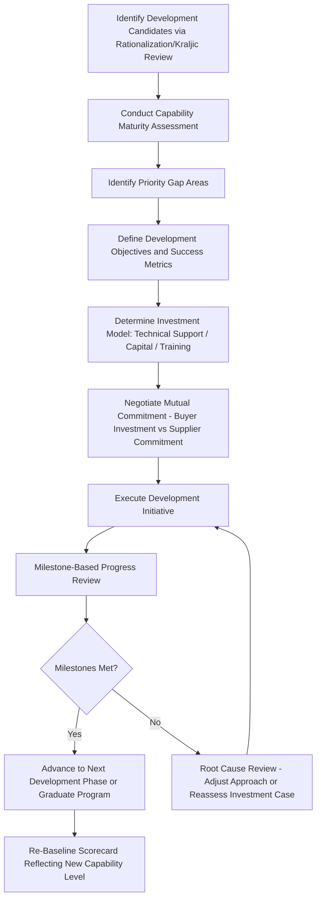
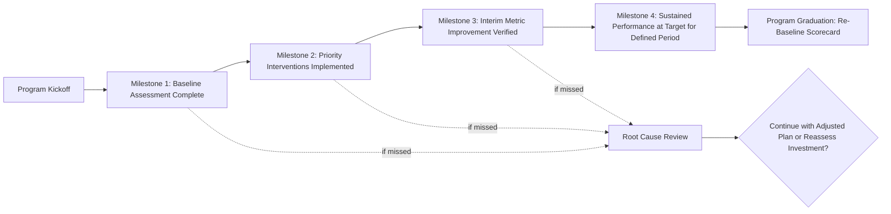
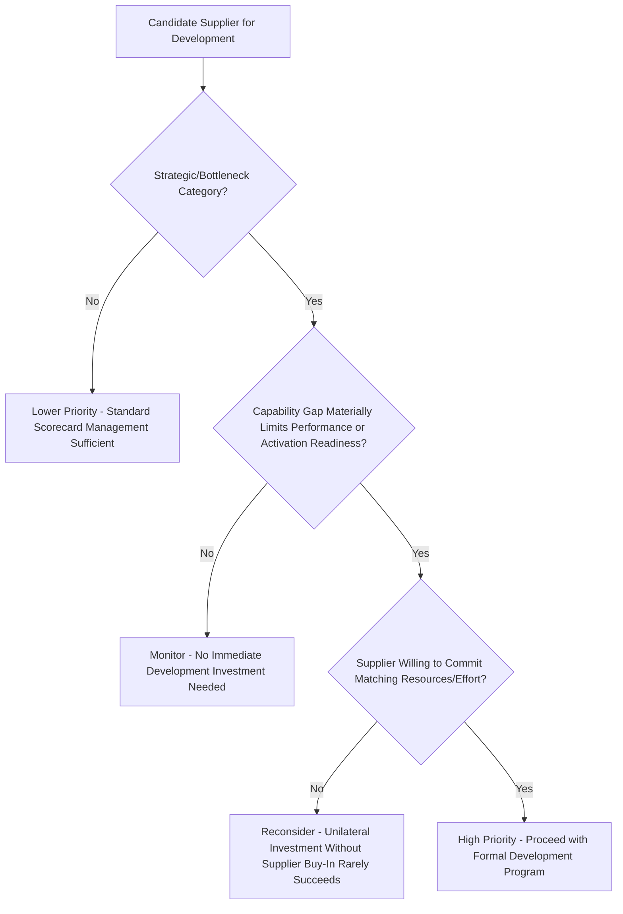

## Supplier Development Program Design


### Overview

Supplier Development Program Design is the discipline of structuring formal initiatives through which a buying organization actively invests resources — technical assistance, training, capital, process improvement expertise — to raise a supplier's capability, rather than passively monitoring performance and reacting to failures. Where CAPs remediate specific deficiencies reactively, supplier development is proactive and forward-investing: it targets suppliers whose long-term strategic value justifies buyer-side investment in their improvement. In Dual Sourcing, supplier development is the deliberate mechanism for closing the capability gap between a newly qualified secondary source and a mature primary, converting a "backup on paper" into a genuinely activation-ready alternative rather than waiting for organic improvement through volume alone.

### Key Points

- **Development differs from CAP in initiative and investment direction**: A CAP is supplier-driven remediation of an identified failure; supplier development is buyer-initiated, buyer-invested capability building, often addressing gaps the supplier hasn't yet manifested as a scorecard failure.
- **Program targeting should follow the Kraljic/rationalization logic**: development investment is justified for Strategic and Bottleneck category suppliers where capability gaps carry outsized business risk, not spread thinly across the entire supplier base.
- **Development requires genuine resource commitment from the buyer**, not just supplier-facing exhortation — technical expert time, capital co-investment, or process engineering support are what distinguish a real program from a scorecard threat repackaged as "development."
- **Maturity models provide the diagnostic starting point**: before designing interventions, the supplier's current capability level across relevant dimensions (quality systems, process control, digital integration) must be assessed against a defined maturity framework.
- **Dual sourcing development investment has a distinct ROI case**: unlike development aimed at cost reduction from an already-adequate primary, development aimed at a secondary supplier's capability gap is justified by risk-mitigation value (a genuinely activation-ready backup) rather than incremental savings alone.

### Supplier Development Program Types

| Program Type | Focus | Typical Mechanism |
| --- | --- | --- |
| Technical/Process Development | Manufacturing process capability, quality systems | On-site technical assistance, Lean/Six Sigma training, joint process mapping |
| Capacity Development | Physical/operational capacity expansion | Capital co-investment, equipment financing support, capacity-guarantee-linked investment |
| Digital/Systems Integration | EDI/API capability, data exchange maturity | Implementation support, shared integration cost, sandbox testing support |
| Quality Systems Development | Certification attainment (ISO 9001, industry-specific) | Training, gap-assessment audits, mentorship toward certification |
| Financial Health Support | Working capital constraints limiting capability investment | Supply chain financing programs, early payment terms, volume commitments enabling supplier financing |

### Supplier Development Program Design Flow



### Capability Maturity Model (Illustrative Framework)

| Maturity Level | Characteristics | Typical Development Focus |
| --- | --- | --- |
| Level 1: Ad Hoc | Inconsistent processes, reactive quality control, manual data exchange | Foundational process documentation, basic quality system establishment |
| Level 2: Managed | Documented processes, basic SPC, EDI/portal integration | Process capability improvement (Cpk targets), digital integration expansion |
| Level 3: Defined | Standardized processes across facility, proactive quality management | Advanced analytics adoption, cross-facility standardization |
| Level 4: Optimized | Continuous improvement culture, predictive quality/maintenance, full digital integration | Joint innovation, co-development, benchmarking partnership |

[Inference: this four-level structure mirrors common capability maturity model (CMM-style) frameworks widely used in supplier development practice; specific level definitions and terminology vary by organization and industry.]

### Development Business Case Template



```
Supplier Development Business Case: [Supplier Name]

Current State:
  Maturity Level: _______________________
  Key Capability Gaps: _______________________
  Current Scorecard Performance: _______________________

Strategic Rationale:
  Category Classification (Kraljic): _______________________
  Role: [Primary / Secondary-Dual-Sourced / Sole Source]
  Business Risk if Gap Unaddressed: _______________________

Proposed Investment:
  Type: [Technical Assistance / Capital / Training / Digital Integration Support]
  Buyer Resource Commitment: _______________________ (hours, dollars, expertise)
  Supplier Resource Commitment: _______________________
  Timeline: _______________________

Success Metrics and Milestones:
  Milestone 1 (Month __): _______________________
  Milestone 2 (Month __): _______________________
  Target End-State Metric: _______________________ (e.g., PPM reduction from X to Y)

Expected ROI/Risk-Mitigation Value:
  Quantified Benefit: _______________________
  [If Dual-Sourcing Context] Activation-Readiness Value: _______________________

Approval: _______________________ (per governance tier authority matrix)
```

### Milestone-Based Development Tracking



### Development Investment Prioritization Matrix



### Dual Sourcing-Specific Considerations

- **Development as the deliberate accelerant for secondary-supplier readiness**: Rather than passively waiting for a low-volume secondary supplier to organically mature, targeted development investment (technical assistance, digital integration support) closes the capability gap on a defined timeline, directly serving the activation-readiness objective.
- **Digital integration development often the highest-leverage investment for secondary suppliers**: A secondary supplier lagging on EDI/API integration relative to the primary represents a specific, addressable gap (see EDI/API Integration content) that directly affects failover speed — often a more tractable and faster win than deeper process-capability development.
- **Parity of development opportunity, not necessarily parity of investment volume**: The secondary supplier need not receive identical development investment to the primary, but should have a defined, genuine pathway to close specific gaps identified as activation blockers, rather than being excluded from development programs by default due to lower current volume.

### Common Pitfalls

- Launching a "development program" that consists solely of scorecard pressure and CAP demands without genuine buyer-side resource investment, which suppliers correctly perceive as relabeled enforcement rather than partnership
- Spreading limited development resources thinly across the entire supplier base rather than concentrating on Strategic/Bottleneck category suppliers where the business case is strongest
- Failing to secure matching supplier commitment before investing buyer resources, resulting in one-sided investment with no supplier accountability for follow-through
- Neglecting digital integration and activation-readiness gaps in secondary-supplier development in favor of only pursuing traditional quality/process development
- Not re-baselining the scorecard after successful development program completion, causing the supplier's improved capability to go unrecognized in ongoing performance evaluation

**Related Topics**

- Capability Maturity Models and Supplier Assessment Frameworks
- Corrective Action Plans vs. Proactive Development Program Distinctions
- EDI and API Integration for Activation-Readiness Acceleration
- Cost and Value Metrics: TCO and Development Investment ROI
- Joint Business Planning and Capacity Investment Trust
- Dual Sourcing Activation Readiness and Secondary Supplier Maturation