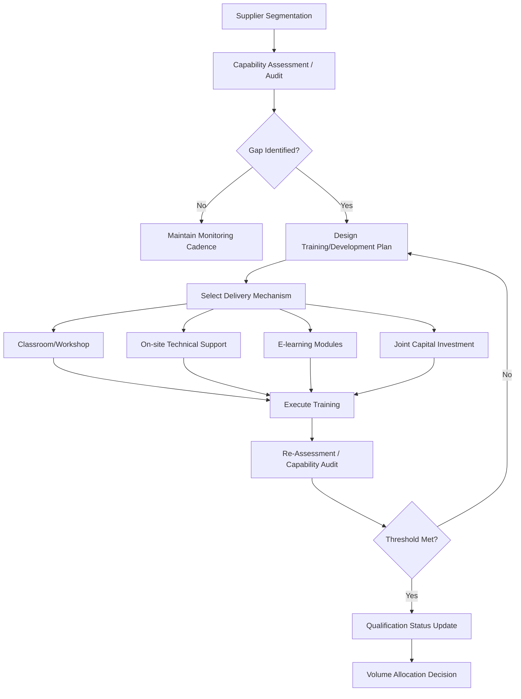

## Capability-Building and Training Initiatives

### Definition and Strategic Purpose

Capability-building and training initiatives refer to the structured, often formalized set of activities a buying organization undertakes to raise a supplier's technical, operational, quality, and managerial competencies. Unlike transactional supplier management (inspection, penalty enforcement, contract renewal), capability-building is an investment-oriented approach: the buyer commits resources — engineering time, training curricula, capital, embedded personnel, or shared technology — with the expectation of a durable improvement in the supplier's performance baseline.

Within a Supplier Relationship Management (SRM) and Dual Sourcing context, these initiatives serve several intertwined strategic purposes:

- **Risk mitigation in dual-sourcing structures**: When a buyer deliberately maintains two (or more) qualified sources for a critical component, one supplier — typically the newer, smaller, or geographically diversifying source — often lags the incumbent in process maturity. Capability-building closes that gap so the "second source" can genuinely absorb volume during a disruption, rather than being a source that exists on paper but cannot scale quickly.
- **Total cost of ownership (TCO) reduction**: Training suppliers in lean methods, statistical process control (SPC), or design-for-manufacturability (DFM) tends to reduce the buyer's inbound quality costs, expediting costs, and warranty exposure.
- **Strategic alignment and lock-in avoidance**: Capability-building programs, especially when standardized across a supplier base, allow the buyer to embed its own quality language, tooling, and data standards into suppliers without creating single-supplier dependency, since the same curriculum can be replicated across a second or third source.
- **Preservation of competitive tension**: In dual-sourcing arrangements, deliberately raising a weaker supplier's capability preserves genuine bidding competition and negotiation leverage at the next sourcing event, rather than allowing incumbency alone to determine share of business.

### Position in the Supplier Development Lifecycle

Capability-building typically follows supplier segmentation and precedes long-term integration. A common sequence:

1. **Segmentation** – classify suppliers (e.g., strategic, leverage, bottleneck, non-critical) using a Kraljic-style matrix.
2. **Capability assessment** – audit the supplier against defined maturity criteria (quality systems, process control, engineering capability, financial stability).
3. **Gap analysis** – compare current-state maturity to the capability level required for the intended role (sole source, dual source, backup/qualified-but-inactive source).
4. **Capability-building and training initiatives** – the focus of this section: closing identified gaps through structured intervention.
5. **Performance monitoring and re-certification** – verifying that gains are sustained (not just achieved once during an audit window).

### Core Categories of Capability-Building Initiatives

**Technical and Process Training**

- Statistical Process Control (SPC) and process capability ($C_p$, $C_{pk}$) training
- Root Cause Analysis (RCA) methodologies: 5-Why, Fishbone/Ishikawa, Fault Tree Analysis
- Design for Manufacturability and Assembly (DFMA) workshops
- Advanced Product Quality Planning (APQP) and Production Part Approval Process (PPAP) training, common in automotive and aerospace supply chains
- Failure Mode and Effects Analysis (FMEA) — both design (DFMEA) and process (PFMEA)

**Quality Management System (QMS) Development**

- Support toward ISO 9001, IATF 16949, AS9100, or industry-specific certifications
- Internal audit training so the supplier can self-police rather than rely solely on buyer audits
- Calibration and metrology program development

**Lean and Operational Excellence**

- 5S, Kaizen events, Value Stream Mapping (VSM)
- Single-Minute Exchange of Die (SMED) for setup reduction
- Total Productive Maintenance (TPM)

**Digital and Data Capability**

- EDI/API integration training so the supplier can participate in the buyer's demand signal and forecasting systems
- Training on the buyer's supplier portal, vendor-managed inventory (VMI) systems, or quality data submission platforms

**Managerial and Commercial Capability**

- Cost modeling and should-cost analysis literacy, so negotiations are grounded in shared understanding rather than opacity
- Contract and compliance training (e.g., conflict minerals reporting, ESG/sustainability disclosure requirements, trade compliance)

**Embedded/On-Site Support**

- Resident engineer programs: buyer places an engineer at the supplier's facility for a defined period
- Joint problem-solving teams for specific process or yield issues

### Delivery Mechanisms

| Mechanism | Description | Typical Use Case |
| --- | --- | --- |
| Classroom/workshop training | Instructor-led sessions, often cohort-based across multiple suppliers | Standardized methodology rollout (SPC, FMEA) |
| On-site technical assistance | Buyer engineers visit supplier facility | Line-specific yield or defect issues |
| Supplier days / summits | Buyer convenes multiple suppliers for shared learning and benchmarking | Sharing best practices, reinforcing standards |
| E-learning / digital modules | Self-paced content, often via LMS | Scalable, low-cost baseline training across many suppliers |
| Secondment / exchange programs | Supplier personnel temporarily work within the buyer's operations | Deep cultural and process alignment for strategic suppliers |
| Joint capital investment | Buyer co-funds equipment or tooling upgrades | Capacity or precision gaps that training alone cannot fix |

### Capability-Building in the Dual-Sourcing Context Specifically

Dual sourcing introduces a distinctive tension: the buyer wants both sources to be *capable* but does not necessarily want them to be *identical* in cost structure, since some differentiation preserves negotiating leverage. Capability-building programs in this context are typically designed with three considerations:

- **Calibrated parity, not full parity**: The buyer often brings the secondary source up to a defined minimum capability threshold (e.g., matching $C_{pk} \geq 1.33$ on critical characteristics) without necessarily transferring every proprietary process refinement given to the primary source.
- **IP and knowledge-transfer boundaries**: When training involves process specifications or tooling designs, buyers must manage the risk that training content becomes a vector for one supplier's proprietary methods leaking to a competing supplier, particularly if both suppliers serve other customers in the same industry. Legal safeguards (NDAs, IP assignment clauses) are typically paired with the technical training content.
- **Qualification-linked training triggers**: Many dual-sourcing programs tie specific training modules to qualification milestones — e.g., a supplier cannot move from "conditionally qualified" to "fully qualified, eligible for volume allocation" status until PPAP-equivalent training and a successful capability audit are complete.

**Example**: A buyer sourcing a precision-machined component from an incumbent Supplier A (Cpk 1.67, ISO 9001 + IATF 16949 certified) and a newer Supplier B (Cpk 1.05, ISO 9001 only, no automotive-specific certification) would typically:

1. Run a gap assessment against the incumbent's demonstrated capability level.
2. Deploy SPC and PFMEA training to Supplier B's process engineers.
3. Fund calibration equipment upgrades if measurement system capability is the binding constraint.
4. Conduct a joint capability audit before releasing dual-source volume allocation, often targeting a Cpk threshold before releasing significant volume.
5. Maintain a lighter-touch, ongoing monitoring cadence for the qualified secondary source once it is validated.

### Governance and Metrics

Capability-building initiatives are typically governed through:

- **Supplier scorecards** tracking quality (PPM defect rates), delivery (OTIF — on-time-in-full), and cost performance trends before and after training interventions
- **Capability maturity models**, often a 4–5 level scale (e.g., Level 1: Ad hoc, Level 2: Repeatable, Level 3: Defined, Level 4: Managed, Level 5: Optimizing), analogous in structure to the Capability Maturity Model Integration (CMMI) framework used in software engineering
- **Training completion and certification tracking**, frequently embedded in the buyer's supplier portal or SRM software (e.g., SAP Ariba, Coupa, Jaggaer)
- **Return on training investment**: measured as the delta in defect cost, rework cost, or expediting cost pre- versus post-intervention, though attribution to training alone versus other concurrent changes is often methodologically difficult [Inference — attribution challenges are a general limitation of supplier development ROI measurement, not always explicitly quantified in practice].

### Illustrative Process Flow

### Common Pitfalls

- **Training without reinforcement**: One-off workshops without follow-up audits tend to see capability regress to baseline within a few quarters.
- **Asymmetric investment perception**: If the incumbent supplier perceives the buyer investing disproportionately in a competing second source, relationship trust with the incumbent can erode, so transparency around dual-sourcing rationale is often managed carefully.
- **Certification without genuine capability**: Suppliers may treat training as a checkbox exercise to unlock volume allocation rather than internalizing the methodology, which capability audits (not just training-completion records) are designed to catch.
- **Underestimating resource commitment**: Embedded engineer programs and joint capital investment carry real opportunity cost for the buyer's own engineering organization, which is sometimes underestimated in program planning [Inference].

**Next Steps**

- Supplier Capability Maturity Models and Scoring Frameworks
- Resident Engineer and Embedded Support Program Design
- PPAP and APQP Documentation Requirements Across Industries
- Should-Cost Modeling as a Supplier Development Tool
- Balancing Knowledge Transfer with IP Protection in Multi-Supplier Ecosystems
- Supplier Scorecard Design and PPM/OTIF Metric Governance
- Transitioning a Qualified Secondary Source to Active Volume Allocation