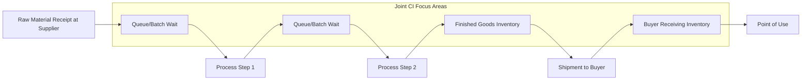

## Lean and Continuous Improvement With Suppliers

### Definition and Strategic Rationale

Lean and Continuous Improvement (CI) with suppliers refers to the extension of lean manufacturing principles — originally developed within a single firm's four walls (most notably the Toyota Production System) — outward across the boundary of the buying organization into its supply base. Rather than treating suppliers purely as external transaction counterparties, the buyer engages suppliers as co-participants in eliminating waste, reducing variability, and driving incremental performance gains across the extended value stream.

In an SRM and Dual Sourcing context, lean/CI programs serve distinct purposes:

- **Extended value stream optimization**: Waste (muda) at a supplier's facility — excess inventory, overproduction, defects, waiting time — ultimately surfaces as cost, lead time, or quality risk at the buyer's own operations. Lean-with-suppliers treats the multi-tier supply chain as a single value stream to be optimized jointly, not as isolated cost centers.
- **Sustaining dual-source parity over time**: Initial capability-building (see prior chapter item) closes a one-time gap; continuous improvement is the ongoing mechanism that prevents that gap from reopening and keeps both sources competitive with one another.
- **Cost reduction without price-only negotiation**: CI-derived savings (e.g., reduced scrap, shorter cycle times) can be shared between buyer and supplier, offering an alternative to adversarial price-down negotiation tactics.

### Core Lean Principles Applied at the Supplier Interface

**The Five Lean Principles (Womack & Jones framework), applied externally**

1. **Value** – defined from the end customer's perspective, cascaded contractually and operationally to the supplier so the supplier understands which specifications and tolerances are genuinely value-adding versus historically inherited but non-critical.
2. **Value Stream Mapping (VSM)** – mapping material and information flow across the buyer-supplier boundary, not just within one facility. Extended VSM exercises are typically conducted jointly, with representatives from both organizations physically walking the process.
3. **Flow** – reducing batch-and-queue behavior in the supplier's production and shipping patterns, often via smaller, more frequent shipments synchronized to the buyer's consumption rate.
4. **Pull** – replacing forecast-push replenishment with kanban or consumption-triggered replenishment signals between buyer and supplier.
5. **Perfection** – an explicit, ongoing improvement cadence (kaizen) rather than a one-time project.

### Key Tools and Methodologies

**Value Stream Mapping (Extended/Cross-Enterprise)**

Maps the flow from the supplier's raw material receipt through to the buyer's point of use, capturing cycle times, inventory buffers, and information lead times at each step. Distinguishes value-adding time from non-value-adding time; a典型的な outcome is a current-state map showing that value-added time is a small fraction of total lead time, followed by a future-state map with target reductions.

**Kaizen Events (Joint)**

Time-boxed (typically 3–5 day) focused improvement workshops conducted jointly at the supplier's facility, targeting a specific process, cell, or bottleneck. Structured phases typically include: problem definition, current-state observation, root-cause identification, rapid experimentation, and standardized-work documentation.

**Kanban and Pull Replenishment**

- Two-bin or card-based visual signals that trigger supplier replenishment only when actual consumption occurs, reducing buyer-side inventory and smoothing supplier production load.
- Electronic kanban (e-kanban) systems increasingly replace physical cards, integrating with the buyer's ERP or the supplier portal referenced in capability-building programs.

**Single-Minute Exchange of Die (SMED)**

Applied at supplier facilities to reduce changeover/setup times, enabling smaller batch sizes without productivity loss — directly supporting the "flow" principle and reducing the supplier's economic incentive to overproduce.

**Total Productive Maintenance (TPM)**

Joint focus on equipment reliability at the supplier, since unplanned downtime at a supplier directly threatens the buyer's own production continuity — particularly acute in a dual-sourcing model where the "backup" source's equipment reliability determines how quickly it can absorb diverted volume.

**Statistical Process Control (SPC) as a CI Feedback Loop**

While SPC is foundational to capability-building, in a CI context it functions as an ongoing feedback mechanism: control charts and $C_{pk}$ trending are reviewed in recurring supplier business reviews to identify drift before it becomes a defect event.

**Poka-Yoke (Error-Proofing)**

Design and process changes at the supplier that make defects physically impossible or immediately detectable, reducing reliance on downstream inspection — often a joint engineering exercise between buyer and supplier quality teams.

### Governance Structures for Ongoing CI

| Mechanism | Cadence | Purpose |
| --- | --- | --- |
| Supplier Business Reviews (SBR) / Quarterly Business Reviews (QBR) | Quarterly (typical) | Review scorecard trends, agree CI priorities |
| Joint Kaizen Calendar | Project-based, often multiple per year per strategic supplier | Execute targeted improvement events |
| Shared savings / gainsharing agreements | Ongoing, tied to realized savings | Align financial incentive for supplier-driven improvement |
| CI idea/suggestion systems | Continuous | Capture incremental improvements from supplier shop-floor personnel |
| Tiered supplier councils | Semi-annual/annual | Cross-supplier best-practice sharing, benchmarking |

**Example**: A buyer and a Tier-1 machining supplier jointly map the value stream for a critical bracket component. The current-state map reveals 11 days of total lead time against roughly 40 minutes of actual value-added machining time, with the gap attributable to batch queuing between operations and a weekly (rather than daily) shipping schedule. A joint kaizen event targets changeover reduction (via SMED) to enable smaller batch sizes, paired with a shift to a twice-weekly milk-run shipment. Post-event, lead time is reduced meaningfully and buyer-side safety stock requirements drop correspondingly — a plausible order of outcome, though actual figures are program-specific and would be validated through the SBR reporting cycle [Inference — illustrative magnitude, not a universal benchmark].

### Lean/CI in the Dual-Sourcing Context Specifically

- **Cross-pollination risk and value**: Insights gained from a kaizen event at Supplier A can often be generalized and offered to Supplier B, raising the floor across the dual-source base — but as with capability-building, this requires managing IP boundaries if the two suppliers are commercial competitors.
- **Avoiding CI-driven lock-in**: Heavy joint investment in supplier-specific process redesign can inadvertently increase switching costs, working against the strategic flexibility that dual sourcing is meant to preserve. Buyers typically favor CI investments in *general* capability (workforce skill, equipment reliability) over investments narrowly tailored to a single buyer's part number.
- **Comparative benchmarking as a CI lever**: In a dual-source structure, the buyer can use performance data from one source as a benchmark to motivate CI at the other — a form of competitive tension that single-source relationships cannot leverage.

### Illustrative Value Stream Flow

### Measurement and Sustaining Gains

- **Lead time reduction** (order-to-delivery, and process cycle time specifically)
- **Inventory turns** at both supplier and buyer, often tracked jointly as a shared metric rather than optimized locally by either party alone
- **First Pass Yield (FPY)** and defect PPM trends over time, not just at a single audit point
- **Overall Equipment Effectiveness (OEE)** at the supplier, where TPM initiatives have been deployed
- **Sustainment audits**: scheduled follow-up visits (e.g., 30/60/90-day post-kaizen) to verify standardized work is actually being followed, since a well-documented failure mode of kaizen events generally is that gains erode once the event team disengages [Inference — widely observed pattern in lean literature, treated here as a general caution rather than a universal law].

### Common Pitfalls

- **Buyer-driven CI without supplier ownership**: Improvements imposed top-down by the buyer's engineers, rather than co-developed with supplier shop-floor personnel, tend not to sustain.
- **Savings capture asymmetry**: If all CI-derived savings are captured by the buyer through price-downs, supplier motivation to surface further improvement opportunities diminishes; gainsharing models are a common corrective.
- **Metric overload**: Tracking too many KPIs across too many suppliers dilutes management attention; mature programs typically focus SBR discussion on a small set of leading indicators per supplier tier.
- **Treating kaizen as a one-time event** rather than embedding a suggestion/improvement cadence into daily supplier operations.

**Related Topics**

- Extended Value Stream Mapping Techniques and Symbol Notation
- Gainsharing and Savings-Sharing Contract Structures
- Kanban System Design for Multi-Tier Supply Chains
- Supplier Business Review (SBR) Design and KPI Selection
- Total Productive Maintenance (TPM) Implementation at Third-Party Facilities
- Poka-Yoke Design Techniques for Supplier Process Integration
- Benchmarking Frameworks Across Dual-Sourced Supplier Pairs