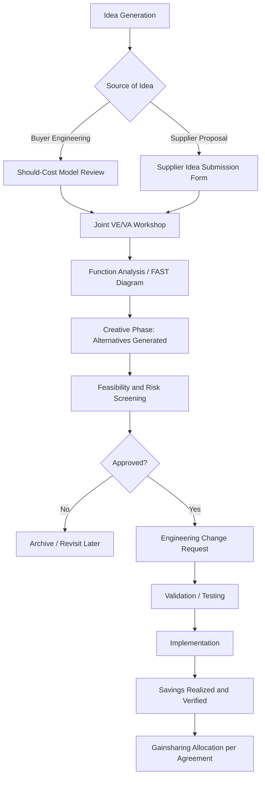

## Joint Cost Reduction and Value Engineering Programs

### Definition and Strategic Rationale

Joint Cost Reduction (JCR) and Value Engineering (VE) programs are structured, collaborative initiatives in which buyer and supplier organizations jointly identify, quantify, and implement cost-out or value-improvement opportunities across a product or component's design, materials, and production process — with the financial benefit shared or allocated according to a predefined agreement, rather than extracted unilaterally through price negotiation.

This distinguishes JCR/VE from adversarial cost-down tactics in a critical way: the former treats the supplier's engineering knowledge as a resource to be leveraged jointly, while the latter treats the supplier purely as a price-taker. In an SRM and Dual Sourcing context, this distinction matters because:

- **Sustainable savings vs. margin transfer**: Price-only cost-downs transfer margin from supplier to buyer without changing the underlying cost structure, which is often unsustainable and can degrade quality or service over time. JCR/VE targets the actual cost driver (design complexity, material specification, process yield), producing savings that persist.
- **Preserving supplier health in a dual-source structure**: Squeezing a secondary source's margin too aggressively can undermine its financial viability precisely when the buyer needs it most — during a primary-source disruption. JCR/VE offers a path to cost reduction that need not erode supplier financial health.
- **Engineering trust as a relationship asset**: A track record of fair gainsharing tends to make suppliers more willing to proactively surface further savings ideas.

### Value Engineering vs. Value Analysis — Terminological Distinction

Though often used interchangeably in practice, the classical distinction (originating with Lawrence Miles at General Electric in the 1940s) is:

- **Value Engineering (VE)** – applied during the design phase, before a product enters production, to achieve required function at optimal cost.
- **Value Analysis (VA)** – applied to an existing, already-in-production product or component, analyzing it retrospectively to identify cost-reduction opportunities without compromising function.

Both are grounded in the core value equation:

$$V = \frac{F}{C}$$

where $V$ is value, $F$ is function (performance, reliability, aesthetics — whatever the customer requires), and $C$ is cost. Value can be increased by improving function at equal cost, maintaining function at lower cost, or — most powerfully — simultaneously improving function while reducing cost.

### The VE/VA Job Plan (Classical Methodology)

A structured, phase-gated process, typically applied in joint workshops with both buyer and supplier engineering, cost, and manufacturing representatives present:

1. **Information Phase** – gather complete data on the component: specifications, current cost breakdown, volumes, performance requirements, and constraints.
2. **Function Analysis Phase** – decompose the component into its functions using active-verb/noun pairs (e.g., "transmit torque," "seal fluid," "resist corrosion"), distinguishing basic (must-have) functions from secondary (nice-to-have or historically inherited) functions. Function Analysis System Technique (FAST) diagrams are commonly used here.
3. **Creative Phase** – brainstorm alternative ways to achieve each function at lower cost or higher value, without judging feasibility yet.
4. **Evaluation Phase** – screen ideas for technical feasibility, cost impact, and risk.
5. **Development Phase** – develop the most promising ideas into concrete proposals with validated cost and performance data.
6. **Presentation/Implementation Phase** – present to decision-makers, secure approval, and implement with a formal change process (engineering change order/request).

### Should-Cost Modeling as the Analytical Foundation

Should-cost analysis — building a bottom-up cost model of what a component *should* cost given its material, process, labor, and overhead inputs — is the quantitative backbone of most JCR/VE programs. A typical should-cost model decomposes total cost as:

$$C_{total} = C_{material} + C_{labor} + C_{overhead} + C_{tooling/amortized} + \text{Margin}$$

Joint JCR programs often involve the buyer sharing its should-cost model with the supplier (or building it collaboratively), creating a shared factual basis for negotiation rather than opposing, opaque cost claims. This is sometimes termed "open-book costing" or "transparent cost modeling."

**Example**: A buyer's should-cost model for a stamped metal bracket estimates material cost at $0.42/unit, labor and overhead at $0.31/unit, and tooling amortization at $0.05/unit, totaling $0.78 against the supplier's quoted $1.05. A joint review reveals the gap is attributable largely to a lower-than-necessary steel grade specification inherited from an earlier design revision and a scrap rate higher than the buyer's model assumed. A joint VE workshop targeting the material specification and a supplier-side process yield improvement narrows the gap, with savings split according to the program's gainsharing terms.

### Common Cost-Reduction Levers Explored Jointly

**Design-Level Levers**

- Material substitution (e.g., alternative alloy grade, resin, or composite meeting the same functional requirement at lower cost)
- Tolerance relaxation on non-critical dimensions, reducing machining time or scrap
- Part consolidation (combining multiple components into one, reducing assembly labor and inventory carrying cost)
- Standardization across product variants (reducing tooling proliferation and enabling volume-driven unit cost reduction)

**Process-Level Levers**

- Yield improvement (reducing scrap/rework cost, often connecting directly to the SPC and lean/CI programs discussed elsewhere in this chapter)
- Alternative manufacturing process selection (e.g., near-net-shape casting vs. machining from billet)
- Automation of manual operations where volume justifies capital investment

**Commercial/Supply Chain Levers**

- Packaging and logistics optimization (reducing freight cost per unit through better cube utilization)
- Volume consolidation across the dual-source base to improve either supplier's negotiating position with their own upstream raw material suppliers
- Payment term or inventory ownership restructuring that reduces the supplier's carrying cost, part of which can be passed through as unit price reduction

### Gainsharing Models

| Model | Mechanism | Typical Use Case |
| --- | --- | --- |
| 50/50 split | Savings divided equally between buyer and supplier for an agreed period | Most common default in mature JCR programs |
| Tiered/declining share | Supplier retains a larger share initially, declining over subsequent periods | Incentivizes early, aggressive proposal submission |
| Fixed-price hold with supplier retention | Buyer holds price flat while supplier retains 100% of realized savings for a defined window | Rewards supplier-originated ideas with minimal buyer engineering input |
| Volume-for-price tradeoff | Supplier reduces price in exchange for committed or increased volume allocation | Common in dual-sourcing rebalancing negotiations |

### Governance and Process Flow

### JCR/VE in the Dual-Sourcing Context Specifically

- **Comparative should-cost validation**: When two suppliers produce the same or similar components, the buyer can cross-validate should-cost assumptions between them, often surfacing where one supplier's process is genuinely more efficient versus where quoted price differences reflect margin strategy rather than cost structure.
- **Selective idea propagation**: A cost-saving idea originating from one supplier (e.g., a material substitution) can sometimes be offered to the second source — subject to the same IP and competitive-sensitivity caveats raised under capability-building — effectively multiplying the savings across the dual-sourced volume.
- **Negotiating leverage from parallel programs**: Running JCR/VE workshops with both sources concurrently, rather than sequentially, tends to prevent either supplier from perceiving itself as the sole target of cost pressure, which can otherwise strain the relationship.
- **Risk of unintended divergence**: If VE changes (e.g., a tolerance relaxation) are implemented with one source but not communicated to and mirrored at the second source, the two suppliers' output can drift out of specification alignment — a risk that requires formal engineering change control to extend to both qualified sources simultaneously.

### Governance Cadence and Metrics

- **Savings pipeline tracking**: idea count, validated savings-in-progress, and realized (booked) savings, typically reported quarterly and often integrated into the same SBR cadence used for lean/CI review.
- **Idea velocity**: time from idea submission to implementation, used as a process-health indicator.
- **Supplier participation rate**: number of supplier-originated (versus buyer-originated) ideas, often tracked as a proxy for relationship health and trust.
- **Savings verification methodology**: distinguishing "cost avoidance" (preventing a future cost increase) from "hard savings" (measurable reduction against a prior baseline price), since conflating the two can distort reported program value [Inference — a commonly cited distinction in procurement cost-savings reporting practice, though exact terminology varies by organization].

### Common Pitfalls

- **One-sided savings capture** eroding supplier willingness to propose future ideas, as noted under lean/CI — gainsharing terms need to be perceived as fair, not just contractually present.
- **Engineering change control gaps**: implementing a VE change without full re-validation (especially in regulated industries like automotive or aerospace) can introduce quality or compliance risk.
- **Should-cost model staleness**: models built once and not refreshed for raw material index movements (e.g., steel, resin, or energy price indices) lead to negotiating positions that no longer reflect current reality.
- **Function creep in scope**: VE workshops that drift from cost reduction into unrelated design debates can lose focus and stall the job-plan cadence.

**Next Steps**

- Should-Cost Modeling Techniques and Cost Breakdown Structures
- FAST Diagramming and Function Analysis in Practice
- Gainsharing Contract Design and Legal Structuring
- Engineering Change Management Across Dual-Qualified Sources
- Raw Material Index-Linked Pricing Mechanisms
- Supplier Idea Management Systems and Submission Workflows
- Distinguishing Cost Avoidance from Hard Savings in Procurement Reporting