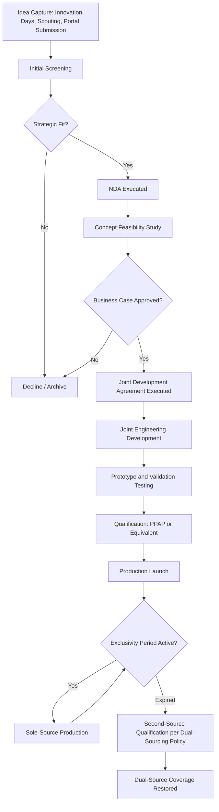

## Supplier Innovation Pipelines and Co-Development

### Definition and Strategic Rationale

Supplier innovation pipelines and co-development refer to the structured mechanisms by which a buying organization systematically captures, evaluates, and integrates innovation originating from its supply base — and, at a deeper level of engagement, jointly develops new technologies, materials, or product features with strategic suppliers before those innovations reach the broader market.

This represents the furthest point along the supplier development maturity spectrum discussed in this chapter: capability-building raises a supplier's execution competence, lean/CI improves existing processes, joint cost reduction extracts value from the current design — but supplier co-development creates genuinely new value, often ahead of the buyer's own internal R&D capacity or timeline.

In an SRM and Dual Sourcing context, this category carries distinctive tensions not present in the earlier chapter items:

- **Innovation exclusivity vs. dual-source flexibility**: A supplier that invests significant R&D effort into a co-developed innovation typically expects some period of exclusivity or preferential commercial terms in return — directly in tension with the buyer's dual-sourcing principle of maintaining substitutable, competing sources.
- **First-mover risk allocation**: Early-stage co-development carries technical and commercial risk (the innovation may not work, may not scale, or may not be adopted); the buyer and supplier must contractually agree how that risk — and the corresponding reward if successful — is shared.
- **Information asymmetry and disclosure risk**: Deep co-development often requires the supplier to share proprietary process knowledge and the buyer to share forward-looking product roadmap information, both of which carry competitive sensitivity, particularly acute if the supplier also serves the buyer's competitors.

### Innovation Pipeline Structure

A mature supplier innovation pipeline typically mirrors a stage-gate (Cooper's Stage-Gate) structure, adapted for externally sourced ideas:

1. **Idea Capture** – structured intake from suppliers (innovation days, technology scouting visits, supplier portals with a dedicated innovation-submission channel), as distinct from the reactive cost-idea submission channel used in JCR/VE programs.
2. **Screening** – initial triage against strategic fit, technical feasibility, and rough order-of-magnitude business case.
3. **Concept Development** – joint feasibility study, often under a Non-Disclosure Agreement (NDA) or Joint Development Agreement (JDA), including early technical validation.
4. **Business Case and Investment Decision** – formal gate review determining whether to fund full development, typically requiring cross-functional buyer sign-off (engineering, procurement, quality, legal).
5. **Joint Development Execution** – parallel or integrated engineering work, prototype iteration, and validation testing.
6. **Qualification and Launch** – formal part qualification (PPAP or equivalent), transition into the buyer's standard sourcing and dual-sourcing qualification framework.
7. **Post-Launch Review** – performance tracking against the original business case, and — critically for dual-sourcing strategy — a decision on whether/when to transfer or license the innovation to a second source.

### Supplier Segmentation for Innovation Engagement

Not all suppliers are candidates for co-development; innovation pipeline programs typically apply a segmentation lens distinct from (though related to) the Kraljic matrix used for general sourcing strategy:

| Supplier Category | Innovation Engagement Model |
| --- | --- |
| Strategic/Preferred suppliers | Deep co-development, JDAs, roadmap sharing, possible exclusivity terms |
| Leverage suppliers (commodity, high spend) | Structured idea submission, less deep technical integration |
| Niche/specialist technology suppliers | Technology scouting relationships, often pre-commercial |
| Bottleneck/emerging suppliers (relevant to dual-sourcing) | Innovation engagement typically deferred until capability-building milestones are met |

### Contractual and Governance Mechanisms

**Non-Disclosure Agreements (NDAs)** — govern the earliest, pre-commitment exploratory conversations.

**Joint Development Agreements (JDAs)** — the core legal instrument for co-development, typically addressing:

- Scope of work and milestones
- Funding responsibility (buyer-funded, supplier-funded, or cost-shared)
- Intellectual property ownership and licensing terms (background IP the supplier brings in, versus foreground IP jointly created)
- Exclusivity terms and duration (e.g., 12–24 months of buyer exclusivity before the supplier may offer the innovation to other customers)
- Exit and termination provisions if the development fails technically or commercially

**Innovation Governance Boards** — cross-functional buyer-side committees (procurement, engineering, R&D, legal) that review and prioritize co-development proposals, ensuring innovation investment aligns with product roadmap rather than being pursued ad hoc by individual engineers.

**Technology Roadmap Sharing Sessions** — structured, often annual, sessions where the buyer shares forward-looking product direction (under NDA) and invites strategic suppliers to align their own R&D investment accordingly.

### The Exclusivity–Dual-Sourcing Tension, in Depth

This is the defining strategic challenge of this chapter item, and merits explicit treatment:

- **Time-boxed exclusivity as a compromise**: Rather than permanent sole-source commitments, mature programs typically negotiate a defined exclusivity window (e.g., first 18 months of production) after which the buyer retains the right to qualify a second source — sometimes with a technology license or transfer payment to the originating supplier as compensation.
- **"Second source enablement" clauses**: Some JDAs explicitly include provisions requiring the innovating supplier to cooperate in transferring sufficient process knowledge to enable a second source's qualification after the exclusivity period, in exchange for the exclusivity itself.
- **Buyer-owned foreground IP as a mitigation**: When the buyer funds a meaningful share of the co-development cost, negotiating buyer ownership (or joint ownership) of foreground IP gives the buyer the legal freedom to license the innovation to a second source independent of the original supplier's willingness.
- **Portfolio-level balancing**: Buyers managing many co-development relationships across a supplier base often accept sole-source exposure on a subset of genuinely differentiated innovations while maintaining strict dual-sourcing discipline on commodity or non-differentiated components — a deliberate risk-segmentation decision rather than a uniform policy.

**Example**: A buyer co-develops a novel corrosion-resistant coating process with a specialist supplier, funding 60% of the development cost under a JDA that grants the supplier 18 months of exclusivity in exchange for a contractual commitment to support a second source's process qualification thereafter, with the buyer retaining a license to the foreground process parameters (though not the supplier's underlying proprietary chemistry) developed during the joint program. At month 20, the buyer initiates qualification of a second coating supplier using the licensed process parameters, restoring dual-sourcing coverage while having captured 18 months of competitive differentiation from the original innovation.

### Innovation Pipeline Flow

### Metrics and Governance Cadence

- **Pipeline funnel metrics**: number of ideas captured, conversion rate at each stage gate, average time-in-stage
- **Innovation-sourced revenue/savings contribution**: value attributable to supplier-originated innovation versus internally originated R&D, often tracked as a strategic KPI at the category management level
- **Supplier innovation participation rate**: proportion of strategic suppliers actively engaged in the pipeline versus purely transactional
- **Time-to-market impact**: comparison of co-developed innovation timelines against equivalent internally-developed alternatives, where available
- **Dual-source restoration lag**: for co-developed items under exclusivity, the elapsed time between exclusivity expiration and second-source qualification completion — a metric specific to reconciling this chapter item with the broader dual-sourcing strategy

### Common Pitfalls

- **Innovation theater**: running "innovation days" or idea-submission portals without a genuine, resourced stage-gate process behind them, leading suppliers to disengage after seeing no follow-through.
- **IP ambiguity at the outset**: entering technical collaboration before IP ownership terms are settled, creating disputes once an innovation proves commercially valuable.
- **Exclusivity without an exit plan**: granting open-ended or vaguely bounded exclusivity that leaves the buyer structurally unable to restore dual-sourcing coverage even when strategically necessary.
- **Roadmap disclosure risk**: sharing forward-looking product plans with a supplier that also serves competitors, without adequate NDA scope or information-barrier controls.
- **Underfunded co-development**: treating joint development as a favor the supplier extends for free, discouraging the supplier's best technical resources from being allocated to the buyer's priorities relative to other customers who pay for access.

**Related Topics**

- Joint Development Agreement (JDA) Structuring and IP Clause Design
- Stage-Gate Process Adaptation for External Innovation Sourcing
- Technology Scouting and Supplier Innovation Day Program Design
- Foreground vs. Background IP Allocation in Collaborative R&D
- Second-Source Enablement Clauses and Technology Transfer Mechanics
- Innovation Governance Board Design and Cross-Functional Prioritization
- Portfolio-Level Risk Segmentation Between Sole-Source Innovation and Dual-Sourced Commodities