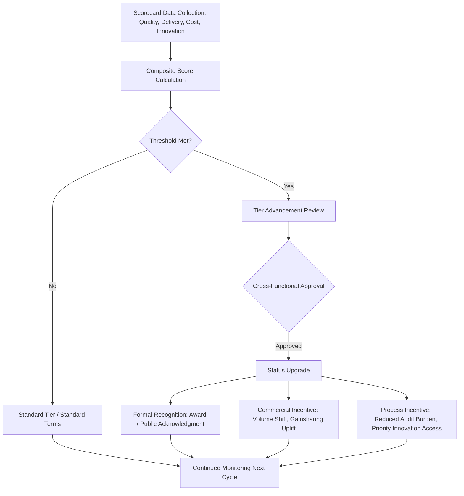

## Recognition and Incentive Programs

### Definition and Strategic Rationale

Recognition and incentive programs are formalized mechanisms by which a buying organization acknowledges and rewards superior supplier performance, distinct from — and complementary to — the corrective, gap-closing focus of capability-building, and the financially transactional focus of joint cost reduction. Where earlier chapter items address *how to raise a supplier up to a required standard* or *how to extract joint value*, recognition and incentive programs address *how to reinforce and perpetuate behavior once a supplier is already performing well*.

The underlying rationale draws on a basic behavioral premise in supplier management: performance management systems built entirely on penalty and corrective action (scorecobards that only flag deficiencies, contracts that only specify liquidated damages) tend to produce compliance-minimum behavior. Recognition and incentive mechanisms are designed to shift supplier motivation toward proactive, above-baseline performance by making excellence visible, valued, and — where structured as tangible incentives — financially or commercially rewarding.

In an SRM and Dual Sourcing context, this chapter item carries specific strategic functions:

- **Sustaining the gains from capability-building and lean/CI**: Recognition reinforces that the effort suppliers put into training uptake, kaizen participation, and cost-reduction proposals is seen and valued, reducing the risk of regression discussed under those earlier items.
- **Shaping dual-source competitive dynamics constructively**: In a dual-sourcing structure, recognition programs can be used to make the basis of volume allocation and preferred-status decisions transparent and merit-based, rather than opaque — which tends to motivate both sources to compete on performance rather than purely on price.
- **Retention of supplier mindshare**: Strategic suppliers typically serve multiple customers and allocate their best engineering talent, capacity, and innovation attention preferentially. Being recognized as a "customer of choice" — a term of art in procurement literature — is itself a competitive lever for securing preferential treatment from suppliers, independent of contractual terms.

### Categories of Recognition Mechanisms

**Formal Recognition Programs**

- Annual or periodic **Supplier of the Year** (or category-specific: Quality Excellence, Innovation, Delivery Excellence) awards, often presented at a formal supplier summit or conference
- Public acknowledgment through the buyer's supplier portal, newsletter, or website
- Executive-level recognition — site visits or letters from senior buyer leadership, which carry outsized relationship value in a business-to-business context relative to their direct cost

**Tiered Status/Certification Programs**

- Formal designation levels (e.g., "Certified," "Preferred," "Strategic," "Platinum") tied to sustained scorecard performance across quality, delivery, cost, and responsiveness metrics
- Status tiers often unlock tangible privileges: reduced audit frequency, streamlined approval processes for engineering changes, priority access to buyer's innovation pipeline (linking directly to the co-development chapter item), or first-look opportunities on new sourcing events

**Financial and Commercial Incentives**

- Volume allocation increases as a reward mechanism — directly relevant to dual sourcing, since a portion of contestable volume can be structured to shift toward the better-performing of two qualified sources on a recurring (e.g., quarterly or annual) basis
- Extended contract terms or renewal preference for top-tier performers, reducing the supplier's own planning uncertainty
- Gainsharing enhancements (building on the JCR/VE mechanisms from the prior chapter item) — e.g., a more favorable savings split for suppliers with a sustained track record of proactive idea submission
- Reduced administrative burden — fewer required certifications, simplified invoicing terms, faster payment terms for top-tier suppliers

**Non-Financial Relationship Incentives**

- Invitations to buyer strategic planning sessions or technology roadmap discussions (again linking to co-development eligibility)
- Co-marketing or joint case-study opportunities, where the supplier can reference the relationship in its own business development (subject to confidentiality agreement terms)
- Early access to buyer forecast data, improving the supplier's own planning accuracy

### Designing the Performance-to-Reward Linkage

A well-governed program requires an explicit, objective linkage between measured performance and the recognition or incentive granted, typically built on the same scorecard infrastructure referenced elsewhere in this chapter (quality PPM, OTIF delivery, cost performance, responsiveness/service, and increasingly ESG/sustainability metrics).

**Illustrative composite scoring structure:**

$$S_{total} = w_Q \cdot S_Q + w_D \cdot S_D + w_C \cdot S_C + w_I \cdot S_I$$

where $S_Q$, $S_D$, $S_C$, and $S_I$ represent normalized sub-scores for quality, delivery, cost performance, and innovation/responsiveness respectively, and $w$ terms are category weights reflecting the buyer's strategic priorities (which may differ by commodity or supplier segment).

Programs generally define explicit thresholds (e.g., top quartile, or a minimum composite score such as $S_{total} \geq 90$) that trigger tier advancement, award eligibility, or incentive unlocking, rather than leaving recognition to subjective account-manager discretion — subjectivity being a common source of supplier distrust in less mature programs.

### Recognition and Incentive Program Flow

### Recognition and Incentives in the Dual-Sourcing Context Specifically

- **Merit-based volume rebalancing**: Rather than fixed 50/50 (or other static) volume splits between dual sources, mature programs often build in a periodic, scorecard-driven rebalancing mechanism — e.g., the better-performing source over a review period earns an increased share of contestable/flexible volume for the following period, while the underperforming source retains its baseline "floor" volume to preserve continuity of qualification and avoid the very risk (loss of a viable second source) dual sourcing is meant to prevent.
- **Avoiding demotivation of the "floor" source**: Because dual-sourcing structures typically require maintaining both sources as viable, programs need to balance rewarding the stronger performer against fully disengaging the weaker one — since a demotivated secondary source is a latent supply-risk in itself. Some programs address this by offering distinct recognition categories (e.g., "Most Improved") that a currently-lagging source can still compete for.
- **Transparency as a design principle**: Because volume allocation is a sensitive, zero-sum-feeling lever between two competing suppliers, programs generally invest in making the scoring methodology and thresholds fully transparent to both suppliers in advance, reducing the risk that either source perceives allocation decisions as arbitrary or relationship-driven rather than performance-driven.

**Example**: A buyer operating a dual-sourced electronics component category reviews composite scorecards quarterly. Supplier A (incumbent, historically 65% volume share) and Supplier B (secondary source, 35% share) are both evaluated against the same weighted quality/delivery/cost/innovation formula. In a quarter where Supplier B achieves a materially higher composite score — driven by a proactive VE proposal and a sustained defect-rate improvement — the buyer's governance process shifts a defined increment of contestable volume toward Supplier B for the following two quarters, while formally recognizing Supplier B at the next supplier summit. Supplier A retains its contractual floor volume, preserving its qualification status and preventing an overreaction that would undermine the dual-source structure's resilience purpose.

### Governance and Administration

- **Cross-functional review boards**: Tier advancement and award decisions typically require sign-off beyond procurement alone (quality, engineering, and sometimes finance), preventing any single function's relationship bias from driving outcomes.
- **Defined review cadence**: Most programs operate on a fixed periodic cycle (quarterly scorecard review, annual formal awards), synchronized where possible with the SBR/QBR cadence used for lean/CI and JCR/VE governance to avoid duplicative meeting burden on supplier relationship teams.
- **Program cost tracking**: While much of the value of recognition programs is intangible/relational, tangible incentive costs (volume shift impact, gainsharing uplifts, event costs) are typically tracked against a defined program budget and reviewed for ROI, though — as with capability-building ROI — isolating the causal effect of recognition programs from other concurrent supplier development activity is generally difficult in practice [Inference — a natural extension of the attribution challenge noted for training ROI, though not always explicitly measured this way in every organization's program].

### Common Pitfalls

- **Recognition without substance**: Awards or "Preferred Supplier" titles granted without a rigorous, objective scoring basis tend to be quickly recognized by suppliers as marketing rather than meaningful, undermining program credibility.
- **Incentive-metric misalignment**: Rewarding a metric (e.g., pure on-time delivery) that a supplier can game at the expense of another important dimension (e.g., quality) without a balanced scorecard approach.
- **Static allocation despite a "merit-based" program**: Announcing a performance-linked volume rebalancing mechanism but failing to actually execute rebalancing in practice erodes trust faster than never having promised it.
- **Neglecting the secondary source's morale**: Excessive focus on rewarding the top performer in a dual-source pair, without any acknowledgment mechanism for the second source's improvement trajectory, can accelerate disengagement from the very supplier the dual-sourcing strategy depends on as a hedge.
- **Infrequent review cycles**: Annual-only recognition cycles can feel disconnected from day-to-day supplier effort; pairing a lighter-weight, more frequent acknowledgment mechanism (e.g., quarterly shout-outs) with the larger annual award tends to sustain engagement better.

**Next Steps**

- Composite Supplier Scorecard Design and Weighting Methodologies
- Merit-Based Volume Allocation Mechanisms in Dual-Sourcing Contracts
- "Customer of Choice" Strategy and Supplier Mindshare Competition
- Supplier Summit and Award Program Logistics Design
- Balancing Incentive Concentration and Secondary-Source Retention
- Linking Recognition Tiers to Innovation Pipeline Access Eligibility
- Cross-Functional Governance Structures for Supplier Status Decisions