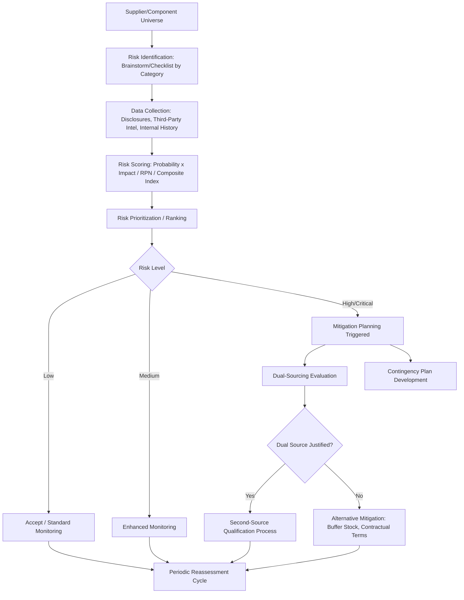

## Risk Identification and Assessment Frameworks

### Definition and Strategic Rationale

Risk identification and assessment frameworks are the structured methodologies by which a buying organization systematically detects, characterizes, and prioritizes potential sources of supply disruption, quality failure, financial instability, compliance exposure, or strategic dependency across its supplier base. This chapter item establishes the analytical foundation on which subsequent Supplier Risk Management activities — contingency planning, monitoring, mitigation — are built.

Within an SRM and Dual Sourcing context, risk identification and assessment plays a foundational, gating role:

- **The dual-sourcing decision itself is a risk-management output**: The decision to maintain two qualified sources for a given component, rather than consolidate to one, is typically a direct output of a risk assessment that determines the component's criticality and the acceptable level of single-source exposure.
- **Risk assessment informs *where* dual sourcing is worth the cost**: Dual sourcing carries real costs — split volume reducing scale economies, dual qualification and audit overhead, potential design/process divergence risk. A rigorous risk framework helps target dual-sourcing investment toward genuinely high-risk, high-impact components rather than applying it uniformly (which would be economically inefficient) or too narrowly (which would leave critical exposure unaddressed).
- **Differentiated risk profiles across dual sources**: The two suppliers in a dual-source pair rarely carry identical risk profiles (different geographies, different financial health, different single points of failure), so the assessment framework must evaluate each source individually as well as the pair's *combined* residual risk — e.g., if both sources depend on the same upstream sub-tier supplier or the same natural disaster-prone region, the dual-sourcing structure provides less real protection than volume-split numbers alone would suggest.

### Categories of Supplier Risk

A comprehensive framework typically organizes risk into several dimensions, since a supplier can be low-risk on one dimension and high-risk on another:

**Operational/Supply Continuity Risk**

- Capacity constraints relative to buyer's demand growth
- Single-tier or single-facility production (no internal backup)
- Equipment reliability and maintenance practices (connecting to the TPM discussion under lean/CI)
- Labor relations stability (strike risk, turnover rates)

**Financial Risk**

- Liquidity and solvency indicators (current ratio, debt-to-equity, Altman Z-score or similar distress-prediction models)
- Revenue concentration (supplier's own customer concentration — a supplier heavily dependent on one buyer, or one other customer, carries elevated risk)
- Credit rating trends and payment behavior with its own suppliers

**Quality/Technical Risk**

- Process capability trends ($C_{pk}$ drift, defect PPM trajectory — directly connecting to the SPC discussion under capability-building)
- Engineering change frequency and change-control discipline
- Counterfeit or substandard material risk in the supplier's own inbound supply chain

**Geographic/Geopolitical Risk**

- Natural disaster exposure (seismic zones, flood plains, hurricane corridors)
- Political instability, trade sanctions, export control exposure
- Infrastructure reliability (power grid stability, port congestion, transportation network resilience)
- Currency volatility exposure for cross-border sourcing relationships

**Cyber and Information Security Risk**

- Supplier's own cybersecurity posture, particularly where the supplier has system access or handles buyer intellectual property (relevant given the data integration discussed under capability-building and the IP-sharing discussed under co-development)
- Third- and fourth-party (sub-tier) digital supply chain exposure

**Compliance and ESG Risk**

- Regulatory compliance (environmental, labor, trade) in the supplier's operating jurisdiction
- Conflict minerals and responsible sourcing disclosure obligations
- Sustainability/ESG performance, increasingly a formal risk category as buyer-side reporting obligations (e.g., scope 3 emissions disclosure) extend into supply chain risk assessment

**Concentration and Structural Risk**

- Single-source dependency at the buyer's own component level (the core driver of the dual-sourcing decision)
- Sub-tier concentration risk — even with two qualified Tier-1 sources, both may depend on a shared, unmonitored Tier-2 or Tier-3 supplier

### Core Assessment Methodologies

**Probability–Impact Risk Matrix**

The most widely used foundational tool: risks are scored along two axes — likelihood of occurrence and severity of impact if they occur — and plotted to prioritize mitigation effort. A simplified qualitative matrix:

| Impact ↓ / Probability → | Low | Medium | High |
| --- | --- | --- | --- |
| **Severe** | Monitor | Mitigate | Urgent Action |
| **Moderate** | Accept | Monitor | Mitigate |
| **Minor** | Accept | Accept | Monitor |

More quantitative implementations assign numerical scores (e.g., 1–5) to each axis and calculate a risk score as:

$$R = P \times I$$

where $R$ is the composite risk score, $P$ is probability, and $I$ is impact severity — used to rank-order suppliers or supply positions for mitigation prioritization.

**Failure Mode and Effects Analysis (FMEA), Applied at the Supply-Base Level**

Extending the FMEA methodology referenced under capability-building from a single-process tool to a supply-continuity tool, using the classical Risk Priority Number:

$$RPN = S \times O \times D$$

where $S$ is severity of the failure's effect, $O$ is occurrence/probability of the failure mode, and $D$ is the ability to detect the failure before it impacts the buyer. Applied at the supply-base level, "failure modes" become events like "sole-source facility fire," "key raw material shortage," or "supplier bankruptcy," rather than process-specific defects.

**Kraljic Matrix (Extended for Risk Segmentation)**

While originally a sourcing-strategy tool (positioning spend/profit impact against supply risk), the Kraljic matrix's supply-risk axis is itself a risk assessment output, and the resulting quadrant — particularly the "Bottleneck" quadrant (low profit impact, high supply risk) and "Strategic" quadrant (high profit impact, high supply risk) — directly identifies where dual-sourcing investment is most likely to be justified.

**Supplier Risk Scorecards / Composite Risk Indices**

Analogous in structure to the performance scorecards discussed under recognition and incentive programs, but scoring risk dimensions rather than performance dimensions, often expressed as a weighted composite:

$$Risk_{total} = w_1 R_{financial} + w_2 R_{operational} + w_3 R_{geo} + w_4 R_{compliance} + w_5 R_{cyber}$$

with weights reflecting the buyer's category-specific risk priorities (e.g., a semiconductor buyer might weight geopolitical and concentration risk more heavily than a commodity packaging buyer).

**Bowtie Analysis**

A visual risk-assessment method that maps preventive controls on one side of a risk event and mitigative/response controls on the other, useful for communicating both the *causes* a buyer should monitor and the *contingency responses* available — directly bridging into subsequent chapter items on contingency planning.

**Monte Carlo / Scenario-Based Quantitative Risk Modeling**

For high-value or highly strategic supply positions, some organizations apply probabilistic simulation — modeling a distribution of possible disruption durations and financial impacts rather than a single point estimate — to quantify expected value at risk and to test the resilience benefit of dual-sourcing under different disruption scenarios [Inference — this is a more advanced/less universally adopted practice than the matrix and scorecard methods above; prevalence varies significantly by industry and organizational sophistication].

### Data Sources for Risk Assessment

- **Direct supplier disclosure**: financial statements, certifications, self-assessment questionnaires (SAQs)
- **Third-party risk intelligence platforms**: commercial services aggregating financial distress signals, news/media monitoring, and geopolitical risk feeds (e.g., firms such as Dun & Bradstreet, Moody's, Resilinc, Interos, or Everstream — buyers should verify current offerings directly given the pace of vendor consolidation in this space) [Unverified — specific vendor landscape should be confirmed via current sources, as this market evolves quickly]
- **Buyer-internal data**: scorecard history, audit findings, incident/quality escapes logs
- **Sub-tier mapping exercises**: increasingly, buyers attempt to map beyond Tier-1 visibility into Tier-2/Tier-3 suppliers for critical components, given that concentration risk often hides at deeper tiers than initial assessment captures

### Risk Assessment Process Flow

### Risk Assessment in the Dual-Sourcing Context Specifically

- **Correlated risk detection**: A properly designed framework explicitly tests whether the two sources in a dual-sourcing pair share underlying risk exposure (same region, same sub-tier supplier, same raw material dependency), since uncorrelated risk profiles are what make dual sourcing an effective hedge — two suppliers in the same flood plain provide materially less true risk reduction than the nominal "two sources" count would suggest.
- **Risk-differentiated qualification thresholds**: Assessment frameworks often feed directly into how rigorously a candidate second source must be vetted — a component assessed as low-risk may accept a lighter-weight secondary qualification, while a critical/strategic component assessed as high-risk demands full parallel qualification rigor for both sources.
- **Dynamic reassessment triggers**: Because supplier risk is not static, mature frameworks define trigger events (financial rating downgrade, geopolitical escalation, a quality escape) that force an off-cycle reassessment, which may in turn accelerate or newly justify a dual-sourcing initiative that a periodic (e.g., annual) review cycle alone might catch too late.

**Example**: A buyer sourcing a specialty electronic component conducts a Kraljic-based screen identifying it as "Strategic" (high profit impact, high supply risk). A deeper composite risk index reveals the current sole source carries elevated geographic risk (a single seismic-zone facility) and elevated financial risk (a declining credit trend). The buyer initiates second-source qualification; during the correlated-risk check, the assessment team discovers the leading second-source candidate shares the same upstream wafer supplier as the incumbent. The buyer adjusts its search to prioritize a second-source candidate with a genuinely independent upstream supply chain, since qualifying a nominally "second" source with a shared underlying dependency would provide limited actual risk reduction.

### Common Pitfalls

- **Assessing suppliers, not the full risk chain**: Focusing risk assessment only on the directly contracted Tier-1 supplier while ignoring sub-tier concentration, missing the correlated-risk problem described above.
- **Static, infrequent assessment**: Treating risk assessment as an annual compliance exercise rather than maintaining trigger-based reassessment, leaving the buyer exposed to fast-moving risk events (financial distress, geopolitical shocks) between review cycles.
- **Over-reliance on a single data source**: Depending solely on supplier self-disclosure (which carries obvious incentive bias) without independent third-party verification.
- **Uniform risk weighting across dissimilar categories**: Applying the same risk-scoring weights to a commodity packaging supplier and a strategic semiconductor supplier, obscuring where risk genuinely warrants dual-sourcing investment.
- **Conflating likelihood with impact in qualitative discussions**: Loosely describing a supplier as simply "high risk" without decomposing which axis (probability vs. severity) drives that classification, which undermines the ability to design a targeted mitigation response.

**Related Topics**

- Kraljic Matrix Application to Dual-Sourcing Investment Decisions
- Sub-Tier Supply Chain Mapping Methodologies
- Supplier Financial Health Monitoring and Distress-Prediction Models
- Correlated Risk Detection Across Dual-Sourced Supplier Pairs
- Third-Party Risk Intelligence Platform Selection Criteria
- Trigger-Based Reassessment Program Design
- Bowtie Analysis for Supply Continuity Risk Communication