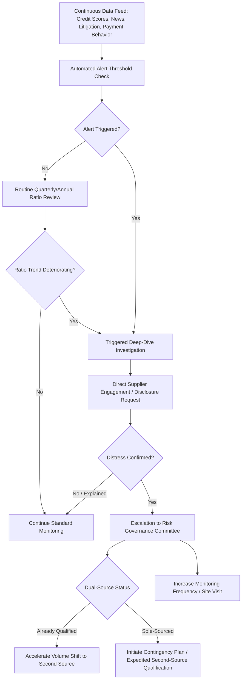

## Financial Risk Monitoring and Early-Warning Indicators

### Definition and Strategic Rationale

Financial risk monitoring and early-warning indicators refer to the ongoing, systematic tracking of quantitative and qualitative signals of a supplier's financial health, designed to detect deteriorating solvency, liquidity, or profitability *before* that deterioration manifests as a supply disruption — missed shipments, quality corner-cutting, or outright business failure. This distinguishes financial risk monitoring from the broader, periodic risk *assessment* frameworks discussed in the previous chapter item: assessment establishes a point-in-time risk profile and prioritization, while monitoring is the continuous, trend-oriented discipline of watching that profile change over time and triggering action when it does.

Within an SRM and Dual Sourcing context, financial risk monitoring plays a particularly time-sensitive role:

- **Financial failure is often the least visible risk until it is too late**: Unlike a natural disaster or a quality escape, financial distress frequently develops gradually and is actively concealed by struggling suppliers, since public knowledge of distress can accelerate a bank calling a loan or other customers pulling business — a self-fulfilling dynamic sometimes termed a "death spiral." This makes proactive, leading-indicator monitoring more valuable than reactive discovery.
- **Direct trigger for dual-sourcing activation or acceleration**: A supplier financial-distress signal is one of the most common triggers for either activating an already-qualified secondary source's volume ramp, or accelerating an otherwise-planned second-source qualification timeline discussed in prior chapter items.
- **Distinguishing the two dual-sourced suppliers' financial resilience**: A newer, smaller secondary source frequently carries a different (often thinner) financial risk profile than an established incumbent — sometimes higher risk due to limited scale, sometimes lower risk due to a more conservative capital structure. Monitoring both individually is necessary since financial resilience does not track cleanly with technical or quality capability.

### Core Financial Indicators and Ratios

**Liquidity Indicators**

- **Current ratio**: $\dfrac{\text{Current Assets}}{\text{Current Liabilities}}$ — a ratio meaningfully below 1.0 signals potential short-term obligation difficulty, though "meaningfully below" is industry- and capital-structure-dependent.
- **Quick ratio (acid-test)**: $\dfrac{\text{Current Assets} - \text{Inventory}}{\text{Current Liabilities}}$ — a stricter liquidity measure excluding inventory, which may not be quickly convertible to cash.
- **Cash conversion cycle**: days inventory outstanding plus days sales outstanding minus days payable outstanding — a lengthening trend can indicate the supplier is increasingly financing its operations through extended payables (delaying its own supplier payments), itself an early sub-tier risk signal.

**Solvency and Leverage Indicators**

- **Debt-to-equity ratio**: $\dfrac{\text{Total Debt}}{\text{Total Equity}}$ — elevated and rising leverage reduces a supplier's financial flexibility to absorb a downturn or unexpected cost shock.
- **Interest coverage ratio**: $\dfrac{\text{EBIT}}{\text{Interest Expense}}$ — a low or declining ratio indicates earnings are increasingly strained relative to debt service obligations.

**Profitability Trend Indicators**

- Gross margin and operating margin trends over multiple periods (a single weak quarter is less concerning than a sustained multi-period decline)
- Revenue concentration and trend — a supplier heavily dependent on a shrinking end-market, or losing a major customer (potentially even the buyer's dual-source counterpart, in categories where suppliers serve overlapping accounts), carries elevated forward risk

**Composite Distress-Prediction Models**

- **Altman Z-Score**, a widely referenced multivariate model combining working capital, retained earnings, EBIT, market value of equity, and sales — each scaled by total assets — into a single score historically associated with bankruptcy probability. The original manufacturing-sector formulation is commonly expressed as:

$$Z = 1.2X_1 + 1.4X_2 + 3.3X_3 + 0.6X_4 + 1.0X_5$$

where $X_1$ through $X_5$ represent the working-capital, retained-earnings, EBIT, market-value-of-equity, and sales ratios described above (each normalized by total assets or total liabilities as appropriate). Commonly cited interpretive zones (illustrative, model-version-dependent): scores above roughly 2.9 are generally considered "safe," scores below roughly 1.8 are generally considered "distress zone," with a "grey zone" in between — exact thresholds and coefficient variants differ across published model versions (original, revised, private-firm, and non-manufacturer adaptations), so practitioners should confirm the specific formulation and threshold set being applied [Unverified — precise threshold values and coefficients vary by Altman model variant; buyers should verify against the specific version used by their risk intelligence provider].

- **Commercial credit scores** (e.g., Dun & Bradstreet PAYDEX, or equivalent regional agency scores) providing a standardized, externally benchmarked distress indicator without requiring the buyer to build its own model from raw financials.

### Early-Warning Signal Categories Beyond Formal Ratios

Financial statements are typically lagging and infrequent (quarterly or annual, and often unavailable in detail for privately held suppliers). Mature monitoring programs supplement ratio analysis with faster-moving qualitative and behavioral signals:

- **Payment behavior changes**: the supplier requesting expedited payment terms, early-payment discounts, or deviating from historically agreed invoicing cadence
- **Operational behavior changes**: reduced responsiveness, declining on-time delivery performance not attributable to a known operational cause, sudden staff turnover in key account-management or engineering roles
- **Legal and public-record signals**: liens, judgments, litigation filings, changes in corporate registration status
- **Credit insurance market signals**: trade credit insurers reducing or withdrawing coverage on a given supplier is a strong externally-verified distress signal, since credit insurers have their own independent underwriting incentive to detect risk early
- **News and media monitoring**: layoff announcements, facility closures, executive departures, credit rating agency actions
- **Supply-chain behavioral signals**: the supplier's own suppliers reporting payment delays (visible through sub-tier mapping discussed in the prior chapter item)

### Monitoring Architecture and Cadence

| Monitoring Tier | Data Source | Typical Frequency | Applied To |
| --- | --- | --- | --- |
| Continuous automated feed | Third-party risk intelligence platform alerts (news, credit score changes, litigation) | Real-time/daily | All suppliers above a defined spend or criticality threshold |
| Periodic formal review | Financial statement analysis, ratio calculation, trend review | Quarterly or annual | Strategic/critical suppliers, dual-sourced categories |
| Triggered deep-dive | Direct supplier engagement, site visit, detailed financial disclosure request | Event-driven | Any supplier crossing a defined risk threshold |
| Portfolio-level review | Aggregated risk dashboard across full supplier base | Monthly/quarterly at category management level | Governance reporting to leadership |

### Financial Monitoring Process Flow

### Financial Risk Monitoring in the Dual-Sourcing Context Specifically

- **Differential monitoring intensity**: Because financial distress at a sole-source supplier carries categorically higher consequence than at a dual-sourced supplier (where a second source can absorb volume), monitoring intensity and alert thresholds are often calibrated to sourcing structure — sole-sourced critical suppliers frequently warrant the most intensive, continuous monitoring tier regardless of current apparent financial health.
- **Financial distress as a volume-rebalancing trigger**: Building on the merit-based volume rebalancing mechanisms discussed under recognition and incentive programs, financial early-warning signals are typically treated as an independent, override-level trigger — a financially deteriorating supplier's volume share may be proactively reduced even if its current quality and delivery scorecard performance remains strong, since scorecard performance is a lagging indicator relative to financial distress.
- **Protecting the distressed supplier relationship during transition**: Buyers managing a financially deteriorating dual-source partner face a delicate balance — reducing exposure to protect supply continuity, while avoiding actions (abrupt volume withdrawal, public loss-of-confidence signals) that could themselves accelerate the supplier's failure, particularly if the buyer represents a meaningful share of that supplier's revenue and has some interest in the supplier's survival (e.g., to preserve future dual-source optionality or avoid disruption to other components sourced from the same supplier).
- **Second-source financial vetting as a qualification gate**: Financial health assessment is typically incorporated as a formal gate within the second-source qualification process itself (referenced in the risk identification chapter item), preventing a buyer from resolving one single-source risk only to introduce a new one via a financially fragile second source.

**Example**: A buyer's continuous monitoring feed flags a rating agency downgrade and a trade-credit-insurance coverage reduction for a sole-sourced casting supplier. The triggered deep-dive reveals a declining interest coverage ratio over the trailing four quarters alongside extending payment terms with the supplier's own raw-material vendors — a cash conversion cycle signal. Given the sole-source exposure, the buyer's risk governance committee accelerates a previously deprioritized second-source qualification initiative, while simultaneously engaging the distressed supplier directly (rather than publicly reducing orders) to avoid contributing to a self-fulfilling failure while the second source is qualified.

### Common Pitfalls

- **Over-reliance on lagging financial statements alone**: Annual or quarterly filings, particularly for private suppliers with limited disclosure obligations, can be months stale relative to actual current condition — behavioral and third-party signals are necessary complements, not optional extras.
- **Ignoring privately-held supplier opacity**: Smaller, privately held secondary sources (common in dual-sourcing structures specifically because they are newer or less established) often have materially less public financial disclosure than large incumbents, requiring direct disclosure agreements or reliance on third-party estimated-financials products.
- **Alert fatigue from poorly calibrated thresholds**: Overly sensitive automated alerting across an entire supplier base can overwhelm risk teams with low-value signals, reducing attention to genuinely material triggers — calibration by supplier criticality tier (as in the monitoring architecture table above) mitigates this.
- **Treating a single Z-Score or credit score as sufficient**: Composite distress scores are useful screening tools but were generally developed and validated against broad populations; applying them mechanically without qualitative context can produce false positives or false negatives for a specific supplier's actual situation [Inference — a standard caution around composite scoring model application generally, not specific to any single vendor's implementation].
- **Delayed escalation due to relationship reluctance**: Account managers with long-standing supplier relationships may be slow to escalate early distress signals out of relationship loyalty or optimism bias — governance structures with defined, objective escalation triggers (rather than discretionary judgment alone) help counter this.

**Next Steps**

- Altman Z-Score Variants and Appropriate Model Selection by Supplier Type
- Trade Credit Insurance Signals as a Third-Party Risk Verification Source
- Sub-Tier Financial Risk Propagation and Cash Conversion Cycle Analysis
- Contingency Planning and Second-Source Activation Triggers
- Governance Design for Distress-Driven Volume Rebalancing
- Privately-Held Supplier Financial Disclosure Agreement Structuring
- Risk Dashboard Design for Portfolio-Level Financial Monitoring