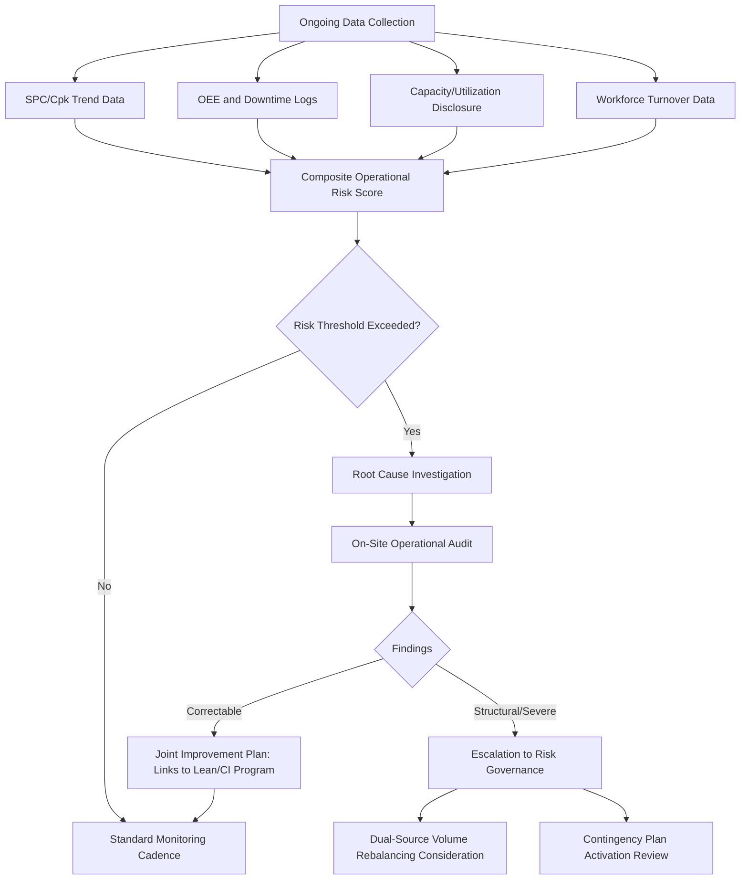

## Operational, Quality, and Capacity Risk

### Definition and Strategic Rationale

Operational, quality, and capacity risk encompasses the category of supply risk arising from a supplier's internal execution capability — its ability to consistently produce conforming product, at required volumes, on schedule, without disruption from equipment failure, process variability, labor issues, or resource constraints. Where the prior chapter item addressed financial distress as a largely *external-to-operations* risk signal, this item addresses risk that originates directly within the supplier's manufacturing and operational environment.

This chapter item connects directly to several earlier discussions in this syllabus without duplicating them: capability-building (addressing how to raise operational maturity), lean/CI (addressing how to sustain and improve operational performance), and SPC-based process monitoring are all *mitigation and improvement* mechanisms. Operational, quality, and capacity risk, by contrast, is the *risk assessment and monitoring* lens applied specifically to the operational domain — identifying where execution capability is fragile enough to threaten supply continuity, independent of financial health.

In an SRM and Dual Sourcing context, this risk category carries particular weight because:

- **It is often the most direct and frequent cause of actual disruption**: Financial failure and geopolitical shocks are comparatively rare tail events; capacity constraints, equipment breakdowns, and quality escapes are comparatively routine occurrences that cumulatively account for a large share of real-world supply interruptions.
- **Capacity risk is structurally central to dual-sourcing effectiveness**: A second source that is technically qualified but lacks the *actual spare capacity* to absorb meaningful volume on short notice provides only partial protection — a distinction this chapter item treats explicitly.
- **Quality risk and capacity risk often trade off against each other**: A supplier under capacity pressure (running at or above sustainable utilization) frequently experiences quality degradation as a secondary effect, meaning these two risk dimensions should generally be assessed together rather than independently.

### Operational Risk Sub-Categories

**Equipment and Asset Risk**

- Equipment age, maintenance history, and single-point-of-failure machinery (a critical process step performed on only one machine, with no redundancy)
- Overall Equipment Effectiveness (OEE) trends — declining OEE is a leading indicator of both quality and capacity risk simultaneously
- Spare parts availability and mean-time-to-repair (MTTR) for critical equipment

**Process and Quality Risk**

- Process capability indices ($C_p$, $C_{pk}$) trending toward marginal levels on critical characteristics
- Defect PPM trend direction (not just current level — a rising trend from a low base can be more concerning than a stable, slightly elevated level)
- Frequency and severity of engineering deviations, non-conformance reports, and corrective action requests
- Incoming raw material quality variability from the supplier's own upstream sources

**Labor and Workforce Risk**

- Turnover rates, particularly among skilled or specialized roles that are slow to backfill
- Labor relations stability (union contract status, strike history, wage-dispute exposure)
- Key-person dependency — critical process knowledge concentrated in a small number of individuals without documented standard work or succession planning

**Capacity and Utilization Risk**

- Current utilization rate relative to theoretical maximum capacity
- Committed capacity across the supplier's full customer base (a supplier may show available capacity in aggregate but have allocated it contractually elsewhere)
- Bottleneck process steps that constrain total throughput regardless of upstream capacity

**Facility and Site Risk**

- Single-facility production for a critical component (no internal multi-site redundancy at the supplier itself, distinct from the buyer's external dual-sourcing across suppliers)
- Facility condition, safety record, and regulatory compliance status

### Assessment Methodologies

**Process Capability Analysis**

Building on the SPC foundation from capability-building, ongoing monitoring of $C_{pk}$ trends provides a direct, quantitative leading indicator of quality risk:

$$C_{pk} = \min\left(\frac{USL - \mu}{3\sigma}, \frac{\mu - LSL}{3\sigma}\right)$$

where $USL$ and $LSL$ are the upper and lower specification limits, $\mu$ is the process mean, and $\sigma$ is the process standard deviation. A declining $C_{pk}$ trend — even while still technically above a minimum acceptance threshold — is typically treated as an early operational risk signal warranting investigation before an actual out-of-specification event occurs.

**Capacity Utilization and Headroom Analysis**

Comparing a supplier's demonstrated maximum sustainable output against the buyer's current and forecasted demand, expressed as available headroom:

$$\text{Headroom} = \frac{\text{Max Sustainable Capacity} - \text{Committed Volume (all customers)}}{\text{Max Sustainable Capacity}}$$

Critically, this calculation requires visibility into the supplier's *total* committed volume across its entire customer base, not just the buyer's own order volume — a data point that requires supplier disclosure and trust, since suppliers may be reluctant to share customer-level capacity allocation for competitive reasons.

**Overall Equipment Effectiveness (OEE) Monitoring**

$$OEE = Availability \times Performance \times Quality$$

Tracked over time at critical equipment/process steps, OEE decline can signal emerging operational risk across multiple dimensions simultaneously (the "Availability" factor capturing downtime risk, "Quality" factor capturing the defect risk described above).

**Operational Risk Audits and Site Assessments**

Structured, periodic on-site audits — distinct from quality-system certification audits (ISO/IATF) — specifically evaluating equipment condition, maintenance practices, workforce stability indicators, and observed capacity utilization, often using a standardized scoring checklist to enable comparison across suppliers and over time.

**Bottleneck and Constraint Analysis (Theory of Constraints lens)**

Identifying the specific process step that limits total throughput, since capacity risk assessment focused only on aggregate facility output can miss a narrow, under-capacity bottleneck operation that constrains the entire line regardless of overall facility scale.

### Operational Risk Monitoring Process Flow

### Operational, Quality, and Capacity Risk in the Dual-Sourcing Context Specifically

- **Capacity headroom as the true test of dual-sourcing resilience**: A second source's qualification status alone does not guarantee resilience value — the framework must explicitly assess whether that source has genuine, verified spare capacity (not merely nominal facility size) to absorb a meaningful volume surge within an acceptable timeframe if the primary source fails. A second source running at 95% utilization across its full customer base offers limited real protection despite being technically qualified.
- **Correlated operational risk across dual sources**: Similar to the correlated financial and geographic risk discussed under risk identification, two dual-sourced suppliers can share operational risk exposure — e.g., both relying on the same specialized equipment vendor, the same scarce skilled-labor market, or the same raw material processor — which the operational risk framework should surface explicitly rather than treating each source's operational risk as independent.
- **Quality risk asymmetry between primary and secondary sources**: A newer secondary source frequently exhibits higher process variability (lower $C_{pk}$) during its early production ramp than an established incumbent, which is an expected, temporary condition addressed through the capability-building programs discussed earlier — but ongoing operational risk monitoring is needed to confirm the variability genuinely converges toward the incumbent's level over time rather than persisting.
- **Capacity risk as a volume-allocation input**: Building on both the JCR/VE and recognition-program volume mechanisms discussed earlier, verified capacity headroom is typically a required input (not merely a performance-based incentive) when determining how much *additional* contestable volume can safely be shifted toward a given source, since shifting volume beyond a source's genuine sustainable capacity would itself create new operational risk.

**Example**: A buyer dual-sources a plastic injection-molded component between an established Supplier A and a newer Supplier B. Ongoing $C_{pk}$ monitoring shows Supplier B's process capability on a critical dimension has been improving steadily over several quarters following a capability-building intervention, approaching but not yet matching Supplier A's demonstrated level. A capacity headroom analysis — requiring a supplier disclosure agreement to obtain visibility into Supplier B's total committed volume across its customer base — reveals Supplier B currently operates at roughly 55% utilization, indicating genuine surge capacity exists. Based on the combined signal (converging quality capability, confirmed capacity headroom), the buyer's risk governance process authorizes a modest increase in Supplier B's baseline volume allocation, both as a resilience-building step and as validation of the capability-building investment's return.

### Common Pitfalls

- **Treating capacity as a static, one-time qualification data point**: Capacity utilization changes continuously as a supplier's own customer base evolves; a source qualified as having ample headroom two years ago may have since become fully committed to other accounts without the buyer's awareness.
- **Ignoring the capacity-quality interaction**: Assessing quality risk and capacity risk in separate silos, missing the common pattern where capacity overextension is a leading cause of subsequent quality degradation.
- **Relying on nominal facility capacity rather than demonstrated sustainable output**: Theoretical maximum capacity (often used in supplier marketing materials) frequently overstates realistically sustainable output, which should be validated against actual historical throughput data rather than supplier-provided estimates alone.
- **Under-investing in bottleneck-level analysis**: Assessing capacity risk only at the aggregate facility level can miss a specific constrained process step that limits true available headroom regardless of overall site scale.
- **Insufficient sub-tier operational visibility**: Focusing operational risk assessment entirely on the Tier-1 supplier's own facility while missing operational fragility at a critical Tier-2 sub-supplier feeding into it.

**Related Topics**

- OEE Improvement Programs and Their Risk-Monitoring Value
- Capacity Disclosure Agreements and Supplier Trust-Building Mechanisms
- Theory of Constraints Applied to Multi-Tier Supply Chain Bottlenecks
- Process Capability Convergence Tracking for Newly Qualified Second Sources
- Correlated Operational Risk Detection Across Dual-Sourced Supplier Pairs
- On-Site Operational Risk Audit Checklist Design
- Linking Capacity Headroom Verification to Volume Allocation Governance