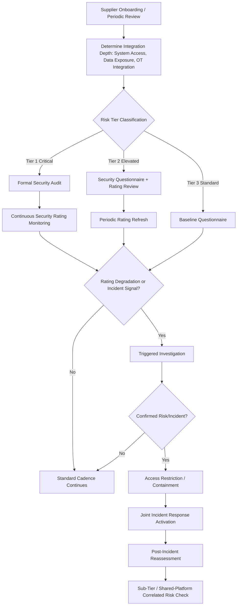

## Cybersecurity and Data Risk in the Supply Base

### Definition and Strategic Rationale

Cybersecurity and data risk in the supply base refers to the exposure a buying organization faces from vulnerabilities in its suppliers' information systems, digital infrastructure, and data-handling practices — including risk that originates not directly at a supplier but propagates through that supplier's own upstream (sub-tier) digital supply chain. This risk category has grown from a peripheral IT concern into a mainstream procurement and SRM discipline as suppliers have become increasingly digitally interconnected with buyers through the EDI/API integrations, supplier portals, and VMI systems referenced under capability-building, and as suppliers increasingly hold sensitive buyer data through the co-development and IP-sharing relationships discussed earlier in this syllabus.

Within an SRM and Dual Sourcing context, cybersecurity risk carries several distinctive characteristics relative to the other risk categories in this chapter:

- **It is a bidirectional risk**: Unlike financial or operational risk, which threatens primarily the buyer's supply continuity, cybersecurity risk at a supplier can directly threaten the *buyer's own* systems and data — a compromised supplier with network access or shared credentials can serve as an attack vector into the buyer's environment (a pattern seen in numerous well-documented supply-chain breach incidents).
- **It scales non-linearly with digital integration depth**: The more deeply a supplier is integrated into the buyer's systems (EDI, shared portals, embedded engineering collaboration platforms), the greater the potential blast radius of a supplier-side compromise — meaning cybersecurity risk assessment should scale with integration depth, not just with traditional criticality/spend measures.
- **Dual sourcing offers only partial protection**: Unlike operational or financial risk, where a second source can absorb volume if the primary fails, cybersecurity risk at one source does not necessarily reduce risk at the other — if both dual-sourced suppliers use the same third-party software platform or share a common sub-tier vendor, a single vulnerability can compromise both simultaneously, undermining the risk-diversification logic dual sourcing otherwise provides.

### Categories of Cybersecurity and Data Risk

**Direct Network and System Access Risk**

- Suppliers with VPN access, shared credentials, or direct system integration into the buyer's ERP, MES, or supplier portal environments
- Legacy or poorly maintained connection methods (unpatched systems, weak authentication) providing a low-effort intrusion path

**Data Confidentiality Risk**

- Exposure of buyer intellectual property shared during co-development engagements (engineering drawings, specifications, process parameters)
- Exposure of commercially sensitive data (pricing, forecast/demand data, roadmap information shared under NDA as discussed in the co-development chapter item)
- Personal data exposure where suppliers process employee, customer, or other personal information on the buyer's behalf, triggering data-protection regulatory obligations (e.g., GDPR-equivalent frameworks depending on jurisdiction)

**Operational Technology (OT) and Industrial Control System Risk**

- Increasing convergence of IT and OT systems at manufacturing suppliers means a cyber incident can directly cause physical production disruption (ransomware halting a production line), blending cybersecurity risk with the operational/capacity risk category discussed in the prior chapter item
- Industrial control system vulnerabilities specific to manufacturing environments, often running older, less frequently patched software than corporate IT systems

**Sub-Tier and Fourth-Party Digital Risk**

- A supplier's own software vendors, cloud service providers, and sub-tier suppliers introduce risk the buyer cannot directly assess or control, analogous to the sub-tier financial and operational concentration risks discussed earlier, but specifically in the digital domain
- Shared software platforms or common cloud infrastructure providers across otherwise-independent suppliers (including, notably, across a buyer's own dual-sourced supplier pair) can create hidden correlated risk

**Ransomware and Business Continuity Risk**

- Ransomware attacks specifically targeting manufacturing and logistics suppliers have become a materially significant and frequently reported category of supply-disruption event in recent years, distinct from a traditional data-breach concern in that the primary impact is operational shutdown rather than data exposure alone

### Assessment and Monitoring Methodologies

**Security Questionnaires and Self-Assessment Frameworks**

Standardized questionnaire-based assessments, often based on established frameworks such as NIST Cybersecurity Framework (CSF), ISO/IEC 27001, or SIG (Standardized Information Gathering) questionnaires, used to establish a baseline security posture understanding across the supplier base without requiring bespoke assessment of every supplier.

**Independent Security Ratings**

Third-party cybersecurity rating services (analogous in structure to the financial credit-rating services discussed under financial risk monitoring) that externally scan and score a supplier's observable security posture — exposed vulnerabilities, patch cadence, email security configuration, and similar externally-visible indicators — without requiring direct supplier cooperation, providing a continuously updated signal comparable in spirit to the continuous financial monitoring feed discussed previously.

**Contractual Security Requirements and Right-to-Audit**

- Minimum security control requirements embedded in supplier contracts (encryption standards, access control requirements, incident notification obligations)
- Right-to-audit clauses enabling the buyer to conduct or commission security assessments, particularly for suppliers with deep system integration or access to sensitive IP

**Tiered Risk-Based Assessment Depth**

Given the impracticality of deep assessment across an entire supplier base, mature programs typically tier assessment rigor based on a combination of (a) data/system access depth and (b) criticality, applying the most rigorous assessment (audits, penetration testing requirements, continuous monitoring) only to the highest-risk tier.

| Risk Tier | Criteria | Typical Assessment Depth |
| --- | --- | --- |
| Tier 1 – Critical | Direct system access, significant IP/data exposure, OT integration | Formal audit, continuous security rating monitoring, contractual penetration testing requirements |
| Tier 2 – Elevated | Meaningful data exchange (EDI, portal access) without deep system integration | Security questionnaire, periodic third-party rating review |
| Tier 3 – Standard | Limited digital interaction | Baseline questionnaire at onboarding, light periodic refresh |

**Incident Notification and Response Requirements**

Contractually mandated timelines for supplier notification of a security incident affecting buyer data or systems, paired with defined joint incident-response procedures — since detection delay significantly compounds the impact of a supply-chain-originated breach.

### Cybersecurity Risk Assessment Process Flow

### Cybersecurity and Data Risk in the Dual-Sourcing Context Specifically

- **Correlated digital risk across the dual-source pair**: As emphasized above, the standard dual-sourcing resilience logic (independent sources reduce joint failure probability) can fail silently in the cybersecurity domain if both sources rely on the same third-party ERP platform, the same cloud infrastructure provider, or the same specialized software vendor — a diligence step that requires explicitly asking both suppliers about shared platform dependencies, which is not always a standard part of traditional dual-sourcing qualification checklists.
- **Differentiated integration depth by source**: An established incumbent supplier frequently has deeper, longer-standing system integration with the buyer than a newer secondary source, meaning the two suppliers may legitimately warrant different risk-tier classifications and different assessment rigor — integration depth should be assessed per-supplier rather than assumed uniform across a dual-sourced pair.
- **Secondary source as a lower-maturity entry point**: A newer or smaller secondary source, often selected in part for cost or geographic diversification reasons, may have less mature cybersecurity practices than an established incumbent, potentially making it the weaker link in the combined dual-source risk profile even if its operational and quality capability has been successfully raised through capability-building.
- **Data-sharing asymmetry**: Because IP and roadmap sharing depth often differs between a primary/strategic source and a secondary source (per the exclusivity and information-boundary considerations discussed under co-development), the actual data-confidentiality risk exposure between the two dual-sourced suppliers is frequently asymmetric and should be assessed as such rather than assumed equivalent.

**Example**: A buyer dual-sources a critical subassembly between an established Supplier A (deeply integrated via EDI and a shared engineering collaboration platform) and a newer Supplier B (currently limited to portal-based order communication). Initial risk tiering classifies Supplier A as Tier 1 (formal audit, continuous monitoring) and Supplier B as Tier 2. During a subsequent capability-building initiative that begins integrating Supplier B into the same EDI system to support the lean/CI kanban replenishment program discussed earlier, the buyer's risk team reclassifies Supplier B to Tier 1 given its new access depth, and separately confirms — through the correlated-risk diligence step — that both suppliers use different cloud ERP providers, preserving genuine risk independence between the two sources.

### Common Pitfalls

- **Static risk-tier classification**: Failing to re-tier a supplier as its system integration deepens over time (as in the example above), particularly relevant given how capability-building and lean/CI initiatives often *increase* digital integration as a natural byproduct of operational improvement.
- **Questionnaire-only assessment without independent verification**: Relying solely on supplier self-reported security questionnaires, which — similar to financial self-disclosure — carry inherent incentive bias, without supplementing with independent security ratings or audit rights for higher-tier suppliers.
- **Overlooking OT-specific risk in manufacturing suppliers**: Applying IT-oriented security frameworks without adequately addressing the distinct vulnerability profile of industrial control systems and manufacturing execution environments.
- **Missing the correlated-risk check across dual sources**: Assuming that qualifying two independent legal entities as dual sources automatically provides independent risk profiles, without explicitly verifying shared software, cloud, or sub-tier digital dependencies.
- **Inadequate incident notification contractual terms**: Absent or vague breach-notification timelines in supplier contracts can materially delay the buyer's own awareness and response to an incident originating at a supplier.
- **Treating cybersecurity as a one-time onboarding gate rather than continuous monitoring**: Given how quickly security posture and threat landscapes evolve, a security assessment conducted only at initial supplier qualification (paralleling the same staleness risk noted under financial monitoring) provides limited protection against risk that develops after onboarding.

**Next Steps**

- NIST CSF and ISO/IEC 27001 Framework Application to Supplier Assessment
- Right-to-Audit Clause Design and Contractual Security Requirements
- OT/ICS-Specific Security Risk in Manufacturing Supply Chains
- Correlated Digital Risk Detection Across Dual-Sourced Supplier Pairs
- Joint Incident Response Planning with Critical Suppliers
- Third-Party Security Rating Platform Selection and Integration
- Sub-Tier and Fourth-Party Digital Risk Mapping Methodologies