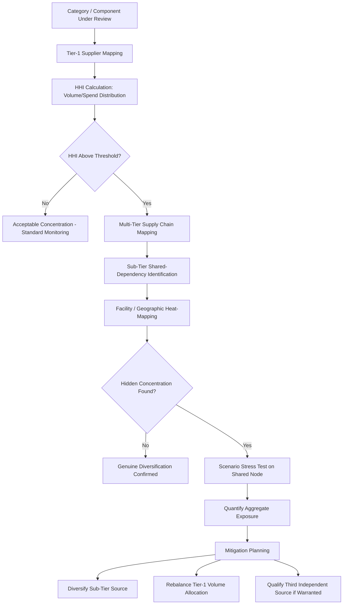

## Concentration Risk and Single Points of Failure

### Definition and Strategic Rationale

Concentration risk and single points of failure refer to the structural vulnerability that arises when supply for a critical component, material, or capability depends on an insufficiently diversified base — whether that is a single supplier, a single facility, a single geographic region, or a single upstream sub-tier source that multiple ostensibly "different" suppliers actually share. This chapter item functions as something of a synthesis point within Supplier Risk Management: the financial, operational, and cybersecurity risk categories discussed in the preceding items each describe a *type* of risk, while concentration risk describes a *structural pattern* that can amplify any of those risk types when diversification is absent or illusory.

This is, in an important sense, the risk category that most directly justifies the entire dual-sourcing discipline this syllabus is built around — and simultaneously the category most prone to false confidence, since the earlier chapter items have repeatedly noted (under risk identification, financial monitoring, operational risk, and cybersecurity risk) that nominally "dual-sourced" positions can still harbor hidden, correlated concentration exposure beneath the surface.

Within an SRM and Dual Sourcing context specifically:

- **Concentration risk assessment is the analytical justification for dual sourcing**: A component sourced from a single supplier, at a single facility, is by definition a single point of failure; the entire premise of dual sourcing is that deliberately introducing a second, sufficiently independent source reduces this structural vulnerability.
- **Surface-level dual sourcing can mask deeper concentration**: As flagged repeatedly across earlier chapter items, two legally distinct supplier entities can still share a common single point of failure one or more tiers upstream — a shared raw material processor, a shared specialized equipment vendor, a shared sub-component supplier, or common exposure to the same natural disaster zone or logistics chokepoint. True risk reduction requires concentration analysis to extend beyond the immediately contracted Tier-1 relationship.
- **Concentration exists on the demand side too**: Less commonly discussed but strategically relevant, a buyer can itself represent a concentration risk *to* a supplier (the buyer being a large share of that supplier's revenue), which circles back to the financial risk monitoring discussion — a supplier overly dependent on one buyer carries elevated fragility that ultimately becomes the buyer's own risk.

### Dimensions of Concentration Risk

**Supplier-Level Concentration**

The most direct form: reliance on a single legal entity for a critical input, with no qualified alternative. Typically the first and most obvious output of the Kraljic-based risk identification process discussed earlier in this chapter.

**Facility/Site-Level Concentration**

Even where a supplier relationship is diversified, production may still be concentrated at a single physical facility — including cases where a buyer believes it has "dual-sourced" a component across two supplier contracts, only to discover both suppliers manufacture at facilities within the same industrial park, seismic zone, or flood plain.

**Geographic/Regional Concentration**

Broader than single-facility risk: reliance on a single country or region for a critical material or component category, exposing the buyer to correlated geopolitical, trade-policy, currency, or natural-disaster risk across an entire commodity category, not just a single supplier relationship.

**Sub-Tier (Upstream) Concentration**

The most difficult dimension to detect and the most frequently underestimated: two or more nominally independent Tier-1 suppliers relying on the same Tier-2 or Tier-3 source for a critical raw material, sub-component, or specialized process step. This is the specific mechanism by which "dual sourcing" can fail to deliver actual risk reduction, as flagged under the correlated-risk discussions in the risk identification, financial, operational, and cybersecurity chapter items.

**Logistics and Infrastructure Concentration**

Reliance on a single port, transportation corridor, or logistics provider connecting an otherwise-diversified supplier base to the buyer — a structural chokepoint that can neutralize supplier-level diversification if disrupted.

**Technology/IP Concentration**

Dependency on a single proprietary technology, patented process, or specialized equipment type available from only one or a very small number of vendors — relevant to the co-development chapter item, where an innovation exclusivity arrangement can itself constitute a deliberately accepted concentration risk, ideally time-boxed as discussed previously.

**Demand-Side (Buyer) Concentration**

The buyer's own share of a given supplier's total revenue — a high buyer-concentration supplier is more exposed to the buyer's own demand volatility, and conversely, a buyer that is only a small fraction of a supplier's business may receive lower priority during a capacity-constrained period, which is itself a form of risk worth assessing.

### Assessment Methodologies

**Herfindahl-Hirschman Index (HHI), Applied to Supply-Base Concentration**

Adapted from its traditional market-concentration use, HHI can be applied to measure how concentrated a buyer's spend or volume is across its supplier base for a given category:

$$HHI = \sum_{i=1}^{n} s_i^2$$

where $s_i$ is the percentage share of total category volume held by supplier $i$. A single-source position yields an HHI of 10,000 (on a 0–10,000 scale, using percentage shares), while a well-balanced multi-source position yields a substantially lower score. Applied to a two-supplier dual-sourcing structure, a 50/50 split yields $HHI = 50^2 + 50^2 = 5{,}000$, while an 80/20 split yields $HHI = 6{,}800$ — illustrating that nominal "dual sourcing" with a heavily skewed volume split still carries meaningfully elevated concentration relative to a more balanced allocation.

**Multi-Tier Supply Chain Mapping**

Extending visibility beyond Tier-1 to identify shared upstream dependencies — a practice referenced under risk identification and increasingly treated as a necessary (though resource-intensive) diligence step for genuinely critical components, often requiring direct supplier cooperation to disclose their own sub-tier sourcing, sometimes under confidentiality protection given the competitive sensitivity of such disclosure.

**Bill-of-Materials (BOM) Concentration Analysis**

Working backward from the buyer's product structure to identify which raw materials, specialized components, or process technologies appear across multiple ostensibly-diversified supply positions — surfacing category-level concentration that individual supplier-by-supplier risk assessment can miss when viewed in isolation.

**Geographic Heat-Mapping**

Plotting supplier and known sub-tier facility locations against known hazard zones (seismic activity, flood risk, hurricane corridors, politically unstable regions) to visually identify clusters of geographic concentration across a nominally diversified supplier base.

**Scenario/Stress Testing**

Modeling the impact of a specific single-point-of-failure event (a named facility, a named sub-tier supplier, a named logistics corridor) across the *entire* affected supply base simultaneously, rather than assessing each affected buyer-facing supplier relationship independently — revealing the true aggregate exposure a hidden concentration point represents.

### Concentration Risk Assessment Process Flow

### Concentration Risk in the Dual-Sourcing Context Specifically

- **Dual sourcing as necessary but not sufficient**: This chapter item's central, recurring theme across the syllabus is that establishing two qualified Tier-1 suppliers is a necessary starting point for concentration risk reduction but is not sufficient on its own — genuine risk reduction requires validating independence across facility, geographic, sub-tier, and logistics dimensions simultaneously.
- **Volume-split concentration within a dual-source structure**: As the HHI illustration above demonstrates, a heavily skewed volume allocation between two qualified sources (e.g., 90/10) still carries substantial residual concentration risk even though two suppliers exist — meaning the volume-rebalancing mechanisms discussed under recognition and incentive programs and financial monitoring have a direct concentration-risk-reduction function, not merely a performance-incentive function.
- **Triangulating toward a third source for the most critical positions**: For the highest-criticality components — particularly where genuine sub-tier independence between two sources proves difficult to achieve — some organizations extend beyond dual sourcing to a deliberately structured three-source (or more) strategy specifically to dilute concentration further, accepting the additional qualification and coordination overhead as a justified cost for the most severe risk exposures.
- **Demand concentration as a reciprocal consideration in second-source selection**: When qualifying a new secondary source, assessing what share of *that supplier's* business the buyer will represent is itself relevant — becoming a very large share of a small secondary supplier's revenue can create a new, reversed concentration dependency (the supplier becoming reliant on the buyer), with its own financial-risk implications as discussed in the prior chapter item.

**Example**: A buyer believes it has adequately diversified a critical semiconductor packaging component across two Tier-1 suppliers, each in a different country. A multi-tier mapping exercise, triggered by the concentration-risk assessment process, reveals both Tier-1 suppliers source a specific rare substrate material from the same single Tier-3 processor. An HHI calculation at the substrate-material level (rather than the Tier-1 supplier level) reveals a concentration score consistent with an effectively sole-sourced position, despite the buyer's Tier-1 relationships being genuinely dual-sourced. A scenario stress test confirms that a disruption at the shared Tier-3 processor would simultaneously affect both Tier-1 suppliers' output. The buyer initiates a sub-tier diversification initiative — working with at least one Tier-1 supplier to qualify an alternative substrate source — to convert the nominal dual-sourcing structure into a genuinely risk-reducing one.

### Common Pitfalls

- **Confusing nominal supplier count with genuine risk diversification**: The single most recurring pitfall across this entire risk category — treating "we have two suppliers" as equivalent to "we have reduced our concentration risk," without the deeper mapping this chapter item describes.
- **Assessing concentration only at the immediately visible tier**: Limiting analysis to the contracted Tier-1 relationship, missing sub-tier, logistics, and technology concentration that often represents the more severe actual exposure.
- **Static concentration assessment**: Sub-tier supply relationships change over time (a Tier-1 supplier may switch its own upstream source without the buyer's knowledge), meaning concentration mapping conducted once at initial dual-source qualification can become stale — paralleling the reassessment-trigger discipline discussed under financial and operational risk monitoring.
- **Underweighting geographic clustering**: Selecting a geographically convenient or cost-effective secondary source located near the incumbent (for logistics or cultural-fit reasons) without recognizing this may reintroduce the very geographic concentration risk dual sourcing was meant to eliminate.
- **Ignoring reciprocal demand concentration**: Focusing entirely on the buyer's supply-side risk while neglecting the financial fragility a buyer can inadvertently create by becoming a disproportionately large share of a smaller secondary supplier's business.
- **Treating three-plus sourcing as always superior without cost-benefit discipline**: Extending diversification further always carries coordination, qualification, and scale-economy costs; the decision to move beyond dual sourcing toward broader diversification should follow the same targeted, risk-justified logic established under risk identification and assessment, rather than being applied reflexively.

**Related Topics**

- Herfindahl-Hirschman Index Application Across Procurement Categories
- Multi-Tier Supply Chain Mapping Program Design and Supplier Cooperation Incentives
- Bill-of-Materials Concentration Analysis Techniques
- Geographic Heat-Mapping and Natural Hazard Overlay Methodologies
- Triple-Sourcing Strategy Design for Highest-Criticality Components
- Reciprocal Demand-Concentration Risk in Secondary Supplier Selection
- Scenario Stress-Testing Frameworks for Shared Sub-Tier Nodes