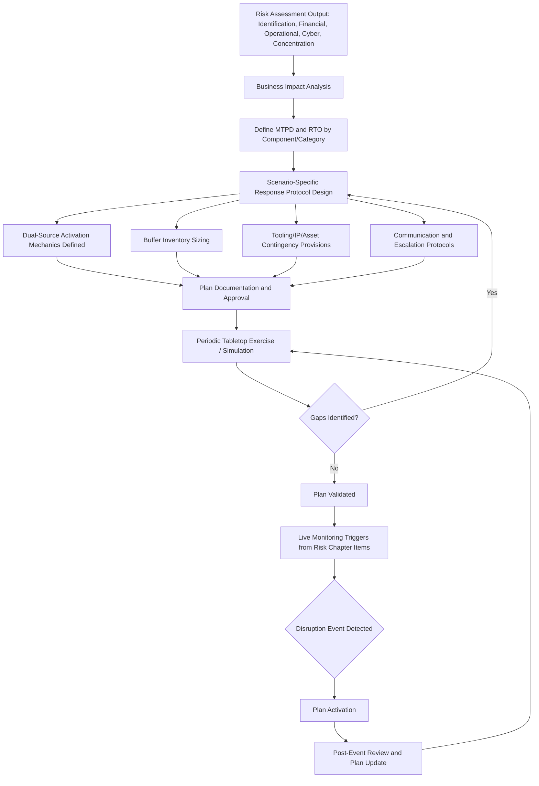

## Business Continuity and Contingency Planning

### Definition and Strategic Rationale

Business continuity and contingency planning refers to the structured, pre-established set of plans, protocols, and resources a buying organization prepares in advance to maintain supply continuity when a risk event — identified and monitored through the frameworks discussed across this chapter — actually materializes into a disruption. Where risk identification, financial monitoring, operational risk assessment, cybersecurity assessment, and concentration risk mapping are fundamentally *detective and diagnostic* disciplines, contingency planning is the *response-readiness* discipline: converting risk awareness into pre-built, executable action.

This chapter item functions as the operational culmination of the preceding Supplier Risk Management items — a well-designed contingency plan draws directly on the risk categories, monitoring triggers, and concentration mapping established earlier, translating them into specific, pre-agreed response protocols rather than leaving response design to be improvised during an actual crisis, when time pressure and incomplete information make sound decision-making materially harder.

Within an SRM and Dual Sourcing context, business continuity and contingency planning has a particularly direct relationship to the dual-sourcing strategy itself:

- **Dual sourcing is only as effective as its activation plan**: A qualified second source provides theoretical resilience, but the *actual* resilience delivered during a real disruption depends on whether a pre-built activation plan exists — defining exactly how quickly volume can be shifted, what lead time is required, and what contractual and logistical steps must occur. An unplanned, ad hoc activation under crisis conditions typically performs far worse than a rehearsed one.
- **Contingency planning validates (or exposes gaps in) the dual-sourcing structure**: The process of building a genuine contingency plan — as opposed to simply pointing to a qualified second source on paper — frequently surfaces the very concentration, capacity, and correlated-risk gaps discussed under concentration risk and operational risk, because contingency planning requires answering concretely: "if the primary source fails today, what specifically happens next, and how long does it take?"
- **Contingency planning must address scenarios beyond simple primary-source failure**: Including scenarios where *both* dual-sourced suppliers are simultaneously affected (correlated risk realized), which is precisely the scenario the concentration-risk chapter item warns can be underestimated.

### Core Components of a Contingency Plan

**Business Impact Analysis (BIA)**

The foundational step, quantifying the operational and financial consequence of a given supply disruption over time — typically expressed as impact escalating with disruption duration, and used to define acceptable Recovery Time Objectives (RTO):

- **Maximum Tolerable Period of Disruption (MTPD)**: the longest duration a disruption can persist before consequences become unacceptable (e.g., production line shutdown, contractual penalty exposure, customer-facing impact)
- **Recovery Time Objective (RTO)**: the target time within which supply must be restored, generally set meaningfully shorter than MTPD to preserve a safety margin

**Contingency Response Protocols by Scenario**

Pre-defined, scenario-specific response plans rather than a single generic plan, since the appropriate response differs materially by risk type:

- Sole-source facility loss (fire, natural disaster) → emergency second-source qualification acceleration or activation of an already-qualified but inactive source
- Financial failure/bankruptcy → asset/tooling recovery provisions (see below), inventory bridging, accelerated volume shift
- Quality escape at scale → containment protocol, alternate-source stopgap production, root-cause and re-qualification timeline
- Cyber incident/ransomware at a digitally integrated supplier → access isolation, alternate communication/ordering channel activation, alongside the joint incident-response procedures discussed under cybersecurity risk

**Dual-Source Activation Mechanics**

For components where a second source already exists (qualified but potentially at lower current volume), the plan should specify:

- The maximum volume ramp rate the second source can realistically absorb (directly informed by the capacity headroom analysis discussed under operational risk)
- Lead time required to convert from current to surge volume
- Any tooling, raw material, or specification differences that must be reconciled before surge volume can begin (relevant where design or process divergence between dual sources has occurred, as flagged under joint cost reduction and lean/CI)
- Contractual mechanisms (already-negotiated surge pricing, minimum volume commitments) that avoid renegotiation under crisis time pressure

**Buffer Inventory and Strategic Stock Positioning**

Pre-positioned safety stock sized specifically to bridge the gap between disruption onset and second-source ramp completion — the required buffer size is a direct function of the RTO and the second source's ramp-rate limitations identified above:

$$\text{Required Buffer} = \text{Daily Consumption} \times (\text{RTO} - \text{Time to Detect Disruption})$$

**Tooling, IP, and Asset Contingency Provisions**

Contractual provisions (often negotiated at the outset of a supplier relationship rather than during a crisis) addressing:

- Buyer-owned tooling housed at a supplier facility, with defined rights to recover or redirect that tooling to an alternate source if the primary supplier fails
- Escrow arrangements for critical process documentation or software, relevant particularly where a co-developed innovation (per the earlier chapter item) resides primarily with one supplier
- Step-in rights allowing the buyer (or a designated third party) to temporarily operate or oversee a distressed supplier's critical production line in extreme scenarios

**Communication and Escalation Protocols**

Pre-defined internal escalation paths and external supplier/customer communication templates, reducing response-time friction and ensuring consistent, accurate messaging during a live disruption rather than reactive improvisation.

### Contingency Planning Process Flow

### Testing and Maintaining Plan Readiness

**Tabletop Exercises and Simulations**

Periodic, structured walkthroughs of specific disruption scenarios with relevant cross-functional stakeholders (procurement, engineering, quality, legal, operations) — without an actual disruption occurring — designed specifically to surface gaps in the written plan before they are discovered under real crisis conditions. This is analogous in spirit to the sustainment audits discussed under lean/CI: a plan that exists only on paper, untested, is prone to the same regression-to-baseline risk noted for kaizen gains.

**Plan Currency and Reassessment Triggers**

Contingency plans require the same trigger-based reassessment discipline discussed under financial and operational risk monitoring — a plan built when a second source had ample capacity headroom becomes stale if that source's utilization has since increased, and a plan built before a sub-tier concentration was discovered (per the concentration-risk chapter item) may no longer reflect genuine independence between primary and contingency sources.

**Post-Event Review**

Following any actual plan activation (even a partial or near-miss activation), a structured review comparing actual response performance against planned RTO and protocol assumptions, feeding lessons learned back into plan refinement — closing the loop analogous to the post-launch review step in the co-development stage-gate process discussed earlier.

### Business Continuity and Contingency Planning in the Dual-Sourcing Context Specifically

- **The plan is the mechanism that converts dual sourcing from theoretical to actual resilience**: This is the central thesis of this chapter item — a qualified but unrehearsed second source with unclear ramp mechanics and no pre-negotiated surge terms often fails to deliver anywhere near its theoretical protective value during an actual crisis, since critical time is lost renegotiating terms and clarifying ramp logistics under pressure.
- **Explicit "both sources affected" scenario planning**: Given the repeated emphasis across this chapter on correlated and concentration risk, mature contingency plans explicitly include a scenario branch for simultaneous impact to both dual-sourced suppliers (e.g., a shared sub-tier disruption, per the concentration-risk item), defining a tertiary response (emergency spot-market sourcing, expedited new-source qualification, substitute material/design fallback) distinct from the standard "shift to second source" playbook.
- **Pre-negotiated surge terms as a specific dual-sourcing contingency asset**: Rather than leaving commercial terms for an emergency volume shift to be negotiated in the moment (when the buyer's negotiating leverage is at its weakest, given urgency), mature programs pre-negotiate surge pricing and minimum-commitment terms with the secondary source as part of the original dual-sourcing agreement — directly connecting the contract-structuring discipline discussed under joint development and gainsharing agreements to contingency readiness.
- **Maintaining the secondary source's activation readiness over time**: A qualified second source that receives minimal ongoing volume can lose practical readiness over time (process drift, workforce turnover on the relevant line, tooling degradation) even while remaining nominally "qualified" — connecting back to the recognition and incentive programs' rationale for maintaining a meaningful floor volume with the secondary source specifically to preserve genuine activation readiness, not just contractual qualification status.

**Example**: A buyer's contingency plan for a sole-source-turned-dual-sourced critical casting component defines an RTO of 21 days following primary-source loss. The plan specifies that Supplier B (secondary source) can ramp from its current 20% baseline volume to 100% coverage within 14 days, based on the capacity headroom analysis conducted under operational risk assessment, with pre-negotiated surge pricing already embedded in the standing contract. A calculated buffer inventory of 10 days' consumption bridges the gap between disruption detection and Supplier B's ramp completion. During a subsequent tabletop exercise, the cross-functional team discovers that a required raw material substitution — needed because Supplier B's standard material specification differs slightly from Supplier A's — would add 5 unplanned days to the ramp timeline, exceeding the RTO margin. This gap, surfaced only through simulation rather than live crisis, triggers a targeted engineering alignment effort to harmonize material specifications between the two sources ahead of any actual disruption.

### Common Pitfalls

- **Plans that exist only on paper, never tested**: Without tabletop exercises or simulation, written contingency plans frequently contain untested assumptions (ramp timelines, communication chains, resource availability) that fail under actual crisis conditions.
- **Underestimating true activation lead time**: Optimistic assumptions about how quickly a "qualified" second source can genuinely reach surge volume, without validating against real capacity headroom and material/tooling alignment data.
- **Negotiating surge terms during the crisis itself**: Leaving commercial terms for emergency capacity unaddressed until needed, sacrificing negotiating leverage precisely when the buyer has the least.
- **Single-scenario planning**: Building a plan only for "primary source fails, shift to secondary" without addressing correlated-failure scenarios, cyber-specific response needs, or gradual-financial-decline scenarios that unfold differently than a sudden facility loss.
- **Static buffer inventory sizing**: Failing to revisit buffer stock levels as RTO assumptions, consumption rates, or secondary-source ramp capability change over time.
- **Neglecting secondary-source readiness decay**: Assuming a qualified second source remains equally ready to activate indefinitely, without accounting for the readiness-decay risk that low ongoing volume allocation can create.

**Next Steps**

- Business Impact Analysis Methodology and RTO/MTPD Determination
- Tabletop Exercise Design and Facilitation for Supply Chain Scenarios
- Pre-Negotiated Surge Pricing and Contractual Contingency Terms
- Buffer Inventory Optimization Models
- Tooling and IP Step-In Rights Contract Structuring
- Material and Specification Harmonization Across Dual-Sourced Suppliers
- Post-Event Review Frameworks and Continuous Plan Improvement Cycles