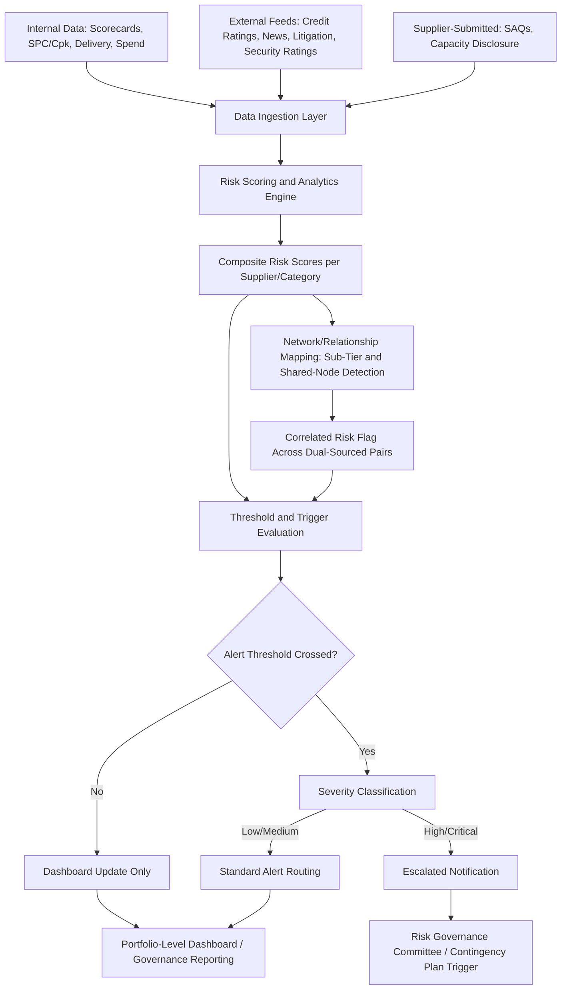

## Risk Monitoring Technology and Real-Time Alerting

### Definition and Strategic Rationale

Risk monitoring technology and real-time alerting refers to the software platforms, data architectures, and automated notification systems that operationalize the risk assessment and monitoring disciplines discussed across this chapter — converting periodic, manual risk review into continuous, systematized surveillance capable of detecting and flagging emerging risk signals as they occur, rather than only at scheduled review intervals. This chapter item is, in effect, the technology infrastructure layer underlying every preceding Supplier Risk Management item: the financial early-warning indicators, operational/quality trends, cybersecurity ratings, and concentration mapping discussed earlier all depend on some underlying data and alerting architecture to function at meaningful scale across a real-world supplier base.

Within an SRM and Dual Sourcing context, this technology layer serves a specific enabling function:

- **Scale beyond manual capability**: A buying organization with hundreds or thousands of suppliers cannot sustain the depth of continuous monitoring described in earlier chapter items (financial ratio tracking, security rating review, operational trend analysis) through manual analyst effort alone; automated monitoring technology is what makes continuous, criticality-tiered monitoring operationally feasible.
- **Speed as the core value proposition**: The entire premise of "early warning" depends on detection speed — the earlier chapter items on financial monitoring and business continuity planning both emphasize that response effectiveness (RTO achievement, distress mitigation before a self-fulfilling spiral) depends heavily on how quickly a signal is detected and escalated, which is fundamentally a technology and process-design problem as much as an analytical one.
- **Correlated-risk detection specifically benefits from technology**: The concentration-risk and cybersecurity chapter items both emphasized that hidden, correlated risk across a dual-sourced supplier pair (shared sub-tier dependencies, shared software platforms) is difficult to detect manually but is precisely the kind of pattern-matching and network-mapping problem well-suited to software-based analysis across large datasets.

### Core Architectural Components

**Data Ingestion Layer**

Aggregates risk-relevant data from multiple source types into a unified monitoring environment:

- Structured internal data: scorecard history, quality/PPM records, SPC/$C_{pk}$ trend data, delivery performance, spend and volume allocation records
- External commercial risk intelligence feeds: financial/credit ratings, news and media monitoring, litigation and regulatory filings, cybersecurity ratings, geopolitical event feeds
- Direct supplier-submitted data: self-assessment questionnaire responses, capacity disclosures, security questionnaire responses
- IoT/sensor data where available: increasingly, some programs incorporate direct facility-level operational data (e.g., equipment sensor feeds) from digitally integrated suppliers, extending the OEE monitoring discussed under operational risk into a more real-time data stream [Inference — this level of direct sensor integration is more common among highly digitally mature buyer-supplier relationships and is not yet a universal baseline practice]

**Risk Scoring and Analytics Engine**

Applies the scoring methodologies discussed throughout this chapter — composite risk indices, Altman Z-Score-style financial models, HHI concentration calculations, $RPN$ risk-priority scoring — computationally across the full monitored supplier base, recalculating scores as new data arrives rather than only at scheduled manual review points.

**Threshold and Trigger Configuration**

The mechanism translating raw scores and data changes into actionable alerts, typically configured per the criticality-tiered approach discussed under cybersecurity and financial risk monitoring — e.g., a Tier-1 critical supplier might trigger an alert on a smaller ratings movement than a Tier-3 standard supplier, reflecting the differentiated monitoring intensity principle established earlier.

**Alerting and Notification Layer**

Delivers triggered alerts to the appropriate stakeholders through defined channels (dashboard notification, email, integration with collaboration platforms), typically with severity-based routing — a minor deviation might generate a passive dashboard flag reviewed at the next periodic cycle, while a severe or Tier-1-critical trigger generates immediate, escalated notification per the escalation protocols discussed under business continuity planning.

**Network/Relationship Mapping Visualization**

Given the recurring emphasis throughout this chapter on correlated and sub-tier risk being difficult to detect through siloed, per-supplier analysis, mature platforms increasingly provide network-graph visualization capability — mapping the multi-tier supplier relationship structure explicitly, allowing risk teams to visually identify shared upstream nodes across a dual-sourced supplier pair, directly supporting the concentration-risk correlated-dependency detection discussed in the prior chapter item.

**Dashboard and Reporting Layer**

Portfolio-level views aggregating individual supplier risk signals into category-level and enterprise-level risk reporting, supporting the governance review cadences (SBR/QBR, risk committee reviews) referenced across multiple earlier chapter items.

### Technology Monitoring Architecture

### Market Landscape (Illustrative Categories)

The commercial risk-technology market spans several overlapping categories, and specific vendor offerings evolve rapidly enough that current sourcing decisions should be validated against up-to-date market research rather than relying solely on static reference material [Unverified — vendor-specific capabilities and market positioning change frequently; current comparative evaluation recommended before platform selection]:

- **Dedicated supply chain risk intelligence platforms**: purpose-built for multi-tier mapping, risk scoring, and alerting (illustrative category examples referenced under risk identification include firms such as Resilinc, Interos, and Everstream, among others in this space)
- **Financial/credit risk data providers**: firms such as Dun & Bradstreet, Moody's, and similar providers, typically integrated into a broader risk platform rather than used standalone for full supply-risk monitoring
- **Cybersecurity rating platforms**: dedicated security-posture rating services, often integrated as a data feed into a broader risk monitoring architecture rather than operating as the sole risk system
- **Procure-to-pay/SRM suite embedded risk modules**: risk monitoring capability increasingly built directly into broader supplier relationship management and procurement platforms (e.g., modules within SAP Ariba, Coupa, Jaggaer, referenced earlier under capability-building's training-tracking discussion), rather than requiring a fully separate best-of-breed risk system
- **Custom-built internal platforms**: larger organizations with sufficient data science resources sometimes build proprietary risk-scoring and alerting capability internally, particularly where integration with highly specific internal operational data (SPC systems, ERP) is a priority

### Implementation Considerations

**Build vs. Buy Decision**

Organizations generally weigh the depth of internal data science and integration capability against the speed-to-value of a commercial platform; a common pattern is adopting a commercial platform for external data aggregation and baseline scoring while layering custom internal analytics for buyer-specific data integration (SPC systems, internal scorecard history).

**Data Quality and Coverage Gaps**

External risk intelligence coverage is generally stronger for larger, publicly-traded, or well-established suppliers than for smaller or privately-held ones — directly relevant to dual sourcing, since a newer secondary source (as noted under financial risk monitoring) may have materially thinner third-party data coverage than an established incumbent, requiring supplementary direct-disclosure mechanisms rather than relying on automated external feeds alone.

**Alert Threshold Calibration and Alert Fatigue**

As flagged under financial risk monitoring, poorly calibrated thresholds — set uniformly across a diverse supplier base rather than tiered by criticality — generate excessive low-value alerts that erode analyst attention to genuinely material signals; threshold calibration is an ongoing tuning exercise rather than a one-time configuration step.

**Integration with Governance Workflow**

Monitoring technology delivers value only when alerts feed into defined governance action, not merely into a dashboard that goes unreviewed — connecting directly to the escalation protocols, contingency plan triggers, and risk governance committee structures discussed under business continuity planning and financial risk monitoring.

### Risk Monitoring Technology in the Dual-Sourcing Context Specifically

- **Automated correlated-risk detection as a distinctive capability**: The network-mapping and sub-tier visualization capability discussed above directly addresses the recurring theme across this chapter that correlated risk between dual-sourced suppliers is difficult to detect manually — technology-enabled mapping makes systematic, ongoing correlated-risk surveillance practical at a scale manual review cannot sustain.
- **Differentiated monitoring configuration per dual-source pair member**: Consistent with the differentiated-tiering principle established under cybersecurity and financial monitoring, the technology configuration should generally apply distinct thresholds and monitoring depth to each half of a dual-sourced pair based on that specific supplier's data maturity, integration depth, and criticality role (primary vs. secondary), rather than applying uniform settings across both.
- **Real-time volume-rebalancing decision support**: Some platforms extend beyond passive alerting into decision-support functionality, surfacing recommended volume-rebalancing actions when a risk signal crosses a threshold for one member of a dual-sourced pair — operationalizing the volume-shift mechanisms discussed under recognition and incentive programs and financial risk monitoring into a more systematic, technology-assisted process rather than a purely manual governance decision.
- **Supporting contingency plan currency**: Automated monitoring of capacity utilization and readiness indicators for a qualified secondary source helps address the "readiness decay" pitfall flagged under business continuity planning — technology-based tracking is better suited to continuously validating that a contingency plan's underlying assumptions (ramp capability, capacity headroom) remain current than periodic manual plan review alone.

**Example**: A buyer implements a risk monitoring platform integrating external financial and cybersecurity rating feeds with internal SPC and scorecard data across its Tier-1 critical supplier base. The platform's network-mapping module, populated through a multi-tier supply chain mapping exercise (per the concentration-risk chapter item), flags that two dual-sourced suppliers for a critical connector component share a common Tier-3 plating sub-supplier. When that Tier-3 supplier's automated credit-rating feed shows a material downgrade, the platform generates a correlated-risk alert — rather than two separate, seemingly unrelated Tier-1 supplier alerts — allowing the risk governance committee to recognize the shared exposure and evaluate sub-tier diversification rather than treating the two Tier-1 relationships as independently resilient.

### Common Pitfalls

- **Treating technology adoption as a substitute for governance process design**: Purchasing or building a monitoring platform without the underlying escalation protocols, contingency triggers, and governance committee structures discussed elsewhere in this chapter results in alerts that generate activity without effective action.
- **Uniform configuration across a diverse supplier base**: Applying identical thresholds and monitoring depth regardless of supplier criticality tier, leading to the alert-fatigue problem discussed under financial risk monitoring.
- **Overestimating external data coverage for smaller/newer suppliers**: Assuming automated feeds provide adequate signal for a newer secondary source with limited public financial or security disclosure, without supplementing with direct engagement mechanisms.
- **Underinvesting in the network-mapping/correlated-risk capability specifically**: Given how central correlated-risk detection is to genuine dual-sourcing resilience (per the concentration-risk chapter item), platforms or implementations that focus solely on individual-supplier scoring without multi-tier relationship mapping miss a core value driver specific to this syllabus's dual-sourcing focus.
- **Static threshold configuration**: Failing to revisit and recalibrate alert thresholds as supplier criticality, integration depth, or dual-sourcing volume splits change over time, paralleling the reassessment-trigger discipline emphasized throughout this chapter.

**Related Topics**

- Multi-Tier Network Mapping Platform Selection and Implementation
- Alert Threshold Calibration Methodologies by Supplier Criticality Tier
- Build-vs-Buy Decision Frameworks for Supply Risk Technology
- Integrating Risk Alerts into Contingency Plan Activation Workflows
- Data Coverage Gaps for Privately-Held and Emerging Suppliers
- Decision-Support Automation for Dual-Source Volume Rebalancing
- Portfolio-Level Risk Dashboard Design for Executive Governance Reporting