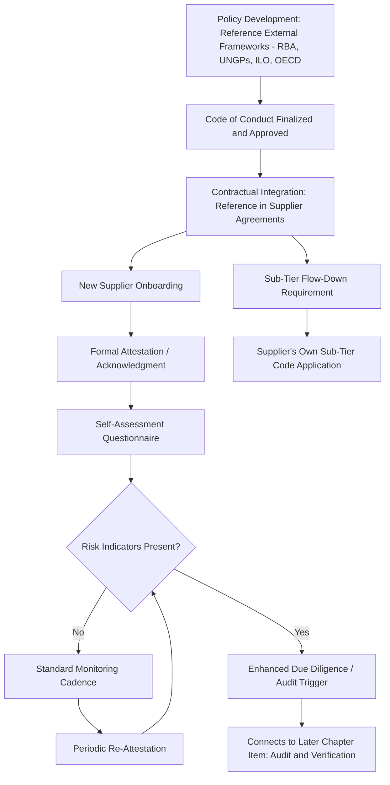

## Supplier Code of Conduct and Ethical Sourcing Policy

### Definition and Strategic Rationale

A Supplier Code of Conduct and Ethical Sourcing Policy is the formal, documented set of minimum standards a buying organization requires its suppliers to meet across labor practices, human rights, environmental stewardship, business ethics, and legal compliance, typically established as a contractual precondition of doing business rather than an aspirational statement alone. It represents the foundational governance instrument for the broader Ethics, Compliance, and Sustainable Sourcing chapter — the standards against which subsequent audit, monitoring, and remediation activities (covered in later chapter items) are measured.

This chapter item marks a deliberate shift in this syllabus's focus: where the Supplier Risk Management chapter addressed risk to the *buyer's* supply continuity, financial exposure, and operational resilience, the Ethics, Compliance, and Sustainable Sourcing chapter addresses risk and responsibility flowing in the other direction — the impact the buyer's supply chain has on workers, communities, and the environment, and the reputational, legal, and increasingly regulatory exposure the buyer itself carries when that impact falls short of required standards.

Within an SRM and Dual Sourcing context specifically, the Code of Conduct carries distinctive relevance:

- **A uniform floor across dual-sourced suppliers**: Because dual sourcing by definition means two (or more) independent suppliers serve the same buyer need, ensuring both suppliers meet the same ethical baseline is necessary to avoid a scenario where the buyer's dual-sourcing risk-mitigation strategy inadvertently routes volume toward whichever source has weaker labor or environmental oversight — undermining the buyer's ethical commitments through backdoor exposure.
- **Code compliance as a qualification gate, connecting to earlier chapter items**: Just as financial health and cybersecurity posture were established as formal gates within second-source qualification (per the Supplier Risk Management chapter), Code of Conduct compliance is typically a non-negotiable qualification prerequisite — a technically and financially capable secondary source that fails Code compliance is generally not an acceptable dual-sourcing candidate regardless of its other strengths.
- **Newer/secondary sources may carry elevated compliance risk**: Analogous to the pattern noted for financial and cybersecurity maturity in earlier chapter items, a newer or smaller secondary supplier — often selected for cost or geographic diversification reasons — may have less mature compliance infrastructure than an established incumbent, requiring proportionally greater initial diligence and ongoing monitoring attention.

### Core Content Areas of a Supplier Code of Conduct

**Labor and Human Rights Standards**

- Prohibition of forced, bonded, or involuntary labor and human trafficking
- Prohibition of child labor, typically referencing minimum age standards aligned with International Labour Organization (ILO) conventions
- Freedom of association and collective bargaining rights
- Non-discrimination and anti-harassment provisions
- Working hours, wages, and benefits meeting applicable legal minimums (and, in more advanced codes, living-wage benchmarks beyond bare legal minimums)
- Health and safety standards for the working environment

**Environmental Standards**

- Compliance with applicable environmental laws and permitting requirements
- Waste management, emissions, and effluent handling standards
- Increasingly, requirements or encouragement around carbon footprint disclosure and reduction commitments, connecting to the ESG risk category referenced under risk identification in the prior chapter
- Resource use efficiency (water, energy) expectations, particularly for resource-intensive manufacturing categories

**Business Ethics and Anti-Corruption**

- Prohibition of bribery, corruption, and improper payments, typically referencing applicable anti-corruption law (e.g., the U.S. Foreign Corrupt Practices Act or the UK Bribery Act, depending on buyer jurisdiction and applicability)
- Conflicts of interest disclosure requirements
- Fair competition and antitrust compliance
- Gifts and entertainment policy boundaries in the buyer-supplier relationship itself

**Responsible Sourcing of Materials**

- Conflict minerals compliance (tin, tantalum, tungsten, gold — commonly referenced under frameworks stemming from Section 1502 of the U.S. Dodd-Frank Act and OECD Due Diligence Guidance)
- Increasingly, broader responsible-material sourcing expectations extending beyond the traditional conflict-minerals list to other higher-risk materials (e.g., cobalt, mica) depending on industry and evolving regulatory attention

**Management Systems and Sub-Tier Flow-Down**

- Requirement that the supplier maintain its own management systems (policies, training, grievance mechanisms) to operationalize the Code, rather than treating it as a signature-only formality
- **Flow-down obligation**: a requirement that the supplier apply equivalent standards to its own sub-tier suppliers — directly extending the Code's reach into the multi-tier structure discussed under concentration risk in the prior chapter, since ethical risk (like financial and operational risk) frequently originates deeper in the supply chain than the directly contracted Tier-1 relationship

### Development and Governance Structure

**Policy Foundation and Reference Frameworks**

Most organizational Codes of Conduct are built by adapting or directly referencing established external frameworks rather than being created entirely from scratch, lending both credibility and a common vocabulary across industry:

- **Responsible Business Alliance (RBA) Code of Conduct** — widely referenced, particularly in electronics and technology-adjacent manufacturing supply chains
- **UN Guiding Principles on Business and Human Rights** — foundational human-rights due-diligence framework
- **ILO Core Labour Standards** — baseline labor rights conventions
- **OECD Guidelines for Multinational Enterprises** — broader responsible business conduct framework

**Contractual Integration**

The Code is typically incorporated into supplier contracts by explicit reference (rather than left as a separate, non-binding document), with defined consequences for non-compliance ranging from corrective action requirements through contract termination — establishing the Code as an enforceable contractual term, not merely a statement of values.

**Acknowledgment and Attestation**

New suppliers, including candidate secondary sources undergoing the qualification process discussed in the Supplier Risk Management chapter, are typically required to formally acknowledge and attest to Code compliance as part of onboarding, often paired with a self-assessment questionnaire (paralleling the SAQ mechanisms discussed under financial and cybersecurity risk monitoring).

### Code of Conduct Governance Flow

### Code of Conduct and Ethical Sourcing in the Dual-Sourcing Context Specifically

- **Equivalent standards, not necessarily identical implementation**: The buyer applies the same Code requirements to both members of a dual-sourced pair, but the specific compliance implementation may legitimately differ by jurisdiction and local legal context — for example, minimum wage compliance benchmarks differ by country, though the underlying Code principle (legal wage compliance, and increasingly living-wage aspiration) applies uniformly.
- **Qualification-gate consistency preventing a "weak link" dynamic**: Since dual-sourcing volume-allocation mechanisms discussed in earlier chapters (merit-based rebalancing, capacity-driven surge activation) could otherwise inadvertently reward a source with lower compliance costs achieved through weaker labor or environmental standards, Code compliance is generally treated as a binary qualification gate applied *before* performance-based or capacity-based allocation logic — a supplier failing the Code gate should not be eligible for volume increases regardless of cost or operational performance advantages.
- **Elevated diligence timing for new secondary sources**: Given the pattern (echoed from financial and cybersecurity risk discussions) that newer secondary suppliers often carry less mature formal compliance infrastructure, Code of Conduct due diligence is typically front-loaded into the initial qualification process for a new second source, rather than deferred to routine periodic review — reducing the risk of onboarding a source that later requires disruptive remediation or disqualification.
- **Sub-tier flow-down as a specific dual-sourcing complexity**: Because the concentration-risk chapter item established that dual-sourced suppliers may share sub-tier dependencies, a Code of Conduct violation discovered at a shared sub-tier supplier can simultaneously implicate *both* halves of a dual-sourced pair — meaning ethical risk correlation deserves the same multi-tier mapping attention given to financial, operational, and cybersecurity correlated risk in the prior chapter.

**Example**: A buyer qualifying a new secondary source for a textile component requires Code of Conduct attestation and a labor-practices self-assessment questionnaire as a mandatory step within the broader qualification process (alongside the technical, financial, and capacity assessments discussed in earlier chapter items). The self-assessment indicates the candidate secondary source operates in a region with elevated forced-labor risk per commonly referenced country-risk indices. Rather than proceeding directly to standard onboarding, the buyer escalates to enhanced due diligence — a more detailed pre-qualification audit — before finalizing dual-source qualification, ensuring the buyer's dual-sourcing strategy does not inadvertently introduce a source with materially weaker ethical standards than its established incumbent.

### Common Pitfalls

- **Treating the Code as a signature-only formality**: A Code acknowledged at contract signing but never reinforced through the audit, monitoring, and remediation mechanisms covered in later chapter items provides limited actual protection against ethical-sourcing risk.
- **Inconsistent application across dual-sourced suppliers**: Applying rigorous Code diligence to a new or smaller secondary source while grandfathering an established incumbent under lighter historical standards, creating an uneven — and potentially reputationally exposed — compliance foundation across the dual-sourced pair.
- **Ignoring sub-tier flow-down enforcement**: Including a flow-down clause in the Code's text without any mechanism to verify the supplier is genuinely applying equivalent standards to its own upstream suppliers, leaving the multi-tier ethical risk effectively unmanaged despite the clause's presence.
- **Static, unreviewed Code content**: Failing to periodically update the Code against evolving external reference frameworks and regulatory requirements (which have expanded materially in scope and rigor in recent years across multiple jurisdictions), leaving the buyer's standard outdated relative to current expectations.
- **Confusing attestation with verification**: Treating a supplier's self-attestation as equivalent to independent confirmation, without the audit and verification mechanisms addressed in the following chapter item — a distinction directly analogous to the self-disclosure bias caution raised for financial and cybersecurity self-assessment in the prior chapter.

**Next Steps**

- Responsible Business Alliance (RBA) and Comparable Reference Framework Adoption
- Conflict Minerals and Responsible Material Sourcing Due Diligence
- Sub-Tier Code of Conduct Flow-Down Verification Mechanisms
- Contractual Non-Compliance Consequences and Remediation Escalation Ladders
- Country and Region-Level Labor Risk Indices for Enhanced Due Diligence Triggers
- Living-Wage Benchmarking Beyond Legal Minimum Compliance
- Ethical Sourcing Audit and Verification Program Design