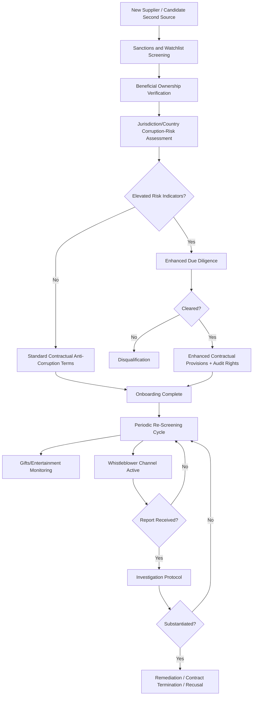

## Anti-Corruption and Conflict-of-Interest Controls

### Definition and Strategic Rationale

Anti-corruption and conflict-of-interest controls refer to the specific policies, contractual provisions, screening procedures, and monitoring mechanisms a buying organization implements to prevent, detect, and remediate bribery, improper payments, and undisclosed conflicts of interest within its supplier relationships and its own procurement organization's conduct toward suppliers. Where the prior chapter item established the Supplier Code of Conduct as the broad ethical-standards umbrella, this chapter item addresses a specific, legally high-stakes subset of that umbrella in greater operational depth — corruption and conflict-of-interest risk carry distinctive legal exposure (criminal liability under statutes such as the U.S. Foreign Corrupt Practices Act (FCPA) or the UK Bribery Act) that generally warrants dedicated controls beyond a general Code of Conduct reference.

This chapter item is also distinctive within the syllabus in that it addresses risk flowing in *both* directions across the buyer-supplier relationship — not only the risk that a supplier engages in corrupt practices in its own business dealings, but the risk that the buyer's own procurement personnel are corrupted (bribed, or influenced by undisclosed conflicts) in ways that distort supplier selection, qualification, or volume-allocation decisions discussed throughout this syllabus.

Within an SRM and Dual Sourcing context specifically:

- **Corruption risk can directly undermine dual-sourcing integrity**: If a procurement professional responsible for supplier qualification or volume-allocation decisions (the merit-based rebalancing mechanisms discussed under recognition and incentive programs, for example) has an undisclosed financial interest in one of two competing dual-sourced suppliers, the entire performance-based allocation logic this syllabus has built up across multiple chapter items becomes compromised — corruption risk is thus not merely a compliance matter but a direct threat to the analytical integrity of the dual-sourcing strategy itself.
- **Third-party corruption liability extends through the supply chain**: Under many anti-corruption statutes, a buyer can face liability for corrupt acts committed by intermediaries or suppliers acting on its behalf, even without direct buyer knowledge — making supplier-side anti-corruption screening a buyer self-protection measure, not solely a downstream ethical concern.
- **Facilitation payments and local business customs create genuine complexity in cross-border dual-sourcing**: Where dual sourcing spans multiple countries (a common driver of geographic risk diversification per the concentration-risk chapter item), suppliers may operate in jurisdictions with different — and sometimes conflicting — local business norms around gifts, facilitation payments, and government interaction, requiring careful policy design that doesn't simply default to the most permissive local custom.

### Core Anti-Corruption Control Mechanisms

**Third-Party Due Diligence and Screening**

- Sanctions and watchlist screening (e.g., against OFAC and equivalent regional sanctions lists, politically exposed persons (PEP) databases) conducted at supplier onboarding and periodically thereafter — directly parallel in structure to the financial and cybersecurity screening processes discussed in the Supplier Risk Management chapter, but focused specifically on corruption and sanctions exposure
- Beneficial ownership verification, identifying the actual individuals who own or control a supplier entity, since corruption risk (and conflict-of-interest risk specifically) is frequently obscured behind layered corporate ownership structures
- Risk-tiered due diligence depth, mirroring the criticality-based tiering principle established for cybersecurity and financial monitoring — suppliers in higher-corruption-risk jurisdictions (per commonly referenced indices such as Transparency International's Corruption Perceptions Index) or involving government-adjacent business warrant deeper screening than standard commercial suppliers

**Contractual Anti-Corruption Provisions**

- Representations and warranties requiring supplier compliance with applicable anti-corruption law
- Audit rights specific to anti-corruption compliance verification
- Termination rights triggered by confirmed corrupt conduct
- Flow-down requirements extending anti-corruption obligations to the supplier's own agents and sub-tier relationships, paralleling the Code of Conduct flow-down discussion in the prior chapter item

**Gifts, Entertainment, and Hospitality Policy**

- Defined monetary thresholds and approval requirements governing gifts or entertainment exchanged between buyer personnel and supplier personnel, applied bidirectionally
- Explicit prohibition or tight restriction around gifts/entertainment during active sourcing events or negotiations — the periods of greatest corruption-risk sensitivity given decisions are actively being made
- Documentation and disclosure requirements for any exceptions

**Conflict-of-Interest Disclosure and Management**

- Mandatory disclosure requirements for buyer-side procurement personnel regarding financial interests, family relationships, or other personal connections to current or prospective suppliers
- Recusal protocols removing conflicted personnel from supplier selection, qualification, or volume-allocation decisions specific to the conflicted relationship
- Periodic (not just onboarding-time) re-attestation, since conflicts of interest can emerge over the life of an employment relationship, not only at its outset

**Whistleblower and Reporting Mechanisms**

- Confidential (and where legally required, anonymous) reporting channels for suspected corruption or conflict-of-interest concerns, available to both internal personnel and external supplier-side employees
- Non-retaliation protections, which are frequently a specific legal requirement under whistleblower protection statutes in many jurisdictions
- Defined investigation protocols and escalation pathways once a report is received

**Training and Awareness**

- Periodic anti-corruption training for procurement personnel, covering applicable law, red-flag indicators, and reporting procedures — analogous in structure to the training initiatives discussed under supplier capability-building, but directed internally rather than at suppliers
- Supplier-facing anti-corruption expectations communication, often delivered alongside the broader Code of Conduct onboarding process discussed in the prior chapter item

### Anti-Corruption Screening and Monitoring Flow

### Anti-Corruption and Conflict-of-Interest Controls in the Dual-Sourcing Context Specifically

- **Protecting the integrity of performance-based volume allocation**: Because this syllabus has repeatedly established merit-based, data-driven mechanisms for volume rebalancing between dual-sourced suppliers (recognition and incentive programs, financial and operational risk-driven rebalancing), conflict-of-interest controls specifically protect the *analytical integrity* of those mechanisms — recusal protocols ensure a procurement professional with an undisclosed interest in one dual-sourced supplier cannot influence the scorecard weighting, threshold-setting, or discretionary elements of allocation decisions in that supplier's favor.
- **Cross-border screening complexity in geographically diversified dual sourcing**: Where dual sourcing is deliberately structured for geographic risk diversification (per the concentration-risk chapter item), the two suppliers may operate under materially different corruption-risk jurisdictional profiles, requiring differentiated due-diligence depth per source rather than a uniform standard applied regardless of jurisdiction — echoing the differentiated-tiering principle established for cybersecurity and financial monitoring.
- **Corruption risk as a qualification gate, analogous to Code of Conduct compliance**: Consistent with the qualification-gate logic established in the prior chapter item, anti-corruption screening failure is generally treated as disqualifying for a candidate secondary source, applied *before* technical, financial, or capacity-based qualification criteria are weighed — a corruption red flag should not be offset by otherwise strong operational capability.
- **Sub-tier and intermediary risk in complex sourcing structures**: Where a dual-sourcing arrangement involves agents, distributors, or other intermediaries (common in some cross-border sourcing structures), anti-corruption due diligence must extend to those intermediaries specifically, since corrupt payments are frequently structured to flow through such third parties rather than directly between buyer and supplier — a specific manifestation of the sub-tier/flow-down risk theme recurring throughout this syllabus.

**Example**: During qualification of a candidate secondary source for a components category, standard sanctions screening clears the supplier entity itself, but beneficial ownership verification reveals that a minority equity stake in the candidate supplier is held by a close family member of a buyer-side sourcing manager directly involved in the qualification decision. Per the conflict-of-interest disclosure and recusal protocol, the sourcing manager is required to disclose the relationship and is recused from further involvement in that supplier's qualification and any subsequent volume-allocation decisions, with an unconflicted colleague assuming that responsibility — preserving the integrity of the broader merit-based dual-sourcing framework this syllabus has established.

### Common Pitfalls

- **Screening only at onboarding, not on an ongoing basis**: Beneficial ownership, sanctions status, and personal conflicts of interest can all change after initial qualification; failing to re-screen periodically mirrors the "static assessment" pitfall flagged repeatedly across the Supplier Risk Management chapter.
- **Treating anti-corruption controls as a compliance checkbox disconnected from procurement decision workflows**: Screening and recusal protocols deliver limited protection if they are not actually integrated into the specific decision points (qualification approval, volume-allocation governance) where corrupted influence could take effect.
- **Underestimating intermediary and agent risk**: Focusing anti-corruption due diligence exclusively on the directly contracted supplier entity while overlooking agents, consultants, or distributors involved in the relationship, who are a commonly cited vector for concealed improper payments.
- **Inconsistent gift/entertainment policy enforcement**: Applying strict standards to some supplier relationships while tolerating informal exceptions for others (often correlating with relationship tenure or personal rapport), creating both legal exposure and a credibility gap in the broader ethics program.
- **Weak or unpublicized whistleblower channels**: A reporting mechanism that exists on paper but is not genuinely trusted or well-communicated (due to unclear anonymity protections or perceived retaliation risk) fails to surface the very concerns it is designed to capture.
- **Uniform jurisdictional treatment despite differentiated risk**: Applying identical due-diligence depth regardless of a supplier's operating jurisdiction, missing the risk-based tiering opportunity that corruption-perception indices and similar tools are specifically designed to support.

**Related Topics**

- FCPA, UK Bribery Act, and Comparable Cross-Jurisdictional Anti-Corruption Law Overview
- Beneficial Ownership Verification Methodologies and Data Sources
- Politically Exposed Persons (PEP) and Sanctions Screening Program Design
- Conflict-of-Interest Disclosure and Recusal Protocol Implementation
- Whistleblower Program Design and Non-Retaliation Protections
- Intermediary and Agent Due Diligence in Cross-Border Sourcing
- Corruption Perceptions Index and Jurisdictional Risk-Tiering Frameworks