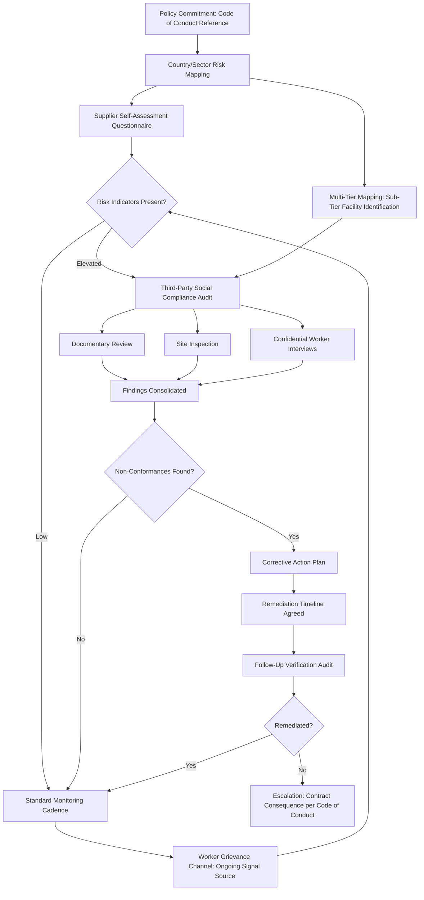

## Human Rights and Labor Standards Due Diligence

### Definition and Strategic Rationale

Human rights and labor standards due diligence refers to the systematic process by which a buying organization identifies, prevents, mitigates, and accounts for actual and potential adverse human rights and labor impacts connected to its supply chain — extending well beyond the attestation-based Code of Conduct compliance discussed earlier into an ongoing, evidence-based verification discipline. Where the Supplier Code of Conduct chapter item established *what standards* apply, and the anti-corruption chapter item addressed a specific high-stakes compliance domain, this chapter item addresses *how a buyer actively verifies* that labor and human rights standards are genuinely being met in practice — a distinction directly analogous to the self-disclosure-versus-independent-verification caution raised repeatedly across the Supplier Risk Management chapter for financial and cybersecurity self-assessment.

This due diligence discipline has evolved rapidly from a voluntary, reputation-driven practice into an increasingly binding legal obligation in multiple jurisdictions, a shift with direct implications for how rigorously this chapter item must be operationalized:

- **Mandatory human rights due diligence legislation**: A growing number of jurisdictions have enacted or are implementing mandatory supply-chain human rights due diligence laws (for example, frameworks along the lines of Germany's Supply Chain Due Diligence Act and the broader EU Corporate Sustainability Due Diligence Directive), shifting human rights due diligence from a voluntary best practice toward a binding legal compliance requirement for covered organizations — buyers should verify current applicable requirements for their specific jurisdiction and organizational scope given this is an actively evolving regulatory area [Unverified — specific legislative scope, implementation timelines, and applicability thresholds vary by jurisdiction and continue to develop; current legal guidance should be confirmed directly].

Within an SRM and Dual Sourcing context specifically:

- **Due diligence must cover both dual-sourced suppliers with equivalent rigor**: Consistent with the qualification-gate logic established under the Code of Conduct chapter item, human rights due diligence cannot reasonably be applied more rigorously to one member of a dual-sourced pair than the other without creating both an ethical inconsistency and a potential legal exposure gap.
- **Sub-tier visibility is the central technical challenge**: As with financial, operational, cybersecurity, and concentration risk discussed throughout the Supplier Risk Management chapter, the most severe human rights risks are frequently found not at the directly contracted Tier-1 supplier but deeper in the supply chain (raw material extraction, lower-tier component manufacturing) — meaning the multi-tier mapping techniques discussed under concentration risk have a direct, high-stakes application in this domain.
- **Dual sourcing can serve as a leverage point for remediation, not only a risk-diversification tool**: Where a human rights due diligence process identifies a deficiency at one dual-sourced supplier, the existence of a qualified alternative source gives the buyer genuine leverage to require remediation (rather than simply accepting continued non-compliance because no alternative exists) — connecting the risk-diversification rationale established throughout this syllabus to a distinctly ethical application.

### The UN Guiding Principles Due Diligence Framework

Most contemporary corporate human rights due diligence programs are structured around the UN Guiding Principles on Business and Human Rights (UNGPs), which establish a recurring due diligence cycle:

1. **Policy Commitment** – a publicly stated commitment to respect human rights, typically embedded in or alongside the Supplier Code of Conduct discussed previously
2. **Impact Assessment** – identifying actual and potential adverse human rights impacts the organization may cause, contribute to, or be directly linked to through its supply chain
3. **Integration and Action** – embedding findings into internal decision-making and taking appropriate action to prevent or mitigate identified impacts
4. **Tracking Effectiveness** – monitoring whether mitigation actions are actually working, not merely whether they were implemented
5. **Communication** – externally reporting on how impacts are being addressed, increasingly a formal requirement under the mandatory due diligence legislation referenced above

This cycle is explicitly iterative and ongoing rather than a one-time assessment — directly paralleling the continuous-monitoring-over-periodic-review principle established for financial and operational risk in the prior chapter.

### Core Assessment and Verification Methodologies

**Risk-Based Country and Sector Mapping**

Using externally referenced risk indices (covering forced labor prevalence, child labor risk, freedom of association restrictions, and similar indicators) to identify which countries and sectors within the buyer's supply chain warrant the most intensive due diligence attention — a risk-tiering approach directly parallel to the criticality-based tiering established for cybersecurity and financial risk monitoring.

**Supplier Self-Assessment Questionnaires (SAQs)**

Structured questionnaires covering labor practices, working hours, wage payment, grievance mechanisms, and workforce demographics — serving as an initial screening layer, though subject to the same self-disclosure bias caution raised for financial and cybersecurity self-assessment; SAQs are generally treated as a starting point for risk-tiering further verification depth, not as sufficient verification on their own.

**Third-Party Social Compliance Audits**

Independent, on-site audits conducted by specialized social-compliance auditing firms, typically following standardized audit protocols (such as those associated with SA8000, SMETA (Sedex Members Ethical Trade Audit), or industry-specific audit protocols like the RBA's Validated Assessment Program). These audits generally examine:

- Documentary review (payroll records, working-hour logs, age-verification documentation)
- Physical site inspection (working conditions, safety equipment, dormitory conditions where applicable)
- Confidential worker interviews, conducted away from management oversight to reduce coached-response risk

**Worker Voice and Grievance Mechanisms**

Direct channels allowing workers at supplier facilities (and increasingly, sub-tier facilities) to raise concerns, often through third-party-operated hotlines or digital platforms specifically designed to preserve worker anonymity and reduce retaliation risk — analogous in structure and purpose to the whistleblower mechanisms discussed under anti-corruption controls, but focused on labor-condition concerns raised by workers rather than corruption concerns raised by employees or business partners.

**Satellite and Remote-Sensing Verification**

For certain high-risk categories (e.g., verifying facility operational status, detecting undisclosed subcontracting to unauthorized facilities), some programs increasingly supplement on-site audit with remote monitoring techniques, though this remains a more specialized and less universally adopted practice [Inference — emerging practice in specific high-risk categories, not yet a standard baseline methodology across general due diligence programs].

**Multi-Tier Mapping for Human Rights Risk**

Directly extending the multi-tier supply chain mapping techniques established under concentration risk, applied specifically to identify where raw material extraction, sub-component manufacturing, or labor-intensive processing occurs — since, as with financial and operational sub-tier risk, human rights risk frequently concentrates at tiers the buyer does not directly contract with or routinely audit.

### Human Rights Due Diligence Process Flow

### Human Rights Due Diligence in the Dual-Sourcing Context Specifically

- **Comparative leverage for remediation**: Where an existing sole-source supplier is found to have a human rights compliance gap, the buyer's practical remediation leverage can be limited if no alternative exists (creating pressure to accept continued non-compliance rather than disrupt supply) — a qualified dual-sourced alternative meaningfully strengthens the buyer's position to require genuine remediation with a credible consequence (volume shift) if it is not achieved, directly connecting the risk-diversification purpose of dual sourcing to an ethical-leverage function distinct from its supply-continuity function discussed in the prior chapter.
- **Avoiding a race-to-the-bottom dynamic in volume allocation**: As flagged under the Code of Conduct chapter item, the merit-based and cost-based volume-allocation mechanisms established throughout this syllabus must not inadvertently reward a dual-sourced supplier for achieving cost advantages through weaker labor standards — human rights due diligence findings are generally treated as a qualification gate applied prior to performance or cost-based allocation logic, consistent with the Code of Conduct discussion.
- **Sub-tier correlation risk mirrors the pattern established under concentration risk**: Two nominally independent dual-sourced Tier-1 suppliers may share a common higher-risk sub-tier raw material source or processing facility; multi-tier human rights mapping should specifically test for this correlated exposure, since a labor-rights violation at a shared sub-tier node would implicate both halves of the dual-sourced pair simultaneously.
- **Differentiated audit depth calibrated to genuine risk, not assumed by source seniority**: While this syllabus has repeatedly noted that newer secondary sources often warrant elevated scrutiny in other risk domains (financial, cybersecurity), human rights risk should be assessed on its own country/sector risk-mapping basis rather than assumed to correlate directly with supplier tenure — an established incumbent operating in a higher-risk jurisdiction or sector may warrant equal or greater audit depth than a newer secondary source in a lower-risk context.

**Example**: A buyer's country/sector risk mapping flags an apparel component category as elevated risk given known sector-wide labor concerns in certain sourcing regions. Both the established primary supplier and a candidate secondary source operate in the flagged region, triggering third-party social compliance audits for both as part of standard due diligence (rather than only the newer secondary source). The audit at the incumbent surfaces excessive working-hour non-conformances against the Code's standards. Given the availability of a qualified — and, per the audit, currently compliant — secondary source, the buyer's remediation conversation with the incumbent carries credible weight: a defined corrective action timeline is agreed, with an explicit understanding that continued non-conformance at the follow-up verification audit would result in volume shifting toward the compliant secondary source, illustrating how the dual-sourcing structure directly strengthens ethical leverage rather than functioning purely as a supply-continuity hedge.

### Common Pitfalls

- **Relying on self-assessment questionnaires alone**: As with financial and cybersecurity self-disclosure, SAQ responses carry inherent incentive bias and are generally insufficient as sole verification for elevated-risk suppliers or sectors — genuine due diligence requires independent audit verification for higher-risk positions.
- **One-time audit without follow-up verification**: Conducting an initial compliance audit but failing to verify that identified corrective actions were genuinely implemented and sustained, paralleling the "plan exists only on paper" pitfall flagged under business continuity planning.
- **Audit fatigue and coached-response risk**: Frequent, predictable, or poorly designed audits can result in supplier facilities preparing specifically for the audit event rather than maintaining genuine ongoing compliance — unannounced audits and confidential worker interviews are specifically designed to mitigate this, though neither fully eliminates the risk.
- **Overlooking sub-tier risk while focusing only on Tier-1 facilities**: As emphasized throughout this chapter item, the most severe human rights risks frequently occur below the directly contracted Tier-1 relationship — an audit program focused exclusively on Tier-1 facilities can create a false sense of adequate coverage.
- **Inconsistent rigor across a dual-sourced pair**: Applying more intensive human rights due diligence to one source than the other without a genuine risk-based justification, creating both an ethical inconsistency and, under mandatory due diligence legislation in applicable jurisdictions, potential legal exposure.
- **Treating due diligence as a static compliance exercise rather than an ongoing cycle**: Failing to apply the "Tracking Effectiveness" step of the UNGP framework — verifying that mitigation actions actually work over time, not merely that they were nominally implemented — mirrors the broader reassessment-trigger discipline emphasized throughout the Supplier Risk Management chapter.

**Related Topics**

- Mandatory Human Rights Due Diligence Legislation Landscape (EU CSDDD, German Supply Chain Act, and Comparable Frameworks)
- SA8000, SMETA, and RBA Validated Assessment Program Audit Protocol Comparison
- Worker Voice and Grievance Mechanism Program Design
- Multi-Tier Human Rights Risk Mapping Techniques
- Remediation and Corrective Action Plan Governance
- Country and Sector-Level Forced Labor and Child Labor Risk Indices
- Leveraging Dual-Sourcing Structures for Ethical Remediation Negotiation