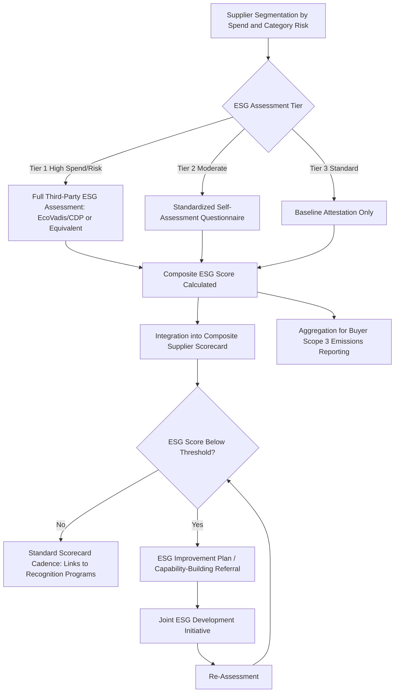

## ESG Criteria in Supplier Requirements

### Definition and Strategic Rationale

ESG criteria in supplier requirements refers to the systematic integration of Environmental, Social, and Governance performance measures into a buying organization's formal supplier qualification, scorecard, and sourcing-decision processes — extending the ethics and compliance foundation established in the preceding chapter items (Code of Conduct, anti-corruption, human rights due diligence) into a broader, quantifiable, and increasingly investor- and regulator-facing measurement framework. Where earlier chapter items in this section addressed specific compliance domains (labor rights, corruption) largely through a pass/fail or gate-based lens, ESG criteria typically function as a graduated, scored dimension integrated alongside the traditional quality, delivery, and cost dimensions of supplier performance management discussed throughout this syllabus.

This represents a structural shift worth noting explicitly: ESG criteria are increasingly not merely an ethical add-on but a formal input into the same scorecard and governance mechanisms already established under recognition and incentive programs and risk identification — meaning ESG performance can influence volume allocation, tier status, and risk classification in the same way quality and financial metrics do.

Within an SRM and Dual Sourcing context specifically:

- **ESG as a fourth pillar alongside quality, delivery, and cost**: Building directly on the composite scorecard structures introduced under recognition and incentive programs ($S_{total} = w_Q S_Q + w_D S_D + w_C S_C + w_I S_I$), many mature programs now extend the formula to include an explicit ESG weighting term, formalizing sustainability performance as a genuine input to supplier standing rather than a separate, disconnected compliance checklist.
- **Regulatory reporting obligations create a data-completeness imperative**: Buyer-side disclosure requirements (particularly around Scope 3 emissions, which by definition include supply-chain-embedded emissions) mean the buyer's own regulatory compliance increasingly depends on obtaining reliable ESG data from suppliers — making supplier ESG data collection a buyer self-interest matter, not solely a values-driven initiative.
- **Differentiated ESG maturity across a dual-sourced pair as both a risk and an opportunity**: As with the compliance-maturity gap noted for newer secondary sources under the Code of Conduct and human rights chapter items, a smaller or newer dual-sourced supplier may have less-developed ESG reporting infrastructure — but also potentially represents an opportunity for the buyer to apply the capability-building methodology discussed earlier in this syllabus to a sustainability-specific development plan.

### Core ESG Dimensions in Supplier Requirements

**Environmental Criteria**

- Greenhouse gas (GHG) emissions data, typically requested per the GHG Protocol's Scope 1 (direct), Scope 2 (purchased energy), and increasingly Scope 3 (value chain) categorization — with supplier-reported Scope 1/2 data feeding directly into the buyer's own Scope 3 calculation
- Energy source mix and renewable energy adoption
- Water usage, waste generation, and circular-economy practices (recycled content, end-of-life material recovery)
- Environmental management system certification (e.g., ISO 14001), extending the QMS certification discussion introduced under capability-building into the environmental domain specifically

**Social Criteria**

- Substantial overlap with the labor and human rights standards discussed in the prior two chapter items, but often expressed here in a more quantified, scorecard-compatible form (e.g., a labor-practices score derived from audit results, rather than a binary compliance attestation)
- Diversity, equity, and inclusion metrics within the supplier's own workforce, increasingly requested as part of buyer supplier-diversity initiatives
- Community impact and local economic development considerations, particularly relevant for suppliers operating in economically vulnerable regions

**Governance Criteria**

- Board composition and independence (more relevant for larger, publicly-structured suppliers than smaller privately-held ones)
- Anti-corruption program maturity, directly connecting to the controls discussed in the prior chapter item
- Data privacy and cybersecurity governance, connecting to the risk category discussed under Supplier Risk Management
- Transparency and disclosure practices generally, including willingness to share the underlying data this entire ESG assessment depends on

### Data Collection and Scoring Methodologies

**Standardized ESG Questionnaires and Platforms**

Many buyers adopt or reference established third-party ESG assessment platforms rather than building fully bespoke questionnaires, for reasons of supplier burden reduction (a supplier serving multiple buyer customers can reuse a single standardized assessment across them) and comparability:

- **EcoVadis** — a widely referenced supplier sustainability ratings platform commonly used across multiple industries [Unverified — specific market positioning and adoption levels should be confirmed via current sources given this is an actively evolving vendor landscape]
- **CDP (formerly the Carbon Disclosure Project)** — commonly used specifically for climate/emissions disclosure
- Industry-specific frameworks, such as those developed within automotive, electronics, or apparel sector sustainability initiatives, which sometimes overlap with the RBA framework referenced under the Code of Conduct chapter item

**Composite ESG Scoring**

Analogous to the risk-scoring formulas established throughout the Supplier Risk Management chapter, ESG assessments typically aggregate sub-scores across environmental, social, and governance dimensions into a composite score:

$$ESG_{score} = w_E \cdot S_E + w_S \cdot S_S + w_G \cdot S_G$$

where $S_E$, $S_S$, and $S_G$ represent normalized environmental, social, and governance sub-scores, and weights reflect the buyer's category-specific sustainability priorities (e.g., an emissions-intensive manufacturing category might weight environmental criteria more heavily than a services category).

**Tiered Requirement Depth by Supplier Criticality and Spend**

Consistent with the risk-tiering principle applied throughout this syllabus (cybersecurity, financial monitoring, human rights audit depth), ESG data collection and verification rigor is typically calibrated to supplier spend, category criticality, and sector-specific ESG risk — full third-party-verified ESG assessment for every supplier in a large base is generally impractical, so programs concentrate deepest scrutiny on the highest-spend or highest-risk-sector suppliers.

### ESG Integration Process Flow

### ESG Criteria in the Dual-Sourcing Context Specifically

- **ESG as an input to merit-based volume allocation, consistent with the recognition-program framework**: Building directly on the composite scoring and volume-rebalancing mechanisms discussed under recognition and incentive programs, a dual-sourced supplier's ESG performance can be formally weighted into the same allocation decisions already driven by quality, delivery, and cost — meaning a sustainability-leading secondary source can gain volume share on ESG merit specifically, not only on traditional performance dimensions.
- **Avoiding ESG-driven correlated risk masking**: As with the correlated-risk theme recurring throughout the Supplier Risk Management chapter, two dual-sourced suppliers may share the same upstream material source or sub-tier processor — meaning a genuine environmental or social risk at that shared node (e.g., a carbon-intensive shared raw material input) affects both halves of the dual-sourced pair's ESG profile simultaneously, regardless of how differentiated their own direct operations appear.
- **Differentiated data maturity requiring calibrated expectations**: Consistent with the pattern noted for financial and cybersecurity data availability in earlier chapters, a newer or smaller secondary source may have materially less mature ESG reporting infrastructure (no formal GHG inventory, no EcoVadis rating) than an established incumbent — programs generally need a bridging approach (self-reported estimates, capability-building support toward formal reporting) rather than simply excluding less-mature secondary sources from ESG-weighted allocation decisions entirely, which would undermine the broader dual-sourcing and capability-building objectives established earlier in this syllabus.
- **ESG-linked capability-building as a natural extension of the earlier chapter item**: A secondary source with a genuine willingness to improve but currently immature ESG data and practice represents a direct application of the capability-building and training initiatives discussed at the start of this syllabus — applied specifically to sustainability capability rather than technical/quality capability.

**Example**: A buyer extends its composite supplier scorecard formula to include an ESG weighting term, sourced from EcoVadis ratings for its highest-spend suppliers. The established incumbent for a critical component holds a strong EcoVadis rating reflecting mature emissions reporting and an ISO 14001-certified environmental management system. The newer secondary source, while operationally and financially qualified, has no formal EcoVadis rating and limited GHG emissions tracking capability. Rather than excluding the secondary source from ESG-weighted allocation entirely — which would penalize a supplier for data immaturity rather than substantiated poor performance — the buyer initiates a joint ESG capability-building engagement (directly modeled on the training-initiative framework established earlier in this syllabus), supporting the secondary source toward baseline GHG inventory development and EcoVadis assessment participation, with a defined timeline before full ESG-weighted scoring parity is expected in the composite scorecard formula.

### Common Pitfalls

- **ESG as a disconnected checklist rather than an integrated scorecard input**: Collecting ESG data through a standalone questionnaire process that never actually feeds into the composite scorecard, volume-allocation, or tier-status mechanisms established elsewhere in this syllabus, limiting the data's practical influence on sourcing decisions.
- **Uniform ESG expectations regardless of data maturity, particularly across a dual-sourced pair**: Penalizing a newer secondary source for data-reporting immaturity in a way indistinguishable from penalizing genuinely poor underlying performance, without the bridging or capability-building approach illustrated above.
- **Overlooking sub-tier and shared-node ESG risk**: Assessing each dual-sourced supplier's ESG profile independently without examining shared upstream dependencies, missing correlated environmental or social risk exposure analogous to the concentration-risk theme established under Supplier Risk Management.
- **Treating third-party ESG ratings as fully equivalent to independent audit verification**: While platforms like EcoVadis incorporate meaningful verification elements, buyers should understand the specific verification methodology and limitations of any third-party rating relied upon, rather than treating a rating score as unconditionally equivalent to the on-site audit rigor discussed under human rights due diligence.
- **Static ESG weighting not reviewed for evolving regulatory relevance**: Given the rapidly evolving mandatory disclosure landscape referenced under human rights due diligence, ESG criteria weighting and data-collection scope may require more frequent review and adjustment than the traditional quality/delivery/cost scorecard dimensions, which tend to be more stable over time.

**Next Steps**

- GHG Protocol Scope 1/2/3 Emissions Data Collection from Suppliers
- EcoVadis, CDP, and Comparable ESG Rating Platform Comparison
- Composite Scorecard Weighting Design Integrating ESG with Traditional Performance Dimensions
- ESG-Focused Capability-Building Program Design for Data-Immature Suppliers
- Scope 3 Emissions Reporting Obligations and Supplier Data Dependency
- Correlated ESG Risk Detection Across Shared Sub-Tier Nodes
- Supplier Diversity Metrics Integration into ESG Scoring Frameworks