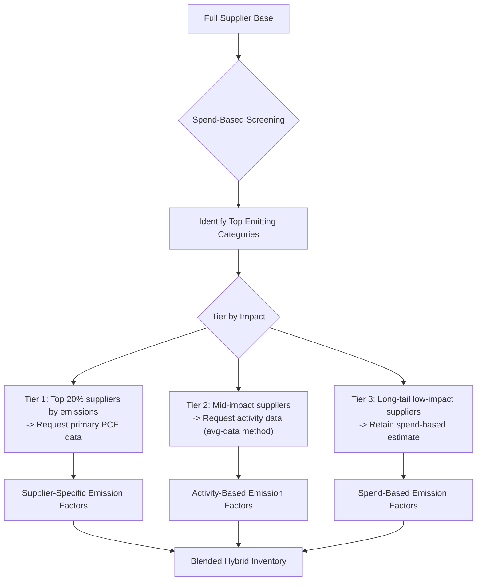
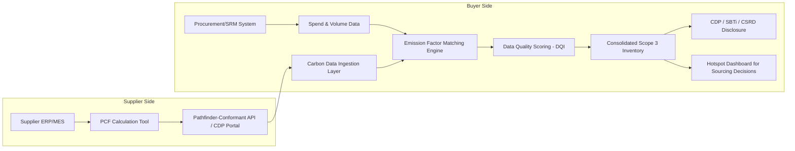

## Scope 3 Emissions Measurement With Suppliers

### Overview

Scope 3 emissions comprise all indirect greenhouse gas (GHG) emissions occurring in a reporting company's value chain, excluding Scope 2 (purchased energy) and Scope 1 (direct operational emissions). Under the GHG Protocol Corporate Value Chain (Scope 3) Standard, these are divided into 15 categories, 8 upstream and 7 downstream. For most industrial and retail companies, Scope 3 represents 70-90% of total carbon footprint, and the majority of that sits with suppliers, primarily under Category 1 (Purchased Goods and Services) and Category 4 (Upstream Transportation and Distribution).

Measuring Scope 3 with suppliers is fundamentally a data-acquisition and data-quality problem layered on top of an emissions-accounting problem. It requires building supplier-facing data collection infrastructure, applying calculation methodologies of varying precision, and managing the inherent uncertainty of multi-tier value chains.

### The 15 Scope 3 Categories (Supplier-Relevant Subset)

| # | Category | Relevance to SRM |
| --- | --- | --- |
| 1 | Purchased Goods and Services | Primary target — largest category for most firms |
| 2 | Capital Goods | Supplier-manufactured equipment/machinery |
| 3 | Fuel- and Energy-Related Activities | Upstream of supplier's own Scope 1/2 |
| 4 | Upstream Transportation and Distribution | Inbound logistics, often 3PL-managed |
| 5 | Waste Generated in Operations | Supplier's disposal of production waste |
| 6 | Business Travel | Internal, not supplier-dependent |
| 7 | Employee Commuting | Internal, not supplier-dependent |
| 8 | Upstream Leased Assets | Leased-in supplier facilities/equipment |
| 9-15 | Downstream categories | Distribution, use-phase, EOL — relevant for product-level supplier data (e.g., material composition) |

Categories 1, 4, and 11 (Use of Sold Products, where supplier-sourced components drive product energy consumption) typically dominate a manufacturer's supplier-attributable Scope 3.

### Calculation Methodology Hierarchy

The GHG Protocol defines a maturity ladder of calculation approaches, from coarse spend-based estimates to supplier-specific measured data. Data quality and calculation effort increase together.

**Tier 1 — Spend-Based Method**

$$E = \sum_i (S_i \times EF_i)$$

Where $S_i$ is spend in a procurement category (currency) and $EF_i$ is an economic input-output emission factor (kgCO2e per currency unit), typically sourced from databases like EPA's USEEIO, DEFRA, or Exiobase.

- **Key Points**
  - Fastest to implement — requires only categorized AP/procurement spend data
  - Lowest accuracy: assumes emissions intensity is uniform across all suppliers in a spend category, ignoring actual production efficiency
  - Sensitive to inflation/price changes, which distort the emissions signal year-over-year unless deflated
  - Standard starting point for initial Scope 3 baseline / CDP disclosure

**Tier 2 — Average-Data (Activity-Based) Method**

$$E = \sum_i (Q_i \times EF_i)$$

Where $Q_i$ is a physical activity quantity (kg of steel, kWh, tonne-km transported) and $EF_i$ is a secondary emission factor from a database (e.g., ecoinvent, DEFRA conversion factors) matched to that material/process.

- **Key Points**
  - Requires procurement to track physical quantities, not just spend, per SKU/material category
  - More accurate than spend-based since it reflects actual material composition
  - Still uses industry-average factors, not the specific supplier's actual process emissions

**Tier 3 — Supplier-Specific Method**

$$E = \sum_i (Q_i \times EF_{i,\text{supplier}})$$

Uses primary emissions data reported directly by the supplier for the specific product/process, often derived from a supplier-conducted LCA or CDP Supply Chain response.

- **Key Points**
  - Highest accuracy, required for SBTi-validated targets in later years and for credible supplier engagement programs
  - Depends entirely on supplier data collection maturity (see Data Collection Infrastructure below)
  - Should be product-level (per unit of purchased good), not company-average, to support hotspot identification

**Tier 4 — Hybrid Method**

Combines supplier-specific data where available with average-data or spend-based fallback for suppliers who have not yet reported. This is the practical real-world state for nearly all Scope 3 programs — a blended portfolio moving progressively from Tier 1 to Tier 3 coverage over multiple reporting cycles.

### Supplier Data Collection Infrastructure

**Standard Collection Channels**

1. **CDP Supply Chain Questionnaire** — industry-standard annual survey; buyers request suppliers respond via CDP's platform; provides standardized Scope 1/2/3 and sometimes product carbon footprint (PCF) data
2. **Direct supplier surveys** — company-specific templates (often Excel/portal-based) requesting activity data, energy mix, and emission factors
3. **Industry data exchange platforms** — Catena-X (automotive), PACT (Partnership for Carbon Transparency) using the WBCSD Pathfinder Framework for interoperable PCF exchange between ERP systems
4. **Supplier sustainability platforms** — EcoVadis, Manufacture 2030, Prewave, IntegrityNext — aggregate scoring plus raw emissions data collection, often integrated into SRM/procurement tooling
5. **Product Carbon Footprint (PCF) exchange via API** — machine-readable PCF data conforming to the WBCSD Pathfinder Network data model, enabling automated ingestion into a buyer's carbon accounting system

**Supplier Engagement Tiering**

A pragmatic rollout prioritizes suppliers by emissions materiality, not simply by spend:

This mirrors the Pareto-driven approach recommended by the GHG Protocol: since a small fraction of suppliers typically account for the large majority of Category 1 emissions, engagement resources should concentrate there rather than spreading thin across the entire supplier base.

### Data Quality Scoring

The GHG Protocol's **Data Quality Indicators (DQI)** framework scores each emission factor input across five dimensions, each on a 1 (best) to 5 (worst) scale:

- **Technological representativeness** — does the factor match the specific technology/process used?
- **Temporal representativeness** — how recent is the data (target year vs. factor's reference year)?
- **Geographical representativeness** — does the factor match the supplier's actual production location/grid?
- **Completeness** — proportion of relevant emission sources covered
- **Reliability** — was the underlying data measured, calculated, estimated, or based on unqualified assumptions?

Aggregate DQI scores are used to compute a **pedigree matrix uncertainty** estimate, propagated into overall inventory uncertainty ranges reported alongside total Scope 3 figures — material for both CDP and SBTi validation review.

### Dual Sourcing Implications for Scope 3

Dual/multi-sourcing strategies directly intersect with Scope 3 measurement in several ways:

- **Emissions-adjusted sourcing decisions**: when qualifying a second supplier for the same part, landed carbon cost (transport emissions from Category 4 plus production emissions differential from Category 1) becomes a selection criterion alongside price and lead time, not just a compliance afterthought
- **Data quality fragmentation**: splitting volume across two suppliers who report at different data-quality tiers (one Tier 3 supplier-specific, one Tier 1 spend-based fallback) degrades overall category-level data quality and complicates year-over-year comparability
- **Allocation methodology**: emissions must be allocated per unit of purchased good per supplier, then weighted by volume share — requires PO/ERP-level supplier-SKU-quantity granularity, not aggregate category spend
- **Leverage for primary data acquisition**: qualifying an alternate supplier is a natural checkpoint to mandate CDP/PCF disclosure as an onboarding gate, since new supplier qualification processes have less legacy inertia than pushing disclosure requirements onto entrenched incumbents

### Worked Example — Hybrid Category 1 Calculation

A manufacturer purchases steel components from two suppliers:

- Supplier A (60% volume, 1,200 tonnes): submitted a verified product carbon footprint of 1.85 tCO2e/tonne steel (Tier 3)
- Supplier B (40% volume, 800 tonnes): no primary data submitted; average-data method applied using an ecoinvent EU steel factor of 2.10 tCO2e/tonne (Tier 2)

$$E_{\text{total}} = (1200 \times 1.85) + (800 \times 2.10) = 2220 + 1680 = 3900 \ \text{tCO2e}$$

**Output**

| Supplier | Volume (t) | Method | EF (tCO2e/t) | Emissions (tCO2e) |
| --- | --- | --- | --- | --- |
| A | 1,200 | Tier 3 (supplier-specific) | 1.85 | 2,220 |
| B | 800 | Tier 2 (average-data) | 2.10 | 1,680 |
| **Total** | 2,000 | Hybrid | — | **3,900** |

[Inference] If Supplier B were later onboarded to Tier 3 reporting and its actual footprint proved materially lower than the ecoinvent proxy (plausible if it runs an EAF mini-mill rather than the blended BF-BOF/EAF mix typical of the regional average), total reported Category 1 emissions could decrease without any actual physical reduction in production — an artifact of data-quality improvement rather than decarbonization, which is a common reporting pitfall requiring clear year-over-year disclosure footnotes distinguishing structural vs. data-quality-driven variance.

### System Architecture for Supplier Emissions Data Pipeline

### Regulatory and Framework Drivers

- **CSRD (EU)** — mandates Scope 3 disclosure under ESRS E1 for in-scope companies, with phased assurance requirements increasing data quality expectations over time
- **SBTi** — near-term targets require Scope 3 target-setting when Scope 3 exceeds 40% of total emissions (true for nearly all manufacturers); demands increasing supplier engagement coverage over the target period
- **CDP Supply Chain Program** — buyer-driven cascading disclosure request mechanism, the most widely adopted supplier engagement channel
- **WBCSD Partnership for Carbon Transparency (PACT)** — technical interoperability standard (Pathfinder Framework) enabling PCF data to move between different companies' carbon accounting systems without manual re-entry

[Unverified] Specific numeric compliance thresholds and phase-in timelines under CSRD and other regional regulations continue to be refined through delegated acts; current program requirements should be verified against the applicable jurisdiction's latest guidance rather than treated as fixed.

**Related Topics**

- Product Carbon Footprint (PCF) Calculation and Verification
- Supplier Carbon Disclosure Onboarding Programs (CDP Supply Chain)
- Emission Factor Databases (ecoinvent, DEFRA, EPA USEEIO) — Selection and Maintenance
- WBCSD Pathfinder Framework and PACT Network Integration
- Science Based Targets initiative (SBTi) — Scope 3 Target Validation
- Carbon-Adjusted Total Cost of Ownership (TCO) Modeling for Supplier Selection
- Multi-Tier Supply Chain Emissions Mapping (Tier 2/Tier 3 Traceability)
- CSRD/ESRS E1 Disclosure Requirements for Value Chain Emissions