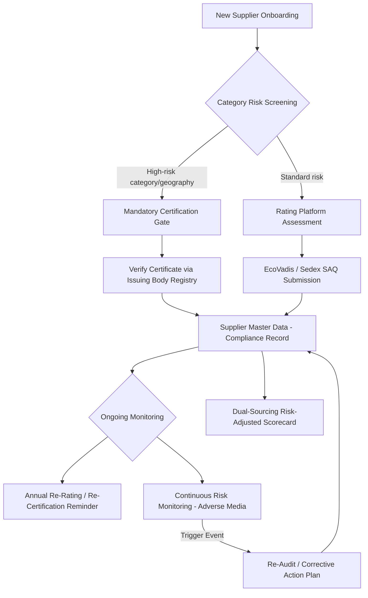

## Responsible Sourcing Certifications and Ratings

### Overview

Responsible sourcing certifications and ratings are third-party or platform-based mechanisms that verify and score a supplier's environmental, social, and governance (ESG) performance. They serve two structurally different functions that are frequently conflated:

- **Certifications** — binary/pass-fail attestations against a defined standard, issued after an audit, applying to a facility, product, or management system (e.g., ISO 14001, SA8000, Fair Trade)
- **Ratings** — continuous scored assessments (often 0-100 or letter-grade) produced by a platform aggregating self-disclosed data, documentary evidence, and/or public records (e.g., EcoVadis, MSCI ESG, Sedex SAQ scores)

Both feed into SRM as supplier qualification gates, ongoing risk-monitoring inputs, and dual-sourcing decision criteria, but they differ substantially in audit rigor, cost, refresh cadence, and legal defensibility.

### Certification vs. Rating — Structural Comparison

| Dimension | Certification | Rating |
| --- | --- | --- |
| Output format | Pass/fail or tiered (e.g., Bronze/Silver/Gold) | Numeric score or percentile |
| Basis | On-site/remote audit against a fixed standard | Documentary review, questionnaire, sometimes AI/public-data scraping |
| Scope | Facility or product-specific | Company-wide, sometimes multi-facility aggregate |
| Assurance level | Higher — accredited auditors, defined non-conformance process | Variable — largely self-reported with spot verification |
| Refresh cycle | Typically 1-3 years | Typically annual |
| Cost borne by | Supplier (audit fee) | Supplier (subscription) or buyer (platform license) |
| Legal/regulatory weight | Often referenced directly in regulation (e.g., conflict minerals) | Rarely regulatory-binding; used for internal risk scoring |

### Major Certification Schemes by Domain

**Environmental Management Systems**

- **ISO 14001** — environmental management system (EMS) certification; process-based, does not certify specific emissions performance, only that a management system exists and is followed
- **ISO 50001** — energy management systems, relevant for suppliers in energy-intensive categories

**Labor and Social Standards**

- **SA8000** — Social Accountability International's standard covering child labor, forced labor, health & safety, freedom of association, working hours, and remuneration; one of the most widely audited social standards in manufacturing supply chains
- **BSCI (amfori)** — Business Social Compliance Initiative code of conduct with monitoring audits, common in EU retail/apparel supply chains
- **WRAP (Worldwide Responsible Accredited Production)** — apparel/footwear-focused, 12 principles covering labor, health & safety, environmental, and customs compliance

**Conflict Minerals and Traceability**

- **RMAP (Responsible Minerals Assurance Process)** — administered by RMI (Responsible Minerals Initiative); certifies smelters/refiners of tin, tantalum, tungsten, gold (3TG) as conformant to OECD Due Diligence Guidance
- **CFSI/CMRT (Conflict Minerals Reporting Template)** — standardized data collection format rather than a certification itself, used to cascade smelter-level data up the supply chain to comply with Dodd-Frank Section 1502 and EU Conflict Minerals Regulation

**Forestry, Agriculture, and Commodities**

- **FSC (Forest Stewardship Council)** / **PEFC** — chain-of-custody certification for wood/paper/fiber
- **RSPO (Roundtable on Sustainable Palm Oil)** — palm oil supply chain certification
- **Fair Trade / Fairtrade International** — commodity-level certification (coffee, cocoa, cotton) covering labor conditions and price floors
- **Rainforest Alliance** — agricultural sustainability certification, merged standard with UTZ

**Quality/Integrated Management (Adjacent, Often Co-Required)**

- **ISO 9001** — quality management; frequently bundled into supplier qualification alongside responsible sourcing certs even though it is not itself an ESG standard

### Major Rating Platforms

**EcoVadis**

- Scores across four themes: Environment, Labor & Human Rights, Ethics, Sustainable Procurement
- 0-100 scale, converted to medal tiers (Bronze/Silver/Gold/Platinum, top percentile bands)
- Based on a documentary evidence review (policies, certificates, reports) rather than on-site audit — [Unverified] whether a specific supplier's EcoVadis assessment included document verification calls or only automated document parsing depends on the assessment tier purchased, which varies by contract
- Widely used as an SRM-integrated onboarding gate (minimum score thresholds for tender eligibility)

**Sedex (SMETA)**

- Sedex is a data-sharing platform; **SMETA (Sedex Members Ethical Trade Audit)** is the associated audit methodology (2-pillar or 4-pillar: labor, health & safety, environment, business ethics)
- Suppliers upload a **Self-Assessment Questionnaire (SAQ)** plus audit reports, visible to linked buyers
- Distinct from EcoVadis in that Sedex is primarily an audit-report repository/sharing mechanism rather than a proprietary scoring algorithm, though SAQ risk ratings are algorithmically generated

**MSCI ESG Ratings / Sustainalytics**

- Company (not facility) level, primarily investor-facing rather than procurement-facing
- Relevant to SRM mainly for public/large-cap suppliers where investment-grade ESG rating correlates with disclosure maturity, and for buyer-side corporate ESG reporting that references supplier ratings in scope

**IntegrityNext / Prewave**

- Real-time supply chain risk monitoring platforms — combine self-assessment questionnaires with continuous media/public-record scanning (adverse news, sanctions lists, labor violation reports)
- Increasingly positioned to satisfy **supply chain due diligence law** requirements (see Regulatory Drivers) because they provide ongoing monitoring rather than point-in-time snapshots

**CDP (Carbon Disclosure Project) Supply Chain**

- Scored A-D(-) primarily for climate, water, and forests disclosure; covered in depth under Scope 3 measurement but functions as a rating input to overall supplier ESG profile

### Integration Architecture into SRM

**Key Points**

- Certificate validity should be verified against the issuing body's public registry (many schemes, e.g., RMAP, FSC, publish searchable databases), not solely trusted from a supplier-submitted PDF — expired or revoked certificates are a common audit finding
- Rating scores should be timestamped and versioned in the supplier master record since methodologies are periodically revised (EcoVadis has updated its scoring methodology across versions, meaning scores are not always directly comparable year-over-year without normalization)
- A single rating source creates single-point-of-failure risk in supplier risk assessment; mature SRM programs blend certification (point-in-time assurance) with rating (continuous signal) with continuous monitoring (event-driven signal)

### Regulatory Drivers Pushing Certification/Rating Adoption

- **EU Corporate Sustainability Due Diligence Directive (CSDDD)** — requires in-scope companies to conduct human rights and environmental due diligence across their value chain, creating direct demand for documented supplier certification/rating evidence as due diligence artifacts
- **German Supply Chain Due Diligence Act (LkSG)** — earlier, narrower precursor to CSDDD with similar due diligence documentation requirements
- **EU Deforestation Regulation (EUDR)** — requires geolocation and due diligence statements for commodities linked to deforestation (palm oil, soy, cattle, cocoa, coffee, rubber, wood), directly increasing reliance on FSC/RSPO-style chain-of-custody certification
- **US Uyghur Forced Labor Prevention Act (UFLPA)** — creates a rebuttable presumption that goods from Xinjiang involve forced labor, driving demand for supply chain traceability documentation that certifications alone often cannot fully satisfy, requiring supplementary chain-of-custody evidence

[Inference] As CSDDD and EUDR enforcement matures, buyer organizations are likely to shift weight from static certifications toward continuous-monitoring rating platforms (IntegrityNext/Prewave-style) since regulatory due diligence obligations are framed as ongoing processes rather than point-in-time checks, though the pace and specifics of this shift depend on finalized enforcement guidance not yet fully settled across all EU member states.

### Dual Sourcing Implications

- **Certification parity requirement**: when qualifying a second supplier for a single-sourced part, responsible sourcing certification/rating parity (not just price/quality/lead-time parity) should be an explicit qualification gate — a lower-rated alternate supplier can create downstream compliance risk even if commercially attractive
- **Risk diversification vs. compliance concentration trade-off**: dual sourcing across two suppliers in the same high-risk geography does not diversify compliance risk even though it diversifies supply risk; certification/rating data should be cross-referenced against geographic risk indices (e.g., forced labor prevalence indices) during sourcing decisions
- **Weighted scorecard blending**: a common SRM implementation pattern is a weighted composite score combining commercial terms, quality history, and ESG rating/certification status into a single supplier selection scorecard, so that responsible sourcing performance is systematically factored into award decisions rather than treated as a separate compliance checkbox

### Worked Example — Weighted Supplier Scorecard

A procurement team evaluates two candidate suppliers for a dual-sourcing award, weighting commercial (50%), quality (30%), and responsible sourcing (20%):

$$\text{Composite Score} = (0.50 \times S_{\text{commercial}}) + (0.30 \times S_{\text{quality}}) + (0.20 \times S_{\text{ESG}})$$

| Supplier | Commercial (0-100) | Quality (0-100) | ESG Rating (0-100, EcoVadis) | Composite |
| --- | --- | --- | --- | --- |
| X | 88 | 82 | 55 (no cert, low EcoVadis tier) | $(0.5)(88)+(0.3)(82)+(0.2)(55) = 44.0+24.6+11.0 = 79.6$ |
| Y | 80 | 85 | 92 (EcoVadis Gold, SA8000 certified) | $(0.5)(80)+(0.3)(85)+(0.2)(92) = 40.0+25.5+18.4 = 83.9$ |

**Output**: Supplier Y wins on composite score despite a lower commercial score, illustrating how ESG weighting materially shifts sourcing outcomes once formally integrated into the scorecard rather than treated as a pass/fail side gate.

**Related Topics**

- Supplier Code of Conduct Design and Cascading Requirements
- Conflict Minerals Due Diligence (RMAP, CMRT) Implementation
- EU CSDDD and EUDR Compliance Architecture for Procurement
- Supplier Risk Scorecards — Weighted Multi-Criteria Decision Models
- Continuous Supply Chain Risk Monitoring Platform Integration (API-based)
- Audit Management and Corrective Action Plan (CAP) Tracking Systems