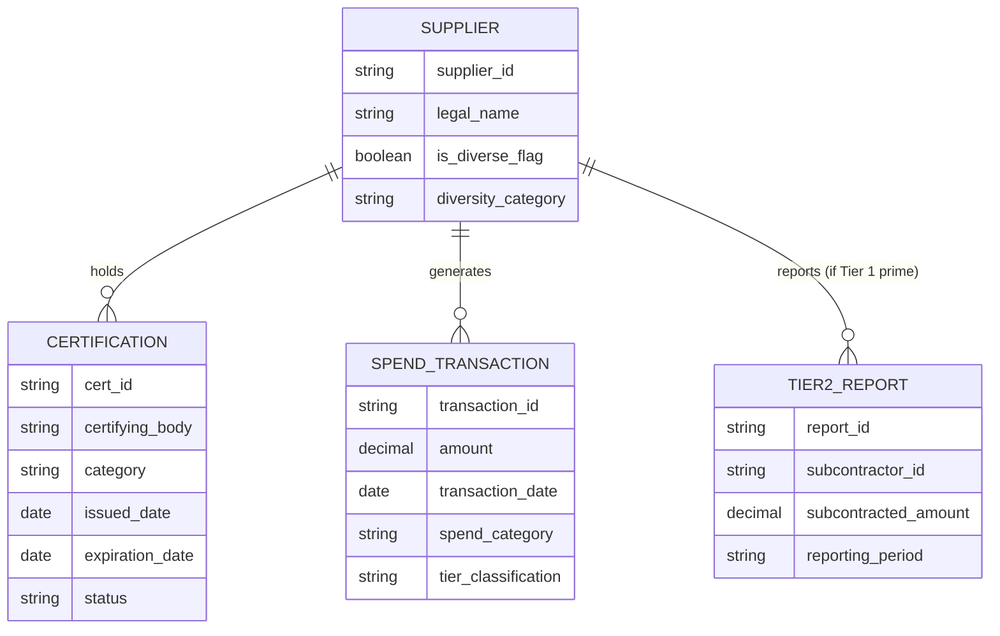
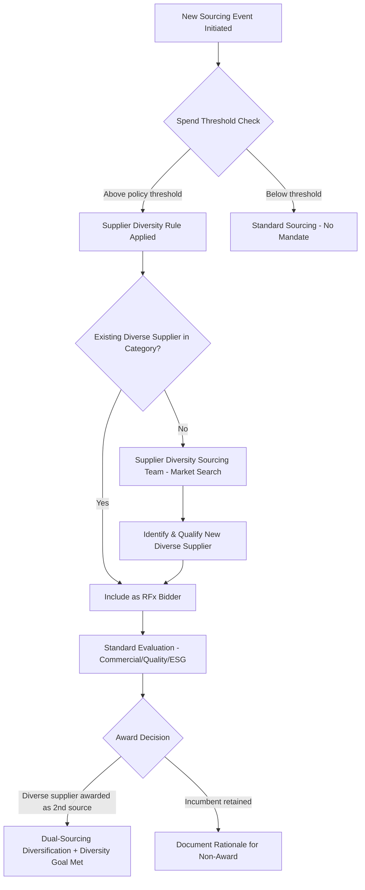

## Supplier Diversity and Inclusion Programs

### Overview

Supplier diversity programs are structured procurement initiatives that intentionally include historically underrepresented business owners, minority-owned, women-owned, veteran-owned, LGBTQ+-owned, disability-owned, and small/disadvantaged businesses, in the sourcing and award process. Programmatically, this sits at the intersection of procurement policy, certification verification, spend tracking, and supplier development, and in mature organizations is operated with the same rigor as quality or cost management: defined targets, tracked spend, tiered reporting, and integration into the supplier qualification and dual-sourcing workflow.

### Core Program Components

1. **Classification and certification verification** — determining which suppliers qualify as "diverse" under a recognized certifying body, not self-declaration alone
2. **Spend tracking and Tier 1/Tier 2 reporting** — measuring direct spend with diverse suppliers plus spend that large prime suppliers subcontract to diverse subcontractors
3. **Sourcing integration** — mandating diverse supplier inclusion in RFx events (e.g., "rule of three" requiring at least one diverse bidder per sourcing event above a spend threshold)
4. **Supplier development** — capacity-building support (financing access, mentorship, technical assistance) to help diverse suppliers scale to meet enterprise procurement requirements
5. **Goal-setting and executive reporting** — percentage-of-spend targets cascaded to category managers, reported to leadership/board and sometimes externally (ESG/CSR disclosures)

### Certification Bodies by Category

| Category | Primary Certifying Bodies (US-centric; varies by region) |
| --- | --- |
| Minority-owned | NMSDC (National Minority Supplier Development Council) |
| Women-owned | WBENC (Women's Business Enterprise National Council) |
| Veteran-owned | NVBDC (National Veteran Business Development Council), VA VOSB/SDVOSB (federal) |
| LGBTQ+-owned | NGLCC (National LGBT Chamber of Commerce) |
| Disability-owned | Disability:IN |
| Small/disadvantaged (federal) | SBA 8(a), HUBZone, SDB designations (US federal contracting) |
| Global equivalent | WEConnect International (cross-border certification recognition for women-owned businesses) |

[Unverified] Certification requirements, recognized bodies, and legal frameworks vary substantially by country and, within federal contracting, by specific agency — the table above reflects commonly referenced US frameworks and should be verified against the applicable jurisdiction's current regulatory and certification landscape before being treated as authoritative for a specific program.

**Key Points**

- Certification typically requires proof of ownership percentage (commonly 51%+ ownership by the qualifying group), operational control, and independence from a non-diverse parent entity
- Certifications generally require periodic renewal (typically annual or biennial), so supplier master data needs expiration tracking, not a one-time flag
- Self-certification (supplier attests without third-party verification) is used in some programs for lower-risk/lower-spend categories but carries higher audit and misrepresentation risk than third-party certification

### Tier 1 vs. Tier 2 Spend Reporting

- **Tier 1 spend**: direct spend by the buying organization with a certified diverse supplier
- **Tier 2 spend**: spend that a non-diverse Tier 1 prime supplier subcontracts to a certified diverse subcontractor, reported by the prime back to the buyer

$$\text{Total Diverse Spend} = \sum \text{Tier 1 Direct Spend} + \sum \text{Tier 2 Reported Subcontracted Spend}$$

Tier 2 tracking requires primes to self-report subcontractor spend, typically via a **supplier diversity subcontracting plan** submitted periodically (quarterly/annually), and is a common point of data-quality weakness since it depends on the prime's own reporting diligence rather than data the buyer directly observes.

### Data Model / System Architecture

**Key Points**

- `is_diverse_flag` should never be a static boolean set once at onboarding — it must be derived from active, non-expired certification records, recalculated on a schedule (e.g., nightly batch job checking `expiration_date < today`) so that spend reported against a lapsed certification doesn't silently inflate diverse spend metrics
- Diversity category should support multi-category tagging (a supplier can be both minority-owned and women-owned) rather than a single enum, since dashboard reporting typically needs to report overlapping categories without double-counting spend at the aggregate level

### Integration into Sourcing Events and Dual Sourcing

- **Dual sourcing as a diversity lever**: when an incumbent supplier relationship is well-established, introducing a second qualified source is often the lowest-friction point to bring a diverse supplier into a category, since it does not require displacing an existing relationship, only adding capacity alongside it
- **Risk-diversification synergy**: diverse suppliers, being frequently smaller/regional businesses, can also serve a geographic or scale-diversification role in a dual-sourcing risk strategy, though this must be balanced against the capacity and financial-resilience risk smaller suppliers may carry (see Supplier Development below)
- **Documentation requirement**: when an existing diverse Tier 2 or Tier 1 supplier is not selected in a sourcing event where diversity goals apply, mature programs require documented rationale (price, quality, capacity gap) for audit-trail and internal governance purposes

### Supplier Development Programs

Because certified diverse suppliers are disproportionately smaller businesses, enterprise-scale procurement requirements (capacity, IT integration, compliance documentation, payment terms) can create structural barriers independent of product/service quality. Supplier development programs address this via:

- **Mentor-protégé programs** — pairing a diverse supplier with an established prime or the buyer's own technical/quality teams
- **Accelerated/net-shortened payment terms** — improving diverse suppliers' cash flow, sometimes via early-payment or supply chain finance programs targeted specifically at this segment
- **Capacity-building grants or low-interest financing partnerships** — often coordinated through certifying bodies (NMSDC, WBENC) or third-party fintech partners
- **Technical onboarding support** — assistance integrating with buyer EDI/procurement systems, which can otherwise be a hard qualification barrier for smaller suppliers

### Reporting and Governance

**Common Metrics**

- % of total addressable spend with certified diverse suppliers (Tier 1 + Tier 2)
- Category-level diverse spend penetration
- Number of new diverse suppliers onboarded per period
- Diverse supplier retention/attrition rate
- RFx participation rate (bids received from diverse suppliers vs. total bids)

**Output**

| Metric | Formula |
| --- | --- |
| Diverse Spend % | $\dfrac{\text{Total Diverse Spend (Tier 1 + Tier 2)}}{\text{Total Addressable Spend}} \times 100$ |
| RFx Diversity Participation Rate | $\dfrac{\text{Diverse Bidders}}{\text{Total Bidders}} \times 100$ per sourcing event |
| Category Penetration | Diverse spend / total spend, computed per procurement category to identify under-penetrated categories |

[Inference] Categories with low diverse-supplier penetration are frequently technical/specialized categories (e.g., high-capex manufacturing, specialized IT infrastructure) where the barrier is more plausibly supplier capacity/scale than availability of certified diverse businesses, suggesting supplier development investment yields higher category-penetration improvement than sourcing-event mandates alone in those specific categories — though this varies by industry and should be validated against the buying organization's own category-level data rather than assumed universally.

### Regulatory and Contractual Context

- **US Federal Contracting** — FAR (Federal Acquisition Regulation) subpart 19 sets small business/socioeconomic subcontracting goals for federal primes, with mandatory subcontracting plans above defined dollar thresholds
- **State and local government contracting** — many US states/municipalities have MBE/WBE (Minority/Women Business Enterprise) participation requirements or goals on public contracts, relevant directly to the Philippine LGU context by analogy: local government procurement often carries its own set-aside or preference frameworks distinct from private-sector voluntary programs, and [Unverified] specific requirements applicable to Philippine LGU procurement should be verified against Republic Act 9184 (Government Procurement Reform Act) and its implementing rules rather than assumed to mirror US frameworks
- **Corporate ESG/CSR disclosure frameworks** — supplier diversity metrics are increasingly requested in ESG reporting frameworks and investor questionnaires, creating a reporting linkage between procurement-level diversity data and enterprise sustainability disclosure

**Related Topics**

- Supplier Master Data Management — Certification Lifecycle and Expiration Tracking
- RFx Process Design with Mandated Diverse Bidder Inclusion Rules
- Supplier Financing and Early-Payment Programs for SME/Diverse Suppliers
- ESG Disclosure Integration — Linking Procurement KPIs to Corporate Sustainability Reporting
- Government Procurement Frameworks and Local Preference/Set-Aside Requirements