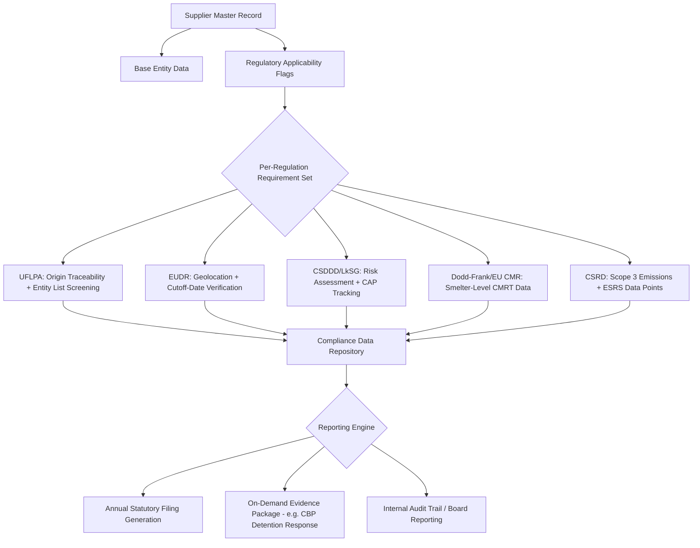

## Regulatory Disclosure and Reporting Obligations

### Overview

Regulatory disclosure and reporting obligations are the legally mandated requirements that compel organizations to collect, verify, and publicly or contractually disclose information about their supply chains, spanning human rights, environmental, financial, and governance dimensions. For SRM, these obligations translate directly into data architecture requirements: what supplier-level data must be captured, at what granularity, verified to what standard, and exported in what format and cadence. This item surveys the major regulatory regimes, their overlapping/conflicting scope boundaries, and the system design implications of supporting multi-jurisdictional compliance simultaneously.

### Regulatory Landscape by Domain

**Human Rights and Forced Labor**

- **US Uyghur Forced Labor Prevention Act (UFLPA)** — rebuttable presumption that goods mined, produced, or manufactured wholly or in part in Xinjiang, or by entities on the UFLPA Entity List, are made with forced labor; importers must provide "clear and convincing evidence" to rebut, requiring granular supply chain traceability down to raw material origin
- **US Tariff Act Section 307** — broader, pre-existing prohibition on goods made with forced/convict/indentured labor, enforced via CBP Withhold Release Orders (WROs)
- **UK Modern Slavery Act 2015** — requires qualifying companies (turnover threshold) to publish an annual Modern Slavery Statement describing steps taken to address slavery/trafficking risk in operations and supply chains; disclosure-based (no mandated substantive due diligence standard), reporting-obligation model rather than a due-diligence-obligation model
- **Australian Modern Slavery Act 2018** — similar disclosure-based statement requirement, lower turnover threshold than UK
- **EU Corporate Sustainability Due Diligence Directive (CSDDD)** — shifts from disclosure-only to mandatory due diligence obligation: in-scope companies must identify, prevent, mitigate, and account for adverse human rights and environmental impacts across their chain of activities, with civil liability exposure for failures

**Conflict Minerals**

- **US Dodd-Frank Section 1502** — requires SEC-reporting companies to disclose use of 3TG (tin, tantalum, tungsten, gold) sourced from DRC/adjoining countries, via annual Form SD filing and accompanying Conflict Minerals Report
- **EU Conflict Minerals Regulation (2017/821)** — requires EU importers of 3TG above volume thresholds to conduct OECD-aligned due diligence; narrower importer scope than Dodd-Frank's issuer-based scope

**Environmental**

- **EU Deforestation Regulation (EUDR)** — mandates geolocation coordinates and due diligence statements for commodities (palm oil, soy, cattle, wood, cocoa, coffee, rubber) and derived products placed on the EU market, verifying deforestation-free production after a defined cutoff date
- **EU CSRD (Corporate Sustainability Reporting Directive)** — mandates detailed sustainability reporting under ESRS standards, including Scope 3 value chain emissions (ESRS E1) and value chain due diligence disclosures across environmental and social standards, phased in by company size/listing status

**Governance and Anti-Corruption**

- **US FCPA (Foreign Corrupt Practices Act)** — anti-bribery provisions extending liability to third parties (including suppliers/agents) acting on a company's behalf
- **UK Bribery Act 2010** — broader strict-liability corporate offense for failure to prevent bribery, including by "associated persons" such as suppliers

**Financial/Supply Chain Risk Disclosure**

- **SEC Climate Disclosure Rules** (US, evolving) — [Unverified] scope, finalized status, and specific Scope 3 requirements have been subject to legal challenge and revision; current applicable requirements should be verified against the SEC's latest rule status rather than assumed static
- **German Supply Chain Due Diligence Act (LkSG)** — national precursor to CSDDD, mandatory human rights/environmental due diligence with risk analysis, complaint mechanism, and annual reporting to Germany's BAFA regulator

### Cross-Regulation Scope Comparison

| Regulation | Trigger | Obligation Type | Reporting Mechanism |
| --- | --- | --- | --- |
| UFLPA (US) | Import of goods with Xinjiang nexus | Rebuttable presumption / import block | Evidence submission to CBP upon detention |
| UK Modern Slavery Act | Turnover threshold | Disclosure only | Annual public statement |
| CSDDD (EU) | Employee count + turnover threshold | Mandatory due diligence | Annual report + civil liability exposure |
| Dodd-Frank 1502 | SEC-reporting + 3TG use | Disclosure | Annual Form SD |
| EUDR | Placing in-scope commodities on EU market | Mandatory due diligence + geolocation | Due diligence statement per shipment/batch |
| CSRD | Company size/listing thresholds (phased) | Mandatory sustainability reporting | Annual report per ESRS standards, assured |
| LkSG (Germany) | Employee count threshold | Mandatory due diligence | Annual report to BAFA |

**Key Points**

- Obligation type is the critical system-design distinction: disclosure-only regimes (UK Modern Slavery Act) require narrative reporting and can tolerate qualitative supplier data, while mandatory due diligence regimes (CSDDD, EUDR, LkSG) require an auditable process trail — risk assessments, corrective action tracking, and demonstrable ongoing monitoring, not just an annual statement
- Thresholds (turnover, employee count) differ per regulation and are periodically revised; a supplier master data model should store the buying organization's own applicability status per regulation as a configurable flag rather than hardcoding scope logic into reporting code
- Several regimes (UFLPA, EUDR) require sub-tier traceability (raw material origin, geolocation of production) that most standard supplier master data (registered legal entity, primary contact, Tier 1 relationship) does not capture by default — this is frequently the largest implementation gap in compliance system rollouts

### Data Architecture Implications

**Key Points**

- A **regulatory applicability matrix** keyed by supplier attributes (jurisdiction, spend category, commodity type, tier level) should drive which data-collection requirements are triggered per supplier, rather than applying a single uniform questionnaire to the entire supplier base — this keeps collection burden proportionate and avoids over-collecting data not actually required for a given supplier's risk profile
- Evidence packages for reactive obligations (e.g., responding to a CBP UFLPA detention) require rapid assembly of traceability documentation on demand; system design should treat this as a query/export capability against the compliance repository, not a manual per-incident document hunt
- Multi-regulation overlap creates opportunity for shared data collection: a single supplier traceability/origin data point can satisfy UFLPA, EUDR, and conflict minerals CMRT requirements simultaneously if the underlying data model captures origin at sufficient granularity, avoiding redundant supplier surveys per regulation

### Worked Example — Regulatory Applicability Determination

A supplier record with attributes `commodity_category = "electronics component"`, `contains_3TG = true`, `manufacturing_country = "Country X"`, `buyer_is_SEC_reporting = true`:

$$\text{Applicable}(s) = \{r \in R : \text{trigger}_r(s) = \text{true}\}$$

**Output**

| Regulation | Trigger Evaluated | Applicable? |
| --- | --- | --- |
| Dodd-Frank 1502 | `buyer_is_SEC_reporting AND contains_3TG` | Yes |
| EU Conflict Minerals Reg. | `buyer_is_EU_importer AND contains_3TG AND volume > threshold` | [Depends on buyer EU importer status — not derivable from this record] |
| UFLPA | `manufacturing_country == "China" OR entity_on_UFLPA_list` | No (Country X ≠ China in this example; would require additional entity-list screening) |
| EUDR | `commodity_category ∈ {palm oil, soy, cattle, wood, cocoa, coffee, rubber}` | No (electronics component not in scope) |

This illustrates why a rules-engine approach to applicability, rather than manually tracked spreadsheets, becomes necessary once a supplier base spans more than a handful of regulatory regimes simultaneously.

### Dual Sourcing Implications

- **Compliance-driven sourcing constraint**: for UFLPA-sensitive commodity categories, qualifying a second source may be constrained less by commercial fit and more by origin/entity-list clearance — a technically strong candidate supplier can be disqualified outright if unable to demonstrate a clean chain of custody
- **Jurisdictional diversification as risk mitigation**: dual sourcing across two suppliers in different manufacturing jurisdictions can reduce regulatory concentration risk (e.g., one detained shipment under UFLPA does not halt total supply if the second source has independent, verifiable origin)
- **Reporting burden duplication**: adding a second source multiplies the compliance data collection and verification burden per category; this cost should be factored into dual-sourcing business cases alongside the traditional supply-risk-reduction rationale
- **Disqualification asymmetry**: [Inference] because due-diligence-obligation regimes like CSDDD impose direct civil liability risk on the buyer rather than merely reputational risk, sourcing teams operating under CSDDD scope are likely to apply materially stricter compliance gating to new/alternate suppliers than sourcing teams operating only under disclosure-only regimes like the UK Modern Slavery Act, though the specific gating thresholds applied are an internal policy choice rather than a fixed regulatory requirement.

### Reporting Cadence and Format Summary

| Regulation | Cadence | Format |
| --- | --- | --- |
| UK/Australia Modern Slavery Act | Annual | Public narrative statement |
| Dodd-Frank 1502 | Annual | SEC Form SD + Conflict Minerals Report |
| CSRD | Annual | Structured ESRS-tagged report (XBRL-tagged, digital) |
| EUDR | Per shipment/batch | Due diligence statement submitted via EU Information System |
| LkSG | Annual | Report to BAFA |
| CSDDD | Annual | Due diligence report (format finalized via national transposition) |

[Unverified] CSDDD national transposition details, exact reporting templates, and phased applicability dates vary by EU member state implementation and remain subject to ongoing regulatory finalization; specific filing requirements should be confirmed against current guidance from the relevant national authority before being used for compliance planning.

**Related Topics**

- Conflict Minerals Due Diligence Systems (RMAP, CMRT) — Deep Implementation
- Supply Chain Traceability Data Models (Origin, Chain-of-Custody, Geolocation)
- Regulatory Applicability Rules Engines for Multi-Jurisdiction Compliance
- Scope 3 Emissions Measurement With Suppliers (CSRD/ESRS E1 linkage)
- Sanctions and Entity-List Screening Automation for Supplier Onboarding
- Corrective Action Plan (CAP) Tracking and Audit Trail Architecture