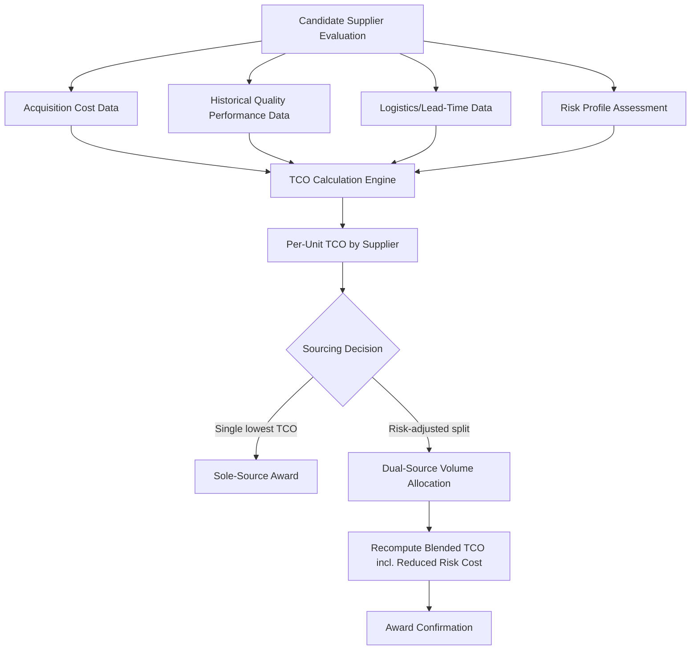

## Total Cost of Ownership Modeling

### Overview

Total Cost of Ownership (TCO) modeling is a procurement analysis methodology that quantifies the complete cost of acquiring, deploying, operating, and disposing of a good or service over its full lifecycle, rather than evaluating suppliers on unit purchase price alone. TCO is the primary analytical mechanism through which SRM programs justify supplier selection, dual-sourcing decisions, and make-vs-buy tradeoffs on a economically defensible basis rather than on price alone, which frequently misrepresents true economic cost when quality, logistics, risk, and lifecycle factors differ materially between suppliers.

### TCO Structural Framework

$$TCO = C_{\text{acquisition}} + C_{\text{operating}} + C_{\text{quality}} + C_{\text{logistics}} + C_{\text{risk}} + C_{\text{disposal}} - V_{\text{residual}}$$

**Cost Component Breakdown**

| Component | Includes |
| --- | --- |
| Acquisition | Unit price, tooling/setup costs, negotiation/contracting admin cost, initial qualification/audit cost |
| Operating | Installation, integration, training, maintenance, consumables, energy consumption over use-life |
| Quality | Cost of defects — scrap, rework, warranty claims, field failure cost, inspection/incoming QC labor |
| Logistics | Freight, customs/duties, inventory carrying cost, safety stock premium, lead-time buffer cost |
| Risk | Supply disruption cost (expected value of stockout/expediting), currency/hedging cost, compliance/audit cost |
| Disposal | End-of-life decommissioning, recycling/disposal fees, environmental remediation |
| Residual Value | Salvage value, resale value, credited back (subtracted) |

**Key Points**

- Unit price is frequently only 30-70% of TCO in categories with significant quality variance, logistics complexity, or lifecycle operating cost (e.g., industrial equipment, IT hardware) — the gap widens further in categories with high failure-cost exposure
- TCO should be modeled per unit of consumption (e.g., $/part, $/service-hour) to remain comparable across suppliers with different volume commitments, not as an aggregate contract-level figure alone
- Not all components apply to all categories: a professional services contract has negligible logistics/disposal cost but potentially significant quality (rework) and risk (vendor lock-in) cost, while a raw material contract is dominated by acquisition and logistics

### Quality Cost Sub-Model — Cost of Poor Quality (COPQ)

Quality cost is frequently the most underestimated TCO component because it is distributed across departments (procurement doesn't see warranty claims; customer service doesn't see incoming inspection cost) rather than appearing on a single invoice.

$$C_{\text{quality}} = (D \times C_{\text{scrap}}) + (R \times C_{\text{rework}}) + (W \times C_{\text{warranty}}) + C_{\text{inspection}}$$

Where $D$ = defect rate, $R$ = rework incidence rate, $W$ = warranty claim rate, each multiplied by their respective per-unit cost, plus fixed incoming inspection labor cost.

**Example**

A component priced at $10.00/unit from two candidate suppliers, 100,000 units/year:

| Supplier | Unit Price | Defect Rate | Scrap Cost/Unit | Warranty Claim Rate | Warranty Cost/Claim |
| --- | --- | --- | --- | --- | --- |
| A | $9.50 | 3.5% | $25 | 1.2% | $180 |
| B | $10.20 | 0.8% | $25 | 0.3% | $180 |

$$C_{\text{quality},A} = (100{,}000 \times 0.035 \times 25) + (100{,}000 \times 0.012 \times 180) = 87{,}500 + 216{,}000 = \$303{,}500$$

$$C_{\text{quality},B} = (100{,}000 \times 0.008 \times 25) + (100{,}000 \times 0.003 \times 180) = 20{,}000 + 54{,}000 = \$74{,}000$$

**Output**

| Supplier | Acquisition Cost (100k units) | Quality Cost | TCO (partial) |
| --- | --- | --- | --- |
| A | $950,000 | $303,500 | $1,253,500 |
| B | $1,020,000 | $74,000 | $1,094,000 |

Despite a 7.4% higher unit price, Supplier B produces a lower total cost once quality cost is incorporated — the canonical TCO justification pattern for paying a price premium for a higher-quality/higher-reliability source.

### Logistics and Inventory Carrying Cost Sub-Model

$$C_{\text{carrying}} = Q_{\text{avg inventory}} \times C_{\text{unit}} \times r_{\text{carrying}}$$

Where $r_{\text{carrying}}$ is the annual carrying cost rate (typically 15-30% of inventory value annually, comprising capital cost, storage, insurance, obsolescence, and shrinkage).

Suppliers with longer lead times or less reliable delivery performance require higher safety stock, which increases carrying cost even when unit price and quality are identical — a frequently omitted TCO component when logistics and procurement functions report separately.

$$SS = z \times \sigma_{d} \times \sqrt{LT}$$

Where $SS$ = safety stock, $z$ = service-level factor (e.g., 1.65 for ~95% service level), $\sigma_d$ = standard deviation of daily demand, $LT$ = lead time in days.

**Key Points**

- A supplier with longer or more variable lead time increases required safety stock by the square-root-of-lead-time relationship shown above, meaning logistics TCO impact scales non-linearly with lead-time degradation, not proportionally
- Dual sourcing directly interacts with this formula: splitting demand across two suppliers with independent (uncorrelated) lead-time variability can reduce aggregate safety stock requirement versus single-sourcing from the higher-variability supplier, a benefit that should be quantified in the TCO comparison rather than treated only as a qualitative risk-mitigation argument

### Risk Cost Sub-Model — Expected Disruption Cost

$$C_{\text{risk}} = P(\text{disruption}) \times C_{\text{disruption impact}}$$

Where disruption impact cost includes expedited freight premium, production downtime cost, and expedite/spot-market price premium during the disruption window.

For single-sourced categories, $P(\text{disruption})$ reflects the sole supplier's own risk profile (financial stability, geographic/geopolitical exposure, capacity utilization). For dual-sourced categories, this term is materially reduced (not eliminated) since a second, ideally uncorrelated, source can absorb volume during a primary-source disruption.

### Dual Sourcing and TCO — Volume Allocation Optimization

When splitting volume between two qualified sources, the optimization objective is minimizing blended TCO subject to capacity and risk-diversification constraints, not simply awarding 100% to the lowest single-supplier TCO:

$$\min_{x} \left[ x \cdot TCO_A + (1-x) \cdot TCO_B \right] + C_{\text{risk reduction benefit}}(x)$$

Where $x$ is the volume share allocated to Supplier A, subject to $0 \le x \le 1$ and any minimum-viable-order or capacity constraints per supplier.

**Key Points**

- Even when Supplier A has a strictly lower unit TCO than Supplier B, an $x < 1$ allocation (i.e., not fully sole-sourcing to A) can be TCO-optimal once the risk-reduction benefit of maintaining a qualified second source is quantified and added into the objective function — this is the formal economic justification for dual sourcing beyond qualitative "don't put all eggs in one basket" reasoning
- The risk-reduction benefit term is genuinely difficult to estimate precisely since it depends on disruption probability and impact magnitude, both of which are inherently uncertain; [Inference] many organizations therefore apply a minimum-allocation floor (e.g., "no single source above 70-80% of category volume") as a practical proxy for this term rather than computing $C_{\text{risk reduction benefit}}(x)$ explicitly, since deriving a defensible probability distribution for supply disruption is often more effort than the decision warrants at typical category stakes

### TCO Model Data Requirements and System Integration

| Data Category | Source System |
| --- | --- |
| Unit pricing, volume commitments | Contract/pricing master data |
| Defect rate, rework/scrap incidence | Quality management system (QMS) |
| Warranty claims | Field service / CRM system |
| Lead time, on-time delivery performance | ERP/procurement transaction history |
| Carrying cost rate, inventory levels | Inventory management / WMS |
| Supplier financial/risk profile | Supplier risk monitoring platform |

**Key Points**

- TCO modeling accuracy depends heavily on cross-system data integration; organizations without integrated quality/logistics/procurement data typically fall back to simplified TCO proxies (acquisition + a flat logistics/quality adder percentage) rather than fully itemized bottom-up TCO, which is a reasonable pragmatic starting point but understates the differentiation between suppliers on the dimensions that matter most
- A TCO model should be versioned and re-run periodically (not calculated once at initial sourcing), since defect rates, lead times, and risk profiles evolve over the supplier relationship — stale TCO assumptions used to justify a multi-year sole-source decision are a common audit finding in mature procurement governance reviews

**Related Topics**

- Should-Cost Modeling and Cost-Breakdown Analysis
- Supplier Scorecards — Integrating Quality, Delivery, and Cost Performance
- Safety Stock and Inventory Optimization Under Supply Variability
- Dual-Sourcing Volume Allocation and Risk-Adjusted Award Strategies
- Value Engineering and Design-to-Cost Methodologies
- Category-Level Should-Cost Benchmarking