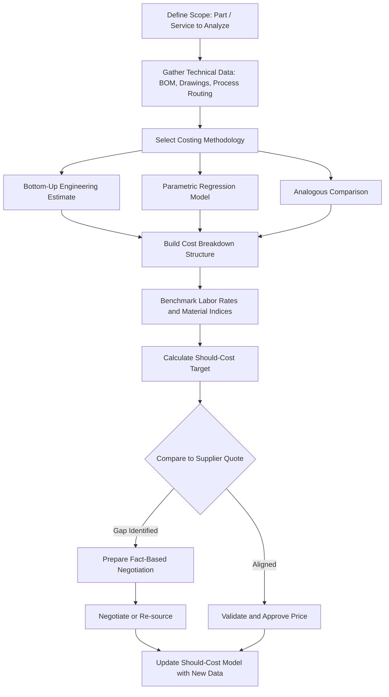

## Should-Cost Modeling and Cost Breakdown Analysis

### Definition and Purpose

Should-cost modeling is a procurement analysis technique that estimates what a product or service *should* cost to produce, based on a decomposition of its underlying cost drivers — raw materials, labor, overhead, tooling, logistics, and profit margin — rather than relying solely on supplier-quoted prices. It is also referred to as "clean sheet costing," "cost breakdown analysis (CBA)," or "parametric cost estimation" depending on methodology.

The purpose is to give a buying organization an independent, fact-based reference point for price negotiations, rather than negotiating purely against historical prices or competitive bids. This is especially critical in **dual sourcing** strategies, where a buyer must evaluate whether two suppliers' price differentials are explained by genuine cost structure differences (e.g., labor market, automation level) or by margin-taking.

### Why It Matters in Dual Sourcing Contexts

- **Negotiation leverage**: Buyers who understand the cost structure can identify which line items are inflated, rather than accepting a quote at face value.
- **Supplier comparison normalization**: When comparing Supplier A and Supplier B, should-cost models let you separate "legitimate cost differences" (e.g., different labor rates, different plant utilization) from "margin differences," enabling apples-to-apples evaluation.
- **Second-source qualification**: When onboarding a second supplier, should-cost models set a target price band that the new source must be evaluated against, avoiding both overpaying and setting unrealistic expectations that cause quality shortcuts.
- **Risk mitigation**: Prevents single-source price gouging by giving the buyer a credible walk-away/negotiation anchor even before a second source is fully qualified.

### Core Components of a Cost Breakdown

A standard manufacturing cost breakdown structure typically includes:

1. **Direct Materials** — raw material cost, including scrap/yield loss factored in
2. **Direct Labor** — labor hours × loaded labor rate (wages + benefits + payroll taxes)
3. **Manufacturing Overhead** — machine depreciation, factory utilities, indirect labor, maintenance
4. **Tooling and Setup Amortization** — one-time tooling cost spread across expected volume
5. **Packaging and Logistics** — inbound freight for materials, outbound freight to buyer
6. **SG&A (Selling, General & Administrative)** — supplier's corporate overhead allocation
7. **Profit Margin** — supplier's target margin, often 5–15% depending on industry and risk profile

$$C_{total} = C_{material} + C_{labor} + C_{overhead} + C_{tooling} + C_{logistics} + C_{SGA} + C_{margin}$$

### Should-Cost Modeling Methodologies

#### 1. Bottom-Up (Zero-Based) Costing

Builds the cost estimate from first principles: material specifications, process routing, cycle times, and machine rates. This is the most rigorous method and requires engineering-level detail (bill of materials, process flow, machine capacity data).

**Example** (simplified bottom-up calculation for an injection-molded plastic bracket):

| Cost Element | Calculation | Value |
| --- | --- | --- |
| Material | 0.085 kg × $2.10/kg | $0.1785 |
| Machine time | 18 sec cycle × $45/hr machine rate | $0.225 |
| Labor (1 operator per 4 machines) | 18 sec × ($22/hr ÷ 4) | $0.0275 |
| Tooling amortization | $45,000 tool ÷ 500,000 units | $0.09 |
| Overhead (110% of labor+machine) | 1.10 × ($0.225 + $0.0275) | $0.2778 |
| **Subtotal (COGS)** |  | **$0.7988** |
| SG&A (8%) | 0.08 × $0.7988 | $0.0639 |
| Margin (10%) | 0.10 × ($0.7988 + $0.0639) | $0.0863 |
| **Should-Cost Target** |  | **$0.9490** |

If the supplier's quoted price is $1.35/unit, the $0.40 gap becomes the focus of negotiation discussion — the buyer asks the supplier to justify it (higher scrap rate, different material grade, lower automation) rather than accepting it outright.

#### 2. Parametric (Top-Down) Costing

Uses statistical relationships between known cost drivers (e.g., weight, complexity, volume) and historical cost data across similar parts to estimate cost via regression or cost-per-unit-weight benchmarks. Faster but less precise; useful for early-stage sourcing decisions or high SKU-count categories where bottom-up analysis for every item is impractical.

$$\hat{C} = \beta_0 + \beta_1 \cdot W + \beta_2 \cdot N_{features} + \varepsilon$$

Where $W$ is part weight, $N_{features}$ is a complexity index (number of machined features, tolerances, etc.), and $\varepsilon$ is unexplained variance. [Inference] The specific regression coefficients are always organization- and category-specific and must be recalibrated against internal historical spend data; no universal coefficient set exists.

#### 3. Analogous/Comparative Costing

Uses cost data from a similar, already-produced item as a baseline, adjusted for scale, material, or geography differences. Fast but least precise — primarily used for rough order-of-magnitude (ROM) estimates during early supplier screening.

#### 4. Activity-Based Costing (ABC)

Allocates overhead based on actual activities consumed (machine setups, inspections, material handling) rather than a blanket overhead percentage. More accurate for complex, low-volume, high-mix production environments.

### Process Flow for Should-Cost Analysis

### Data Sources for Building Should-Cost Models

- **Commodity price indices**: LME (London Metal Exchange) for metals, resin price indices for plastics, published labor rate surveys (e.g., ILO, national statistics agencies) by country/region
- **Should-cost software platforms**: aPriori, Costimator, Teamcenter Product Cost Management, Proplanner — these use CAD-integrated feature recognition to auto-generate process routings and cycle time estimates
- **Supplier-provided open-book cost data** (where contractually granted)
- **Internal historical spend and RFQ archives**
- **Freight and logistics rate benchmarks** (e.g., Freightos Baltic Index, DAT for trucking)

[Unverified] Specific software feature sets and pricing change frequently; buyers should confirm current capabilities directly with vendors before procurement decisions.

### Cost Breakdown Analysis (CBA) in Supplier Negotiations

CBA is often requested directly from suppliers as an "open-book" cost breakdown submission, structured as a form the supplier fills in alongside their quote. Key negotiation practices:

- **Line-item challenge**: Query each cost bucket individually rather than negotiating the total price as one number — this prevents suppliers from "hiding" margin in opaque overhead allocations.
- **Should-cost vs. quoted-cost gap analysis**: Present the modeled cost breakdown to the supplier as the basis for discussion, which shifts the conversation from "give me a discount" to "explain this specific variance."
- **Currency and index-linked clauses**: For long-term dual-sourcing contracts, tie material cost components to published indices so should-cost models auto-adjust rather than requiring re-negotiation from scratch each cycle.

### Should-Cost Modeling Applied to Dual Sourcing Decisions

| Evaluation Dimension | Supplier A (Incumbent) | Supplier B (Second Source) | Should-Cost Benchmark |
| --- | --- | --- | --- |
| Quoted Unit Price | $1.20 | $1.05 | — |
| Modeled Material Cost | $0.45 | $0.40 (lower-cost region) | $0.42 |
| Modeled Labor Cost | $0.30 | $0.15 (lower labor market) | $0.20 |
| Modeled Overhead | $0.20 | $0.25 (less automated) | $0.22 |
| Modeled Margin | $0.25 (21%) | $0.25 (24%) | $0.15 (target 12–15%) |
| **Assessment** | Margin above target; negotiate | Margin above target despite lower base cost; negotiate | — |

This structure reveals that Supplier B's lower price is not purely a cost advantage — it is also taking a higher margin percentage — giving the buyer negotiation room on both sources simultaneously rather than assuming the lower quote is already "fair."

### Common Pitfalls

- **Outdated commodity indices**: Using stale material price benchmarks produces should-cost targets that are unrealistic and damage negotiation credibility.
- **Ignoring regional cost structures**: Applying a single labor rate assumption across suppliers in different countries invalidates comparisons; should-cost models must be geography-specific.
- **Over-precision in early-stage sourcing**: Applying bottom-up costing to every SKU in a large, low-value catalog is often not cost-effective; parametric/analogous methods are more appropriate at that stage.
- **Excluding risk premiums**: Dual-source suppliers, particularly newly onboarded ones, may reasonably carry a higher margin or overhead allocation during ramp-up; should-cost models that fail to account for this can create adversarial, unproductive negotiations.
- **Static models**: [Inference] Should-cost models that are not periodically refreshed against current material indices and labor rates tend to lose negotiation credibility over time, since suppliers can point to outdated assumptions to dismiss the analysis.

### Key Metrics and KPIs

- **Should-Cost Accuracy**: $\frac{|C_{actual} - C_{modeled}|}{C_{actual}} \times 100\%$ — tracked over time to validate model calibration
- **Negotiation Savings Realized**: difference between initial quote and final negotiated price, attributed to should-cost-informed negotiation
- **Cost Transparency Index**: percentage of category spend covered by an active should-cost model
- **Model Refresh Cadence**: frequency (e.g., quarterly) at which commodity indices and labor benchmarks are updated

### Example: Should-Cost Summary Table Template

| Category | Should-Cost | Supplier Quote | Variance | Variance % | Action |
| --- | --- | --- | --- | --- | --- |
| Materials | $X | $Y | $(Y-X) | % | Query/Accept |
| Labor | $X | $Y | $(Y-X) | % | Query/Accept |
| Overhead | $X | $Y | $(Y-X) | % | Query/Accept |
| Tooling | $X | $Y | $(Y-X) | % | Query/Accept |
| Logistics | $X | $Y | $(Y-X) | % | Query/Accept |
| Margin | $X | $Y | $(Y-X) | % | Query/Accept |
| **Total** |  |  |  |  |  |

### Related Topics

- Total Cost of Ownership (TCO) Analysis
- Value Engineering and Value Analysis (VE/VA)
- Open-Book Costing Agreements with Suppliers
- Commodity Price Index Tracking and Hedging Strategies
- Supplier Cost Model Software (aPriori, Costimator, Teamcenter PCM)
- Activity-Based Costing (ABC) for Procurement
- Negotiation Strategy Frameworks in Dual Sourcing
- Supplier Financial Health Assessment and Margin Analysis
- Regional Labor Rate Benchmarking for Global Sourcing