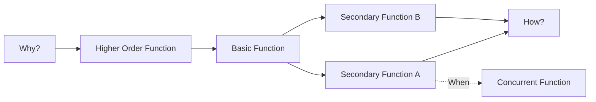
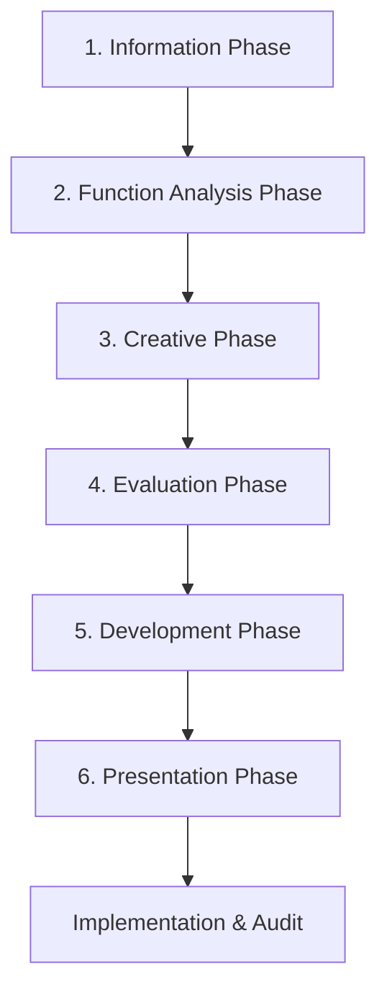

## Value Engineering and Value Analysis Techniques

### Definitions and Conceptual Foundation

**Value Engineering (VE)** is a systematic, function-oriented, team-based methodology applied during the design or pre-production phase of a product, process, or service to improve value — defined as the ratio of function to cost. VE is applied *before* a design is finalized or a part exists in production.

**Value Analysis (VA)** is functionally identical in method but applied *retroactively* — to an existing product, component, or process already in production or in use. The distinction is timing, not technique: VE is proactive (design-stage), VA is reactive (post-production/in-service).

$$Value = \frac{Function}{Cost}$$

Value can be increased four ways:

- Reduce cost while holding function constant
- Increase function while holding cost constant
- Increase function while decreasing cost
- Accept a cost increase justified by a disproportionately larger function gain

**Key Points**

- VE/VA is not the same as cost-cutting. Cost-cutting reduces cost, often at the expense of function; VE/VA seeks to preserve or improve required function.
- The discipline originated at General Electric during WWII (Lawrence Miles), when material shortages forced substitution of components, and it was observed that substitutes sometimes performed as well or better at lower cost — the origin of function-based thinking.
- VE is standardized internationally via SAVE International's Value Methodology and formalized in standards such as **SAE ARP4692** (aerospace) and **EN 12973** (European Value Management standard).

---

### Function Analysis: The Core of VE/VA

The defining feature that separates VE/VA from ordinary cost reduction is **function analysis** — decomposing a product or process into its basic functions, expressed as a **verb + noun** pair (e.g., "transmit torque," "retain fluid," "indicate pressure").

Functions are classified as:

- **Basic function**: the primary reason the item exists; removing it eliminates the item's purpose (e.g., a light bulb's basic function is "produce light").
- **Secondary function**: supports the basic function but is not itself the reason for existence (e.g., "resist heat," "conduct current").
- **Unwanted/negative function**: a function that adds cost without adding customer value (e.g., "generate noise," "produce vibration").

**FAST Diagramming (Function Analysis System Technique)**

FAST diagrams arrange functions horizontally, answering "How?" moving right and "Why?" moving left, with "When?" branches for functions that occur simultaneously.

**Cost-Function Matrix**

Once functions are identified, cost is allocated to each function (often via component-to-function mapping) to compute a **Value Index**:

$$Value\ Index = \frac{Worth\ of\ Function}{Cost\ of\ Function}$$

Where "worth" is typically estimated via the lowest-cost method known to achieve that function reliably. A Value Index significantly below 1.0 flags a high-priority target for VE study — cost is disproportionate to the function's actual worth.

---

### The Value Methodology Job Plan

SAVE International's formal VE Job Plan has six sequential phases. This structure is the backbone of virtually all VE/VA workshops and is frequently tested/referenced in procurement and engineering certifications (CVS — Certified Value Specialist).

**1. Information Phase**

- Gather cost data, drawings, specifications, customer requirements, sales/volume data, and complaint/warranty history.
- Identify high-cost, low-volume, or high-complaint items as candidates (Pareto analysis: typically 20% of components drive 80% of cost).

**2. Function Analysis Phase**

- Decompose into verb-noun functions; build FAST diagram; allocate cost per function; compute Value Index; rank functions by improvement potential.

**3. Creative (Speculation) Phase**

- Brainstorming to generate alternative ways to perform each targeted function.
- Judgment is deliberately suspended during this phase (classic brainstorming rule: quantity over quality, no criticism).
- Techniques used: brainstorming, SCAMPER (Substitute, Combine, Adapt, Modify, Put to other use, Eliminate, Reverse), morphological analysis, TRIZ (Theory of Inventive Problem Solving) contradiction matrices, and benchmarking against competitor teardown data.

**4. Evaluation Phase**

- Ideas are screened, ranked, and filtered using weighted criteria matrices (cost impact, feasibility, risk, lead time, tooling impact).
- Common tool: **Pugh Matrix** (concept selection matrix) comparing each idea against a baseline/datum on weighted criteria.

**5. Development Phase**

- Surviving ideas are engineered into concrete proposals with cost estimates, technical validation (FEA, prototype testing, supplier quotes), risk assessment (often via FMEA — Failure Mode and Effects Analysis), and implementation plans.

**6. Presentation Phase**

- Formal proposal to decision-makers with cost-benefit summary, implementation timeline, and risk mitigation.
- Followed by **Implementation** and a formal **Audit** phase to verify realized savings against projected savings — this closes the loop and is frequently omitted in immature VE programs, undermining credibility of future studies.

---

### Value Analysis in a Dual Sourcing / SRM Context

Within Supplier Relationship Management and dual sourcing programs, VA/VE serves several specific structural purposes:

**1. Should-Cost Modeling Integration**

VA is frequently paired with **should-cost analysis** to validate supplier quotes. Function-cost breakdowns from a VA study feed directly into should-cost models, giving procurement objective, function-justified cost targets rather than negotiating purely off historical pricing or market benchmarks.

**2. Specification Rationalization for Dual Sourcing**

When qualifying a second source, over-specified or legacy-tolerance requirements (often carried forward from an original single-source design) are prime VA targets. Removing unwanted functions or relaxing non-critical tolerances can:

- Widen the qualified supplier pool
- Reduce switching costs between primary and secondary suppliers
- Standardize components across both suppliers, simplifying dual-source part interchangeability

**3. Supplier-Led VE Proposals (VEP / VECP)**

Many SRM programs formalize supplier-submitted value engineering proposals — in U.S. federal contracting this is codified as the **Value Engineering Change Proposal (VECP)** under FAR Subpart 48. Structurally:

- Supplier identifies a function-cost improvement opportunity
- Submits formal VECP with cost/savings analysis
- Buyer and supplier typically share the realized savings under a pre-negotiated share ratio (common split ranges 50/50 to 50/25, buyer/supplier, depending on contract type)
- This incentivizes suppliers — especially in a dual-sourced relationship — to compete on value contribution, not just unit price

**4. Cross-Supplier VA Workshops**

In mature dual-sourcing arrangements, some buyers run joint VA workshops with both qualified suppliers (with appropriate confidentiality/competitive firewalls) to identify shared design-for-manufacturability opportunities, since dual-source parts must remain functionally interchangeable across differing process capabilities.

**Key Points**

- In dual sourcing, VA must preserve **form, fit, and function (FFF)** equivalence across both suppliers unless a formal engineering change (ECR/ECN) is issued to both simultaneously.
- Unilateral VA changes accepted from only one supplier can silently break interchangeability — a critical dual-source risk.

---

### Techniques and Tools Summary

| Technique | Phase Used | Purpose |
| --- | --- | --- |
| FAST Diagramming | Function Analysis | Map function hierarchy and dependencies |
| Cost-Function Matrix | Function Analysis | Allocate cost to function, compute Value Index |
| Pareto (ABC) Analysis | Information | Prioritize high-impact components/processes |
| Brainstorming / SCAMPER | Creative | Generate alternative solutions |
| TRIZ Contradiction Matrix | Creative | Resolve technical trade-offs systematically |
| Pugh Matrix | Evaluation | Weighted concept comparison vs. baseline |
| FMEA | Development | Risk-assess proposed changes |
| Should-Cost Modeling | Development/SRM | Validate proposal savings against cost drivers |
| Life Cycle Costing (LCC) | Development | Ensure savings aren't offset by downstream cost increases |

---

### Example: Simplified VA Walkthrough

**Item**: A stamped steel bracket used in a municipal streetlight assembly, sourced from two qualified suppliers under a dual-source contract.

1. **Function**: "Support luminaire" (basic), "resist corrosion" (secondary), "allow adjustment" (secondary).
2. **Cost-function allocation**: Of $4.20 total piece cost, $1.10 is attributable to a decorative powder-coat finish exceeding the actual corrosion-resistance requirement for the installation environment.
3. **Creative phase idea**: Replace decorative-grade powder coat with a standard-grade corrosion coating meeting the same IP-rating requirement.
4. **Evaluation**: Pugh matrix confirms equivalent function, no aesthetic requirement in spec, both current suppliers can apply standard coating without new tooling.
5. **Result**: Estimated $0.65 piece cost reduction, verified via updated should-cost model; VECP submitted by primary supplier; savings split 50/50 per contract terms; specification updated and reissued to both qualified suppliers to preserve dual-source interchangeability.

[Unverified] Numeric figures in this example are illustrative only and not derived from a specific real-world case.

---

### Common Pitfalls

- **Treating VE as pure cost-cutting**: Skipping function analysis and simply demanding price reductions from suppliers is not VE/VA and frequently degrades product function or reliability.
- **Skipping the audit phase**: Without verifying realized vs. projected savings, VE programs lose credibility and organizational buy-in erodes over time.
- **Single-supplier VA changes in dual-source environments**: Approving a change from only one supplier without updating the shared specification breaks FFF equivalence.
- **Ignoring life-cycle cost**: A component-level saving that increases downstream maintenance, warranty, or failure cost produces a net negative value outcome; Life Cycle Costing (LCC) analysis should accompany major VA proposals.

**Related Topics**

- Should-Cost Modeling and Cost Breakdown Analysis
- FMEA (Failure Mode and Effects Analysis) in Supplier Risk Management
- VECP (Value Engineering Change Proposal) Contracting Mechanics under FAR 48
- Design for Manufacturability and Assembly (DFMA)
- Total Cost of Ownership (TCO) vs. Life Cycle Costing (LCC)
- Supplier-Led Continuous Improvement (Kaizen) Programs in Dual Sourcing
- Engineering Change Management (ECR/ECN) Across Multi-Source Supply Chains