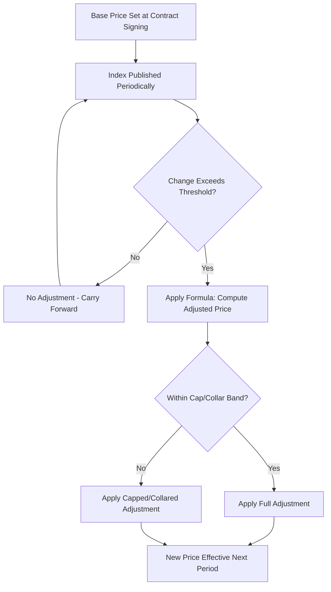

## Price Indexation and Currency Hedging

### Conceptual Overview

Price indexation and currency hedging are two distinct but often co-deployed risk-management mechanisms used in long-term supply contracts to protect buyer and supplier from value erosion caused by external economic forces:

- **Price Indexation**: contractually links a contract's unit price to a published external index (commodity index, labor index, FX index, inflation index) so that price adjusts formulaically over time, rather than through ad-hoc renegotiation.
- **Currency Hedging**: financial or contractual techniques used to protect a party from adverse movement in exchange rates when a contract's cost base and invoicing currency differ.

Both mechanisms exist because fixed long-term pricing exposes one or both parties to unmanaged risk: suppliers bear commodity/input-cost risk under a fixed price, while buyers bear the risk of overpaying if costs fall. Indexation and hedging convert unmanaged risk into a structured, formula-driven, and often shared allocation of risk.

---

### Price Indexation Mechanics

**Core Formula Structure**

Most indexation clauses use a weighted escalation formula, most commonly derived from the classic industrial **price adjustment formula** used in engineering/construction and long-term supply contracts:

$$P_{adj} = P_0 \left( a + b\frac{M_1}{M_0} + c\frac{L_1}{L_0} + d\frac{E_1}{E_0} \right)$$

Where:

- $P_0$ = base contract price
- $a$ = fixed (non-escalating) portion of cost (e.g., margin, overhead)
- $b, c, d$ = weighted proportions of cost attributable to materials (M), labor (L), energy (E) respectively, such that $a + b + c + d = 1$
- $M_0, L_0, E_0$ = index values at contract base date
- $M_1, L_1, E_1$ = index values at time of adjustment

**Key Points**

- The **fixed portion** $a$ exists to ensure the supplier's margin and non-variable overhead are not artificially escalated — otherwise indexation would inflate profit, not just recover cost.
- Weights ($b, c, d$) should reflect the supplier's actual cost structure ideally verified via open-book costing or should-cost analysis, not arbitrary allocation.

**Common Index Sources**

| Index Type | Example Sources | Typical Use |
| --- | --- | --- |
| Commodity indices | LME (London Metal Exchange), Platts, CRU | Metals, plastics, energy inputs |
| Labor indices | Bureau of Labor Statistics (BLS) ECI, national wage indices | Labor-intensive manufacturing/services |
| General inflation | CPI, PPI (Producer Price Index) | Broad-based cost escalation |
| Freight/logistics | Baltic Dry Index, Drewry WCI | Transportation-heavy supply chains |
| FX indices | Central bank reference rates, WM/Reuters fix | Cross-currency contracts |

**Adjustment Frequency and Triggers**

- **Periodic (scheduled)**: quarterly, semi-annual, or annual recalculation regardless of magnitude of change.
- **Threshold-triggered**: adjustment only occurs once the index moves beyond a defined band (e.g., ±5%), reducing administrative overhead for minor fluctuations while protecting against material swings.
- **Cap and collar structures**: many contracts bound the adjustment with a floor and ceiling to limit maximum price movement in either direction per period, converting open-ended risk into a bounded range.

---

### Currency Hedging Mechanics

Currency exposure in SRM/procurement contexts typically arises in three forms:

1. **Transaction exposure**: risk on a specific contracted payment in a foreign currency between agreement date and settlement date.
2. **Translation exposure**: accounting-level exposure when consolidating foreign-currency-denominated supplier contracts into a parent company's reporting currency.
3. **Economic exposure**: longer-term competitive risk when currency shifts alter the relative cost-competitiveness of suppliers in different currency zones.

**Contractual (Non-Financial) Hedging Techniques**

- **Currency clauses in contract**: price stated in a "hard" currency (typically USD or EUR) regardless of supplier's home currency, shifting FX risk to the supplier.
- **Currency splitting/basket clauses**: price is split proportionally across two or more currencies matching the supplier's actual cost base (e.g., 60% local currency for labor, 40% USD for imported raw material), reducing mismatch between invoicing currency and underlying cost currency.
- **FX adjustment/re-opener clauses**: similar in structure to price indexation — price is re-based if an FX reference rate moves beyond a defined threshold between agreed reset dates.

**Financial Hedging Instruments**

| Instrument | Mechanism | Typical Use Case |
| --- | --- | --- |
| Forward contract | Locks an exchange rate for a specific future date | Known, fixed-date payment obligations |
| FX Option | Right (not obligation) to exchange at a set rate | Uncertain timing/volume exposure, wants to preserve upside |
| Currency swap | Exchange of principal/interest in different currencies over time | Long-term, recurring multi-year contracts |
| Money market hedge | Borrowing/lending in different currencies to offset exposure | Alternative to forwards when derivatives markets are illiquid |
| Natural hedge | Matching currency of revenue and cost (e.g., sourcing locally to match sales currency) | Structural, non-derivative risk reduction |

**Key Points**

- Forwards and options are executed by the **treasury function**, not procurement directly — but procurement/SRM must supply accurate forecast volumes and payment timing for treasury to size hedges correctly.
- **Natural hedging** (matching currency of costs to currency of revenue, e.g., via dual sourcing in different currency zones) is often the lowest-cost long-term hedge, and is a direct rationale for maintaining suppliers across multiple currency regions in a dual-sourcing strategy.

---

### Intersection with Dual Sourcing Strategy

Dual sourcing interacts with indexation/hedging in several structurally important ways:

**1. Currency Diversification as Structural Hedge**

Deliberately qualifying suppliers in different currency zones (e.g., one domestic, one offshore) creates a natural portfolio hedge: adverse currency movement affecting one supplier's competitiveness is partially offset by the other. This is a primary strategic rationale for dual sourcing beyond simple supply continuity.

**2. Indexation Formula Consistency Across Sources**

When two suppliers operate under different cost structures (different labor markets, different input mixes), applying a uniform indexation formula to both can distort relative competitiveness over time. Best practice is calibrating index weights ($b, c, d$ in the formula above) per supplier based on their actual cost base, verified periodically via open-book review — otherwise one supplier may become structurally favored or disadvantaged purely due to formula mismatch, not real cost performance.

**3. Dynamic Volume Allocation Based on Indexed Price**

Mature dual-source programs sometimes tie volume allocation dynamically to the post-indexation landed price of each supplier (highest volume to lowest current landed cost), creating a built-in competitive tension that rewards suppliers whose actual cost base is better protected by their hedging/indexation structure.

**4. Hedge Cost as a Negotiated Line Item**

In supplier negotiations, the cost of hedging (option premiums, forward point costs) is sometimes explicitly negotiated as a pass-through line item rather than buried in the base price — improving transparency and comparability across dual-sourced suppliers with different natural currency exposures.

---

### Worked Example

**Scenario**: A buyer sources a molded plastic component from two suppliers — Supplier A (domestic, same currency as buyer) and Supplier B (offshore, invoices in USD, buyer's functional currency is PHP).

- Base price with Supplier A: ₱185.00/unit, indexed quarterly to a domestic resin price index (70% weight) and local wage index (20% weight), 10% fixed margin.
- Base price with Supplier B: $3.40/unit, contract includes an FX re-opener clause triggered if USD/PHP moves more than 5% from the ₱56.00 base rate between quarterly resets.

If USD/PHP moves from ₱56.00 to ₱59.50 (a 6.25% move, exceeding the 5% threshold):

$$P_{adj} = \$3.40 \times \frac{59.50}{56.00} = \$3.61 \text{ equivalent landed cost impact}$$

The re-opener clause permits Supplier B to request a price adjustment, or — if a currency basket clause exists — only the USD-denominated raw material portion (say 40% of cost) escalates, dampening the full pass-through:

$$P_{adj} = \$3.40 \times \left(0.6 + 0.4 \times \frac{59.50}{56.00}\right) \approx \$3.49$$

[Unverified] Figures are illustrative for demonstrating formula mechanics, not sourced from a real contract.

This demonstrates why **currency basket clauses** are preferred over full pass-through re-openers when a supplier's true cost exposure is only partially FX-denominated — full pass-through overstates the supplier's actual risk and creates unnecessary volatility for the buyer.

---

### Common Pitfalls

- **Applying full price indexation without a fixed-margin carve-out**: inflates supplier margin over time rather than just recovering true cost increases.
- **Using a mismatched index**: e.g., indexing a component's price to a broad CPI figure when the actual cost driver is a specific commodity — creates systematic over- or under-recovery unrelated to true cost movement.
- **Ignoring hedge cost transparency**: suppliers may embed hedging costs invisibly into base price, making cross-supplier price comparison in dual sourcing misleading unless hedge costs are itemized.
- **Static index weights over long contract terms**: a supplier's cost structure (labor vs. material vs. energy mix) can shift due to automation or process changes; index weights should be periodically re-validated, not fixed indefinitely at contract signing.
- **No cap/collar on indexation**: exposes the buyer (or supplier) to unbounded price swings during commodity or currency shocks, undermining budget predictability — a key reason cap/collar structures are standard in mature contracts.

**Related Topics**

- Should-Cost Modeling and Cost Breakdown Analysis
- Open-Book Costing and Cost Transparency Agreements
- Total Cost of Ownership (TCO) in Multi-Currency Sourcing
- Commodity Risk Management and Forward Buying Strategies
- Contractual Risk Allocation Structures in Long-Term Supply Agreements
- Dual Sourcing Volume Allocation Models
- Treasury-Procurement Collaboration in Global Supply Chains