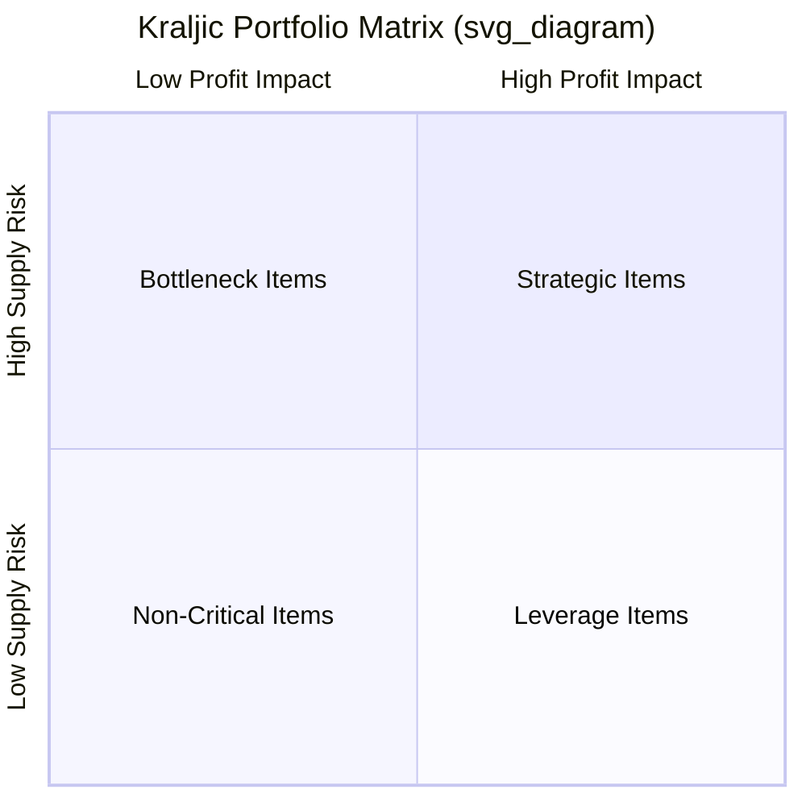
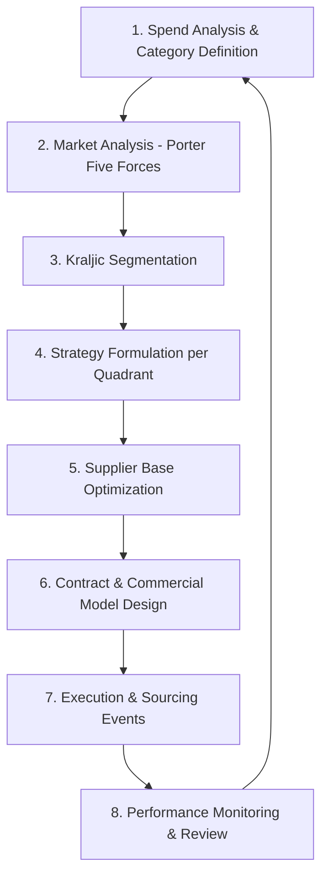

## Category-Level Cost Management Strategies

### Conceptual Overview

Category-level cost management is the practice of managing procurement spend not transaction-by-transaction or supplier-by-supplier, but at the level of a **spend category** — a grouping of goods or services with similar characteristics, markets, and sourcing dynamics (e.g., "packaging materials," "logistics services," "IT hardware," "professional services"). The premise is that cost and risk drivers differ fundamentally between categories, so a single procurement strategy applied uniformly across all spend produces suboptimal outcomes.

This discipline sits above individual sourcing events and individual supplier relationships — it defines *how* an organization should approach an entire category over a multi-year horizon, informing which suppliers are engaged, how many, on what commercial terms, and with what negotiation posture.

---

### Category Segmentation: The Kraljic Matrix

The foundational tool for category-level strategy is the **Kraljic Portfolio Matrix** (Peter Kraljic, *Purchasing Must Become Supply Management*, Harvard Business Review, 1983), which segments categories along two axes:

- **Profit impact / business impact** (x-axis): how significantly the category affects cost, revenue, or product quality
- **Supply risk** (y-axis): scarcity of supply, number of qualified suppliers, switching costs, market volatility

Note: rendered here as unrendered text per formatting rules; a standard Kraljic matrix places **Leverage** (high impact, low risk), **Strategic** (high impact, high risk), **Non-critical/Routine** (low impact, low risk), and **Bottleneck** (low impact, high risk) in the four quadrants.

**Four Quadrant Strategies**

| Quadrant | Characteristics | Cost Management Strategy |
| --- | --- | --- |
| **Strategic** | High spend, high risk, few qualified suppliers, critical to core product | Deep partnership, joint cost engineering, long-term contracts, risk-sharing, should-cost modeling, dual/multi-sourcing where feasible |
| **Leverage** | High spend, many qualified suppliers, low switching risk | Competitive bidding, reverse auctions, price benchmarking, volume consolidation, aggressive negotiation |
| **Bottleneck** | Low spend, high risk (sole source, long lead time, IP-protected) | Secure supply continuity, safety stock, qualify alternates, avoid over-negotiating on price at expense of availability |
| **Non-critical/Routine** | Low spend, low risk, many suppliers, commoditized | Process efficiency, P-cards/catalog buying, reduce transaction cost (not unit price), e-procurement automation |

**Key Points**

- Cost strategy is inverted between quadrants: in **Leverage**, the goal is aggressive price reduction via competition; in **Strategic**, aggressive price pressure can destroy supplier relationships needed for innovation and risk-sharing, so cost management shifts toward **value** (should-cost, TCO, joint engineering) rather than pure price.
- Category placement is not static — a category can migrate quadrants over time (e.g., a bottleneck item becomes leverage once a second qualified source is developed), and dual sourcing is itself often a deliberate strategy to migrate a category from Strategic/Bottleneck toward Leverage by reducing supply risk.

---

### Category Strategy Development Process

**1. Spend Analysis and Category Definition**

- Aggregate transactional spend data (typically from ERP/AP systems) and classify using a standard taxonomy (e.g., UNSPSC — United Nations Standard Products and Services Code).
- Identify **spend fragmentation**: the same category purchased through multiple suppliers, business units, or contracts without coordination — often the single largest source of avoidable cost in decentralized organizations.

**2. Market Analysis**

- Apply structural market analysis (commonly Porter's Five Forces: supplier power, buyer power, threat of substitutes, threat of new entrants, competitive rivalry) to understand the category's underlying cost and power dynamics.
- Assess commodity/input cost drivers, market concentration (e.g., HHI — Herfindahl-Hirschman Index for supplier market concentration), and price volatility history.

**3–4. Segmentation and Strategy Formulation**

- Apply Kraljic (or an internal variant) to each sub-category; assign a differentiated strategy per quadrant as above.

**5. Supplier Base Optimization**

- Determine optimal number of suppliers per category — the **single vs. dual vs. multi-sourcing decision** is made here, balancing:
  - Cost benefits of consolidation (volume leverage, lower administrative overhead)
  - Risk benefits of diversification (supply continuity, negotiating leverage, currency/geographic hedging)
- Formal **supplier rationalization** exercises (reducing an unmanaged long tail of suppliers to a strategically sized panel) are typically executed within this step.

**6. Contract and Commercial Model Design**

- Select pricing mechanism appropriate to category risk profile: fixed price, indexed price (see price indexation), cost-plus, gain-sharing, or hybrid.
- Define contract duration, volume commitments, and exit/renewal terms aligned to category strategy (e.g., short terms for Leverage/commoditized categories to preserve competitive tension; longer terms for Strategic categories to justify joint investment).

**7–8. Execution and Monitoring**

- Execute sourcing events (RFx, auctions, negotiations) per the defined strategy.
- Monitor via category-level KPIs (below) and re-run the cycle periodically (typically annually for high-spend categories).

---

### Core Cost Management Levers by Category Type

**For Leverage Categories**

- **Volume consolidation**: aggregating fragmented demand across business units/regions to unlock volume discounts
- **Competitive bidding / e-auctions**: reverse auctions are most effective here due to supplier abundance and low differentiation
- **Should-cost benchmarking**: comparing supplier quotes against an independently modeled cost baseline
- **Standardization**: reducing specification variants to increase addressable competitive supply base

**For Strategic Categories**

- **Total Cost of Ownership (TCO) modeling**: evaluating full lifecycle cost (acquisition, logistics, quality/defect cost, maintenance, disposal) rather than unit price alone
- **Joint Value Engineering / cost-down workshops**: structured collaborative programs (see Value Engineering) with shared savings mechanisms
- **Risk-sharing commercial models**: gain-sharing, cost-plus-incentive-fee structures, or indexed pricing to align supplier and buyer incentives under volatility
- **Dual/multi-sourcing as structural risk mitigation**: deliberately maintaining two qualified suppliers to preserve negotiating leverage and supply continuity even at some efficiency cost

**For Bottleneck Categories**

- **Supply assurance contracts**: securing minimum allocation guarantees, sometimes at a price premium, prioritizing continuity over cost minimization
- **Alternate qualification programs**: proactively developing/qualifying a second source to migrate the category out of Bottleneck
- **Inventory buffering**: strategic safety stock to de-risk lead-time variability, evaluated against carrying cost

**For Non-Critical/Routine Categories**

- **Process cost reduction, not unit price**: the dominant cost driver is transaction/administrative cost, not unit price, so focus shifts to catalog buying, purchase card (P-card) programs, and procure-to-pay automation
- **Supplier consolidation for administrative simplicity**: fewer suppliers even at modest price premium, to reduce transaction overhead

---

### Category KPIs and Governance

| KPI | Purpose |
| --- | --- |
| Category spend under management | % of category spend actively managed under a defined strategy vs. maverick/uncontrolled spend |
| Cost avoidance vs. cost savings | Distinguishes prevented cost increases (avoidance) from realized reductions (savings) — both matter but are reported separately |
| Supplier concentration ratio | % of category spend with top N suppliers — used to monitor over-concentration risk in dual/multi-source categories |
| Contract compliance rate | % of spend transacted under negotiated contracts vs. off-contract (maverick) spend |
| Should-cost variance | Gap between should-cost model and actual negotiated/paid price |
| Category risk index | Composite score of supply risk factors (single-source exposure, geographic concentration, financial health of suppliers) |

**Category Management Governance Structure**

Most mature organizations assign a **Category Manager** (sometimes titled Commodity Manager) as the single accountable owner for a category's end-to-end strategy, distinct from tactical buyers who execute individual purchase orders. Category Managers typically report through a Category Management Office (CMO) or Center of Excellence, and category strategies are reviewed at defined governance cadences (quarterly business reviews, annual strategy refresh) involving cross-functional stakeholders (engineering, finance, operations, legal).

---

### Intersection with Dual Sourcing

Category-level strategy is the layer at which the **dual sourcing decision itself is made** — it is not a supplier-level tactic but a category-level structural choice, typically justified by:

1. **Risk mitigation**: reducing single-point-of-failure exposure for categories with high supply risk (natural disaster exposure, geopolitical risk, single-plant dependency)
2. **Negotiating leverage preservation**: maintaining competitive tension indefinitely, particularly in categories at risk of drifting from Leverage toward Strategic due to supplier consolidation in the market
3. **Currency/geographic diversification**: as discussed under price indexation and currency hedging, sourcing the same category from suppliers in different currency zones as a natural hedge
4. **Capacity assurance**: ensuring aggregate qualified capacity exceeds peak demand, particularly for categories with cyclical or volatile demand

The category strategy defines the **target sourcing ratio** (e.g., 70/30 primary/secondary allocation) and the **switching triggers** (cost, quality, delivery thresholds) that govern dynamic reallocation between dual-sourced suppliers — this ratio and its governing rules are a category management deliverable, operationalized through individual supplier contracts and performance scorecards.

**Key Points**

- Dual sourcing carries an inherent cost trade-off: splitting volume across two suppliers typically forfeits some volume-discount leverage achievable via full consolidation with one supplier. Category strategy must explicitly weigh this efficiency cost against the risk-mitigation and leverage benefits — dual sourcing is a deliberate strategic choice, not a default.
- [Inference] The specific volume-discount forfeiture from splitting sourcing 70/30 vs. 100/0 is highly category- and market-specific and cannot be generalized numerically without category-specific cost-volume data.

---

### Common Pitfalls

- **Applying a single sourcing strategy across all categories uniformly**: treating a Bottleneck category the same as a Leverage category (e.g., running a reverse auction for a sole-source critical component) can damage supply continuity for negligible price benefit.
- **Static segmentation**: failing to periodically re-run Kraljic segmentation as market conditions or supplier base changes causes strategies to become stale relative to actual risk/impact profile.
- **Confusing cost avoidance with cost savings in reporting**: conflating the two undermines credibility of category management program's reported financial impact.
- **Under-resourcing Bottleneck categories**: because they represent low spend, Bottleneck categories are frequently under-prioritized despite carrying disproportionate operational risk.
- **Ignoring maverick spend**: category strategies that are not enforced through procurement systems/contract compliance controls fail to capture intended savings regardless of how well-designed the strategy is.

**Related Topics**

- Kraljic Matrix and Supplier Segmentation Frameworks
- Should-Cost Modeling and Cost Breakdown Analysis
- Total Cost of Ownership (TCO) Analysis
- Supplier Rationalization and Panel Optimization
- Value Engineering and Value Analysis Techniques
- Price Indexation and Currency Hedging
- Spend Analysis and UNSPSC Taxonomy
- Category Management Governance and Organizational Design