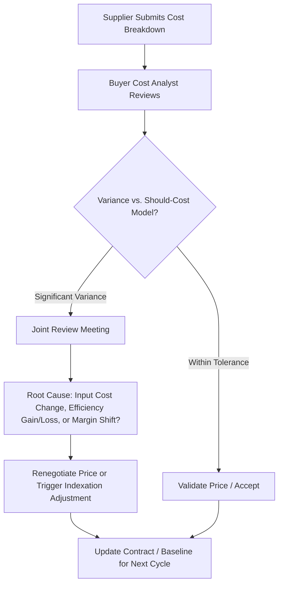

## Open-Book Costing and Cost Transparency

### Conceptual Overview

**Open-book costing (OBC)** is a contractual and operational practice in which a supplier discloses the detailed cost structure underlying a product or service — raw materials, labor, overhead, logistics, and profit margin — to the buyer, rather than presenting only a final negotiated price. It is the practical mechanism through which **cost transparency** is achieved in a buyer-supplier relationship.

OBC sits in direct contrast to traditional **closed-book (black-box) pricing**, where the supplier discloses only the final price and the buyer negotiates against market benchmarks or historical pricing with no visibility into the supplier's actual cost composition.

$$P = C_{material} + C_{labor} + C_{overhead} + C_{logistics} + M$$

Where $M$ is the disclosed margin. Under OBC, each term is itemized and (ideally) auditable, rather than bundled into an opaque $P$.

**Key Points**

- OBC is not the same as should-cost modeling. Should-cost modeling is the buyer's *independent estimate* of what a product should cost, built without supplier input. OBC is the supplier's *actual, disclosed* cost data. The two are complementary and are typically triangulated against each other — a large variance between should-cost estimate and open-book disclosure is itself a signal warranting investigation.
- OBC requires a foundation of trust and typically a longer-term or strategic relationship — it is rarely appropriate or achievable for short-term, transactional, or highly competitive Leverage-category sourcing (see category-level cost management), where suppliers have limited incentive to disclose cost structure to a buyer they may not deal with again.

---

### Why Open-Book Costing Is Used

| Driver | Explanation |
| --- | --- |
| **Fair pricing validation** | Buyer can verify price is cost-justified rather than negotiated purely off market power or anchoring |
| **Joint cost reduction** | Visibility into cost structure enables collaborative value engineering targeted at the actual largest cost drivers, rather than guessing |
| **Trust-building in strategic relationships** | Signals long-term partnership intent, supporting supplier's willingness to make dedicated investments (tooling, capacity) |
| **Indexation formula calibration** | Provides the empirical cost-weight data (e.g., $b, c, d$ in a price adjustment formula — see price indexation) needed to build accurate, fair escalation clauses |
| **Risk and margin monitoring** | Allows buyer to detect supplier financial distress (margin erosion) before it manifests as a supply disruption |
| **Target costing enablement** | Supports collaborative target costing exercises where buyer and supplier jointly work backward from a market price to an achievable cost structure |

---

### Levels of Cost Transparency

Cost transparency is not binary; it exists on a maturity spectrum, often modeled as a set of tiers:

- **Level 0 — Closed Book**: Only final price disclosed; no cost visibility.
- **Level 1 — Cost Category Disclosure**: Supplier discloses broad cost buckets (e.g., "60% material, 25% labor, 15% overhead/margin") without line-item detail.
- **Level 2 — Itemized Open-Book**: Full bill-of-materials-level cost breakdown, labor hours and rates, specific overhead allocation methodology, and disclosed margin.
- **Level 3 — Audited Open-Book**: Buyer (or a mutually agreed third-party auditor) has contractual right to audit supplier books/records to verify disclosed costs against actual accounting data.
- **Level 4 — Real-Time/System-Integrated Transparency**: Buyer has direct or API-level visibility into supplier ERP/costing systems, commodity purchase prices, or production data, often supported by shared digital platforms — the most advanced and least common tier, typically reserved for the most strategic, high-volume relationships.

**Key Points**

- Most mature strategic-category relationships operate at Level 2 or Level 3. Level 4 requires significant systems integration and mutual trust and is uncommon outside deeply integrated supply chains (e.g., automotive OEM-Tier 1 relationships).

---

### Cost Breakdown Structure (CBS)

The standard artifact used in OBC is a **Cost Breakdown Structure**, itemizing:

1. **Direct material cost**: raw material and purchased component costs, often further broken down by sub-supplier/commodity with reference to market index prices
2. **Direct labor cost**: labor hours × loaded labor rate, sometimes disaggregated by process step
3. **Manufacturing/process overhead**: machine time, utilities, tooling amortization, allocated per unit via a defined allocation methodology (activity-based costing is preferred over blanket overhead rates for accuracy)
4. **SG&A (Selling, General & Administrative) allocation**: corporate overhead allocated to the product/contract
5. **Logistics/freight**: inbound material freight, outbound finished goods freight, customs/duties where applicable
6. **Packaging**
7. **Quality/scrap/yield loss allowance**: cost impact of expected defect or yield rates
8. **Margin**: disclosed profit margin, sometimes itself subject to negotiation as a distinct line item rather than bundled into price

**Example CBS Table (Illustrative)**

| Cost Element | Unit Cost | % of Total |
| --- | --- | --- |
| Direct material | $2.10 | 50.0% |
| Direct labor | $0.84 | 20.0% |
| Manufacturing overhead | $0.50 | 12.0% |
| Logistics/freight | $0.21 | 5.0% |
| Packaging | $0.08 | 2.0% |
| Scrap/yield allowance | $0.13 | 3.0% |
| SG&A allocation | $0.21 | 5.0% |
| Margin | $0.13 | 3.0% |
| **Total** | **$4.20** | **100%** |

[Unverified] Figures are illustrative to demonstrate CBS structure, not derived from a real contract.

---

### Governance and Contractual Mechanics

**1. Contractual Right to Audit**

Level 3 OBC requires an explicit **audit clause** granting the buyer (or an independent third party bound by confidentiality) the right to inspect relevant cost records — often limited to specific accounts or cost centers relevant to the contracted item, not the supplier's entire financial statements, to balance transparency against the supplier's legitimate confidentiality interests.

**2. Confidentiality and Data Protection**

Because disclosed cost data is highly sensitive (revealing supplier margin, sourcing relationships, and cost efficiency to a customer who may also be negotiating with competitors), OBC arrangements are typically governed by:

- Strict **non-disclosure agreements (NDAs)** specific to the cost data
- Restricted internal access (often limited to a small named group on the buyer side, sometimes with contractual penalties for misuse)
- Data handling and destruction clauses at contract end

**3. Cost Update Cadence**

OBC is not a one-time disclosure; mature arrangements define a **periodic cost review cadence** (commonly quarterly or annually) where the supplier resubmits updated cost breakdowns, which then feed into:

- Price renegotiation
- Indexation formula recalibration (see price indexation and currency hedging)
- Joint value engineering target-setting

**4. Margin Protection Clauses**

Because full transparency exposes supplier margin, many OBC contracts include mechanisms protecting the supplier from having disclosed margin used purely to squeeze price to zero — e.g., **minimum margin floors**, or gain-sharing structures where cost reductions identified jointly are split between buyer and supplier rather than fully captured by the buyer.

---

### Intersection with Dual Sourcing

Open-book costing interacts with dual sourcing in specific, sometimes tension-laden ways:

**1. Comparative Cost Benchmarking Across Sources**

When both suppliers in a dual-source arrangement operate under OBC, the buyer gains a powerful internal benchmark — comparing disclosed cost structures side-by-side reveals which supplier has genuine structural cost advantages (better process efficiency, lower input costs) versus which is simply charging a lower margin, informing more sophisticated volume-allocation decisions than price comparison alone.

**2. Confidentiality Firewalls Between Competing Suppliers**

A critical governance requirement: cost data disclosed by Supplier A must never be shared with, or used to directly pressure, Supplier B (and vice versa), as this would likely constitute a breach of the NDA and could expose the buyer to legal risk and reputational damage, and would rapidly destroy supplier trust in the OBC arrangement. Buyer-side governance typically enforces **information firewalls** (e.g., only aggregate/anonymized benchmarks are used in supplier-facing negotiations, never one supplier's specific line-item data shown to another).

**3. Reduced Willingness to Disclose Under Competitive Pressure**

Suppliers in a dual-sourced, competitively tensioned relationship may be *less* willing to fully disclose cost data (fearing it will be used to justify shifting volume to the competing source) compared to a single-source strategic partnership. This is a structural tension: dual sourcing improves buyer negotiating leverage but can reduce the depth of transparency achievable, particularly at Level 3/4. Buyers often mitigate this via strong confidentiality guarantees and by demonstrating that disclosed data leads to joint value creation (shared savings) rather than purely punitive price reduction.

**4. Should-Cost as a Substitute When OBC Is Unavailable**

For dual-sourced categories where suppliers decline full open-book disclosure, independent should-cost modeling becomes the primary substitute mechanism for validating price fairness across both sources.

---

### Common Pitfalls

- **Requesting open-book costing without offering anything in return**: suppliers are unlikely to disclose sensitive cost data purely on request; sustainable OBC requires an exchange — longer contract terms, gain-sharing, volume commitments, or genuine partnership investment.
- **Treating disclosed costs as immediately auditable fact**: without an audit clause and periodic verification, disclosed costs can be inflated or selectively presented; Level 2 disclosure without Level 3 audit rights has inherent limits on reliability.
- **Breaching confidentiality firewalls in dual-source arrangements**: even inadvertent disclosure of one supplier's cost data to a competing source can trigger legal exposure and irreparably damage the relationship.
- **Using OBC purely as a price-squeeze tool**: if every disclosure is immediately followed by a demand to reduce price to near-zero margin, suppliers rationally reduce transparency and disclosure quality over time.
- **Static cost breakdowns**: treating a CBS as fixed after initial disclosure rather than updating on a defined cadence causes indexation and pricing decisions to drift out of sync with actual current cost reality.

**Related Topics**

- Should-Cost Modeling and Cost Breakdown Analysis
- Price Indexation and Currency Hedging
- Value Engineering and Value Analysis Techniques
- Category-Level Cost Management Strategies
- Target Costing and Collaborative Cost Planning
- Gain-Sharing and Risk-Sharing Commercial Models
- Supplier Financial Health Monitoring