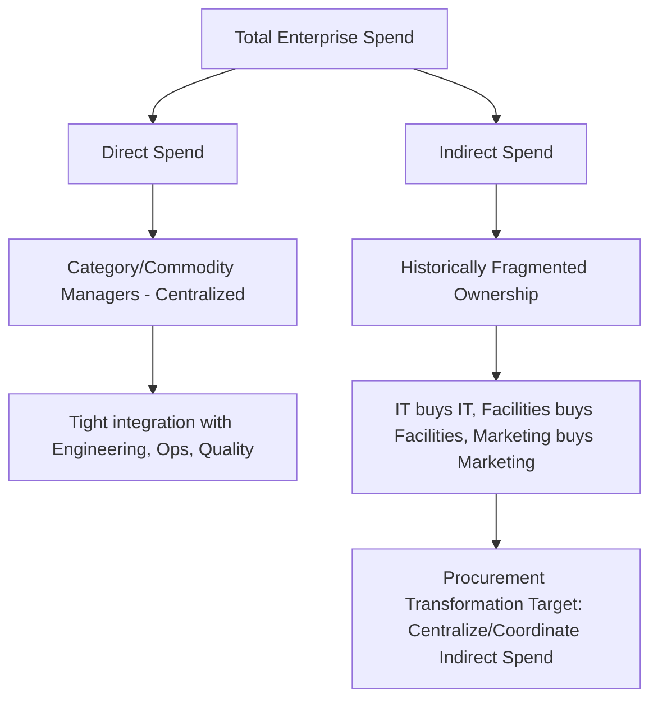

## Direct Versus Indirect Spend Categories

### Conceptual Overview

**Direct spend** and **indirect spend** are the two foundational categories into which all procurement spend is classified — the split precedes and structurally informs category-level strategy (Kraljic segmentation, sourcing approach, governance model) because the two spend types differ fundamentally in their relationship to the organization's core output.

- **Direct spend**: expenditure on goods and services that are consumed directly in, or become a physical/functional part of, the product or service the organization sells. It has a direct, traceable relationship to Cost of Goods Sold (COGS).
- **Indirect spend**: expenditure on goods and services that support business operations but are not incorporated into the final product — often referred to as **MRO (Maintenance, Repair, and Operations)** spend, general/administrative spend, or "non-production" spend.

$$COGS = \sum (Direct\ Material + Direct\ Labor + Direct\ Manufacturing\ Overhead)$$

Indirect spend, by contrast, typically flows through **Operating Expense (OpEx)** or SG&A on the income statement rather than COGS.

---

### Defining Characteristics and Comparison

| Dimension | Direct Spend | Indirect Spend |
| --- | --- | --- |
| Relationship to product | Becomes part of, or is consumed in producing, the final product | Supports operations; not embedded in the final product |
| Financial statement treatment | Cost of Goods Sold (COGS) | Operating Expense (OpEx) / SG&A |
| Examples | Raw materials, components, contract manufacturing, packaging | IT services, facilities/janitorial, office supplies, travel, professional services (legal, consulting), marketing, MRO parts |
| Typical spend volume | Often highest total spend, concentrated in fewer, larger contracts | Highly fragmented across many small-to-medium purchases and many suppliers |
| Supply risk profile | Directly tied to production continuity — disruption stops the production line | Rarely halts production directly, but can disrupt operations, compliance, or employee productivity |
| Organizational visibility/ownership | Typically owned by dedicated commodity/category managers, tightly integrated with engineering and operations | Historically fragmented ownership across departments (IT buys its own software, facilities buys its own services) — "maverick" or decentralized spend is common |
| Typical procurement maturity | Higher — direct materials procurement is usually a mature, well-governed function given its criticality | Lower — indirect spend is frequently under-managed, a major target of procurement transformation initiatives |
| Sourcing cycle | Longer, more rigorous (supplier qualification, PPAP/quality validation, tooling) | Often shorter and lighter-weight, though large indirect categories (IT, facilities) can be equally complex |

**Key Points**

- The direct/indirect split is not always clean. Some categories are genuinely ambiguous — e.g., **packaging** may be direct (if it ships with and is essential to the product) or indirect (if it's internal handling material); a company's own chart of accounts and costing methodology defines the boundary, and this should be documented explicitly rather than assumed.
- **Capital expenditure (CapEx)** — spend on long-lived assets like equipment or facilities — is sometimes treated as a third category distinct from both direct and indirect operating spend, since it is capitalized and depreciated rather than expensed.

---

### Why the Distinction Matters for Category Strategy

**1. Risk Tolerance and Supply Assurance**

Direct spend disruption has immediate, visible, and often severe consequences (production line stoppage), which is why direct-material categories are disproportionately represented in **Strategic** and **Bottleneck** quadrants of the Kraljic matrix and are the primary driver behind **dual/multi-sourcing strategies** — the cost of maintaining a second qualified source is justified by the catastrophic cost of a single-source disruption. Indirect spend disruption is typically more tolerable and rarely justifies the same investment in redundancy.

**2. Sourcing Rigor and Qualification Requirements**

Direct materials typically require formal supplier qualification processes — quality system audits, **PPAP (Production Part Approval Process)** or equivalent, capacity verification, and often multi-month or multi-year qualification lead times before a supplier can be approved. Indirect categories generally have lighter qualification requirements, though regulated indirect categories (e.g., certain professional/legal services, cloud/IT security) can still carry significant compliance overhead.

**3. Organizational Ownership Model**

Direct spend is almost universally centrally managed by procurement/supply chain given its criticality. Indirect spend has historically been decentralized, purchased by the requesting department with limited procurement involvement — a major and well-documented source of **maverick spend**, price inconsistency, and missed consolidation savings, and consequently a common primary target of enterprise procurement transformation and cost-reduction programs.

**4. Cost Management Technique Applicability**

- **Direct spend**: should-cost modeling, open-book costing, value engineering/value analysis, and price indexation (see prior items) are most rigorously and frequently applied here because unit cost visibility and precision materially affect COGS and gross margin.
- **Indirect spend**: cost management often centers on **demand management** (reducing consumption, not just unit price — e.g., travel policy enforcement, software license optimization/"shelfware" elimination) and **spend consolidation** (reducing supplier fragmentation to unlock volume pricing), since the underlying "should-cost" of many indirect services is harder to model at a component level.

---

### Indirect Spend Sub-Categorization

Because indirect spend is broad and heterogeneous, it is typically further broken down into standard sub-categories for management purposes:

| Sub-Category | Examples |
| --- | --- |
| **MRO** (Maintenance, Repair, Operations) | Spare parts, industrial supplies, facility maintenance materials |
| **Professional Services** | Legal, consulting, audit, staffing/contingent labor |
| **IT/Technology** | Software licenses (SaaS), hardware, telecom, cloud infrastructure |
| **Facilities** | Janitorial, security, utilities, real estate/leasing |
| **Travel & Expense** | Airfare, lodging, ground transport, meals |
| **Marketing** | Agency fees, media buying, events, promotional materials |
| **HR/Employee Services** | Benefits administration, recruiting services, training |
| **Capital/MRO equipment** | Machinery, tooling (sometimes classified as CapEx rather than indirect OpEx) |

**Key Points**

- Indirect categories are frequently subjected to the same Kraljic segmentation applied to direct categories — e.g., enterprise software licensing for a mission-critical ERP system may sit in the Strategic quadrant despite being "indirect," while office supplies sit firmly in Non-critical/Routine.

---

### Direct/Indirect Distinction in a Dual-Sourcing Context

While dual sourcing is conceptually applicable to any category, it is disproportionately concentrated in **direct spend**, for structural reasons:

1. **Production continuity risk is asymmetric.** A stockout of a direct raw material or component can halt an entire production line within hours or days, producing large, immediate, quantifiable financial loss (lost production, potential contract penalties for late delivery to the buyer's own customers). Most indirect spend disruptions (e.g., a delayed office furniture order) carry materially lower and less time-critical downside, so the cost-benefit case for maintaining a second qualified indirect supplier is usually weaker.
2. **Qualification cost is only justified at sufficient spend/criticality.** Qualifying a second source for a direct material involves real cost (audits, sample validation, potential tooling duplication) — this investment is easier to justify against a Strategic-quadrant, high-spend, high-risk direct category than against a low-value indirect purchase.
3. **Where dual sourcing does apply to indirect categories, it typically concerns high-criticality indirect services** — e.g., maintaining two qualified logistics/freight providers, two cloud infrastructure providers for resilience (multi-cloud strategy), or two staffing agencies for critical contingent labor — where the "indirect" spend still carries Strategic or Bottleneck-level operational risk despite not appearing in COGS.
4. **Category strategy documentation should explicitly state spend type as part of segmentation rationale**, since a reviewer or auditor assessing why a category was or was not dual-sourced will expect the direct/indirect classification (and its associated risk profile) to be part of the documented justification.

---

### Common Pitfalls

- **Applying direct-spend sourcing rigor uniformly to indirect spend**: over-engineering supplier qualification for low-risk indirect purchases wastes procurement capacity without proportional risk reduction.
- **Under-investing in indirect spend management**: because indirect spend is fragmented and individually low-value, organizations often fail to aggregate visibility across it, missing significant consolidation and demand-management savings that in aggregate can rival direct-spend savings potential.
- **Misclassifying ambiguous categories inconsistently**: if packaging, capital equipment, or contract labor are classified inconsistently across business units, spend analysis and category strategy become unreliable.
- **Ignoring indirect categories with disguised strategic risk**: some indirect categories (critical IT infrastructure, key professional services, single-source specialized MRO parts) carry Strategic/Bottleneck-level risk despite their "indirect" accounting label, and should not be deprioritized purely based on spend classification.

**Related Topics**

- Category-Level Cost Management Strategies
- Kraljic Matrix and Supplier Segmentation Frameworks
- Spend Analysis and UNSPSC Taxonomy
- Maverick Spend and Procurement Compliance
- Supplier Qualification and PPAP Processes
- MRO (Maintenance, Repair, Operations) Category Management
- Demand Management in Indirect Procurement