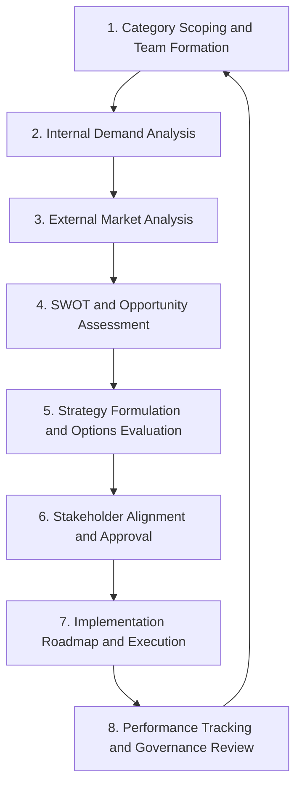
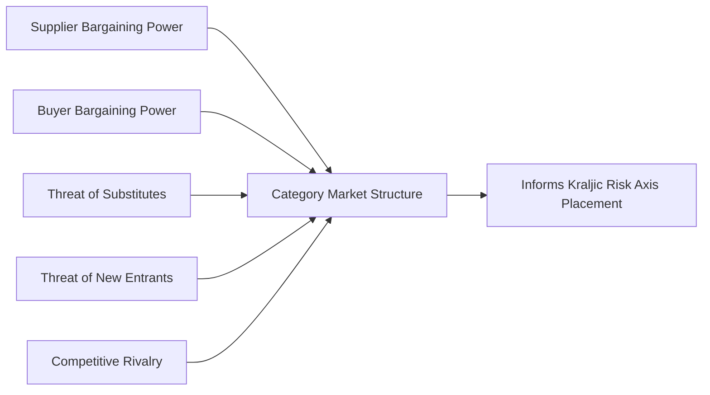
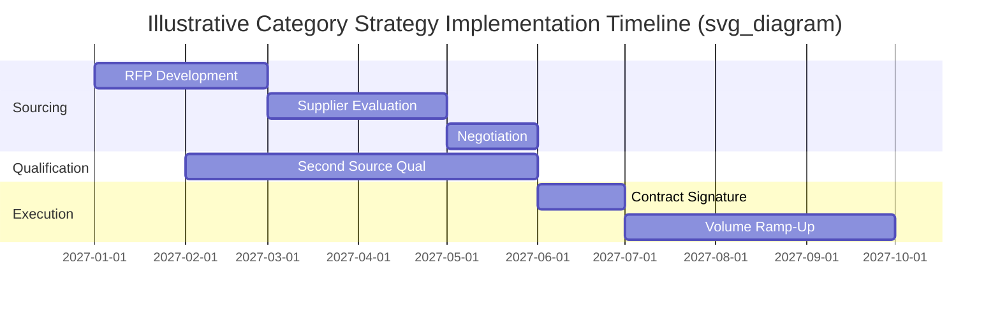

## Strategic Category Planning Process

### Conceptual Overview

The **Strategic Category Planning Process** is the formal, structured methodology by which a category manager develops a multi-year sourcing and cost-management strategy for a given spend category. It is the operational execution engine behind category-level cost management strategies — converting the conceptual segmentation (Kraljic, direct/indirect classification) into a documented, actionable, stakeholder-aligned strategy with defined objectives, initiatives, and timelines.

Where category-level cost management strategies define *what kind* of strategy a category should follow based on its quadrant, the Strategic Category Planning Process defines the *repeatable process* by which that strategy is researched, built, approved, executed, and refreshed. It is typically documented in a formal deliverable called a **Category Strategy Document** or **Category Plan**.

---

### The Category Planning Cycle

This cycle typically runs annually for high-priority Strategic and Leverage categories, and on a lighter, less frequent cadence (e.g., biennially) for Bottleneck and Non-critical categories, reflecting proportional investment of planning effort relative to category impact and risk.

---

### 1. Category Scoping and Team Formation

- **Define category boundaries**: precisely what is included/excluded (e.g., "packaging" may or may not include labeling, may or may not include inbound freight).
- **Assemble a cross-functional category team**: typically includes the category/commodity manager (lead), engineering/technical representative, finance/cost analyst, quality, and relevant business unit stakeholders. For Strategic categories, sponsorship from senior leadership is often formalized.
- **Assign a Category Owner**: single point of accountability for the category strategy's development and execution, distinct from tactical buyers.

**Key Points**

- Cross-functional involvement is critical specifically because category strategy decisions (e.g., dual-sourcing a component, changing a specification) have downstream engineering, quality, and operational consequences that a procurement-only team cannot adequately evaluate alone.

---

### 2. Internal Demand Analysis

- **Historical spend analysis**: 2–3 years of transactional spend data, broken down by supplier, business unit, specification/SKU, and geography — typically the first quantitative step, since it reveals fragmentation, supplier concentration, and price variance for the same or similar items across the organization.
- **Demand forecasting**: projected future volume requirements, informed by sales/operations forecasts, new product introduction pipelines, or business growth plans.
- **Specification review**: cataloging current specifications, tolerances, and requirements to identify standardization or rationalization opportunities (a direct input to value engineering/value analysis work).
- **Stakeholder requirements gathering**: interviews or workshops with internal users of the category to understand unmet needs, pain points, and non-negotiable requirements (quality, compliance, lead time).

---

### 3. External Market Analysis

- **Supply market structure assessment**: number of viable suppliers, market concentration (e.g., using an HHI — Herfindahl-Hirschman Index — proxy), barriers to entry, and overall market maturity.
- **Porter's Five Forces analysis**: applied at the category level to understand structural power dynamics — supplier bargaining power, buyer bargaining power, threat of substitutes, threat of new entrants, and competitive rivalry among existing suppliers.
- **Cost driver and commodity analysis**: identifying the underlying input costs (raw materials, labor, energy, logistics) that drive category pricing, and their historical volatility — this directly informs whether price indexation mechanisms are warranted for the category.
- **Benchmarking**: comparing current pricing/terms against industry benchmarks, peer organizations, or third-party market intelligence sources.
- **Supplier landscape mapping**: identifying incumbent suppliers, potential new entrants, and their relative capabilities, capacity, financial health, and geographic footprint.

---

### 4. SWOT and Opportunity Assessment

A structured **SWOT analysis** (Strengths, Weaknesses, Opportunities, Threats) is commonly applied at the category level, synthesizing internal demand analysis and external market analysis into a clear opportunity map:

| Quadrant | Typical Category-Level Content |
| --- | --- |
| **Strengths** | Buyer's negotiating leverage, existing strong supplier relationships, internal cost visibility (open-book arrangements) |
| **Weaknesses** | Fragmented internal demand, poor specification standardization, limited market intelligence |
| **Opportunities** | Volume consolidation, dual-sourcing to reduce risk/increase leverage, value engineering targets, emerging suppliers/technologies |
| **Threats** | Supply market consolidation, commodity price volatility, single-source dependency, geopolitical/currency risk |

This step directly feeds the **Kraljic re-segmentation** decision — confirming or revising the category's quadrant placement based on updated risk and impact data, and surfacing specific, prioritized improvement opportunities (e.g., "reduce supplier count from 12 to 3," "qualify a second source in Southeast Asia to reduce currency and geographic concentration risk").

---

### 5. Strategy Formulation and Options Evaluation

With opportunities identified, the category team formulates specific strategic options and evaluates trade-offs. Common structural decisions made at this stage:

- **Sourcing strategy**: single-source, dual-source, or multi-source — including target volume allocation ratios and the risk/leverage rationale (see category-level cost management strategies and direct vs. indirect spend categories for the underlying decision logic).
- **Commercial model**: fixed price, indexed price, cost-plus, gain-sharing (see price indexation and open-book costing).
- **Contract structure and duration**: aligned to category risk profile — shorter terms preserve competitive tension for Leverage categories; longer terms support joint investment for Strategic categories.
- **Supplier development vs. new supplier qualification**: whether to invest in improving an incumbent supplier's capability or qualify a new entrant.
- **Cost reduction initiative selection**: which specific levers to pursue (should-cost benchmarking, value engineering workshops, specification standardization, demand reduction).

Each option is typically evaluated using a **weighted decision matrix** against criteria such as cost impact, risk reduction, implementation feasibility, timeline, and required investment — structurally similar to the Pugh Matrix approach used within individual value engineering evaluation phases, but applied here at the strategic/category level rather than to individual design alternatives.

**Key Points**

- The dual-sourcing decision, when it arises, is formally evaluated here with an explicit cost-benefit case: the efficiency cost of splitting volume (lost volume-discount leverage) is weighed quantitatively against the risk-mitigation value (estimated cost of a potential single-source disruption, probability-weighted) — not adopted by default.

---

### 6. Stakeholder Alignment and Approval

- The draft category strategy is presented to relevant governance bodies — commonly a **Category Management Office (CMO)**, a cross-functional steering committee, or, for high-spend/high-risk Strategic categories, executive leadership.
- Formal sign-off is typically required before execution, particularly where the strategy involves material changes (adding/removing suppliers, multi-year contract commitments, specification changes affecting product design).
- **RACI clarification** (Responsible, Accountable, Consulted, Informed) is often finalized at this stage to ensure execution roles are unambiguous across procurement, engineering, finance, and business unit stakeholders.

---

### 7. Implementation Roadmap and Execution

The approved strategy is translated into a time-phased execution plan, typically including:

- Sourcing events (RFI/RFP/RFQ, negotiations, or reverse auctions as appropriate to the category)
- Supplier qualification/onboarding timelines (particularly critical for dual-sourcing initiatives requiring new supplier qualification)
- Contract negotiation and execution milestones
- Change management activities (e.g., specification changes requiring engineering sign-off, ECR/ECN processes)
- Communication plan to affected internal stakeholders

---

### 8. Performance Tracking and Governance Review

- Category performance is tracked against the KPIs defined in the strategy (spend under management, cost savings/avoidance, supplier concentration, contract compliance — see category-level cost management strategies for the standard KPI set).
- Periodic governance reviews (commonly quarterly business reviews for Strategic categories) assess progress against the roadmap and trigger course-correction if market conditions or internal requirements shift materially.
- The cycle formally restarts (typically annually) with a refreshed internal demand analysis and external market analysis, ensuring the category strategy does not become stale — a documented common failure mode when category plans are treated as static, one-time deliverables rather than living documents.

---

### The Category Strategy Document: Standard Structure

A well-formed Category Strategy Document typically includes the following sections, synthesizing the outputs of the process above:

1. Executive summary and category overview
2. Current state: spend analysis, supplier base, contract status
3. Market analysis: Five Forces, market structure, cost drivers
4. Kraljic segmentation and quadrant rationale
5. SWOT and opportunity assessment
6. Strategic objectives and target state (e.g., target sourcing ratio, target cost reduction, target risk profile)
7. Initiatives and roadmap with owners and timelines
8. Risk assessment and mitigation plan
9. Governance and review cadence
10. Approval/sign-off record

---

### Intersection with Dual Sourcing

The Strategic Category Planning Process is the formal vehicle through which a dual-sourcing initiative is justified, sequenced, and governed:

1. **Market analysis (Step 3) identifies candidate second sources** by mapping the supplier landscape and assessing which potential suppliers meet minimum qualification thresholds (technical capability, financial stability, geographic/currency diversification value).
2. **SWOT/opportunity assessment (Step 4) quantifies the risk case** for dual sourcing — e.g., single-source concentration flagged as a "Threat," informing a prioritized "Opportunity" to qualify an alternate.
3. **Strategy formulation (Step 5) sets the specific target allocation ratio** and defines switching/reallocation triggers (cost, quality, delivery performance thresholds) that will govern how volume moves between the two sources over time.
4. **Implementation roadmap (Step 7) sequences the qualification timeline** for the second source, which for direct-material categories can be the longest single element of the plan (given PPAP or equivalent quality validation requirements).
5. **Ongoing governance (Step 8) tracks the realized benefit** of dual sourcing against the original business case — e.g., verifying that the anticipated risk-mitigation and leverage benefits materialized and were not outweighed by the anticipated volume-discount forfeiture.

**Key Points**

- A category strategy that recommends dual sourcing without having completed rigorous market analysis and quantified risk/cost trade-off evaluation is a common audit finding — the process exists precisely to ensure the decision is evidence-based rather than reflexive.

---

### Common Pitfalls

- **Skipping external market analysis**: building a category strategy based solely on internal spend data without understanding supply market structure produces strategies poorly calibrated to actual negotiating leverage or risk.
- **Treating the category plan as a one-time deliverable**: failing to refresh the plan on a defined cadence causes strategy to drift out of alignment with changing market conditions, a frequently cited failure mode in mature category management maturity assessments.
- **Insufficient cross-functional involvement**: procurement-only category plans for technically complex or Strategic categories often miss critical engineering, quality, or operational constraints, leading to stakeholder resistance during implementation.
- **Weak governance/approval processes**: category strategies that lack formal executive sign-off for high-risk decisions (e.g., dual-sourcing a Strategic component) are more vulnerable to being overridden or under-resourced during execution.
- **Underestimating qualification lead time in the implementation roadmap**: particularly for dual-sourcing initiatives in direct-material categories, underestimating supplier qualification timelines (PPAP, capacity validation) is a common cause of roadmap slippage.

**Related Topics**

- Category-Level Cost Management Strategies
- Kraljic Matrix and Supplier Segmentation Frameworks
- Direct Versus Indirect Spend Categories
- Spend Analysis and UNSPSC Taxonomy
- Supplier Qualification and PPAP Processes
- Should-Cost Modeling and Cost Breakdown Analysis
- Category Management Governance and Organizational Design
- Porter's Five Forces in Supply Market Analysis