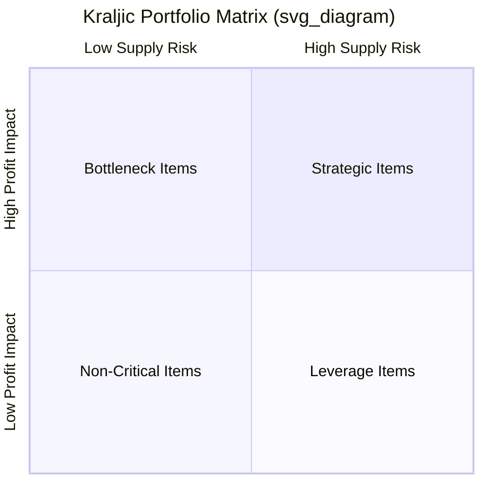
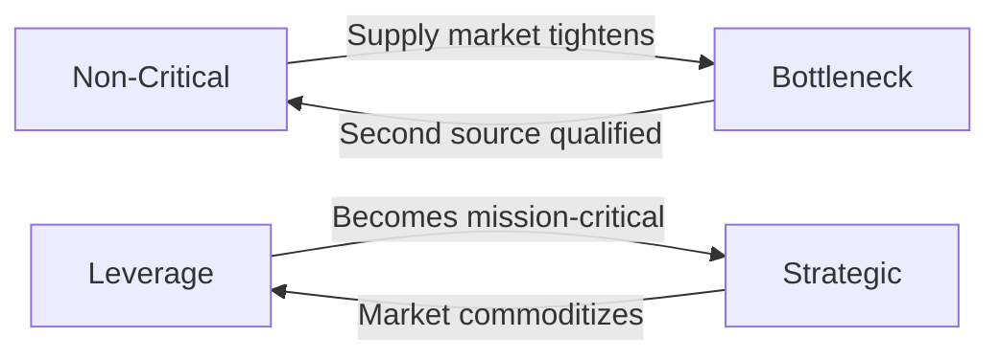

## Tailoring SRM Approach by Category Type

### Overview

Supplier Relationship Management is not a uniform process applied identically across all purchases. A firm sourcing custom semiconductor components manages that relationship fundamentally differently than one purchasing office supplies. The **Kraljic Portfolio Matrix**, introduced by Peter Kraljic in 1983, remains the foundational framework for segmenting purchases and tailoring SRM intensity, governance, and resourcing accordingly.

### The Kraljic Matrix Foundation

Kraljic segments purchased items along two axes:

- **Profit Impact / Supply Risk** — how much the category affects financial performance versus how vulnerable the supply base is to disruption.

$$\text{Category Class} = f(\text{Profit Impact}, \text{Supply Risk})$$

This produces four quadrants, each demanding a distinct SRM posture.

### Category Type 1: Strategic Items (High Impact, High Risk)

**Key Points**

- Examples: custom-engineered components, sole-sourced advanced materials, critical IT infrastructure contracts.
- SRM approach: deep, collaborative partnership with joint value creation.
- Governance: executive-level sponsorship, multi-year contracts, joint business planning (JBP), shared risk/reward models.
- Sourcing strategy: typically dual or multi-sourced *deliberately* to mitigate the high supply risk, even at a cost premium — this is where dual sourcing has the strongest business case.
- Metrics: Total Cost of Ownership (TCO), innovation pipeline contribution, joint KPIs, supplier development investment.

**Example**

A hospital system sourcing a specialized surgical implant material qualifies two manufacturers under a joint quality agreement, shares demand forecasts 18 months out, and co-invests in capacity expansion at both suppliers to avoid single-point failure.

### Category Type 2: Bottleneck Items (Low Impact, High Risk)

**Key Points**

- Examples: a proprietary spare part from a single legacy vendor, specialty chemicals with few qualified producers.
- SRM approach: risk mitigation-focused, not relationship-deepening — low spend doesn't justify heavy investment, but supply disruption is disproportionately damaging.
- Tactics: safety stock buffers, supplier qualification of alternates, contractual continuity-of-supply clauses, vendor-managed inventory (VMI) where feasible.
- A common mistake: under-resourcing this quadrant because dollar volume looks small. The risk profile, not spend, should drive attention.

**Example**

A manufacturer relies on one supplier for a certified fastener used in aerospace assembly. Rather than negotiating price (low leverage anyway), the buyer qualifies a second-source supplier and maintains 90 days of buffer stock.

### Category Type 3: Leverage Items (High Impact, Low Risk)

**Key Points**

- Examples: commodity raw materials, standardized packaging, common electronic components with many qualified suppliers.
- SRM approach: competitive tension is the primary lever — transactional to moderately collaborative relationships.
- Tactics: competitive bidding, reverse auctions, volume consolidation, price benchmarking, short-to-medium contract terms to preserve negotiating leverage.
- Dual sourcing here is used for cost competition rather than risk mitigation — splitting volume between two suppliers to maintain pricing pressure.

**Example**

A consumer goods company sources corrugated packaging from three qualified suppliers, running annual RFQs and shifting volume share based on quarterly price and quality scorecards.

### Category Type 4: Non-Critical Items (Low Impact, Low Risk)

**Key Points**

- Examples: office supplies, MRO consumables, standard stationery.
- SRM approach: minimize process cost, not unit price — the goal is efficiency of the transaction itself.
- Tactics: e-procurement catalogs, P-cards, supplier consolidation to reduce the number of relationships managed, automated purchase-to-pay (P2P) workflows.
- Over-investing SRM effort here has negative ROI; the objective is to automate and disengage as much as possible.

### Comparative Summary

| Category | Supplier Count Strategy | SRM Intensity | Primary Lever |
| --- | --- | --- | --- |
| Strategic | Deliberate dual/multi-source | Very High | Partnership & co-investment |
| Bottleneck | Qualify alternates | Moderate | Risk mitigation & continuity |
| Leverage | Competitive multi-source | Low–Moderate | Price competition |
| Non-Critical | Consolidate | Minimal | Process automation |

### Migration Between Quadrants

Categories are not static. A component can shift from Leverage to Bottleneck if a supplier exits the market, or from Non-Critical to Strategic if it becomes tied to a compliance requirement. [Inference] Mature SRM organizations re-run Kraljic segmentation on a periodic cadence (commonly annual or triggered by market events) rather than treating the classification as fixed at initial sourcing.

### Practical Application Workflow

**Steps to tailor SRM by category:**

1. Classify every active SKU/service against the Kraljic matrix using historical spend and a supply-risk scoring rubric (supplier count, switching cost, lead time, geopolitical exposure).
2. Assign differentiated governance models per quadrant (executive JBP for Strategic vs. automated catalog buying for Non-Critical).
3. Set category-specific KPIs — TCO and innovation for Strategic, price variance for Leverage, continuity metrics for Bottleneck, process cost for Non-Critical.
4. Re-assess quadrant placement on a fixed cycle or upon triggering events (single-source disruption, cost spike, new regulation).

**Related Topics**

- Kraljic Matrix scoring methodology and risk-weighting rubrics
- Joint Business Planning (JBP) frameworks for Strategic suppliers
- Vendor-Managed Inventory (VMI) design for Bottleneck categories
- Reverse auction mechanics for Leverage categories
- E-procurement catalog automation for Non-Critical spend
- Dual sourcing cost-benefit modeling (premium vs. risk-adjusted savings)