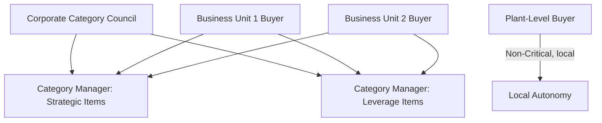
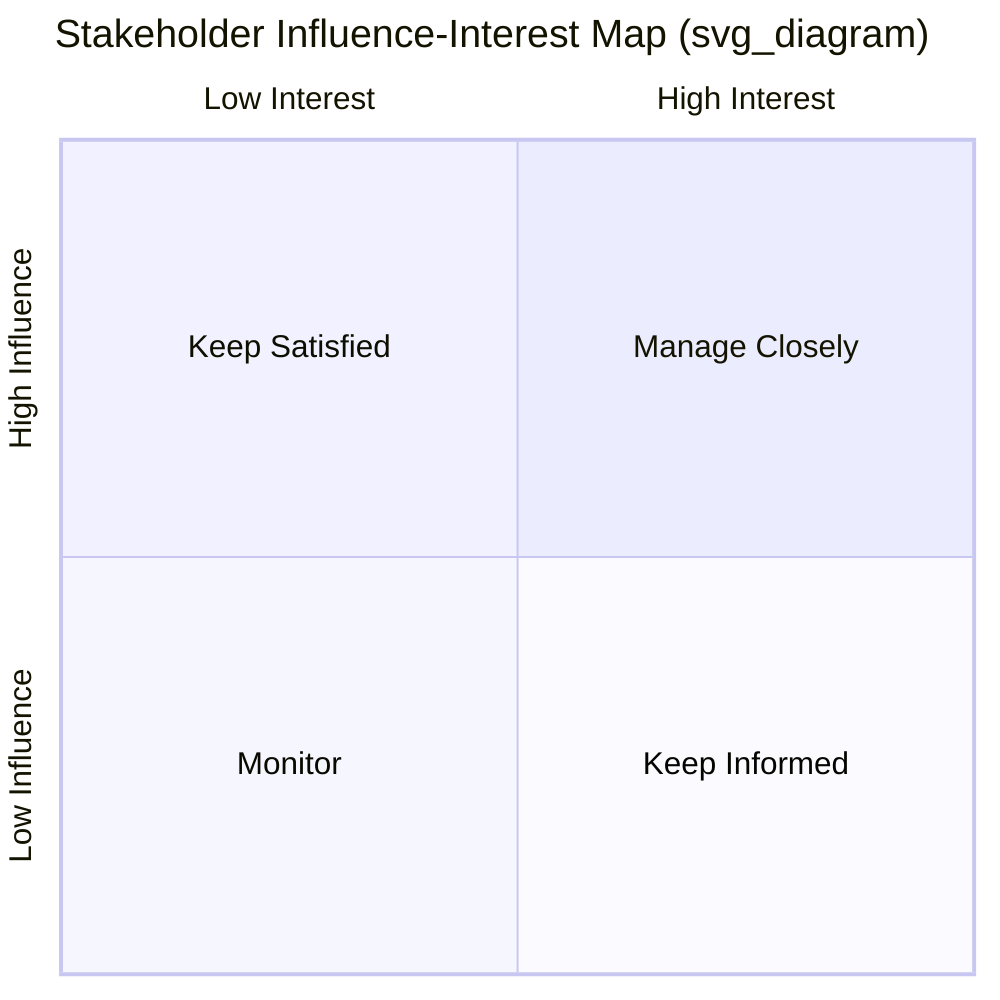

## Category Team Structures and Stakeholder Alignment

### Overview

Effective category management depends as much on organizational design as on sourcing strategy. A well-segmented Kraljic matrix is worthless if the team executing against it lacks the right composition, mandate, and stakeholder buy-in. This topic covers how organizations structure category teams and align cross-functional stakeholders to execute SRM effectively.

### Core Team Structure Models

**Key Points**

Organizations typically adopt one of three structural models for category management:

- **Centralized** — a single corporate procurement function owns all category strategy and supplier decisions across business units.
- **Decentralized** — individual business units or plants manage their own category sourcing independently.
- **Center-Led (Hybrid)** — corporate category teams set strategy and negotiate strategic/leverage contracts, while execution and local supplier management is delegated to business units.

| Model | Decision Speed | Negotiating Leverage | Local Responsiveness | Common Fit |
| --- | --- | --- | --- | --- |
| Centralized | Slower | Highest | Low | Strategic & Leverage categories |
| Decentralized | Fast | Lowest | Highest | Non-Critical, highly local needs |
| Center-Led | Moderate | High | Moderate | Most large multi-site enterprises |

[Inference] Most mature enterprises converge on a center-led hybrid because it captures cross-business volume leverage for Strategic and Leverage categories while allowing plant-level flexibility for Non-Critical and locally-sourced items.

### The Cross-Functional Category Team

A category team for a Strategic or Bottleneck item is rarely procurement-only. The typical composition includes:

- **Category Manager** — owns strategy, supplier selection, overall accountability.
- **Engineering/Technical Lead** — defines specifications, validates supplier technical capability, co-owns quality standards.
- **Quality/Compliance Representative** — ensures regulatory and quality-system alignment (critical in regulated sectors like healthcare, aerospace, government).
- **Finance/Cost Analyst** — supports TCO modeling, price benchmarking, budget impact analysis.
- **Operations/Supply Chain Planner** — owns demand forecasting inputs, inventory strategy, logistics constraints.
- **Legal/Contracts** — drafts and reviews terms, especially for multi-year strategic agreements.
- **Executive Sponsor** — provides escalation authority and cross-business commitment for Strategic categories.

**Example**

A semiconductor manufacturer's team for a critical wafer-supply category includes a category manager, a process engineer who validates supplier fabs, a quality auditor conducting site assessments, and a VP-level sponsor who signs off on multi-year capacity commitments — reflecting the Strategic quadrant's need for deep, high-governance collaboration.

### RACI Framework for Stakeholder Alignment

A RACI matrix (Responsible, Accountable, Consulted, Informed) is the standard tool for clarifying stakeholder roles and avoiding decision bottlenecks or duplicated effort.

| Activity | Category Manager | Engineering | Finance | Executive Sponsor |
| --- | --- | --- | --- | --- |
| Supplier shortlist | R | C | I | I |
| Technical qualification | C | R/A | I | I |
| Contract negotiation | R/A | C | C | I |
| Final award (Strategic) | R | C | C | A |
| Budget approval | C | I | R/A | I |

### Governance Cadence

**Key Points**

- **Category Councils** — periodic (typically quarterly) cross-functional reviews of category strategy, performance, and market shifts.
- **Business Review Meetings (QBRs)** — joint sessions with strategic suppliers to review scorecards, escalate issues, and align on roadmaps.
- **Steering Committees** — executive-level bodies that resolve cross-business conflicts (e.g., two business units competing for constrained supplier capacity).

### Stakeholder Alignment Techniques

1. **Stakeholder mapping** — plot stakeholders by influence and interest to prioritize engagement effort; high-influence/high-interest stakeholders (e.g., plant managers dependent on a Bottleneck supplier) require direct involvement in strategy decisions.
2. **Shared KPIs** — align procurement, engineering, and finance around common metrics (e.g., TCO reduction, on-time delivery) rather than siloed departmental goals that can conflict (procurement optimizing price while engineering prioritizes specification rigidity).
3. **Category strategy documents** — a formal artifact circulated for cross-functional sign-off before execution, reducing late-stage objections.
4. **Escalation paths** — pre-defined authority levels for resolving disputes (e.g., single-source risk acceptance requires VP sign-off).

### Common Structural Pitfalls

- **Procurement-only ownership of Strategic categories** — excludes engineering/quality voice, leading to supplier decisions that meet cost targets but fail technical validation later.
- **No executive sponsor for high-risk categories** — leaves the team unable to secure investment for dual sourcing or supplier development.
- **Misaligned incentives** — procurement bonused on unit cost while operations is bonused on service level, creating internal conflict over safety stock or premium freight decisions.
- **Category team turnover without knowledge transfer** — particularly damaging for Strategic categories where supplier relationship history and negotiated terms are not systematically documented.

### Practical Application Workflow

**Steps to establish an aligned category team:**

1. Classify the category via Kraljic segmentation to determine required governance intensity.
2. Assemble a cross-functional team sized to the category's risk/impact profile (lean for Non-Critical, full cross-functional bench for Strategic).
3. Build a RACI matrix and circulate it for stakeholder sign-off before strategy execution begins.
4. Establish a governance cadence (council reviews, supplier QBRs) proportional to category criticality.
5. Define shared KPIs across functions to prevent siloed optimization.

**Related Topics**

- Kraljic Matrix category classification (prerequisite input to team sizing)
- Supplier scorecard design for QBR governance
- Category strategy document templates
- Cross-functional incentive alignment models
- Executive steering committee escalation frameworks