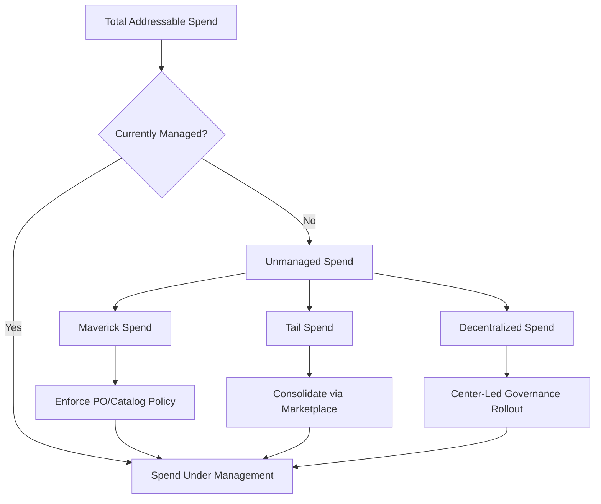

## Spend-Under-Management Growth Strategies

### Overview

Spend Under Management (SUM) is the percentage of an organization's total addressable spend that is actively governed by procurement policy, processes, and category strategy — as opposed to "maverick" or off-contract spend that bypasses procurement oversight entirely. Growing SUM is a primary lever for expanding procurement's influence, capturing savings, and reducing supply risk exposure.

### Defining Spend Under Management

$$\text{SUM \%} = \frac{\text{Spend Actively Managed by Procurement}}{\text{Total Addressable Spend}} \times 100$$

**Key Points**

- "Addressable" spend excludes categories that are structurally exempt (e.g., taxes, certain regulated fees) but includes anything theoretically sourceable.
- SUM is distinct from **contract compliance** (spend flowing through an existing contract) — SUM also captures spend that is actively strategized and monitored even before a formal contract exists.
- [Unverified] Industry benchmarks commonly cited by procurement advisory firms place best-in-class organizations above 80–85% SUM, though the exact figure and methodology vary by source and industry.

### Sources of Unmanaged Spend

| Category | Description | Typical Root Cause |
| --- | --- | --- |
| Maverick spend | Purchases made outside approved contracts/suppliers | Lack of catalog visibility, urgency |
| Tail spend | Long-tail of low-value, high-volume transactions | Too costly to strategically source individually |
| Decentralized/shadow spend | Business units procuring independently | No enforced procurement policy |
| Newly acquired entities | M&A-introduced spend not yet integrated | Integration lag |
| Emergent/project spend | One-off or ad hoc purchases | No pre-existing category strategy |

### Core Growth Strategies

**1. Tail Spend Consolidation**

Tail spend often represents 20–30% of total spend across 80%+ of suppliers/transactions — too fragmented for individual category strategies but too large in aggregate to ignore.

- Aggregate tail spend into "bundles" grouped by rough commodity similarity even without deep strategic sourcing.
- Route through preferred marketplace platforms or a small set of consolidated distributors.
- Apply light-touch e-procurement controls (catalogs, punch-outs) rather than full RFP cycles.

**2. Policy Enforcement and Procure-to-Pay (P2P) Controls**

- Mandate purchase order (PO) creation before invoice acceptance ("no PO, no pay" policy).
- Embed approved supplier catalogs directly in requisition systems to reduce the friction of using unauthorized suppliers.
- Configure spend-threshold approval workflows that flag off-contract purchases automatically.

**3. Category Expansion**

- Systematically extend sourcing methodology from already-managed categories (typically Direct Materials, IT) into historically under-managed indirect categories (Marketing, Professional Services, Facilities, T&E).
- These "soft" categories often resist standard sourcing due to stakeholder perception of specification subjectivity (e.g., "our ad agency relationship is unique") — requires stakeholder education alongside process rollout.

**4. Technology-Enabled Visibility**

- Deploy spend analytics/spend cube tools to classify and surface previously invisible transactions (often ERP data is poorly tagged, making spend classification the first blocker to SUM growth).
- AP data mining to identify recurring vendors below traditional sourcing thresholds that could be consolidated.

**5. Organizational Mandate Expansion**

- Formal policy requiring procurement involvement above a defined spend threshold, sponsored at executive level.
- Business unit scorecards that include SUM percentage as a tracked KPI, creating accountability beyond procurement itself.

### Measuring Progress

**Key Points**

- Track SUM as a rolling percentage, segmented by business unit and category, not just as a single enterprise-wide figure — aggregate numbers can mask pockets of poor compliance.
- Pair SUM growth with **savings realization tracking** — expanding SUM without capturing actual cost reduction indicates the newly managed spend isn't being strategically sourced, only administratively tracked.
- Common secondary metrics: contract compliance rate, PO-based spend percentage, number of active suppliers per category (proliferation is often inversely correlated with SUM maturity).

**Example**

A city government IT department discovers through spend-cube analysis that 40% of software licensing spend occurs through individual department credit card purchases, entirely outside procurement visibility. A phased rollout mandates all software purchases above a low threshold route through a central IT procurement catalog, raising SUM in that category from roughly 60% to over 90% within two fiscal quarters. [Inference] The compressed timeline in such cases is typically achievable in software/SaaS categories specifically because catalog-based routing requires minimal supplier renegotiation, unlike physical goods categories with existing multi-year contracts.

### Common Pitfalls

- Treating SUM growth as a pure compliance exercise disconnected from actual savings — stakeholders disengage if the only visible outcome is added process friction.
- Rolling out enforcement policy without adequate catalog coverage, pushing users toward workarounds (splitting purchases below approval thresholds).
- Ignoring change management — SUM growth fundamentally shifts decision authority away from business units, and this triggers resistance without executive sponsorship and clear communication of the rationale.

### Practical Application Workflow

**Steps to grow spend under management:**

1. Run a spend-cube analysis to classify current spend and identify unmanaged/maverick categories.
2. Segment unmanaged spend into tail spend, maverick spend, and decentralized spend — each requires a different remediation approach.
3. Implement P2P policy controls (PO mandates, catalog embedding) as the low-cost first lever.
4. Prioritize category expansion into indirect spend areas with executive-sponsored mandates.
5. Track SUM percentage alongside savings realization to ensure managed spend translates to value, not just visibility.

**Related Topics**

- Spend analytics and spend-cube data classification methodology
- Tail spend management platforms and marketplace aggregation
- Procure-to-Pay (P2P) system design and PO-matching workflows
- Maverick spend reduction through catalog and punch-out integration
- Category expansion roadmapping for indirect spend categories