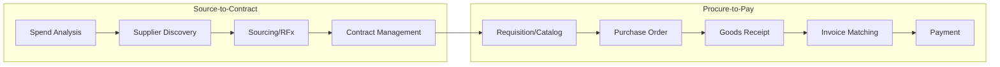
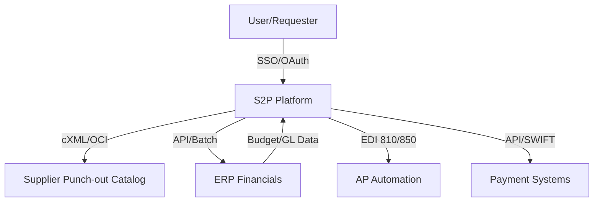

## Source-to-Pay Platform Architecture

### Overview

Source-to-Pay (S2P) platforms integrate the full procurement lifecycle — from supplier identification through sourcing, contracting, purchasing, and payment — into a unified technology stack. Understanding platform architecture is essential for evaluating build-vs-buy decisions, integration requirements, and how SRM/category management processes translate into system workflows.

### The S2P Process Scope

S2P spans two traditionally separate domains that modern platforms increasingly unify:

- **Source-to-Contract (S2C)** — upstream: spend analysis, supplier discovery, RFx/sourcing events, contract negotiation and management.
- **Procure-to-Pay (P2P)** — downstream: requisitioning, purchase orders, goods receipt, invoicing, payment.

### Core Architectural Modules

**Key Points**

Most S2P platforms decompose into the following functional modules, whether delivered as a single suite or best-of-breed integrated systems:

- **Spend Analytics / Spend Cube** — ingests transactional data (ERP, AP, P-card) and classifies it by category, supplier, and business unit; foundational input for category strategy and SUM measurement.
- **Supplier Management (SXM/SRM module)** — supplier master data, onboarding workflows, risk/compliance screening, performance scorecards.
- **Sourcing/eRFx** — structured RFI/RFP/RFQ workflows, e-auctions, bid comparison tooling.
- **Contract Lifecycle Management (CLM)** — contract authoring, clause libraries, approval workflows, obligation/renewal tracking.
- **eProcurement/Catalog** — punch-out and hosted catalogs, guided buying, requisition workflows.
- **Purchase Order Management** — PO generation, approval routing, change order handling.
- **Invoice-to-Pay** — invoice capture (OCR/EDI), 2-way/3-way matching, exception handling, payment execution.

### Reference Architecture Pattern

**Data Layer**

$$\text{Spend Cube} = \text{Transaction Data} \times \text{Supplier Master} \times \text{Category Taxonomy}$$

A common architectural failure point: **poor category taxonomy governance**. If spend classification rules are inconsistent across business units, every downstream module (analytics, sourcing, SUM tracking) inherits the data quality problem.

**Integration Layer**

| Integration Point | Typical Protocol | Purpose |
| --- | --- | --- |
| ERP (Financials) | API / flat-file batch | GL coding, budget checks, PO/invoice sync |
| Supplier Punch-out | cXML / OCI | Catalog browsing within requisition flow |
| EDI/AP Automation | EDI 810/850, API | Invoice and PO document exchange |
| Payment/Banking | API, SWIFT/ACH files | Payment execution and reconciliation |
| Identity/SSO | SAML, OAuth2/OIDC | User authentication across modules |

### Deployment Models

**Key Points**

- **Suite platforms** (single vendor, unified data model) — simpler integration, consistent UX, but potentially weaker capability in any single module compared to specialists.
- **Best-of-breed** (separate sourcing, CLM, P2P tools integrated via middleware/APIs) — stronger individual module capability, higher integration complexity and maintenance burden.
- **Marketplace/network model** — platform connects buyers to a pre-integrated supplier network (reduces onboarding friction but can create vendor lock-in to the network).

[Inference] For organizations with limited integration engineering capacity — common in smaller enterprises and public-sector bodies — suite platforms are generally the lower-risk choice despite module-level capability trade-offs, since the integration burden of best-of-breed architectures requires sustained technical resourcing.

### Data Model Considerations

A robust S2P platform's core entities typically include:

- **Supplier Master** — canonical supplier record, deduplicated across business units, linked to risk/compliance status.
- **Category Taxonomy** — hierarchical classification (e.g., UNSPSC or custom) applied consistently across spend analytics, sourcing events, and contracts.
- **Contract Repository** — versioned contract documents linked to supplier, category, and associated POs/invoices for compliance tracking.
- **Approval Workflow Engine** — configurable routing rules based on spend threshold, category, business unit.

**Example**

A government LGU document/records platform integrating procurement functionality would map submitted requisitions to a category taxonomy, route approvals through a configurable workflow engine based on budget ceiling thresholds mandated by public procurement law, and maintain an auditable contract repository — architecturally similar in structure to commercial S2P suites, though public-sector implementations typically add stricter audit-trail and public-disclosure requirements than standard commercial deployments.

### Governance and Configuration Layer

- **Approval matrices** — configured per category/threshold, often mirroring the RACI structures established in category team governance.
- **Policy enforcement** — "no PO, no pay" rules, maverick spend flagging, budget-check gating before requisition approval.
- **Audit trail** — immutable logging of approval actions, especially critical in regulated/public-sector contexts for compliance and dispute resolution.

### Common Architectural Pitfalls

- Treating spend analytics as a one-time implementation project rather than an ongoing data-governance function — taxonomy drift degrades reporting accuracy over time.
- Under-integrating the CLM module with P2P, resulting in POs/invoices that don't automatically validate against contracted terms (pricing, quantity caps).
- Choosing best-of-breed architecture without budgeting for the ongoing middleware/API maintenance burden required to keep systems synchronized.
- Insufficient master data governance for supplier records, leading to duplicate supplier entries and fragmented spend visibility — directly undermining SUM measurement accuracy.

### Practical Application Workflow

**Steps to evaluate or design S2P architecture:**

1. Map current-state procurement process against the S2C/P2P modules to identify capability gaps.
2. Assess data governance maturity (category taxonomy, supplier master consistency) before selecting tooling — poor data foundations undermine any platform choice.
3. Decide suite vs. best-of-breed based on available integration engineering capacity and required module-level depth.
4. Define the integration architecture (API/EDI/cXML touchpoints with ERP, banking, supplier networks) early, as this typically drives implementation timeline and cost more than module functionality itself.
5. Establish governance layer (approval matrices, audit trail requirements) aligned with organizational policy and any regulatory constraints.

**Related Topics**

- Spend cube data classification and category taxonomy design (UNSPSC standards)
- Contract Lifecycle Management (CLM) clause libraries and obligation tracking
- cXML/OCI punch-out catalog integration mechanics
- Procure-to-Pay 3-way matching and invoice exception workflows
- Supplier master data governance and deduplication strategies