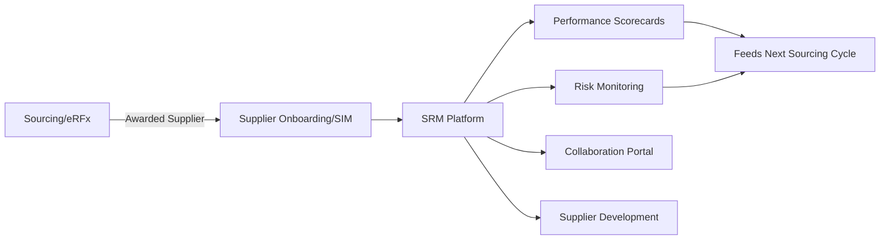

## Supplier Relationship Management Software Capabilities

### Overview

SRM software is the dedicated system of record for managing the supplier lifecycle post-selection — distinct from the upstream sourcing/eRFx tools that find and select suppliers. Where S2P platforms broadly cover the transactional lifecycle, SRM-specific software focuses on ongoing relationship governance: performance monitoring, risk management, collaboration, and development for suppliers already under contract.

### Positioning Within the S2P Stack

**Key Points**

- SRM software typically sits alongside (or as a module within) a broader S2P suite, consuming supplier master data and contract data while feeding performance/risk data back into sourcing decisions.
- Distinguishing SRM from Supplier Information Management (SIM): SIM handles static/semi-static supplier data (registration, certifications, banking details); SRM adds the dynamic, relationship-management layer (scorecards, collaboration, risk monitoring) on top of that foundation.

### Core Capability Areas

**1. Supplier Segmentation and Master Data**

- Tiering suppliers (typically aligned to Kraljic classification: Strategic, Bottleneck, Leverage, Non-Critical) to determine the intensity of SRM engagement applied.
- Centralized supplier profile: certifications, financial health indicators, diversity/ESG credentials, contract linkage.

**2. Performance Management / Scorecarding**

- Configurable KPI frameworks per category or supplier tier — On-Time Delivery (OTD), quality (PPM defect rates), responsiveness, cost performance.
- Automated data capture from transactional systems (ERP delivery data, quality inspection systems) rather than manual scorecard entry, where integration allows.

$$\text{OTD \%} = \frac{\text{Orders Delivered On or Before Due Date}}{\text{Total Orders}} \times 100$$

- Scorecard cadence typically tied to category governance intensity established in category team structures — monthly/quarterly for Strategic suppliers, less frequent for Leverage/Non-Critical.

**3. Risk Management**

- Continuous monitoring of financial risk (credit ratings, bankruptcy signals), operational risk (single-site dependency, geographic concentration), and compliance risk (regulatory sanctions, certification lapses).
- Increasingly integrates third-party risk-intelligence feeds (financial data providers, news/sentiment monitoring) rather than relying solely on periodic manual review.
- Risk scoring often combines multiple weighted factors:

$$\text{Composite Risk Score} = w_1 R_{financial} + w_2 R_{operational} + w_3 R_{compliance} + w_4 R_{geographic}$$

where weights ($w_1...w_4$) are typically configured per category — Strategic categories weighting operational/geographic risk more heavily given the continuity stakes discussed in category-specific dual sourcing.

**4. Collaboration Tools**

- Supplier portals for shared visibility into forecasts, demand signals, quality issues, and joint action plans.
- Joint Business Planning (JBP) workspace features for Strategic suppliers — shared roadmaps, innovation pipeline tracking.
- Issue/CAPA (Corrective and Preventive Action) management workflows for quality or delivery non-conformances.

**5. Supplier Development**

- Tracking improvement plans and audits, particularly relevant for Bottleneck categories where the goal may be developing a second qualified source.
- Capability assessment frameworks documenting supplier maturity against defined criteria (quality systems, capacity, technology roadmap).

### Functional Comparison Table

| Capability | Strategic Suppliers | Leverage Suppliers | Bottleneck Suppliers | Non-Critical Suppliers |
| --- | --- | --- | --- | --- |
| Scorecard frequency | Monthly/Quarterly | Quarterly/Annual | Quarterly | Minimal/None |
| Risk monitoring depth | Continuous, multi-factor | Periodic | Continuous (continuity-focus) | Minimal |
| Collaboration portal use | High (JBP, forecasts) | Moderate (RFQ cycles) | Moderate (continuity planning) | Low/None |
| Development programs | Common | Rare | Common (2nd-source dev) | Rare |

### Architectural/Integration Considerations

- **Data feeds required**: ERP (delivery/quality transactional data), contract management (obligation dates, terms), external risk-intelligence APIs, procurement/sourcing systems (for feedback loop into future RFx).
- **Notification/workflow engine**: automated alerts for scorecard threshold breaches, contract renewal windows, risk score changes — reduces reliance on manual category-manager monitoring.
- [Inference] Smaller organizations, or those without budget for a dedicated SRM module, often approximate these capabilities using a combination of spreadsheet-based scorecards and manual risk review cycles — functionally similar in intent but lacking the automation, audit trail, and real-time alerting that dedicated software provides.

### Example Application

A civic document management context (e.g., a local government platform tracking vendor contracts and deliverables) would typically implement a lightweight analog of SRM capabilities: a supplier/vendor registry (SIM layer), contract obligation tracking with renewal alerts, and a basic performance log tied to deliverable acceptance records — covering the core SRM functions (segmentation, performance tracking, risk/compliance flagging) without the full commercial-suite feature depth (AI-driven risk scoring, supplier collaboration portals) that large private-sector deployments use.

### Common Implementation Pitfalls

- Deploying SRM software without first establishing supplier tiering — undifferentiated scorecard cadence across all suppliers wastes effort on Non-Critical suppliers while under-monitoring Strategic ones.
- Manual scorecard data entry rather than system integration — creates data lag and inconsistency, undermining the reliability procurement teams need for supplier conversations.
- Isolating SRM data from sourcing decisions — performance and risk history should systematically feed into future RFx/award decisions, but siloed systems often break this feedback loop.
- Over-investing in risk-monitoring depth for Leverage/Non-Critical suppliers where the low supply-risk profile doesn't justify the operational overhead.

### Practical Application Workflow

**Steps to evaluate or implement SRM software capabilities:**

1. Establish supplier segmentation (Kraljic-aligned tiering) before configuring scorecard/risk-monitoring intensity.
2. Define category-specific KPI frameworks and integrate automated data feeds from ERP/quality systems where possible.
3. Configure risk-scoring weights appropriate to each category's risk drivers (financial vs. operational vs. geographic).
4. Build the feedback loop connecting SRM performance/risk data back into sourcing and category strategy decisions.
5. Right-size collaboration and development tooling investment to supplier tier — reserve JBP/collaboration portal depth for Strategic suppliers.

**Related Topics**

- Supplier scorecard KPI design and OTD/PPM calculation methodology
- Supplier risk scoring models and third-party risk-intelligence integration
- Joint Business Planning (JBP) workspace design for Strategic suppliers
- CAPA (Corrective and Preventive Action) workflow management
- Supplier Information Management (SIM) vs. SRM capability boundaries