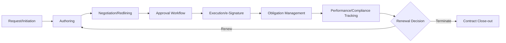
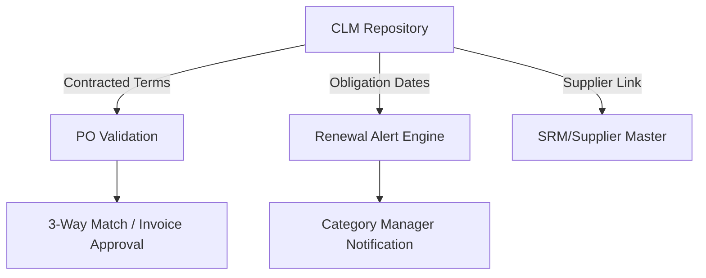

## Contract Lifecycle Management Tools

### Overview

Contract Lifecycle Management (CLM) tools manage the full lifecycle of a contract — from authoring and negotiation through execution, obligation tracking, and renewal or termination. Within the S2P architecture, CLM sits at the boundary between Source-to-Contract and Procure-to-Pay: it is where negotiated terms are codified and subsequently enforced against real transactions.

### The Contract Lifecycle Stages

### Core Capability Areas

**1. Contract Authoring**

- **Clause libraries** — pre-approved, legally vetted clause language organized by category/risk type, reducing negotiation cycle time and legal review burden.
- **Template management** — standardized templates by contract type (MSA, SOW, NDA, purchase agreement) with configurable variable fields.
- **Self-service drafting** — guided authoring wizards allowing category managers to generate compliant draft contracts without starting from a blank document, escalating only non-standard clauses to legal review.

**2. Negotiation and Redlining**

- Version control and redline tracking across negotiation rounds — critical for maintaining an audit trail of what changed and why.
- Collaborative editing (internal cross-functional stakeholders plus external supplier counterparties) within a controlled environment rather than uncontrolled email attachment exchanges.
- Clause risk-scoring: flagging deviations from standard clause library language for legal review, rather than requiring manual line-by-line comparison.

**3. Approval Workflows**

- Configurable routing based on contract value, category, risk tier, and clause deviations — typically mirroring the RACI/governance structures established for the relevant category team.
- Parallel vs. sequential approval routing depending on organizational policy (e.g., legal and finance reviewing simultaneously vs. sequentially).

**4. Execution**

- Native or integrated e-signature capability (e.g., embedded signature workflows) with legally compliant audit trails.
- Automatic filing into the contract repository upon execution, eliminating manual document management steps.

**5. Obligation and Milestone Management**

- Extraction and tracking of key dates and obligations: renewal deadlines, price escalation triggers, SLA commitments, termination notice windows.
- Automated alerting ahead of critical dates — a core value driver, since missed renewal notice windows are a common and costly failure mode in manual contract management.

$$\text{Alert Trigger Date} = \text{Obligation Date} - \text{Configured Lead Time}$$

**6. Compliance and Spend Linkage**

- Validation that POs and invoices align with contracted pricing/terms (feeding into the 3-way matching discussed in S2P architecture) — flags "off-contract" pricing discrepancies automatically.
- Contract compliance rate as a tracked metric, distinct from but related to Spend Under Management.

### AI-Assisted Capabilities (Contemporary Tooling)

Modern CLM platforms increasingly incorporate AI/ML capabilities for:

- **Clause extraction and metadata tagging** — automatically identifying key terms (termination dates, liability caps, governing law) from unstructured contract text, including legacy contracts not originally authored in the system.
- **Risk flagging** — comparing negotiated clauses against a preferred-language baseline and highlighting material deviations for legal attention.
- **Natural language contract search** — querying the repository in plain language ("show me all contracts with auto-renewal clauses expiring in Q2") rather than relying on manual metadata tagging alone.

[Inference] AI-assisted clause extraction is particularly valuable for organizations migrating a backlog of legacy contracts into a CLM system for the first time, since manual metadata tagging of an existing contract portfolio is typically the largest implementation bottleneck.

### Data Model and Integration Points

| Integration Point | Purpose |
| --- | --- |
| Supplier Master (SIM/SRM) | Link contracts to canonical supplier records |
| eProcurement/PO system | Validate PO pricing against contracted terms |
| ERP/Finance | Budget checks, GL coding for committed spend |
| e-Signature provider | Execution workflow (often embedded, sometimes third-party) |
| Category taxonomy | Classify contracts for reporting and governance routing |

### Governance Considerations by Category

- **Strategic contracts** — typically require the deepest clause customization (capacity reservation, joint IP terms, shared risk clauses) and highest-tier approval routing; obligation tracking is critical given the long-term, high-stakes nature discussed in category-specific dual sourcing.
- **Leverage contracts** — shorter terms with more frequent renewal/rebid cycles; CLM value here is primarily cycle-time reduction in repetitive sourcing events.
- **Bottleneck contracts** — obligation tracking around continuity clauses (supply guarantee terms, notice-of-discontinuation clauses) is disproportionately important relative to contract value.
- **Non-Critical contracts** — often handled via standard templates with minimal negotiation, where CLM value is primarily volume/administrative efficiency rather than risk mitigation.

### Common Implementation Pitfalls

- Treating CLM as a document repository only, without configuring obligation-tracking and alerting — this forfeits the tool's primary risk-mitigation value (missed renewal windows, unenforced SLAs).
- Failing to integrate CLM with the eProcurement/PO system, allowing off-contract pricing to go undetected at the transaction level.
- Incomplete legacy contract migration — a CLM system with only newly authored contracts still leaves the majority of an existing portfolio unmanaged and unmonitored.
- Overly rigid clause libraries that block legitimate negotiation flexibility for Strategic categories, driving negotiators to work outside the system.

### Practical Application Workflow

**Steps to implement or evaluate CLM tooling:**

1. Migrate and tag the existing contract portfolio (leveraging AI-assisted extraction where volume makes manual tagging impractical).
2. Configure clause libraries and approval workflows aligned to category governance tiers established in category team structures.
3. Integrate CLM with eProcurement/PO systems to enable automated contract-compliance validation.
4. Configure obligation/renewal alerting with lead times appropriate to each category's negotiation cycle length.
5. Establish contract compliance rate as a tracked KPI feeding into broader Spend Under Management reporting.

**Related Topics**

- Clause library design and legal risk-scoring frameworks
- Contract compliance rate vs. Spend Under Management metrics
- AI-assisted contract metadata extraction for legacy portfolio migration
- e-Signature and execution audit trail requirements
- Obligation/milestone alerting configuration by category tier