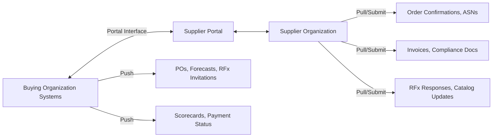
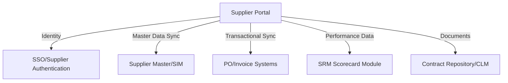

## Supplier Portals and Collaboration Platforms

### Overview

Supplier portals are the external-facing layer of the S2P/SRM technology stack — the interface through which suppliers themselves interact with a buying organization's procurement systems. Where internal SRM modules give category managers visibility into supplier performance, portals give suppliers reciprocal visibility and self-service capability, reducing manual coordination overhead and enabling the collaborative workflows that Strategic and Bottleneck categories in particular depend on.

### Core Purpose Within the S2P Architecture

### Core Capability Areas

**1. Onboarding and Self-Service Data Management**

- Supplier self-registration and profile maintenance (contact details, banking information, certifications, insurance documents) — shifts data-entry burden from internal staff to the supplier, improving accuracy since suppliers maintain their own records.
- Document expiration tracking (insurance certificates, quality certifications) with automated renewal reminders, feeding compliance status into the supplier risk profile.

**2. Transactional Self-Service**

- **PO visibility and acknowledgment** — suppliers view and confirm purchase orders directly rather than through email/fax, reducing order-confirmation lag.
- **Advance Shipment Notices (ASNs)** — suppliers submit shipment/delivery data that feeds receiving/logistics systems.
- **Invoice submission** — direct entry or e-invoicing integration, reducing manual AP data entry and accelerating the invoice-to-pay cycle discussed in S2P platform architecture.
- **Payment status visibility** — suppliers check payment status without contacting AP directly, reducing inbound inquiry volume.

**3. Sourcing Participation**

- RFx response submission directly within the portal, standardizing bid format for easier comparison versus disparate email/spreadsheet submissions.
- Catalog/pricing update submission for hosted catalog arrangements (relevant to the eProcurement catalog capability in S2P architecture).

**4. Collaboration and Planning**

- **Demand forecast sharing** — buyer-side forecasts pushed to suppliers to support their capacity planning, particularly valuable for Strategic and Bottleneck categories where supply continuity is a priority.
- **Joint Business Planning (JBP) workspaces** — shared roadmaps, innovation pipelines, and jointly tracked action items, extending the SRM collaboration capability described previously into a supplier-accessible interface.
- **Issue/CAPA collaboration** — suppliers can view and respond to quality or delivery non-conformance records directly, rather than through email threads disconnected from the system of record.

**5. Performance Transparency**

- Supplier-facing scorecard visibility — many organizations now expose performance scorecards directly to suppliers, creating a shared, objective basis for QBR (Quarterly Business Review) conversations rather than one-sided internal assessments.
- [Inference] Exposing scorecards directly to suppliers is generally more common in Strategic and Leverage categories, where the relationship or competitive dynamic benefits from transparency, than in Non-Critical categories where the administrative overhead of maintaining supplier-facing visibility isn't justified by the spend involved.

### Portal Architecture Patterns

| Pattern | Description | Trade-off |
| --- | --- | --- |
| Native module (embedded in S2P suite) | Portal is a built-in feature of the broader platform | Simplest integration, tied to suite vendor's roadmap |
| Standalone portal + API integration | Dedicated portal product integrated via API to core systems | More configurable UX, added integration maintenance |
| Network/marketplace model | Portal is shared infrastructure across many buyers (supplier maintains one profile serving multiple buying organizations) | Lower supplier onboarding friction, less buyer-specific customization |

### Security and Access Control Considerations

- **Role-based access** — a supplier's portal access must be scoped strictly to their own transactional and contractual data, with no visibility into other suppliers' pricing or performance (a critical control given the competitive-tension dynamics in Leverage category sourcing).
- **Authentication** — supplier-facing SSO or federated identity, distinct from internal employee SSO infrastructure, since supplier organizations are external identity domains.
- **Data segregation** — particularly important in multi-tenant marketplace/network portal models, where the platform vendor must guarantee data isolation between unrelated buying organizations sharing the same supplier.

### Adoption and Change Management Considerations

**Key Points**

- Portal value is directly proportional to supplier adoption — a portal that suppliers don't actively use reverts transactions back to email/phone, defeating its purpose.
- Smaller or less digitally mature suppliers (common in Bottleneck categories with niche/specialized vendors) may need additional onboarding support or simplified interfaces, whereas large Strategic suppliers often prefer direct system-to-system API integration over manual portal use.
- [Inference] Mandating portal usage as a contractual term is a common mechanism for driving adoption in Leverage categories with many interchangeable suppliers, but is less practical in Bottleneck categories where the buyer has limited negotiating leverage to impose such requirements.

### Common Implementation Pitfalls

- Building a portal without integrating it to core transactional systems, resulting in a static information-display tool rather than a functional self-service channel.
- Neglecting supplier-side usability — portals designed primarily around internal buyer workflows often create friction for supplier users, suppressing adoption.
- Inadequate access-control scoping, risking cross-supplier data exposure in shared portal infrastructure.
- Applying uniform portal-usage mandates across all category tiers rather than tailoring onboarding effort to supplier segment, echoing the broader category-differentiated SRM principle.

### Practical Application Workflow

**Steps to implement or evaluate a supplier portal:**

1. Define which S2P/SRM functions the portal must expose (PO acknowledgment, invoicing, RFx, scorecards, JBP) based on category governance needs.
2. Choose an architecture pattern (native, standalone+API, network) based on integration capacity and desired UX control.
3. Design role-based access control with strict data segregation, especially for shared/marketplace deployments.
4. Prioritize onboarding support and adoption incentives differently by supplier tier — high-touch support for Bottleneck/Strategic suppliers, contractual mandates for Leverage suppliers.
5. Integrate portal transactional data bidirectionally with core ERP, SRM, and CLM systems to avoid creating an isolated data silo.

**Related Topics**

- Supplier onboarding workflow design and self-service data governance
- Advance Shipment Notice (ASN) and EDI integration standards
- Joint Business Planning (JBP) workspace design for Strategic suppliers
- Role-based access control and multi-tenant data segregation patterns
- e-Invoicing and invoice-to-pay cycle acceleration