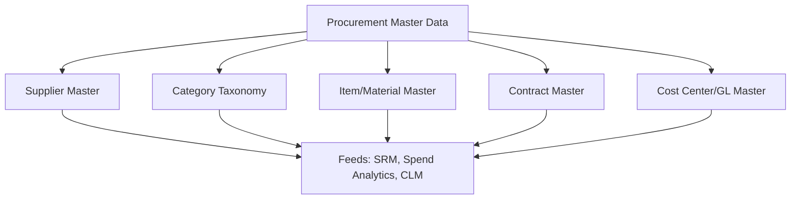
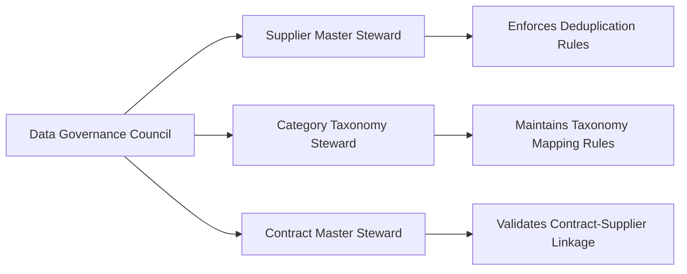

## Master Data Management and Data Governance

### Overview

Master Data Management (MDM) and data governance form the foundational layer underpinning every other S2P/SRM capability discussed so far. Spend analytics, SRM scorecards, CLM compliance validation, and supplier portal functionality all depend on clean, consistent, well-governed master data. Poor MDM is the most common root cause of procurement technology underperformance — a well-architected platform built on fragmented or duplicated data delivers unreliable outputs regardless of module sophistication.

### Core Master Data Domains in Procurement

**Key Points**

- **Supplier Master** — the canonical, deduplicated record of every supplier entity, typically the highest-risk domain for data quality issues due to name variations, multiple sites/subsidiaries, and decentralized entry points.
- **Category Taxonomy** — the hierarchical classification scheme (e.g., UNSPSC, custom enterprise taxonomy) that every spend transaction, contract, and sourcing event must map to consistently.
- **Item/Material Master** — product/service-level data, particularly critical in organizations with large SKU catalogs.
- **Contract Master** — canonical contract records linked bidirectionally to suppliers and categories, as discussed in CLM tools.
- **Cost Center/GL Master** — financial coding structures that connect procurement transactions to budget and accounting systems.

### The Supplier Duplication Problem

**Key Points**

- Supplier duplication is the most pervasive MDM failure mode: the same legal entity entered multiple times due to name variations ("Acme Corp" vs. "Acme Corporation" vs. "ACME CORP."), different addresses for different sites, or decentralized onboarding across business units without a matching check.
- Consequences cascade across every downstream system: fragmented spend visibility (undermining accurate Spend Under Management measurement), diluted negotiating leverage (the same supplier appears as several "small" suppliers rather than one consolidated relationship), and inconsistent risk scoring (risk data attached to one duplicate record while transactions flow through another).

$$\text{True Supplier Spend} = \sum_{i=1}^{n} \text{Spend}_{duplicate_i} \neq \text{Spend Visible in Any Single Record}$$

**Standard Deduplication Approach**

1. Fuzzy-matching algorithms comparing name, address, tax ID, and banking details to identify likely duplicates.
2. Golden-record creation — establishing a single authoritative record per legal entity, often using government-issued tax/business registration IDs as the primary matching key where available.
3. Ongoing match-and-merge governance at the point of new supplier creation, rather than only periodic cleanup cycles, to prevent duplicate accumulation from resuming immediately after cleanup.

### Data Governance Framework

**Key Points**

A data governance framework typically defines:

- **Data ownership** — designated stewards (often within procurement operations or a dedicated data governance function) accountable for master data domain quality, distinct from IT system ownership.
- **Data quality rules** — validation logic enforced at data entry (mandatory fields, format validation, duplicate-check gating before a new supplier record is created).
- **Change control process** — who can modify master data, and what approval is required for changes to sensitive fields (e.g., supplier banking details, a common fraud vector requiring stricter change controls than other fields).
- **Data quality metrics** — measured and reported on an ongoing basis, not just assessed at initial implementation.

| Governance Element | Example Metric |
| --- | --- |
| Completeness | % of supplier records with all mandatory fields populated |
| Duplication rate | Estimated % of supplier records that are duplicates |
| Taxonomy coverage | % of spend transactions successfully mapped to category taxonomy |
| Timeliness | Average lag between supplier data change and system update |

### Governance Organizational Model

[Inference] Organizations with a formal, cross-functional data governance council tend to sustain data quality more reliably over time than those relying solely on IT-driven periodic cleanup projects, since ongoing stewardship addresses the root causes (uncontrolled entry points, inconsistent taxonomy application) rather than only symptoms.

### Category Taxonomy Governance

- Consistent taxonomy application is the prerequisite for meaningful spend analytics and category-differentiated SRM strategy — if the same category of spend is tagged differently by different business units, the resulting Kraljic-based segmentation and SUM measurement become unreliable.
- Common approach: adopt an industry-standard taxonomy (UNSPSC is the most widely used) as a baseline, with a custom enterprise-specific extension layer for categories requiring finer granularity than the standard provides.
- Taxonomy mapping should occur as close to the transaction source as possible (at requisition/PO creation) rather than retroactively during analytics processing, to minimize manual reclassification effort.

### Data Quality Impact on Downstream Modules

| Downstream Capability | Impact of Poor Master Data |
| --- | --- |
| Spend Analytics / SUM | Fragmented, inaccurate spend visibility; unreliable SUM percentage |
| SRM Scorecards | Performance data split across duplicate supplier records, distorting KPIs |
| CLM Compliance Validation | PO-to-contract matching fails when supplier/category references don't align |
| Category Strategy (Kraljic) | Miscategorized spend leads to incorrect quadrant assignment and misapplied SRM intensity |
| Supplier Portal | Suppliers may access or see data tied to the wrong duplicate record |

### Common Implementation Pitfalls

- Treating MDM cleanup as a one-time pre-implementation project rather than an ongoing governance function — data quality degrades again without sustained stewardship.
- Allowing decentralized, ungoverned supplier or category creation across business units without a centralized approval/matching gate.
- Underestimating the effort required for legacy data cleanup during a new S2P/SRM platform implementation — this is frequently the largest and most underestimated component of implementation timelines.
- Failing to assign clear data ownership, leaving master data quality as "everyone's responsibility" in practice, meaning no one's.

### Practical Application Workflow

**Steps to establish MDM and data governance:**

1. Inventory current master data domains and assess data quality baseline (completeness, duplication rate, taxonomy coverage).
2. Establish golden-record deduplication for the supplier master using fuzzy-matching against tax ID/registration numbers as the primary key.
3. Define or adopt a category taxonomy (e.g., UNSPSC-based) and enforce consistent mapping at the point of transaction entry.
4. Assign data stewardship ownership per domain and establish a cross-functional governance council for ongoing oversight.
5. Implement entry-point validation controls (duplicate-check gating, mandatory field enforcement) to prevent data quality degradation from resuming after initial cleanup.

**Related Topics**

- Supplier deduplication algorithms and golden-record matching keys
- UNSPSC and enterprise category taxonomy design
- Data stewardship organizational models and governance councils
- Master data quality metrics and ongoing monitoring dashboards
- Legacy data migration strategy for S2P platform implementations