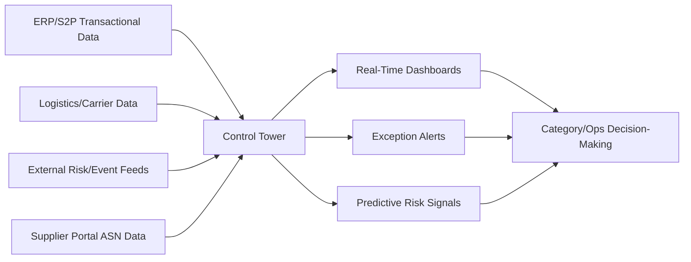
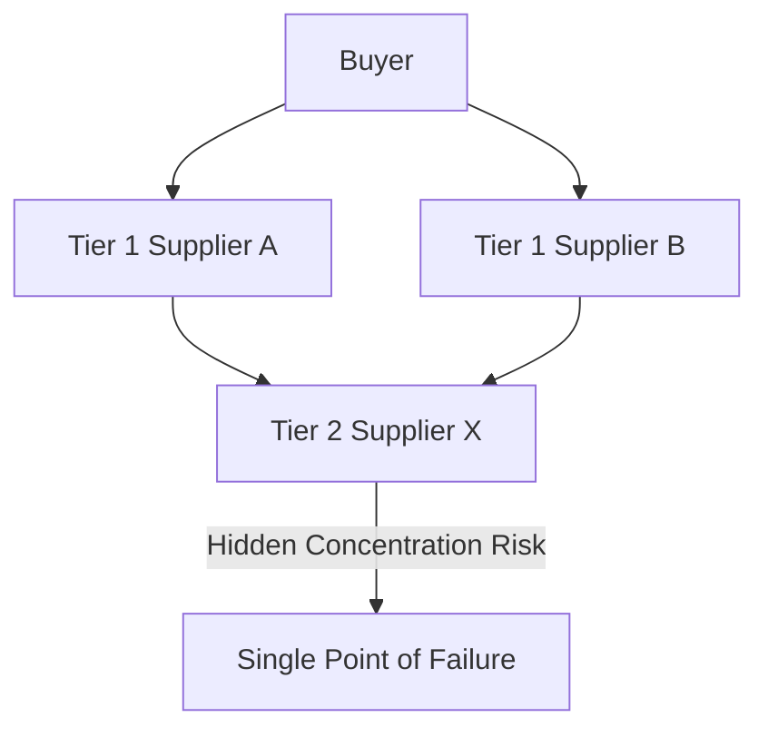

## Supply Chain Visibility and Control Towers

### Overview

Supply chain visibility platforms — commonly architected as "control towers" — provide real-time, end-to-end tracking of orders, shipments, inventory, and supplier events across the extended supply chain. Where SRM software focuses on relationship and performance governance, and CLM manages contractual terms, control towers address the operational question of "where is everything right now, and what's at risk of disruption" — closing the loop between category risk strategy and real-time execution data.

### Positioning Within the Broader Technology Stack

### Core Capability Areas

**1. Shipment and Order Tracking**

- Real-time status aggregation across POs, ASNs (Advance Shipment Notices from supplier portals), and carrier/logistics data into a single unified view rather than siloed per-system tracking.
- Milestone tracking against planned vs. actual timelines (order placed, produced, shipped, in-transit, delivered) with automatic variance flagging.

**2. Exception Management**

- Automated alerts when shipments deviate from expected timelines, quantities, or routes — replacing manual, reactive discovery of delays.
- Configurable exception thresholds and escalation routing, often mirroring the category-tiered governance structures discussed earlier (tighter thresholds and faster escalation for Strategic/Bottleneck category shipments than Leverage/Non-Critical).

**3. Risk Event Monitoring**

- Ingestion of external event feeds — weather, geopolitical events, port congestion, natural disasters — mapped against known supplier locations and shipment routes to proactively flag at-risk orders before a delay is manually reported.
- [Inference] This external-event correlation capability is most valuable for Strategic and Bottleneck categories, where the continuity-risk stakes discussed in category-specific dual sourcing justify the investment in proactive monitoring; applying the same monitoring depth to Non-Critical shipments typically yields limited additional value relative to cost.

**4. Inventory Visibility**

- Multi-tier inventory visibility — not just the buyer's own stock, but visibility into supplier-held inventory and, where data-sharing agreements allow, sub-tier (Tier 2/3) supplier inventory positions.
- Particularly relevant for Bottleneck categories, where buffer inventory strategy (discussed in category-specific dual sourcing) depends on accurate, timely visibility into actual stock positions rather than static reorder-point assumptions.

**5. Multi-Tier Supply Chain Mapping**

- Visualization of the supply network beyond direct (Tier 1) suppliers into sub-tier suppliers, increasingly important for both risk management and regulatory compliance (e.g., conflict minerals reporting, forced-labor due diligence regulations).
- Mapping sub-tier dependencies can reveal hidden concentration risk — multiple Tier 1 suppliers relying on the same Tier 2 source, creating correlated failure risk invisible at the direct-supplier level.

### Predictive and Analytical Capabilities

- **Predictive ETA modeling** — using historical transit data and current conditions to forecast delivery dates more accurately than static carrier estimates.
- **Risk scoring integration** — control tower risk signals often feed into (or draw from) the same supplier risk-scoring models used in SRM software, creating a unified risk view rather than disconnected risk assessments across systems.

$$\text{Disruption Probability} = f(\text{Route Risk}, \text{Supplier Risk Score}, \text{External Event Proximity})$$

### Architecture and Integration Requirements

| Data Source | Typical Integration Method | Purpose |
| --- | --- | --- |
| ERP/TMS (Transportation Management) | API/EDI | Order and shipment transactional data |
| Carrier/3PL systems | EDI 214 (shipment status), API | Real-time transit tracking |
| Supplier Portal | API | ASN and production status data |
| External risk feeds | API (weather, geopolitical, news) | Proactive disruption signals |
| IoT/telematics (where used) | API/direct device integration | Real-time location/condition tracking for high-value shipments |

[Inference] Control tower platforms typically require broader and more heterogeneous data integration than other S2P modules discussed previously, since they must ingest not only internal transactional data but also external logistics-partner and risk-intelligence feeds — this generally makes control tower implementations more integration-intensive than CLM or SRM module rollouts.

### Governance and Organizational Fit

- Control tower dashboards are typically consumed by both category managers (strategic risk decisions) and operational/logistics teams (day-to-day exception handling) — requiring role-differentiated views of the same underlying data.
- Alert routing and escalation authority should align with the category governance structures and RACI frameworks established for the relevant category team, so a Strategic-category disruption alert reaches the appropriate executive sponsor rather than only an operational buyer.

### Common Implementation Pitfalls

- Deploying a control tower without first solving the master data and integration foundation discussed in MDM/data governance — a control tower ingesting poor-quality supplier or shipment data produces unreliable exception alerts.
- Applying uniform monitoring intensity across all category tiers rather than concentrating proactive risk-monitoring investment on Strategic/Bottleneck categories where disruption impact is highest.
- Alert fatigue from poorly tuned exception thresholds — too-sensitive thresholds generate excessive false-positive alerts, causing users to disengage from the notification system entirely.
- Treating multi-tier mapping as a one-time exercise rather than maintaining it as sub-tier supplier relationships evolve.

### Practical Application Workflow

**Steps to implement or evaluate a control tower:**

1. Establish the integration foundation — ERP, carrier/logistics, and supplier portal data feeds — before layering on predictive/risk capabilities.
2. Prioritize deployment scope around Strategic and Bottleneck categories first, where disruption risk and continuity stakes justify the investment.
3. Configure exception thresholds and alert routing aligned to category-tiered governance and RACI escalation paths.
4. Extend visibility to multi-tier (sub-tier) supplier mapping for categories with known concentration-risk exposure.
5. Unify control tower risk signals with existing SRM risk-scoring models rather than maintaining parallel, disconnected risk assessments.

**Related Topics**

- Multi-tier supply chain mapping and sub-tier concentration risk analysis
- Predictive ETA modeling and disruption probability scoring
- EDI 214 shipment status integration and carrier/TMS data feeds
- Alert threshold tuning and exception-management workflow design
- Conflict minerals and forced-labor due diligence reporting requirements