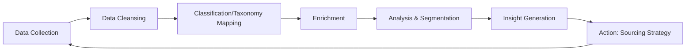
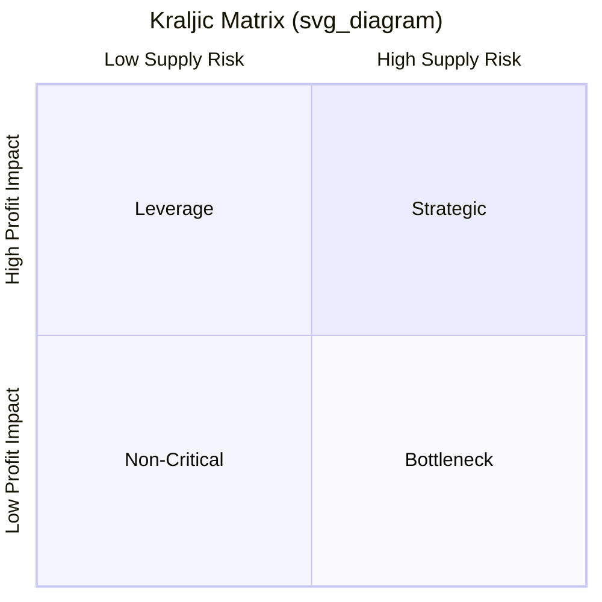

## Spend Analytics Fundamentals

### Definition and Scope

Spend analytics is the systematic process of collecting, cleansing, classifying, and analyzing procurement expenditure data to generate actionable insights for cost reduction, risk management, and strategic sourcing decisions. It forms the analytical backbone of mature Supplier Relationship Management (SRM) and dual sourcing programs, providing the visibility required to determine which categories, suppliers, and regions warrant multi-sourcing strategies.

**Key Points**

- Spend analytics answers three foundational questions: *What are we buying?*, *From whom?*, and *At what price/terms?*
- It is distinct from simple spend reporting: analytics implies classification, enrichment, and pattern detection, not just aggregation
- Mature spend analytics programs achieve 85–95% spend visibility (classified and mapped to a taxonomy), a benchmark widely cited in procurement maturity models [Inference]

### The Spend Analytics Cycle



#### 1. Data Collection

Spend data is aggregated from multiple transactional systems:

- **ERP systems** (SAP, Oracle) — purchase orders, invoices, GL postings
- **P2P platforms** (Coupa, Ariba) — requisitions, contracts, PO line items
- **T&E systems** — travel and expense data, often a blind spot in spend visibility
- **P-card/credit card feeds** — tail spend often invisible to central procurement
- **Bank/AP statements** — reconciliation source for verifying completeness

**Example**

```sql
-- Simplified extraction of AP invoice line data for spend analytics staging
SELECT
    inv.invoice_id,
    inv.vendor_id,
    v.vendor_name,
    inv.gl_account,
    inv.line_amount,
    inv.currency_code,
    inv.invoice_date,
    inv.cost_center,
    po.po_number,
    po.commodity_code
FROM ap_invoice_line inv
LEFT JOIN vendor_master v ON inv.vendor_id = v.vendor_id
LEFT JOIN purchase_order po ON inv.po_number = po.po_number
WHERE inv.invoice_date >= '2025-01-01';
```

#### 2. Data Cleansing

Raw procurement data is notoriously dirty. Core cleansing tasks include:

- **Vendor normalization**: deduplicating "IBM Corp", "I.B.M.", "International Business Machines" into a single canonical supplier record
- **Currency normalization**: converting all transactions to a base reporting currency using consistent FX rates (spot vs. average-rate methodology)
- **Duplicate detection**: identifying repeated invoice entries via fuzzy matching on amount, date, and vendor
- **Missing field imputation**: handling blank commodity codes, cost centers, or GL codes

[Inference] Vendor normalization is frequently cited as consuming the largest share of effort in spend analytics implementations, though the exact proportion varies significantly by organization and data source quality.

#### 3. Classification / Taxonomy Mapping

Transactions are mapped to a standardized commodity/category taxonomy. The two dominant industry frameworks are:

| Taxonomy | Structure | Typical Use |
| --- | --- | --- |
| **UNSPSC** (United Nations Standard Products and Services Code) | 4-level hierarchy: Segment → Family → Class → Commodity | Widely used in P2P systems, e-procurement catalogs |
| **Custom/Hybrid taxonomy** | Organization-specific category tree, often mapped to UNSPSC as a base layer | Common in mature procurement organizations aligning categories to sourcing team structure |

Classification is performed via:

- **Rule-based mapping**: keyword/GL-code-to-category lookup tables
- **Machine learning classifiers**: supervised models (e.g., gradient-boosted trees or transformer-based text classifiers) trained on historical vendor/description-to-category labels, used when manual mapping doesn't scale
- **Hybrid approach**: ML pre-classification with human-in-the-loop review for low-confidence predictions (typically confidence score below 80–85%) [Inference]

#### 4. Enrichment

Classified spend is enriched with third-party and internal reference data:

- **Supplier risk scores** (financial health, ESG ratings, geopolitical exposure)
- **Diversity classifications** (minority-owned, women-owned, veteran-owned status)
- **Contract linkage** — mapping transactions back to governing contracts to measure contract compliance/maverick spend
- **Market pricing indices** — benchmarking paid prices against commodity indices (e.g., metals, freight)

#### 5. Analysis and Segmentation

Common analytical lenses applied to cleansed, classified spend:

- **Pareto (80/20) analysis** — identifying the small number of suppliers/categories driving the majority of spend
- **Maverick spend analysis** — spend occurring outside approved contracts/catalogs
- **Price variance analysis** — same SKU/commodity purchased at different prices across business units
- **Supplier concentration analysis** — critical input to dual sourcing decisions, measuring single-source dependency risk

### Supplier Concentration and Dual Sourcing Linkage

Spend analytics directly informs dual sourcing decisions through concentration metrics.

**Herfindahl-Hirschman Index (HHI)** applied to supplier spend within a category:

$$HHI=\sum_{i=1}^{n}s_i^2\times10000$$

where $s_i$ is supplier $i$'s share of category spend (as a decimal).

- $HHI>2500$: highly concentrated (strong dual/multi-sourcing candidate)
- $1500\le HHI\le2500$: moderately concentrated
- $HHI<1500$: unconcentrated (competitive supply base)

**Example**

A category with two suppliers holding 70% and 30% of spend:

$$HHI=(0.70^2+0.30^2)\times10000=(0.49+0.09)\times10000=5800$$

An HHI of 5800 signals extreme concentration — a primary trigger for evaluating a second qualified source.

### Kraljic Matrix as Analytical Output

Spend analytics feeds the Kraljic Portfolio Matrix, positioning categories by **supply risk** vs. **profit impact**, directly determining which categories require dual sourcing:



- **Strategic items** (high risk, high impact): prime dual-sourcing candidates
- **Bottleneck items** (high risk, low impact): dual sourcing evaluated case-by-case due to low supplier availability
- **Leverage items** (low risk, high impact): competitive bidding rather than dual sourcing typically sufficient
- **Non-critical items**: single sourcing/catalog buying usually adequate

### Key Metrics and KPIs

| Metric | Formula/Definition | Purpose |
| --- | --- | --- |
| Spend Under Management (SUM) | Managed spend ÷ Total spend | Measures procurement's controlled influence |
| Contract Compliance Rate | On-contract spend ÷ Total addressable spend | Detects maverick buying |
| Tail Spend Ratio | Spend in bottom 80% of suppliers ÷ Total spend | Identifies consolidation opportunities |
| Savings Realization Rate | Realized savings ÷ Identified savings | Tracks sourcing initiative execution |
| Single-Source Spend % | Spend with sole suppliers ÷ Total category spend | Direct dual sourcing risk indicator |

### Technology Stack

- **Dedicated spend analytics platforms**: SAP Ariba Spend Analysis, Coupa Spend Guard, Sievo, Zycus, Suplari
- **BI/visualization layers**: Power BI, Tableau, often sitting atop a cleansed spend data warehouse
- **Data pipeline/ETL**: dbt, Talend, or custom Python/SQL pipelines for cleansing and classification
- **ML classification services**: often built on gradient-boosted trees (XGBoost/LightGBM) or fine-tuned NLP models for description-to-category mapping [Inference — implementation varies by vendor and is rarely publicly disclosed in detail]

### Common Pitfalls

- **Incomplete data capture**: excluding P-card, T&E, or subsidiary ERP instances undermines the 80/20 analysis and concentration metrics
- **Stale taxonomy**: failing to update category structures as the business evolves reduces classification accuracy over time
- **Over-reliance on automated classification** without periodic accuracy audits, allowing category drift to go undetected
- **Ignoring currency/inflation normalization**, which can distort year-over-year trend analysis

**Conclusion**

Spend analytics is the diagnostic foundation upon which dual sourcing strategy is built: it identifies where supplier concentration creates risk (via HHI and Pareto analysis), positions categories for strategic treatment (via the Kraljic Matrix), and quantifies the addressable spend base against which sourcing savings and risk mitigation are measured. Without accurate classification and enrichment, dual sourcing decisions are made on incomplete visibility.

**Related Topics**

- UNSPSC Taxonomy Design and Custom Category Mapping
- Maverick Spend Detection and Contract Compliance Analytics
- Supplier Risk Scoring Models (Financial, ESG, Geopolitical)
- Herfindahl-Hirschman Index Applications in Category Management
- Kraljic Matrix: Strategic Sourcing Segmentation
- Tail Spend Management and Consolidation Strategies
- Machine Learning for Automated Spend Classification