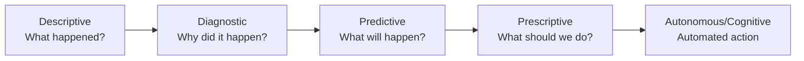
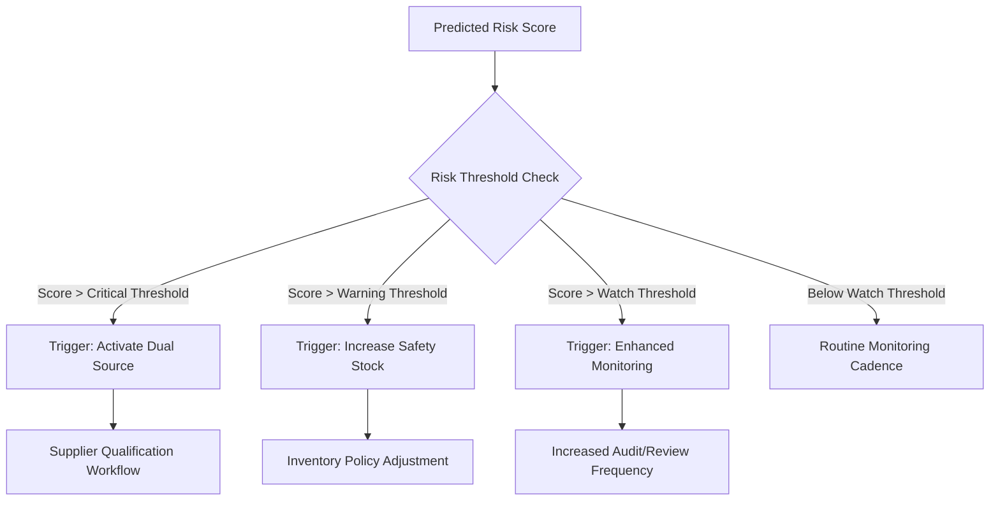

## Predictive and Prescriptive Supplier Risk Analytics


### Definition and Scope

Predictive and prescriptive supplier risk analytics extends traditional (descriptive/diagnostic) spend and risk reporting into forward-looking territory. **Predictive analytics** forecasts the likelihood of future supplier disruption events (financial distress, delivery failure, quality breakdown, geopolitical exposure). **Prescriptive analytics** goes further, recommending specific mitigating actions — including dual/multi-sourcing triggers — based on those forecasts.

**Key Points**

- Descriptive analytics answers "what happened"; predictive answers "what is likely to happen"; prescriptive answers "what should we do about it"
- These capabilities sit at the top of the procurement analytics maturity curve, requiring reliable descriptive/diagnostic data (spend analytics, supplier master data) as a prerequisite
- Output directly drives dual sourcing activation decisions, safety stock policy, and contract renegotiation timing

### Analytics Maturity Progression



### Data Inputs for Risk Models

Predictive supplier risk models typically ingest a blend of internal and external signals:

| Category | Examples | Update Frequency |
| --- | --- | --- |
| Financial | Credit ratings (D&B, Moody's), Altman Z-score, days payable outstanding, debt-to-equity | Monthly/Quarterly |
| Operational | On-time delivery %, defect/PPM rates, order fill rate, lead time variance | Weekly/Real-time |
| Geopolitical | Country risk indices, sanctions lists, trade policy shifts | Continuous/Event-driven |
| Environmental/Climate | Natural disaster exposure, facility geolocation overlay with weather/seismic data | Continuous |
| News/Sentiment | NLP-scored news sentiment, social media signals, litigation records | Real-time (streaming) |
| ESG | Labor practice violations, environmental compliance, audit findings | Quarterly/Annual |
| Cyber | Vendor breach history, security posture scores (e.g., BitSight, SecurityScorecard) | Continuous |

### Predictive Modeling Approaches

#### 1. Financial Distress Prediction

The **Altman Z-score** remains a widely used baseline for supplier bankruptcy risk, particularly for public suppliers:

$$Z=1.2X_1+1.4X_2+3.3X_3+0.6X_4+1.0X_5$$

Where:

- $X_1$ = Working Capital / Total Assets
- $X_2$ = Retained Earnings / Total Assets
- $X_3$ = EBIT / Total Assets
- $X_4$ = Market Value of Equity / Total Liabilities
- $X_5$ = Sales / Total Assets

Interpretation: $Z>2.99$ (safe zone), $1.81\le Z\le2.99$ (grey zone), $Z<1.81$ (distress zone). [Inference] Thresholds are commonly cited from the original model but are sometimes recalibrated by risk vendors for sector-specific use.

Modern implementations supplement or replace Z-score with **gradient-boosted classifiers** (XGBoost, LightGBM) trained on labeled historical default/distress events, since Z-score alone captures only accounting-statement signals and misses operational/news-based risk.

#### 2. Delivery/Operational Disruption Prediction

Time-series and survival-analysis techniques applied to operational KPIs:

- **Survival analysis** (Cox proportional hazards) modeling time-to-disruption events
- **Anomaly detection** on delivery/lead-time series (e.g., isolation forests, seasonal-hybrid ESD) to flag deviating supplier behavior before it manifests as a missed order
- **Classification models** predicting probability of an on-time-delivery failure in the next N periods, using features like recent OTD trend, capacity utilization signals, and order backlog

**Example**

```python
# Simplified feature set for a gradient-boosted supplier disruption classifier
import pandas as pd
from sklearn.model_selection import train_test_split
import xgboost as xgb

features = [
    'otd_trend_90d', 'defect_rate_ppm', 'altman_z_score',
    'news_sentiment_30d', 'country_risk_index',
    'single_source_flag', 'days_since_last_audit',
    'financial_leverage_ratio', 'order_concentration_hhi'
]

X_train, X_test, y_train, y_test = train_test_split(
    df[features], df['disruption_within_90d'], test_size=0.2, random_state=42
)

model = xgb.XGBClassifier(
    n_estimators=300, max_depth=5, learning_rate=0.05,
    eval_metric='auc'
)
model.fit(X_train, y_train)

# Feature importance guides which risk drivers to monitor operationally
importance = pd.Series(model.feature_importances_, index=features).sort_values(ascending=False)
```

[Inference] Feature sets and exact model architectures vary substantially by vendor and are rarely fully disclosed publicly; the above represents a standard, illustrative pattern rather than a documented reference implementation.

#### 3. NLP-Based News/Sentiment Risk Signals

Unstructured text (news feeds, regulatory filings, social media) is processed via:

- **Named Entity Recognition (NER)** to link news events to specific supplier entities (handling entity resolution across name variants/subsidiaries)
- **Sentiment/event classification** (transformer-based classifiers, e.g., fine-tuned BERT variants) categorizing events as bankruptcy risk, labor dispute, regulatory action, M&A activity, natural disaster impact
- **Signal aggregation** into a rolling risk score, often decayed over time (exponential decay weighting recent events more heavily)

### Prescriptive Layer: From Prediction to Action

Prescriptive analytics translates risk scores into recommended actions via decision rules or optimization models.



#### Prescriptive Techniques

- **Rule-based triggers**: simple threshold logic (e.g., "if risk score > 80th percentile AND single-sourced, flag for dual-sourcing evaluation")
- **Optimization models**: linear/mixed-integer programming to determine optimal sourcing allocation across suppliers given risk-adjusted cost, balancing cost minimization against risk diversification
- **Reinforcement learning / simulation** (Monte Carlo simulation of supply chain disruption scenarios) to stress-test dual-sourcing allocation strategies before implementation [Speculation — increasingly discussed in procurement technology literature but adoption maturity is not well-documented]

**Example: Risk-Adjusted Sourcing Allocation (simplified)**

A prescriptive allocation model minimizing risk-adjusted cost across two qualified suppliers:

$$\min\sum_{i=1}^{2}(C_i+\lambda\cdot R_i)\cdot Q_i$$

subject to $\sum_i Q_i=D$ (total demand) and $Q_i\le Cap_i$

Where $C_i$ = unit cost from supplier $i$, $R_i$ = risk score, $\lambda$ = risk-aversion weighting parameter, $Q_i$ = allocated quantity, $D$ = total demand, $Cap_i$ = supplier capacity.

Increasing $\lambda$ shifts allocation toward diversification (favoring dual sourcing) even at higher nominal cost — a direct, quantifiable expression of risk-cost tradeoff.

### Linking to Dual Sourcing Decision Frameworks

Predictive risk scores feed directly into dual-sourcing activation logic layered on top of the Kraljic Matrix and HHI concentration analysis:

| Risk Signal | Prescriptive Action |
| --- | --- |
| Rising financial distress probability (Z-score decline trend) | Initiate backup supplier qualification |
| Geopolitical/country risk spike | Evaluate nearshoring or regional dual source |
| Sustained OTD degradation | Rebalance volume allocation toward secondary source |
| Cyber risk score deterioration | Require security remediation or parallel-source critical components |
| ESG violation flagged | Trigger supplier development plan or sourcing diversification |

### Technology and Platform Landscape

- **Dedicated supplier risk platforms**: Resilinc, Everstream Analytics, Interos, Prewave, Riskmethods (now part of Sphera)
- **Financial risk data providers**: Dun & Bradstreet, Moody's, Creditsafe
- **ERP-embedded risk modules**: SAP Ariba Supplier Risk, Coupa Risk Assess
- **Custom ML pipelines**: often built on Python (scikit-learn, XGBoost), orchestrated via Airflow, with feature stores feeding real-time scoring APIs

[Inference] Specific model architectures, training data, and accuracy benchmarks used by commercial risk platforms are proprietary and not publicly disclosed in verifiable detail; descriptions of their internals should be treated as generalized industry patterns rather than documented specifications.

### Common Pitfalls

- **Model overfitting to historical disruptions**: past disruption patterns (e.g., a specific historical event) may not generalize to novel risk types
- **Data latency**: financial statement data (quarterly) lags operational reality; over-reliance on stale financial signals delays detection
- **Alert fatigue**: overly sensitive thresholds generate excessive low-value alerts, degrading trust in the system and causing teams to ignore genuine warnings
- **Ignoring second-order/network risk**: failing to model risk propagation through sub-tier (Tier 2/3) suppliers feeding into a Tier 1 supplier
- **Static risk-aversion parameters**: failing to adjust $\lambda$ or thresholds by category criticality (Kraljic quadrant), applying uniform risk tolerance across strategic and non-critical spend

**Conclusion**

Predictive and prescriptive supplier risk analytics operationalizes the risk half of the dual-sourcing equation: where spend analytics and the Kraljic Matrix identify *which* categories carry strategic risk, predictive models forecast *when* that risk is likely to materialize, and prescriptive logic converts that forecast into concrete sourcing actions — up to and including activation of a qualified second source. The reliability of this entire layer depends on the completeness of the underlying supplier master data and spend classification established in earlier analytics stages.

**Related Topics**

- Supplier Financial Health Scoring and Altman Z-Score Applications
- Sub-Tier (N-Tier) Supply Chain Risk Mapping
- Monte Carlo Simulation for Supply Chain Disruption Planning
- Risk-Adjusted Sourcing Optimization Models
- NLP-Based Supplier News and Sentiment Monitoring
- Dual Sourcing Activation Frameworks and Trigger Thresholds
- Supplier Risk Platform Selection Criteria (Resilinc, Interos, Everstream)