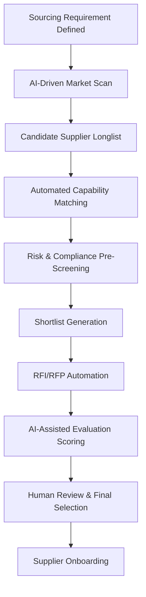
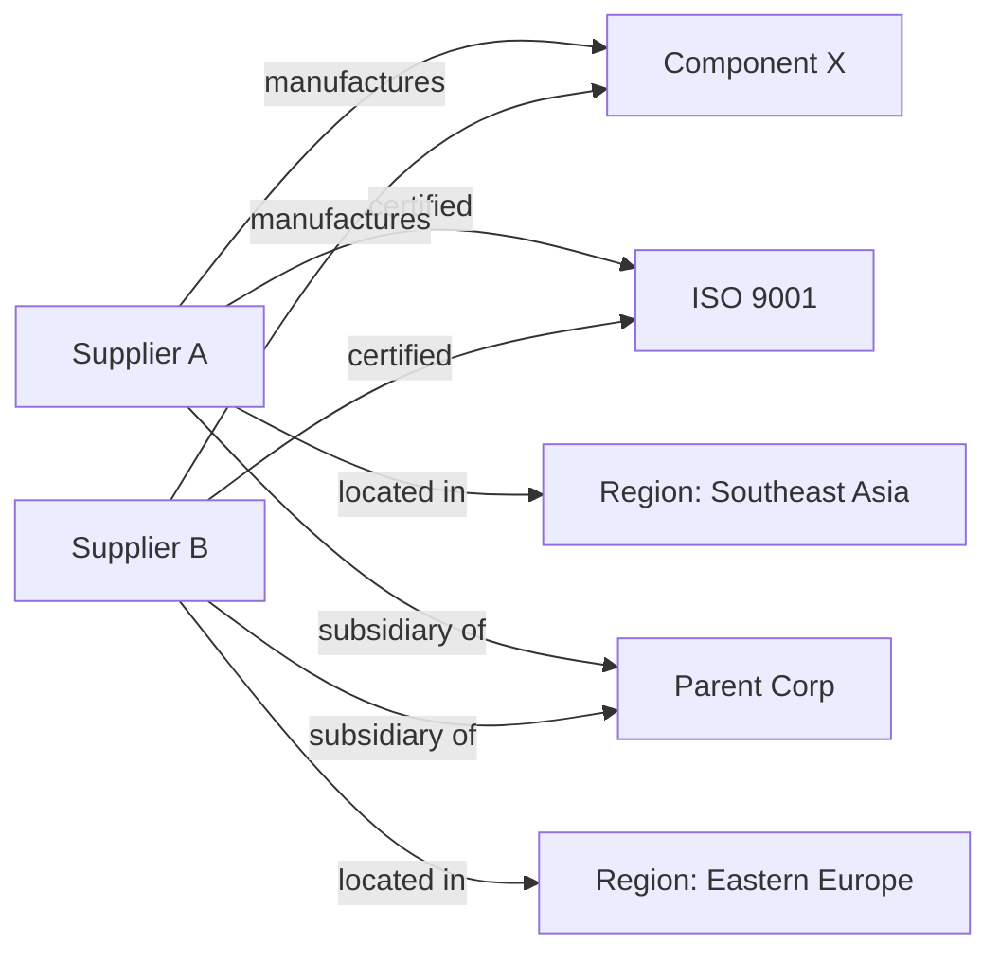

## AI-Enabled Supplier Discovery and Evaluation

### Definition and Scope

AI-enabled supplier discovery and evaluation applies machine learning, natural language processing, and knowledge-graph techniques to automate the identification of potential new suppliers and the assessment of their qualification for onboarding — accelerating a process traditionally reliant on manual market research, RFI distribution, and reference checks. This capability is a critical enabler of dual sourcing: it compresses the time and cost required to identify and qualify a viable second source, which is often the primary bottleneck preventing organizations from acting on risk signals identified in predictive risk analytics.

**Key Points**

- Discovery answers "who could supply this?"; evaluation answers "should we qualify them?"
- AI reduces reliance on incumbent-supplier bias and static preferred-vendor lists by systematically scanning broader market data
- Directly shortens the dual-sourcing activation timeline identified as a gap in predictive/prescriptive risk workflows

### End-to-End Process Flow



### Discovery Techniques

#### 1. Web and Document-Based Market Scanning

- **Web crawling/scraping pipelines** that continuously index supplier websites, industry directories, trade association listings, and manufacturing registries
- **Named Entity Recognition (NER)** and **entity resolution** to extract and deduplicate supplier identities (legal entity names, subsidiaries, DBA names) from unstructured sources
- **Document parsing (OCR + NLP)** applied to trade show catalogs, industry reports, and certification databases to extract capability metadata

#### 2. Knowledge Graph-Based Discovery

Suppliers, products, certifications, and relationships are modeled as a graph, enabling multi-hop queries that flat databases cannot answer efficiently:



This structure surfaces non-obvious risk (e.g., two "independent" suppliers sharing a common parent, undermining a dual-sourcing strategy intended to diversify risk) — a pattern difficult to detect in relational/tabular supplier master data.

**Example query pattern (conceptual, graph database — e.g., Neo4j/Cypher):**

```cypher
MATCH (s:Supplier)-[:MANUFACTURES]->(p:Product {name: 'Component X'})
MATCH (s)-[:CERTIFIED]->(c:Certification {name: 'ISO 9001'})
WHERE NOT (s)-[:SUBSIDIARY_OF]->(:Parent {name: 'Incumbent Parent Corp'})
RETURN s.name, s.region, s.capacity_estimate
ORDER BY s.capacity_estimate DESC
```

#### 3. Semantic/Vector Search for Capability Matching

Rather than exact keyword matching on commodity codes, embedding-based semantic search matches sourcing requirements to supplier capability descriptions:

- Requirement text and supplier capability profiles are encoded into vector embeddings (e.g., sentence-transformer models)
- Cosine similarity ranks candidate suppliers by semantic fit, capturing matches that keyword search misses (e.g., "precision-machined aluminum housings" matching a supplier profile describing "CNC-machined enclosures" despite no shared vocabulary)

```python
# Simplified semantic supplier-matching pattern
from sentence_transformers import SentenceTransformer, util

model = SentenceTransformer('all-MiniLM-L6-v2')

requirement = "Precision-machined aluminum housings for industrial sensors"
supplier_profiles = [
    "CNC-machined enclosures, aerospace-grade aluminum, ISO 9001 certified",
    "Injection-molded plastic components for consumer electronics",
    "Sheet metal fabrication and precision milling for industrial equipment",
]

req_embedding = model.encode(requirement, convert_to_tensor=True)
profile_embeddings = model.encode(supplier_profiles, convert_to_tensor=True)

similarities = util.cos_sim(req_embedding, profile_embeddings)
ranked = sorted(
    zip(supplier_profiles, similarities[0].tolist()),
    key=lambda x: x[1], reverse=True
)
```

[Inference] Specific embedding models and similarity thresholds used in commercial supplier-discovery platforms are proprietary; the pattern above illustrates a standard, generalizable technique rather than a documented vendor implementation.

### Evaluation Techniques

#### 1. Automated Capability and Compliance Pre-Screening

AI systems cross-reference candidate suppliers against structured qualification criteria before human review:

| Screening Dimension | Automated Check |
| --- | --- |
| Certifications | OCR/NLP extraction and validation of certificate authenticity against issuing-body databases |
| Financial viability | Automated pull of credit scores, Altman Z-score (see predictive risk analytics) |
| Sanctions/watchlist screening | Automated matching against OFAC, EU sanctions, denied-party lists using fuzzy name matching |
| Geographic/regulatory fit | Rule-based checks against export control classifications and regional trade agreements |
| Capacity estimation | NLP-derived estimates from public filings, job postings (hiring volume as a capacity proxy), and facility size data [Speculation — capacity estimation from indirect signals is a plausible technique but not a standardized, well-documented industry practice] |

#### 2. AI-Assisted RFI/RFP Analysis

- **Automated RFI response parsing**: NLP extraction of structured answers from free-text or semi-structured RFI responses, populating comparison matrices without manual data entry
- **Response scoring models**: weighted scoring algorithms combining extracted quantitative answers (price, lead time, capacity) with qualitative response quality (completeness, specificity) into a composite score
- **Anomaly/inconsistency detection**: flagging RFI responses with internal contradictions (e.g., claimed certifications not evidenced in submitted documentation) for human follow-up

#### 3. Composite Supplier Scoring Models

A typical automated pre-qualification score blends multiple weighted dimensions:

$$S=w_1F+w_2Q+w_3D+w_4C+w_5R$$

Where $F$ = financial health score, $Q$ = quality/certification score, $D$ = delivery capability score, $C$ = compliance/sanctions clearance, $R$ = risk score (from predictive risk analytics), and $w_i$ are category-specific weights (e.g., strategic Kraljic-quadrant categories weighting $R$ more heavily than leverage categories).

**Example**

```python
weights = {'financial': 0.25, 'quality': 0.25, 'delivery': 0.20, 'compliance': 0.15, 'risk': 0.15}

def composite_score(supplier_scores, weights):
    return sum(supplier_scores[k] * weights[k] for k in weights)

candidate = {'financial': 78, 'quality': 85, 'delivery': 70, 'compliance': 100, 'risk': 65}
score = composite_score(candidate, weights)  # 79.75
```

### Application to Dual Sourcing

AI-enabled discovery directly addresses the core operational constraint in dual sourcing: identifying a *genuinely independent, qualified* second source quickly.

- **Diversification verification**: knowledge-graph analysis confirms candidate second-source suppliers don't share upstream dependencies (same raw material supplier, same sub-tier manufacturer, same parent company) with the incumbent — a failure mode that undermines the risk-reduction purpose of dual sourcing
- **Accelerated qualification cycles**: automated pre-screening compresses supplier qualification timelines, critical when a predictive risk model has flagged a time-sensitive disruption risk
- **Geographic diversification search**: semantic and geographic filtering surface candidates in different risk regions from the incumbent, directly supporting geopolitical risk mitigation identified in prescriptive risk workflows

### Technology and Platform Landscape

- **AI-native discovery platforms**: SAP Ariba Discovery, Scoutbee, TealBook, Globality
- **Knowledge graph infrastructure**: Neo4j, Amazon Neptune, or custom graph layers built on top of supplier master data
- **NLP/document processing**: transformer-based extraction models, often combined with OCR (e.g., AWS Textract, Azure Document Intelligence) for certificate/document validation
- **Sanctions/compliance screening**: Refinitiv World-Check, Dow Jones Risk & Compliance, often integrated via API into pre-screening pipelines

[Inference] As with other AI-enabled procurement platforms, exact model architectures and matching algorithms used by commercial discovery tools are proprietary and not independently verifiable; the techniques described represent standard industry patterns.

### Common Pitfalls

- **Data quality of source material**: AI discovery is only as good as the crawled/indexed data; sparse or outdated public information about smaller/regional suppliers can systematically undercount viable candidates
- **False independence**: failing to trace ownership/supply-chain relationships between "diverse" suppliers, resulting in dual-sourcing arrangements that don't actually reduce correlated risk
- **Over-automation of final selection**: treating composite AI scores as a final decision rather than a pre-screening filter, bypassing necessary human judgment on strategic fit, negotiation dynamics, and relationship factors
- **Bias amplification**: training data skewed toward large, well-documented incumbents can systematically underrank smaller or emerging suppliers, working against supplier diversification goals
- **Sanctions screening false negatives**: fuzzy name-matching thresholds set too loosely may miss genuine watchlist matches (particularly for transliterated names)

**Conclusion**

AI-enabled supplier discovery and evaluation closes the loop between risk identification and risk mitigation in a dual-sourcing strategy: predictive analytics determines *that* a second source is needed, and this capability determines *who* that second source can realistically be — verifying genuine independence via knowledge-graph relationship mapping, and accelerating qualification through automated capability matching and compliance pre-screening. Its effectiveness depends on both the breadth of underlying market data and disciplined human oversight at the final selection stage.

**Related Topics**

- Knowledge Graph Modeling for Supply Chain Relationship Mapping
- Semantic/Vector Search Techniques for Procurement Matching
- Automated Sanctions and Denied-Party List Screening
- Supplier Onboarding Workflow Automation
- Verifying Supply Chain Independence for True Risk Diversification
- RFI/RFP Response Parsing and NLP Extraction Techniques
- Supplier Diversity Sourcing and Bias Mitigation in AI Screening