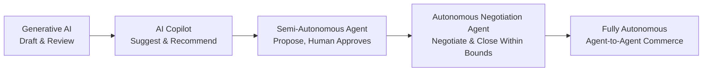
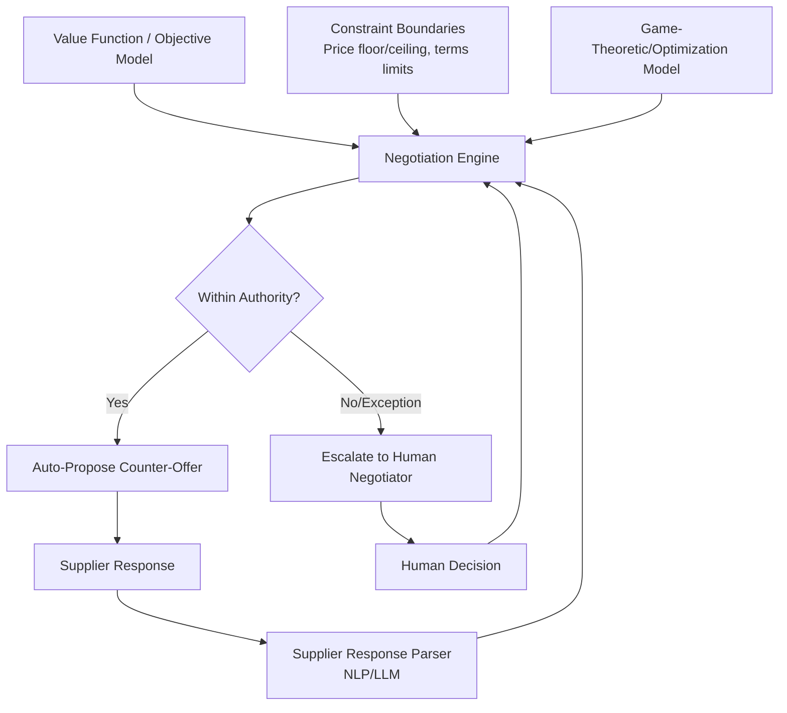

## Generative and Agentic AI in Contracting and Negotiation

### Definition and Scope

This domain covers two distinct but converging AI capability classes applied to contract lifecycle management (CLM) and supplier negotiation:

- **Generative AI**: large language models (LLMs) used to draft, summarize, review, and redline contract language, and to generate negotiation talking points/counter-proposals for human negotiators
- **Agentic AI**: autonomous or semi-autonomous systems that execute multi-step negotiation workflows — reaching out to suppliers, proposing terms, evaluating counter-offers, and closing agreements within predefined constraints — with human review at defined checkpoints rather than at every step

**Key Points**

- The critical distinction from earlier "copilot" AI is autonomy: a copilot suggests, a negotiation agent acts (within bounded authority) and only escalates exceptions to a human
- Autonomous negotiation agents occupy the application layer where LLMs meet specialized domain logic — commonly game-theoretic negotiation models rather than purely probabilistic language generation [agentcommunity](https://agentcommunity.org/m/pactum)
- This capability directly extends AI-enabled supplier discovery: once a second source is identified, agentic negotiation compresses the time to convert that candidate into a contracted, qualified supplier

### Generative vs. Agentic: Capability Spectrum



A copilot suggests insights while an autonomous agent negotiates, executes, and monitors without needing a human to approve every turn. [Inference] Fully autonomous agent-to-agent commerce at scale remains an emerging pattern rather than a widely documented, mature practice as of this writing. [silentinfotech](https://silentinfotech.com/blog/ai-9/why-2026-is-the-year-of-agentic-procurement-382)

### Generative AI Use Cases in Contracting

#### 1. Contract Drafting and Redlining

LLMs generate first-draft contract language from structured inputs (deal parameters, clause libraries, prior agreements) and propose redlines against counterparty-submitted paper.

- **Clause retrieval-augmented generation (RAG)**: LLM drafting grounded in an organization's approved clause library and playbook, rather than open-ended generation, to ensure legal/compliance consistency
- **Automated risk flagging**: NLP classifiers scan incoming contract language against a risk taxonomy (unfavorable indemnification, missing liability caps, non-standard termination clauses), surfacing deviations from playbook standard

**Example: RAG-grounded clause generation pattern**

```python
# Simplified pattern for playbook-grounded contract clause drafting
def generate_clause(clause_type, deal_params, clause_library, llm_client):
    # Retrieve approved precedent clauses matching type and risk tier
    precedents = clause_library.retrieve(
        clause_type=clause_type,
        risk_tier=deal_params['risk_tier'],
        top_k=3
    )
    prompt = f"""
    Draft a {clause_type} clause using these approved precedents as grounding:
    {precedents}
    Deal parameters: {deal_params}
    Do not introduce terms outside the risk tolerances shown in the precedents.
    """
    return llm_client.generate(prompt)
```

#### 2. Contract Review and Obligation Extraction

- **Structured data extraction**: LLMs parse executed contracts into structured fields (pricing terms, renewal dates, SLAs, liability caps) feeding CLM systems and obligation-tracking workflows
- **Comparative analysis**: automated benchmarking of proposed terms against a portfolio of existing contracts to flag outlier pricing or non-standard terms during negotiation prep

#### 3. Negotiation Preparation and Counter-Proposal Generation

Generative AI assists human negotiators by:

- Synthesizing supplier financial/risk data (from predictive risk analytics) into negotiation leverage points
- Drafting counter-proposal language reflecting a specified negotiation stance (e.g., "aggressive on price, flexible on payment terms")
- Generating scenario analyses ("what if we conceded X — what does that imply for Y")

### Agentic AI: Autonomous Negotiation Architecture

#### Core Components



1. **Value function mapping**: enterprise stakeholders' priorities and trade-offs across price, terms, and other commercial variables are mapped into a formal value function before any automated negotiation begins [pactum](https://www.pactum.com/)
2. **Negotiation reasoning engine**: the core reasoning component initiates negotiation to obtain a desired outcome, responds to counterparty proposals, determines when proposals should be accepted or rejected, and determines when and what counter-offers to make [uspto](https://image-ppubs.uspto.gov/dirsearch-public/print/downloadPdf/7373325)
3. **Bounded authority constraints**: hard limits (price floors/ceilings, acceptable payment terms ranges, non-negotiable compliance clauses) within which the agent operates autonomously; anything outside triggers escalation
4. **Supplier-facing interface**: a conversational chat interface through which the system reaches out to suppliers and conducts the negotiation dialogue [pactum](https://www.pactum.com/)
5. **System-of-record integration**: negotiated outcomes and new contract information are written back into corporate systems automatically upon agreement [pactum](https://www.pactum.com/)

#### Negotiation Reasoning Approach

Negotiation agents balance multiple variables — price, payment terms, volume discounts, and delivery schedules — to find a mutually beneficial outcome, relying on game theory and value-based mathematical models rather than purely probabilistic language modeling alone. The LLM layer typically handles natural-language dialogue generation and counterparty-response interpretation, while a separate deterministic/game-theoretic layer handles the actual offer-evaluation and decision logic — a hybrid architecture intended to keep binding commercial decisions auditable and bounded rather than fully delegated to free-form LLM generation. [agentcommunity](https://agentcommunity.org/m/pactum)

**Example: Simplified bounded counter-offer logic**

```python
def evaluate_counter_offer(current_offer, value_function, constraints):
    utility = value_function.score(current_offer)
    if current_offer['price'] < constraints['price_floor']:
        return {'action': 'escalate', 'reason': 'below price floor'}
    if utility >= value_function.acceptance_threshold:
        return {'action': 'accept'}
    else:
        counter = generate_counter_offer(current_offer, value_function, constraints)
        return {'action': 'counter', 'offer': counter}
```

### Application Segment: The "Missing Middle" / Tail Spend

A primary documented use case for autonomous negotiation agents is **tail-spend and long-tail supplier negotiation** — contracts too numerous or low-value to justify dedicated human negotiator time.

- Large enterprises manage a volume of suppliers that human procurement teams cannot realistically handle; long-tail supplier contracts often go untouched for years because the human cost of negotiation exceeds the potential savings — this is the specific gap autonomous negotiation agents target [agentcommunity](https://agentcommunity.org/m/pactum)
- This directly complements dual-sourcing economics: agentic negotiation makes it commercially viable to actively negotiate and maintain terms with a *second* qualified source even in lower-value categories, where the human negotiation cost previously made maintaining an active backup-supplier relationship impractical

### Agentic AI Use Cases Beyond Negotiation

Agentic AI in procurement means using AI systems that can understand a goal, break it into steps, take approved actions across tools, and escalate exceptions to humans. Practical adjacent workflows include: [lapasar](https://lapasar.com/blog/agentic-ai-in-procurement-practical-use-cases-teams-can-adopt-in-2026)

- guided intake, supplier discovery, quote comparison, contract obligation tracking, invoice exception handling, and reorder orchestration [lapasar](https://lapasar.com/blog/agentic-ai-in-procurement-practical-use-cases-teams-can-adopt-in-2026)
- a procurement agent collecting missing purchase request details, matching requests to approved catalogues or contracts, identifying suitable suppliers, preparing an RFQ pack, and comparing supplier responses [lapasar](https://lapasar.com/blog/agentic-ai-in-procurement-practical-use-cases-teams-can-adopt-in-2026)

### Governance and Human-in-the-Loop Design

Given binding commercial authority is delegated to software, governance design is a first-order architectural concern, not an afterthought:

| Control Layer | Purpose |
| --- | --- |
| Authority thresholds | Hard caps on price, term length, or contract value beyond which human approval is mandatory |
| Audit logging | Logging every agent action taken for audit review |
| Decision rationale capture | Recording the reasoning/option set behind each accepted or escalated decision, not just the outcome |
| Category-based scoping | Narrowing autonomous negotiation authority to defined categories (e.g., non-strategic/tail spend) rather than strategic Kraljic-quadrant categories |
| Escalation guardrails | Defined exception triggers (unusual counter-terms, compliance clause deviation, supplier risk score change) forcing human review |

Industry negotiation consultancy perspective emphasizes that the tool produces options, a person selects among them, and records why — reflecting the prevailing governance stance that strategic negotiation decisions retain human accountability even where agentic tooling generates and evaluates the option set.

### Technology and Platform Landscape

- **Autonomous negotiation agents**: Pactum (tail-spend/long-tail supplier negotiation), Keelvar (autonomous sourcing), Zycus (Merlin/autonomous negotiation agents within S2P suites)
- **Predictive negotiation analytics**: Arkestro
- **Contract AI/CLM**: Luminance, Ironclad, DocuSign CLM, SAP Ariba Contracts — generative drafting, redlining, and obligation extraction
- [Inference] Specific model architectures (LLM providers, fine-tuning approaches, proprietary game-theoretic engines) used by named commercial platforms are not fully disclosed publicly; described capabilities reflect vendor-published positioning rather than independently verified technical specification

### Measured Impact (Vendor-Reported)

Organizations deploying AI-powered contract solutions report contract cycle time reductions of up to 60%, alongside improved compliance accuracy. [Unverified] These figures originate from vendor and vendor-adjacent marketing content rather than independently audited benchmarks, and should be treated as directional industry claims rather than validated statistics. [yousign](https://yousign.com/blog/ai-contract-agents)

### Common Pitfalls

- **Over-delegating strategic categories**: applying autonomous negotiation authority to strategic/Kraljic-quadrant categories where relationship dynamics and non-quantifiable factors matter more than optimizable variables
- **Value function misspecification**: an incorrectly weighted or incomplete value function can cause an agent to optimize for the wrong trade-offs (e.g., overweighting price at the expense of delivery reliability critical to dual-sourcing risk reduction)
- **Insufficient escalation coverage**: narrow exception-trigger definitions that fail to catch genuinely novel counterparty terms, allowing the agent to act outside intended bounds
- **Treating LLM dialogue generation as the decision engine**: relying on free-form LLM reasoning for binding commercial decisions rather than a bounded, auditable evaluation layer, reducing explainability and increasing legal/compliance risk
- **Neglecting counterparty experience**: purely autonomous supplier-facing negotiation can damage strategic relationships if suppliers perceive the process as impersonal or inflexible on non-price dimensions

**Conclusion**

Generative and agentic AI represent the operational front end of the SRM/dual-sourcing analytics stack: predictive risk analytics identifies *when* diversification is needed, AI-enabled discovery identifies *who* the candidate second source is, and generative/agentic contracting capability determines *how quickly and efficiently* that candidate can be converted into a formally contracted, actively managed supplier. The technology's near-term value concentrates most clearly in tail-spend and long-tail categories, where bounded autonomous negotiation makes previously uneconomical supplier engagement viable — while strategic-category negotiation retains predominantly human-led, AI-assisted (rather than AI-autonomous) decision-making.

**Related Topics**

- Contract Lifecycle Management (CLM) Systems and Obligation Tracking Automation
- Game-Theoretic Value Function Design for Automated Negotiation
- Tail Spend Management and Long-Tail Supplier Engagement Economics
- Human-in-the-Loop Governance Frameworks for Autonomous Procurement Agents
- RAG-Grounded Contract Drafting and Playbook Clause Libraries
- Agent-to-Agent Commerce and Autonomous B2B Exchange Models
- Integrating Agentic Negotiation with Supplier Risk and Discovery Pipelines