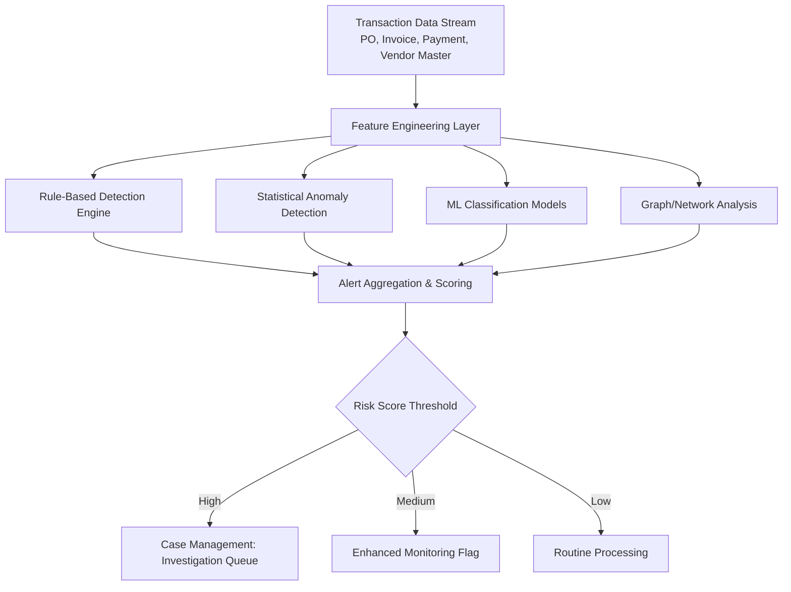
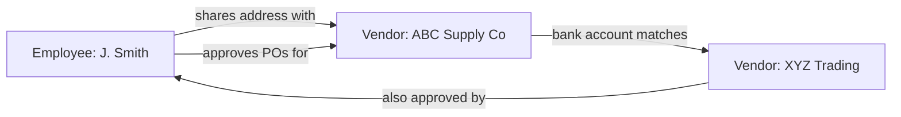

## AI-Based Fraud and Anomaly Detection

### Definition and Scope

AI-based fraud and anomaly detection applies statistical and machine learning techniques to procurement, payment, and supplier transaction data to identify patterns indicative of fraud, policy violations, or irregular behavior that deviates from expected norms. Within SRM and dual sourcing, this capability protects the integrity of both spend data (which feeds spend analytics and supplier scoring) and the sourcing process itself (bid rigging, collusion between "independent" dual-sourcing candidates, shell suppliers).

**Key Points**

- Fraud detection identifies intentional deception (invoice fraud, bid rigging, kickback schemes); anomaly detection more broadly flags statistical outliers that may or may not be fraudulent (data errors, process breakdowns, legitimate but unusual transactions)
- False positives carry real operational cost — investigative effort and strained supplier relationships — so precision/recall tradeoffs are a first-order design concern, not an afterthought
- Anomaly detection outputs feed directly into supplier risk scoring (predictive risk analytics) and can invalidate the presumed independence of dual-sourcing candidates when collusion is detected

### Categories of Procurement Fraud

| Fraud Type | Description | Typical Data Signal |
| --- | --- | --- |
| Invoice fraud | Duplicate, inflated, or fictitious invoices | Duplicate invoice numbers/amounts, round-number amounts, sequential invoice gaps |
| Bid rigging / collusion | Competing bidders coordinating to fix prices | Statistically improbable bid patterns, rotating "winners," suspiciously close bid spreads |
| Shell supplier fraud | Fictitious supplier entities used to divert payments | Vendor master anomalies (PO Box addresses, missing tax IDs, employee address matches) |
| Kickback schemes | Payments to employees for favorable supplier treatment | Unusual approval patterns, single-approver override frequency, employee-vendor relationship overlap |
| Maverick/split-purchase fraud | Splitting purchases below approval thresholds to avoid scrutiny | Multiple sub-threshold POs to the same vendor within short time windows |
| Price/contract manipulation | Off-contract pricing, unauthorized change orders | Price variance vs. contracted rate, change-order frequency outliers |

### Detection Architecture



### Detection Techniques

#### 1. Rule-Based Detection

Deterministic rules encoding known fraud patterns and policy violations:

- Duplicate invoice detection (same vendor, amount, and date within a tolerance window)
- Split-purchase detection (multiple POs to one vendor summing above an approval threshold within N days)
- Segregation-of-duties violations (same individual creating and approving a PO)
- Round-number and threshold-clustering detection (invoices clustering just below approval limits)

**Example**

```sql
-- Split-purchase detection: multiple sub-threshold POs to same vendor within 7 days
SELECT vendor_id, requester_id,
       COUNT(*) AS po_count,
       SUM(po_amount) AS total_amount,
       MIN(po_date) AS window_start,
       MAX(po_date) AS window_end
FROM purchase_order
WHERE po_amount < 10000  -- approval threshold
GROUP BY vendor_id, requester_id,
         DATE_TRUNC('week', po_date)
HAVING COUNT(*) >= 3 AND SUM(po_amount) > 10000;
```

Rule-based systems offer high explainability and auditability but are limited to previously known fraud patterns and are straightforward for sophisticated actors to circumvent once rule logic is understood.

#### 2. Statistical and Unsupervised Anomaly Detection

Used when labeled fraud examples are scarce (typical in procurement fraud, where confirmed cases are rare relative to transaction volume):

- **Isolation Forest**: isolates anomalies by randomly partitioning feature space; anomalies require fewer partitions to isolate than normal points, making this effective for high-dimensional transaction data without labeled training examples
- **Local Outlier Factor (LOF)**: flags points with substantially lower density than their neighbors, useful for detecting invoices/transactions that deviate from a vendor's own historical pattern
- **Benford's Law analysis**: tests whether the leading-digit distribution of transaction amounts conforms to the expected logarithmic distribution; deviations can indicate fabricated or manipulated figures

$$P(d)=\log_{10}\left(1+\frac{1}{d}\right)$$

where $d$ is the leading digit (1–9) and $P(d)$ is its expected frequency under Benford's Law.

**Example: Isolation Forest for invoice anomaly detection**

```python
from sklearn.ensemble import IsolationForest
import pandas as pd

features = ['invoice_amount', 'days_to_payment', 'amount_vs_po_variance',
            'vendor_avg_invoice_ratio', 'approval_time_hours']

model = IsolationForest(
    n_estimators=200,
    contamination=0.02,  # expected fraud rate assumption
    random_state=42
)

df['anomaly_score'] = model.fit_predict(df[features])
df['is_anomaly'] = df['anomaly_score'] == -1

flagged = df[df['is_anomaly']].sort_values('invoice_amount', ascending=False)
```

[Inference] The `contamination` parameter (expected anomaly rate) is typically set based on historical investigation outcomes or industry benchmarks rather than a universally standard value; it requires calibration per organization.

#### 3. Supervised Classification

Where labeled historical fraud cases exist, supervised models predict fraud probability on new transactions:

- **Gradient-boosted trees** (XGBoost, LightGBM): standard choice for structured/tabular fraud data due to strong performance on imbalanced datasets combined with feature importance interpretability
- **Class imbalance handling**: fraud is typically a small minority class, requiring techniques such as SMOTE (Synthetic Minority Oversampling), class-weighted loss functions, or anomaly-score-as-feature approaches rather than naive classification

```python
import xgboost as xgb
from sklearn.model_selection import train_test_split

X_train, X_test, y_train, y_test = train_test_split(
    X, y, test_size=0.2, stratify=y, random_state=42
)

# scale_pos_weight compensates for class imbalance (fraud minority class)
scale_pos_weight = (y_train == 0).sum() / (y_train == 1).sum()

model = xgb.XGBClassifier(
    n_estimators=300, max_depth=6,
    scale_pos_weight=scale_pos_weight,
    eval_metric='aucpr'  # PR-AUC preferred over ROC-AUC under severe imbalance
)
model.fit(X_train, y_train)
```

[Inference] PR-AUC (precision-recall AUC) is generally preferred over ROC-AUC for evaluating models on severely imbalanced fraud datasets, as ROC-AUC can present an overly optimistic picture when the negative class dominates; this is a widely-taught modeling principle rather than a universally mandated standard.

#### 4. Graph/Network Analysis for Collusion and Shell Suppliers

Fraud schemes frequently involve relationships invisible in transaction-level tabular data:

- **Entity resolution**: linking vendor master records to employee records via address, phone, or bank account matching to detect employee-owned shell suppliers
- **Bid-rigging network detection**: graph analysis of bidding history to identify supplier clusters exhibiting coordinated bid rotation or suspiciously correlated pricing across ostensibly competing bids
- **Community detection algorithms** (e.g., Louvain method) applied to supplier-transaction bipartite graphs to surface unexpected clustering among suppliers presumed independent



This pattern — an employee approving purchase orders for a vendor sharing their home address, which in turn shares banking details with a second "independent" vendor — is a canonical shell-supplier fraud signature that graph-based entity resolution surfaces but siloed tabular review typically misses.

#### 5. NLP on Unstructured Fields

- Free-text fields (invoice descriptions, PO justifications, email correspondence where available) analyzed for linguistic markers associated with fraud (vague/generic descriptions, urgency language, unusual approval justifications)
- [Speculation] NLP-based behavioral/linguistic fraud indicators are an active research area but are less standardized in commercial procurement fraud platforms than structured-data techniques described above

### Application to Dual Sourcing Integrity

Fraud and anomaly detection has specific relevance to dual-sourcing program integrity:

- **False independence detection**: graph-based collusion analysis can reveal that two suppliers presented as independent sourcing options are financially or operationally linked (shared ownership, coordinated bidding), undermining the risk-diversification premise established in AI-enabled supplier discovery
- **Bid rigging in dual-source RFPs**: anomaly detection on bid spread and pricing correlation across a dual-sourcing RFP can flag coordinated bidding between the incumbent and prospective second source
- **Volume-shifting fraud**: monitoring for anomalous shifts in order volume allocation between dual sources that don't correspond to legitimate performance or risk-based rebalancing (e.g., an employee steering volume toward a preferred vendor absent a documented justification)

### Key Metrics for Fraud Detection Programs

| Metric | Definition | Purpose |
| --- | --- | --- |
| Precision | True positives / (True positives + False positives) | Minimizes investigative burden from false alarms |
| Recall | True positives / (True positives + False negatives) | Measures fraud-catch completeness |
| False Positive Rate | False positives / Total flagged | Directly impacts investigator workload and supplier relationship strain |
| Time-to-Detection | Elapsed time between fraudulent transaction and flag | Limits financial exposure window |
| Case Resolution Rate | Confirmed fraud / Total investigated cases | Validates model precision in production |

### Technology and Platform Landscape

- **Dedicated fraud analytics platforms**: SAP Fraud Management, Oversight Systems, AppZen (invoice/expense anomaly detection), MindBridge AI
- **Graph database infrastructure**: Neo4j, Amazon Neptune (supporting collusion/entity-network analysis, shared with AI-enabled supplier discovery's knowledge-graph layer)
- **General ML frameworks**: scikit-learn (Isolation Forest, LOF), XGBoost/LightGBM for supervised classification
- **Case management/workflow**: integrated investigation queuing and audit trail systems, typically embedded within GRC (Governance, Risk, Compliance) platforms

[Inference] Specific detection thresholds, model architectures, and accuracy rates for named commercial fraud platforms are proprietary and not independently verifiable in public documentation.

### Common Pitfalls

- **Alert fatigue from poorly calibrated thresholds**: excessive false positives degrade investigator trust and cause genuine alerts to be deprioritized or ignored
- **Static rule sets**: rule-based detection alone becomes ineffective as sophisticated actors learn and circumvent known thresholds; requires supplementing with adaptive statistical/ML methods
- **Training data label scarcity**: confirmed fraud cases are rare, making supervised model training data-starved and prone to overfitting on a small number of historical patterns
- **Siloed data preventing graph analysis**: fraud schemes spanning vendor master, HR, and banking data require integrated data access; organizational silos between these systems are a common practical barrier
- **Ignoring behavioral drift**: legitimate changes in business processes (new approval workflows, M&A-driven vendor consolidation) can trigger false anomaly flags if models aren't retrained/recalibrated against shifting baselines
- **Over-indexing on amount-based rules**: sophisticated fraud often uses amounts specifically designed to evade known thresholds, making pattern/relationship-based detection (graph analysis) a necessary complement to amount-based rules

**Conclusion**

AI-based fraud and anomaly detection safeguards the data integrity underpinning the entire SRM analytics stack: spend analytics, predictive risk scoring, and supplier discovery all depend on transaction and vendor master data being genuine and uncorrupted. In the specific context of dual sourcing, graph-based collusion detection serves a uniquely important function — verifying that presumed-independent sourcing alternatives are not, in fact, financially or operationally entangled, which would silently defeat the risk-diversification purpose the dual-sourcing strategy was designed to achieve.

**Related Topics**

- Graph-Based Entity Resolution for Shell Supplier Detection
- Benford's Law and Statistical Forensic Accounting Techniques
- Class Imbalance Handling in Fraud Classification Models
- Bid Rigging Detection and Collusion Network Analysis
- Segregation-of-Duties Controls and Automated Policy Enforcement
- GRC Platform Integration for Fraud Case Management
- Verifying Supply Chain Independence for True Risk Diversification