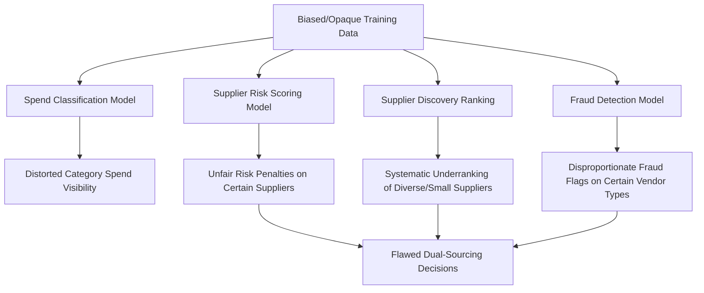
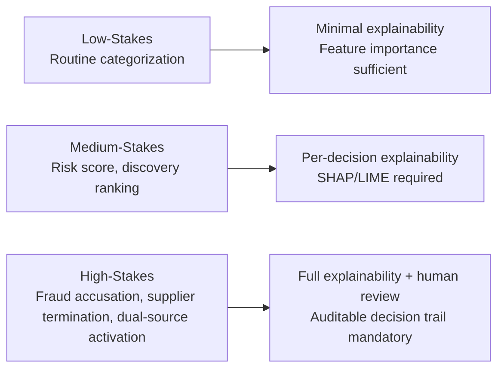
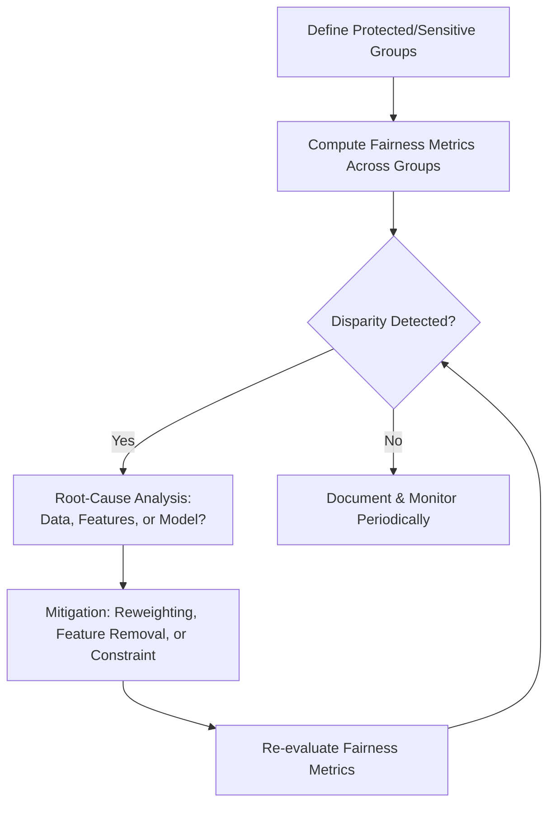

## Explainability and Bias in AI-Driven Decisions


### Definition and Scope

Explainability (interpretability) refers to the degree to which the internal logic of an AI model's decision can be understood and articulated in human-comprehensible terms. Bias refers to systematic, unjustified skew in model outputs that disadvantages certain suppliers, categories, or groups relative to what accurate, fair assessment would produce. Together, these concerns govern whether AI-driven decisions across spend analytics, predictive risk scoring, supplier discovery, fraud detection, and agentic negotiation can be trusted, audited, and defended — particularly where those decisions affect supplier livelihoods, dual-sourcing fairness, and regulatory compliance.

**Key Points**

- Explainability and bias are related but distinct: a model can be highly explainable yet still biased (the bias is simply visible), or accurate and unbiased yet uninterpretable (a "black box" that happens to perform well)
- These concerns cut across every AI capability covered in this chapter — spend classification, risk scoring, supplier discovery, fraud detection, and negotiation agents all inherit whatever bias exists in their training data or design
- Regulatory and contractual exposure (disparate impact claims, supplier diversity commitments, procurement audit requirements) makes this a compliance issue, not solely a technical one

### Why This Matters in SRM and Dual Sourcing Specifically



Because dual-sourcing decisions rest on AI-generated risk scores, concentration metrics, and discovery rankings, undetected bias at any upstream stage propagates directly into which suppliers get considered, qualified, and awarded business — with compounding effect across the sourcing pipeline.

### Sources of Bias in Procurement AI

| Bias Source | Mechanism | Example in SRM Context |
| --- | --- | --- |
| Historical/label bias | Training data reflects past (potentially biased) human decisions | Risk model trained on historical supplier approvals inherits past preference for large incumbents |
| Sampling bias | Training data underrepresents certain supplier populations | Discovery models trained mainly on large, well-documented suppliers underrank smaller/regional/diverse suppliers with sparse public data |
| Proxy discrimination | A neutral-seeming feature correlates with a protected/sensitive attribute | Company size or geographic region correlating with minority/women-owned business status, indirectly penalizing those suppliers |
| Feedback loop bias | Model outputs influence future data used to retrain the model | Suppliers ranked low by a discovery model receive less business, generating less transaction history, reinforcing their low ranking in future retraining |
| Measurement bias | Inconsistent or unequal data quality/availability across groups | Smaller suppliers with less-developed digital footprints appear "riskier" simply due to data sparsity, not actual risk |
| Aggregation bias | A single model applied uniformly across groups with genuinely different underlying relationships | One risk model applied globally may fit large-market suppliers well but misrepresent risk for suppliers in emerging markets with different operating norms |

### Explainability Techniques

#### 1. Intrinsically Interpretable Models

Where feasible, using models whose decision logic is directly readable:

- **Decision trees / rule lists**: fully traceable if-then logic, suitable when the accuracy trade-off against more complex models is acceptable
- **Linear/logistic regression with monotonic constraints**: coefficients directly indicate feature direction and magnitude of influence, with constraints ensuring a feature's effect doesn't counterintuitively reverse across its range
- **Generalized Additive Models (GAMs)**: preserve per-feature interpretability while allowing non-linear relationships, offering a middle ground between simple linear models and black-box ensembles

#### 2. Post-Hoc Explainability for Complex Models

Where higher-accuracy models (gradient-boosted trees, neural networks) are used — common in fraud detection and risk scoring — post-hoc methods explain individual predictions after the fact:

- **SHAP (SHapley Additive exPlanations)**: game-theoretic attribution assigning each feature a contribution value toward a specific prediction, satisfying consistency properties that make cross-prediction comparison meaningful
- **LIME (Local Interpretable Model-agnostic Explanations)**: approximates a complex model's behavior locally around a specific prediction with an interpretable surrogate model (e.g., local linear regression)
- **Feature importance rankings**: global (dataset-wide) measures of which features most influence model predictions, useful for model audit but not for explaining any single decision

**Example: SHAP explanation for a supplier risk score**

```python
import shap
import xgboost as xgb

model = xgb.XGBClassifier()
model.fit(X_train, y_train)

explainer = shap.TreeExplainer(model)
shap_values = explainer.shap_values(X_test)

# Explain a single supplier's risk score
supplier_idx = 0
shap.force_plot(
    explainer.expected_value, shap_values[supplier_idx], X_test.iloc[supplier_idx]
)

# Example interpretation output (illustrative):
# Base risk score: 45
# + 18  (financial_leverage_ratio: elevated)
# + 12  (country_risk_index: high)
# -  8  (otd_trend_90d: improving delivery performance)
# = 67  (final risk score)
```

This decomposition allows a procurement analyst to state precisely *why* a supplier was flagged as elevated risk — a necessary capability when that score informs a dual-sourcing activation decision that will be communicated to the affected supplier or reviewed by an auditor.

#### 3. Explainability Requirements by Decision Stakes

Not all AI-driven decisions warrant the same explainability investment. A practical tiering approach:



[Inference] This tiered framework reflects a common risk-based governance pattern in AI ethics practice generally; it is not a universally standardized or formally codified procurement-industry framework.

### Bias Detection and Measurement

#### Fairness Metrics

Quantitative fairness assessment typically compares model outcomes across defined supplier subgroups (e.g., by size, region, diversity classification):

- **Demographic parity**: whether the rate of favorable outcomes (e.g., being shortlisted, receiving a low risk score) is statistically similar across groups
- **Equal opportunity**: whether true positive rates (e.g., correctly identifying a genuinely low-risk supplier as low-risk) are similar across groups
- **Disparate impact ratio**: the ratio of favorable outcome rates between a reference group and a comparison group

$$DI=\frac{P(\text{favorable outcome}\mid\text{group }A)}{P(\text{favorable outcome}\mid\text{group }B)}$$

A commonly referenced (though not universally mandated) guideline is the "four-fifths rule" from U.S. employment discrimination law, sometimes adapted as an informal benchmark: a $DI$ ratio below 0.8 is treated as a signal warranting further investigation. [Inference] Direct application of employment-law fairness thresholds to supplier/vendor selection contexts is an analogical practice rather than an established legal or regulatory standard specific to procurement.

**Example: Disparate impact check across supplier discovery ranking**

```python
import pandas as pd

def disparate_impact_ratio(df, outcome_col, group_col, reference_group, comparison_group):
    ref_rate = df[df[group_col] == reference_group][outcome_col].mean()
    comp_rate = df[df[group_col] == comparison_group][outcome_col].mean()
    return comp_rate / ref_rate

di = disparate_impact_ratio(
    shortlist_df, outcome_col='shortlisted',
    group_col='supplier_size_category',
    reference_group='large', comparison_group='small'
)
# di < 0.8 flags potential systematic underranking of small suppliers
```

#### Bias Auditing Process



### Bias Mitigation Techniques

| Mitigation Stage | Technique | Description |
| --- | --- | --- |
| Pre-processing | Reweighting / resampling | Adjusting training data representation so underrepresented supplier groups have proportionate influence |
| Pre-processing | Proxy feature removal/adjustment | Identifying and removing/adjusting features that act as proxies for protected attributes |
| In-processing | Fairness-constrained optimization | Adding fairness constraints directly into the model training objective, trading some accuracy for measured fairness improvement |
| Post-processing | Threshold adjustment by group | Calibrating decision thresholds per group to equalize outcome rates, applied cautiously given legal/ethical complexity of group-differentiated treatment |
| Governance | Human review checkpoints | Mandatory human review for decisions crossing defined stakes thresholds (see tiering above) |

[Speculation] Post-processing threshold adjustment by group raises its own legal and ethical questions (potentially constituting a form of differential treatment) and is applied inconsistently across industries; this should be treated as one documented technique among several, not a recommended default.

### Explainability and Bias in Agentic/Generative Systems

The prior chapter items (predictive risk, discovery, agentic negotiation) each introduce distinct explainability challenges:

- **LLM-based components** (used in discovery semantic search, negotiation dialogue, contract drafting) are substantially harder to explain via SHAP/LIME-style attribution than structured tabular models; explainability here often relies on prompt/retrieval transparency (what source documents grounded a generation) rather than feature attribution
- **Agentic negotiation systems** require decision rationale capture at each escalation point (as noted in the negotiation governance discussion) precisely because a black-box negotiation decision carries binding commercial and legal consequence
- **Knowledge graph-based discovery** offers inherent explainability advantages over pure embedding-based ranking, since graph traversal paths (why a supplier was surfaced) are directly inspectable

### Regulatory and Governance Context

- Procurement AI increasingly intersects with emerging AI governance regulation (e.g., EU AI Act risk-tiering concepts, sector-specific algorithmic accountability requirements) that impose documentation and explainability obligations on "high-risk" automated decision systems [Inference — specific regulatory applicability to procurement/supplier-selection AI varies by jurisdiction and is an evolving area; organizations should confirm current requirements with legal counsel rather than relying on generalized description]
- Supplier diversity program commitments create a direct organizational incentive to actively bias-test discovery and risk-scoring models, since undetected bias can silently undermine stated diversity/ESG sourcing goals
- Audit trail requirements in regulated industries (public sector procurement, government contracting) commonly mandate documented, explainable rationale for supplier selection and disqualification decisions

### Common Pitfalls

- **Treating explainability as a one-time certification** rather than continuous monitoring, allowing model drift to reintroduce bias or reduce explanation fidelity over time as underlying data distributions shift
- **Optimizing solely for global accuracy** without disaggregated performance evaluation across supplier subgroups, masking subgroup-specific failure modes
- **Conflating "the model is complex" with "the decision is unexplainable"**: post-hoc methods (SHAP/LIME) make most model classes explainable at the individual-decision level even when the underlying model itself is not intrinsically interpretable
- **Fairness-accuracy tradeoff mismanagement**: applying fairness constraints without stakeholder alignment on how much accuracy degradation is acceptable, or conversely dismissing fairness concerns purely on accuracy-preservation grounds
- **Ignoring feedback loop bias**: failing to monitor whether a model's own past outputs are shaping the training data used for its retraining, entrenching rather than correcting initial bias
- **Applying uniform fairness thresholds across fundamentally different decision types** (e.g., using the same disparate-impact tolerance for a low-stakes categorization task and a high-stakes supplier disqualification decision)

**Conclusion**

Explainability and bias considerations function as a cross-cutting governance layer over every other AI capability in the SRM/dual-sourcing analytics stack: they determine whether the outputs of spend classification, risk scoring, discovery ranking, fraud detection, and negotiation agents can be trusted, defended to auditors and suppliers, and relied upon without silently perpetuating unfair or legally exposed outcomes. Because dual-sourcing decisions specifically depend on AI-derived concentration metrics, risk scores, and discovery rankings, bias or opacity at any upstream stage directly threatens the fairness and defensibility of which suppliers are ultimately qualified as strategic alternatives.

**Related Topics**

- SHAP and LIME: Post-Hoc Model Explainability Techniques
- Fairness Metrics and Disparate Impact Testing in AI Systems
- Feedback Loop Bias and Model Retraining Governance
- AI Governance Regulation and High-Risk Automated Decision Systems
- Supplier Diversity Program Integration with AI Discovery and Scoring
- Human-in-the-Loop Design for High-Stakes Automated Decisions
- Knowledge Graph Explainability vs. Embedding-Based Model Opacity