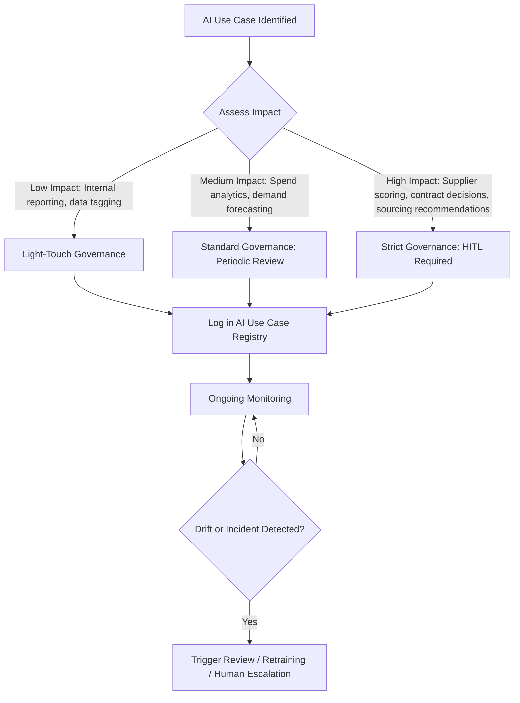

## Human Oversight and Governance of AI Tools

### Definition and Purpose

Human oversight and governance of AI tools refers to the organizational structures, policies, and control mechanisms that ensure AI systems used in supplier relationship management (SRM) — such as supplier risk scoring, spend classification, contract analysis, or predictive sourcing recommendations — remain accountable, auditable, and correctable by human decision-makers. In dual sourcing contexts, this is critical because AI-driven recommendations (e.g., "switch primary supplier" or "flag Supplier B as high-risk") carry direct financial and continuity consequences if left unchecked.

Governance in this context spans two related but distinct concerns:

1. **Model governance** — technical controls over how AI models are built, validated, deployed, and monitored
2. **Human oversight** — the organizational and procedural mechanisms ensuring humans retain meaningful control over AI-influenced decisions

### Why This Matters in Supplier Management Specifically

- **High-stakes decisions**: AI tools increasingly influence supplier selection, risk flagging, price benchmarking, and contract term recommendations — errors can disrupt supply continuity or create legal exposure.
- **Opaque scoring models**: Many supplier risk-scoring and should-cost AI tools use ensemble or black-box models where the rationale for a recommendation is not immediately transparent to procurement staff.
- **Regulatory exposure**: Regulations such as the EU AI Act classify certain supply-chain and creditworthiness-adjacent AI use cases as higher-risk, triggering mandatory oversight obligations.
- **Bias and data quality risk**: AI models trained on historical supplier performance data can encode and perpetuate biases (e.g., systematically penalizing new or smaller suppliers, which undermines dual-sourcing diversification goals).
- **Second-source evaluation integrity**: If an AI tool is used to screen or rank potential second-source suppliers, ungoverned model drift or bias could silently narrow the qualified supplier pool over time.

### Core Governance Framework Components

#### 1. Human-in-the-Loop (HITL) vs. Human-on-the-Loop vs. Human-out-of-the-Loop

| Model | Description | Typical SRM Use Case |
| --- | --- | --- |
| Human-in-the-loop | AI generates a recommendation; a human must approve before action is taken | Supplier disqualification, contract award recommendations |
| Human-on-the-loop | AI acts autonomously within defined bounds; humans monitor and can intervene | Automated spend classification, routine PO matching |
| Human-out-of-the-loop | AI acts fully autonomously, no real-time human review | Rarely appropriate for supplier-facing decisions; used only for low-risk, high-volume tasks (e.g., duplicate invoice flagging) |

[Inference] Most mature SRM governance frameworks apply human-in-the-loop control specifically to supplier-facing decisions with financial or continuity impact, while allowing human-on-the-loop for internal data processing tasks — this reflects general risk-tiering practice rather than a single universal standard.

#### 2. Governance Structures

- **AI Governance Committee / Council**: Cross-functional body (procurement, legal, IT, risk, data science) that approves AI tool deployment, sets risk thresholds, and reviews incidents
- **Model Risk Management (MRM) function**: Borrowed from financial services practice, applies structured validation, independent review, and ongoing monitoring to any AI model influencing supplier decisions
- **AI Use Case Inventory / Registry**: Centralized log of every AI tool in use across SRM, its purpose, data inputs, risk tier, and owner
- **Escalation and Override Protocols**: Documented procedures for how procurement staff can challenge, override, or escalate an AI-generated recommendation

#### 3. Risk Tiering Approach

Most governance frameworks classify AI use cases by risk level to calibrate the degree of oversight required:

### Key Governance Controls

#### Explainability and Transparency Requirements

- Require AI vendors (or internal data science teams) to provide **model cards** or **factsheets** documenting training data sources, known limitations, and intended use boundaries
- For supplier risk scores, require **feature attribution outputs** (e.g., SHAP values) so procurement staff can see *why* a supplier was flagged, not just the resulting score
- Avoid deploying fully black-box models for decisions with direct supplier-facing consequences (disqualification, contract non-renewal) without an explainability layer

#### Audit Trails and Documentation

- Every AI-influenced decision affecting a supplier relationship should log: input data snapshot, model version, output/recommendation, human reviewer identity, and final decision
- Retention periods should align with contractual and regulatory audit requirements (often 3–7 years depending on jurisdiction and contract type)

#### Bias and Fairness Testing

- Periodic testing of supplier scoring models across protected or sensitive dimensions (company size, geography, ownership structure — e.g., minority- or women-owned business status) to detect systematic disadvantage
- [Inference] Because dual-sourcing strategies often deliberately seek to diversify the supplier base, an AI model that inadvertently penalizes smaller or newer suppliers on the basis of thin historical data can directly undermine sourcing diversification goals — this is a plausible governance risk pattern rather than an empirically universal finding, and should be validated against the specific model and dataset in use.

#### Model Monitoring and Drift Detection

- **Data drift**: input data distribution shifts (e.g., new supplier categories, changed market conditions) reducing model accuracy
- **Concept drift**: the underlying relationship between inputs and desired outputs changes over time (e.g., new tariffs changing what "low-risk supplier" means)
- Automated monitoring dashboards should flag when model confidence scores or prediction distributions shift beyond defined thresholds, triggering human review

### Regulatory and Standards Landscape

Claude does not have fully current information on rapidly evolving AI regulation; below reflects the general framework as of early 2026, verified where noted.

Searched the webEU AI Act high-risk AI systems supply chain procurement obligations 2026

### Regulatory and Standards Landscape (Current as of September 2026)

- **EU AI Act**: An AI system is classified as high-risk under Annex III if it falls into one of eight specified risk areas, subject to an additional filter requiring the system to pose a significant risk of harm to health, safety, or fundamental rights. Employment- and worker-management-related AI (which can extend to certain supplier/contractor evaluation contexts) sits within these Annex III categories. Organizations that deploy a high-risk AI system in their supply chain take on "deployer" duties under Article 26 — including human oversight, monitoring, and logging obligations — even though the system's provider carries the bulk of the build-side compliance obligations. [Regulation AI](https://www.regulation-ai.eu/en/ai-act/)[Norppa](https://norppa.io/guides/eu-ai-act)
- **Timeline**: The 2026 Digital Omnibus on AI extended the two high-risk AI compliance deadlines by 16 and 24 months respectively, without changing the underlying obligations themselves. Annex III high-risk duties and Article 50 transparency rules were set to take effect August 2, 2026 for every provider and deployer whose output reaches the EU, with non-EU organizations also in scope. Given the Digital Omnibus deferral noted above, buyers should verify current applicable dates directly rather than assume the original August 2026 date still governs their specific system category. [Unverified — confirm current deadline against official EU AI Office guidance for your specific system classification.] [Regulation AI](https://www.regulation-ai.eu/en/ai-act/)[Tech Jacks Solutions](https://techjacksolutions.com/eu-ai-act/)
- **Procurement-specific relevance**: When an organization brings an AI system into its supply chain, it inherits deployer duties and needs to understand the provider's compliance posture — conformity status, instructions for use, logging capability, and risk classification — which mirrors the vendor-due-diligence practice already required under NIS2, now applied to AI. [Norppa](https://norppa.io/guides/eu-ai-act)
- **NIST AI Risk Management Framework (AI RMF)**: A voluntary but widely-adopted US framework structured around four functions — Govern, Map, Measure, Manage — commonly used as a baseline governance structure even outside regulatory mandate.
- **ISO/IEC 42001**: An international management system standard for AI governance (analogous to ISO 27001 for information security), increasingly referenced in supplier and vendor AI governance policies.

[Inference] Because this regulatory area is actively shifting — as reflected in the 2026 Digital Omnibus deferrals — any specific compliance deadline cited here should be reverified against current official guidance before being used for compliance planning.

### Practical Governance Checklist for SRM AI Tools

1. **Inventory** every AI tool touching supplier decisions (risk scoring, should-cost modeling, contract analytics, sourcing recommendations)
2. **Classify risk tier** for each tool based on decision impact (financial exposure, supply continuity, legal/regulatory exposure)
3. **Assign human checkpoints** — define explicitly where a human must review/approve before action, versus where monitoring alone suffices
4. **Require explainability outputs** from vendors for any tool influencing supplier disqualification, scoring, or contract terms
5. **Establish override and appeal paths** — both for internal procurement staff and for suppliers who wish to contest an AI-driven score or flag
6. **Set monitoring cadence** for drift detection and bias testing (commonly quarterly for high-risk tools)
7. **Maintain audit logs** covering input data, model version, output, human reviewer, and final decision
8. **Train procurement staff** on the specific model's limitations — not just how to use the tool, but when to distrust its output

### Illustrative Governance Architecture

<svg xmlns="http://www.w3.org/2000/svg" viewBox="0 0 800 460">
<text x="400" y="28" text-anchor="middle" font-size="17" font-weight="bold" fill="#1a1a1a">AI Governance Architecture for SRM Tools (svg_diagram)</text>
<rect x="30" y="55" width="740" height="70" rx="8" fill="#e8eef7" stroke="#3a5a8c" stroke-width="1.5" />
<text x="400" y="80" text-anchor="middle" font-size="14" font-weight="bold" fill="#1a1a1a">AI Governance Committee</text>
<text x="400" y="100" text-anchor="middle" font-size="12" fill="#333">Procurement · Legal · Risk · IT/Data Science — sets policy, approves use cases, reviews incidents</text>
<rect x="30" y="150" width="230" height="90" rx="8" fill="#fdf3e0" stroke="#b8860b" stroke-width="1.5" />
<text x="145" y="172" text-anchor="middle" font-size="13" font-weight="bold" fill="#1a1a1a">Model Risk Management</text>
<text x="145" y="192" text-anchor="middle" font-size="11" fill="#333">Independent validation</text>
<text x="145" y="208" text-anchor="middle" font-size="11" fill="#333">Pre-deployment review</text>
<text x="145" y="224" text-anchor="middle" font-size="11" fill="#333">Ongoing performance audits</text>
<rect x="285" y="150" width="230" height="90" rx="8" fill="#e6f4ea" stroke="#2e7d32" stroke-width="1.5" />
<text x="400" y="172" text-anchor="middle" font-size="13" font-weight="bold" fill="#1a1a1a">AI Use Case Registry</text>
<text x="400" y="192" text-anchor="middle" font-size="11" fill="#333">Tool inventory + owner</text>
<text x="400" y="208" text-anchor="middle" font-size="11" fill="#333">Risk tier classification</text>
<text x="400" y="224" text-anchor="middle" font-size="11" fill="#333">Data source documentation</text>
<rect x="540" y="150" width="230" height="90" rx="8" fill="#fbe9e9" stroke="#a83232" stroke-width="1.5" />
<text x="655" y="172" text-anchor="middle" font-size="13" font-weight="bold" fill="#1a1a1a">Monitoring &amp; Drift Detection</text>
<text x="655" y="192" text-anchor="middle" font-size="11" fill="#333">Data drift / concept drift</text>
<text x="655" y="208" text-anchor="middle" font-size="11" fill="#333">Bias &amp; fairness testing</text>
<text x="655" y="224" text-anchor="middle" font-size="11" fill="#333">Confidence threshold alerts</text>
<line x1="145" y1="125" x2="145" y2="150" stroke="#555" stroke-width="1.5" />
<line x1="400" y1="125" x2="400" y2="150" stroke="#555" stroke-width="1.5" />
<line x1="655" y1="125" x2="655" y2="150" stroke="#555" stroke-width="1.5" />
<rect x="150" y="280" width="500" height="80" rx="8" fill="#eef0fb" stroke="#4b3f8c" stroke-width="1.5" />
<text x="400" y="303" text-anchor="middle" font-size="13" font-weight="bold" fill="#1a1a1a">Human-in-the-Loop Decision Point</text>
<text x="400" y="323" text-anchor="middle" font-size="11" fill="#333">Procurement analyst reviews AI recommendation</text>
<text x="400" y="340" text-anchor="middle" font-size="11" fill="#333">Approve / Override / Escalate — logged with rationale</text>
<line x1="145" y1="240" x2="300" y2="280" stroke="#555" stroke-width="1.5" />
<line x1="400" y1="240" x2="400" y2="280" stroke="#555" stroke-width="1.5" />
<line x1="655" y1="240" x2="500" y2="280" stroke="#555" stroke-width="1.5" />
<rect x="220" y="400" width="360" height="45" rx="8" fill="#fff8dc" stroke="#8c7a1a" stroke-width="1.5" />
<text x="400" y="427" text-anchor="middle" font-size="12" fill="#1a1a1a">Supplier-Facing Action (score, flag, recommendation)</text>
<line x1="400" y1="360" x2="400" y2="400" stroke="#555" stroke-width="1.5" marker-end="url(#arrow)" />
</svg>

### Organizational Roles and Responsibilities

| Role | Responsibility |
| --- | --- |
| Procurement/SRM Lead | Defines acceptable use cases, owns supplier relationship impact assessment |
| Data Science/ML Team | Builds, validates, and documents model performance and limitations |
| Legal/Compliance | Ensures regulatory alignment (AI Act, sector-specific rules), reviews supplier-facing consequences |
| Risk/GRC Function | Maintains risk tiering framework, conducts independent model risk reviews |
| IT/Security | Ensures data governance, access control, and system integration integrity |
| Individual Procurement Analysts | Exercise judgment at human-in-the-loop checkpoints; document override rationale |

### Common Pitfalls

- **Rubber-stamping**: Human-in-the-loop checkpoints that exist procedurally but where reviewers habitually approve AI recommendations without genuine scrutiny — undermines the entire oversight premise
- **Governance without teeth**: Committees that approve use cases but have no mechanism to halt or roll back a deployed tool when problems emerge
- **Single point of accountability failure**: No clearly designated owner for a given AI tool, leading to unclear escalation paths when issues arise
- **Treating vendor AI as a black box permanently**: Accepting a third-party AI scoring tool without ever requesting explainability documentation or validation evidence from the vendor
- **Static risk classification**: Failing to re-assess a tool's risk tier as its use case expands (e.g., a tool initially used for internal reporting later repurposed to directly inform supplier disqualification decisions)

### Related Topics

- AI-Driven Supplier Risk Scoring Models
- Explainable AI (XAI) Techniques for Procurement Decisions
- EU AI Act Deployer Obligations (Article 26) for Procurement Functions
- NIST AI Risk Management Framework Implementation
- ISO/IEC 42001 AI Management Systems
- Bias Detection and Fairness Auditing in Supplier Scoring Models
- Model Risk Management (MRM) Frameworks Adapted from Financial Services
- Data Governance for AI Training Data in Supplier Analytics
- Vendor Due Diligence for Third-Party AI/ML Procurement Tools