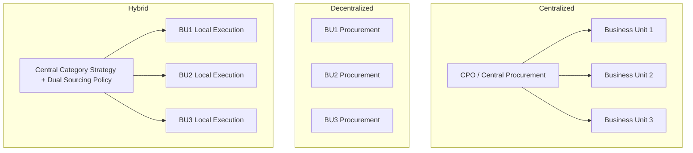

## Centralized, Decentralized, and Hybrid Procurement Models

### Overview

Procurement organizational design determines where purchasing authority, decision rights, and execution responsibility sit within a company. The choice among centralized, decentralized, and hybrid models directly shapes an organization's ability to execute Dual Sourcing strategy, negotiate leverage with suppliers, and respond to local market conditions. This structural decision is foundational to Supplier Relationship Management (SRM) because it determines who owns supplier relationships, who negotiates contracts, and how supplier performance data flows across the enterprise.

### Centralized Procurement Model

**Definition**

A single, central procurement function holds authority over sourcing decisions, supplier selection, contract negotiation, and (often) purchase execution for the entire organization, regardless of business unit or geography.

**Key Points**

- **Authority structure**: All strategic sourcing decisions flow through a central Chief Procurement Officer (CPO) or VP of Procurement.
- **Supplier consolidation**: Spend is aggregated across business units, enabling volume-based leverage.
- **Standardization**: Uniform contract terms, supplier onboarding processes, and SRM scorecards across the enterprise.
- **Common in**: Direct materials procurement, IT hardware/software, MRO (maintenance, repair, operations), and categories with high spend concentration potential.

**Advantages**

- Maximizes negotiating leverage through volume aggregation.
- Reduces maverick spending (off-contract purchases).
- Enables consistent supplier risk management and compliance enforcement.
- Simplifies Dual Sourcing governance — the central team can enforce a strict two-supplier split ratio (e.g., 70/30) across all business units simultaneously.
- Lower administrative overhead from duplicated procurement staff.

**Disadvantages**

- Slower response to local/regional supplier opportunities.
- Business units may feel disconnected from sourcing decisions affecting their operations.
- Bottlenecks when a small central team must service a large, diverse organization.
- Risk of one-size-fits-all contracts that don't fit unique business unit needs.

**Example**

A multinational electronics manufacturer centralizes procurement of semiconductor components. A central sourcing team negotiates master supply agreements with two qualified chip suppliers (Dual Sourcing), allocating 60% of demand to the primary supplier and 40% to the secondary, with the split enforced identically across all manufacturing plants worldwide.

### Decentralized Procurement Model

**Definition**

Individual business units, divisions, or geographic regions independently manage their own sourcing decisions, supplier relationships, and purchase execution, typically with minimal central oversight.

**Key Points**

- **Authority structure**: Local procurement managers or business unit leaders make sourcing decisions autonomously.
- **Local responsiveness**: Business units select suppliers that fit local regulatory, cultural, or logistical requirements.
- **Common in**: Indirect spend categories, region-specific raw materials, professional services, and organizations operating in highly fragmented or regulated markets.

**Advantages**

- Fast decision-making, close to the point of need.
- Better alignment with local supplier ecosystems (e.g., local-content regulations, nearshoring goals).
- Business unit accountability for cost and supplier performance.
- Easier to onboard region-specific secondary suppliers for Dual Sourcing without central approval delays.

**Disadvantages**

- Loss of enterprise-wide negotiating leverage — duplicate suppliers for the same commodity across units.
- Inconsistent contract terms, pricing, and risk exposure.
- Fragmented supplier performance data, making enterprise-wide SRM scorecards difficult to compile.
- Higher risk of supplier fraud or compliance gaps due to inconsistent vetting standards.

**Example**

A retail chain with stores across multiple countries allows each regional office to source perishable goods locally, selecting different backup (dual) suppliers per region based on local harvest seasons and import regulations, without requiring headquarters sign-off.

### Hybrid Procurement Model

**Definition**

A hybrid model splits procurement authority: strategic, high-spend, or high-risk categories are managed centrally (often through a **Center-Led** or **Center of Excellence** structure), while tactical, low-value, or highly localized purchases remain with business units.

**Key Points**

- **Category-based split**: Categories are segmented (e.g., via a Kraljic Matrix) — strategic and leverage items go central; non-critical and routine items stay local.
- **Center-Led governance**: A central team sets policy, negotiates framework/master agreements, and defines the Dual Sourcing ratio guardrails, while local teams execute purchase orders within that framework.
- **Common structure variants**:
  - **Center-led**: Central team owns strategy and contracts; local teams execute.
  - **Lead-Buyer model**: One business unit or region is designated as the "lead" for a category and negotiates on behalf of all units.
  - **Coordinated decentralization**: Local autonomy exists but must operate within centrally issued policy and approved supplier lists.

**Advantages**

- Balances leverage (central) with responsiveness (local).
- Central team can mandate Dual Sourcing minimums (e.g., "no single supplier above 65% of category spend") while letting local units choose which qualified secondary supplier to use.
- Reduces the "all-or-nothing" risk trade-off between the pure models.

**Disadvantages**

- Requires clear governance to avoid role ambiguity ("who owns this supplier relationship?").
- Higher organizational complexity — needs strong RACI (Responsible, Accountable, Consulted, Informed) definitions.
- Risk of central/local tension over category ownership boundaries.

**Example**

A global automotive OEM centrally negotiates master agreements with two approved battery cell suppliers (Dual Sourcing at the enterprise level) to lock in enterprise-wide pricing and capacity commitments. Individual assembly plants then issue local purchase orders against those master agreements, choosing the split ratio between the two suppliers based on plant-level line capacity and logistics costs, within the central policy's allowed range (e.g., 50/50 to 80/20).

### Model Selection Framework

| Factor | Favors Centralized | Favors Decentralized | Favors Hybrid |
| --- | --- | --- | --- |
| Spend concentration | High (few large categories) | Low (fragmented, many small categories) | Mixed |
| Supplier risk profile | High-risk, strategic suppliers | Low-risk, commodity suppliers | Mixed |
| Geographic diversity | Low | High | High |
| Regulatory complexity | Low | High | High |
| Need for Dual Sourcing enforcement | High, uniform control needed | Low, local flexibility acceptable | High, with local execution flexibility |
| Organizational maturity | High procurement maturity | Variable maturity across units | Requires strong governance maturity |

### Structural Diagram

### Implications for Dual Sourcing Governance

- **Centralized**: Dual Sourcing split ratios, supplier qualification criteria, and risk thresholds are set and enforced uniformly. Easiest model for maintaining a single enterprise-wide SRM scorecard per supplier.
- **Decentralized**: Each business unit may independently qualify and manage its own set of dual suppliers, which can result in different suppliers serving the same commodity in different regions — this can *itself* function as a form of geographic dual/multi-sourcing, though unintentionally and without coordinated risk management.
- **Hybrid**: Considered the most common model for effective Dual Sourcing at scale [Inference — based on general procurement organizational design literature and practitioner consensus rather than a single authoritative benchmark study], because it allows central risk policy (minimum secondary-supplier allocation, approved supplier lists) to be enforced while giving local teams flexibility to execute against real-time capacity and logistics constraints.

### Change Management Considerations

- **Centralized → Hybrid/Decentralized transitions**: Typically driven by M&A integration challenges, need for local market responsiveness, or CPO recognition that a "one-size-fits-all" model is creating friction in fast-moving categories.
- **Decentralized → Hybrid/Centralized transitions**: Typically driven by cost pressure, supplier risk incidents (e.g., single points of failure discovered during a supply disruption), or a mandate to formalize Dual Sourcing across the enterprise.
- Role redesign is required in all transitions: local buyers may need to shift from full ownership to "category execution within central policy," which requires clear communication, retraining, and updated KPIs to avoid resistance.
- Governance bodies (e.g., a Procurement Steering Committee) are commonly introduced during hybrid transitions to formally arbitrate category ownership disputes.

**Related Topics**

- Center-Led vs. Lead-Buyer Governance Models
- Kraljic Matrix for Category Segmentation
- RACI Frameworks in Procurement Organizations
- Category Management Structures
- Procurement Center of Excellence (CoE) Design
- Change Management Frameworks for Procurement Transformation (ADKAR, Kotter's 8-Step)
- Supplier Segmentation and Risk Tiering
- Enterprise-Wide Supplier Scorecard Design