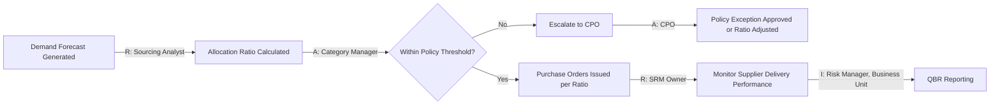

## SRM Roles, Responsibilities, and RACI Design

### Overview

Effective Supplier Relationship Management requires clearly defined roles across the enterprise, because supplier interactions touch procurement, category management, legal, quality, finance, and operational business units simultaneously. Without explicit role definition, SRM programs suffer from duplicated supplier contact, conflicting negotiation messages, and — critically for Dual Sourcing programs — inconsistent enforcement of supplier allocation policy. A RACI (Responsible, Accountable, Consulted, Informed) matrix is the standard tool for formalizing these roles.

### Core SRM Roles

**Supplier Relationship Manager (SRM Owner / Relationship Owner)**

- Owns the end-to-end relationship with a specific supplier or supplier segment.
- Serves as the primary point of contact for strategic and escalation-level issues.
- Coordinates cross-functional input (quality, legal, finance) into a unified supplier engagement strategy.
- In a Dual Sourcing context, monitors whether allocation ratios between primary and secondary suppliers are being honored operationally.

**Category Manager**

- Owns the sourcing strategy for a specific spend category (e.g., raw materials, packaging, logistics).
- Defines whether a category requires single-, dual-, or multi-sourcing based on risk exposure, spend volume, and supply market conditions.
- Leads supplier selection, RFP/RFQ processes, and contract negotiation strategy.
- Distinct from the SRM Owner: Category Manager focuses on *sourcing strategy and market*; SRM Owner focuses on *ongoing relationship execution*. In smaller organizations these roles are often combined.

**Procurement/Sourcing Analyst**

- Executes market research, spend analysis, and supplier performance data aggregation.
- Supports RFP scoring, TCO (Total Cost of Ownership) modeling, and supplier risk assessments.
- Maintains supplier scorecards and dashboards used in Quarterly Business Reviews (QBRs).

**Supplier Quality Engineer (SQE)**

- Owns supplier quality qualification (e.g., PPAP — Production Part Approval Process), audits, and non-conformance resolution.
- Critical in Dual Sourcing: certifies that a secondary supplier meets identical quality specifications before it can receive allocated volume.

**Contract Manager / Legal Counsel**

- Drafts, reviews, and negotiates contractual terms including SLAs, liability clauses, IP protection, and termination conditions.
- Ensures Dual Sourcing contracts include appropriate volume-flexibility clauses (e.g., minimum/maximum order commitments that allow the buyer to shift volume between suppliers without breach).

**Risk Manager**

- Assesses financial, geopolitical, cybersecurity, and operational risk exposure per supplier.
- Maintains risk-tiering models that often *justify* the Dual Sourcing decision in the first place (e.g., single-source risk score exceeding a defined threshold triggers a mandatory dual-source requirement).

**Business Unit / Internal Stakeholder (Requestor)**

- Represents the internal customer (e.g., manufacturing, engineering) who consumes the goods/services being procured.
- Provides technical specifications and demand forecasts; consulted on supplier performance from an operational-use perspective.

**Chief Procurement Officer (CPO) / VP Procurement**

- Accountable for overall procurement strategy, policy-setting, and enterprise risk posture.
- Approves Dual Sourcing policy thresholds (e.g., "no supplier shall exceed 70% of category spend for any strategic commodity").

**Finance / AP (Accounts Payable)**

- Manages supplier payment terms, invoicing accuracy, and financial risk monitoring (e.g., supplier credit rating changes).
- Informed on supplier changes that affect payment structures or contract value.

### RACI Matrix Design Principles

**Key Points**

- **Responsible (R)**: The role(s) that perform the work. Multiple people can be Responsible.
- **Accountable (A)**: The single role ultimately answerable for the outcome. Best practice restricts this to exactly one role per activity to avoid diffused accountability.
- **Consulted (C)**: Roles whose input is sought before a decision (two-way communication).
- **Informed (I)**: Roles that are notified after a decision is made (one-way communication).

**Design Rule**: Every activity row must have exactly one "A." Having zero A's means no one is accountable; having multiple A's creates decision paralysis — a common failure mode in early-stage RACI design.

### Example RACI Matrix — Dual Sourcing Supplier Onboarding

| Activity | CPO | Category Manager | SRM Owner | SQE | Legal | Risk Manager | Business Unit |
| --- | --- | --- | --- | --- | --- | --- | --- |
| Approve Dual Sourcing policy for category | A | R | C | I | I | C | I |
| Identify candidate secondary supplier | I | A/R | C | C | I | C | C |
| Conduct supplier risk assessment | I | C | I | C | I | A/R | I |
| Qualify supplier quality (PPAP) | I | I | C | A/R | I | I | C |
| Negotiate contract terms | I | C | C | I | A/R | C | I |
| Set initial allocation ratio | A | R | C | I | I | C | C |
| Onboard supplier into SRM scorecard system | I | I | A/R | C | I | I | I |
| Monitor ongoing allocation compliance | I | C | A/R | I | I | C | I |
| Conduct Quarterly Business Review (QBR) | I | C | A/R | C | I | I | C |
| Escalate supplier performance issue | I | C | A/R | C | C | C | I |

*Note: "A/R" indicates the same role holds both Accountable and Responsible for that activity — common when a role both decides and executes.*

### RACI for Dual Sourcing Allocation Governance

Because Dual Sourcing requires ongoing enforcement (not just a one-time setup decision), organizations typically define a *separate, recurring* RACI for allocation governance:

### Common RACI Design Pitfalls

- **Role ambiguity between Category Manager and SRM Owner**: Without explicit boundary definition, both roles may independently contact the same supplier with conflicting messages — particularly damaging during Dual Sourcing negotiations where suppliers may attempt to play internal stakeholders against each other.
- **Too many Consulted roles**: Slows decision velocity; a common anti-pattern is listing every stakeholder as "C" out of political caution rather than genuine need for input.
- **Missing Risk Manager in early-stage RACI**: Risk assessment is often added reactively after a supply disruption rather than being built into the initial onboarding RACI — a mature SRM RACI embeds risk sign-off before contract execution, not after.
- **No defined role for allocation-ratio enforcement**: Many organizations define RACI for supplier *selection* but omit ongoing RACI for allocation *monitoring*, resulting in dual-sourcing ratios drifting without anyone accountable for correction. [Inference — based on common organizational design gaps observed in procurement maturity assessments rather than a single cited source]

### Governance Cadence Tied to Roles

| Cadence | Activity | Primary Accountable Role |
| --- | --- | --- |
| Weekly | Delivery/allocation compliance check | SRM Owner |
| Monthly | Supplier scorecard review | Category Manager |
| Quarterly | QBR with strategic suppliers | SRM Owner (with CPO for top-tier suppliers) |
| Annually | Dual Sourcing policy threshold review | CPO |
| Event-driven | Risk re-assessment (e.g., supplier M&A, geopolitical event) | Risk Manager |

**Related Topics**

- Supplier Segmentation and Tiering Models
- Quarterly Business Review (QBR) Design and Facilitation
- Supplier Scorecard KPI Frameworks
- Escalation Path Design for Supplier Non-Performance
- Cross-Functional Sourcing Team (CFT) Structures
- Contract Governance and SLA Management
- Change Management for RACI Rollout Across Business Units